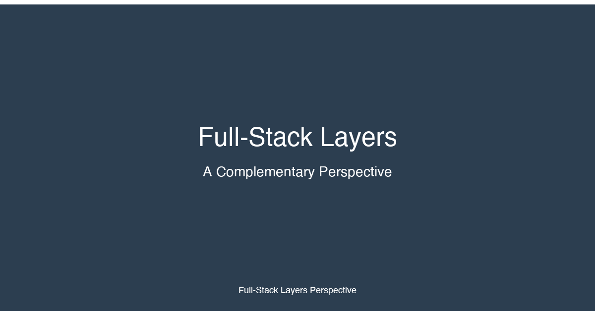

# The Full-Stack Layers: A Complementary Perspective

## Beyond the 12 Factors

The 12 factors focus primarily on frontend-heavy fullstack concerns — UI components, routing, state management, forms, design systems, rendering strategies, i18n, and more. They represent the **application architecture** view.

But a fullstack developer doesn't just work with application architecture. They navigate infrastructure, operations, security, and deployment concerns daily. This complementary **13-layer perspective** captures that side of the stack.

Where the 12 factors ask "How should I structure my frontend?", the 13 layers ask "What do I need to know about every layer between the browser and the database?"

## The 13 Layers at a Glance

| # | Layer | What It Covers |
|---|-------|----------------|
| 1 | Frontend | UI frameworks, component architecture, build tooling, asset pipeline |
| 2 | APIs & Backend Logic | REST, GraphQL, gRPC, WebSocket, server-side business logic |
| 3 | Database & Storage | SQL, NoSQL, object storage, data modeling, migrations |
| 4 | Auth & Permissions | Authentication, authorization, token management, RBAC/ABAC |
| 5 | Hosting & Deployment | Deployment platforms, environments, rollout strategies |
| 6 | Cloud & Compute | Cloud providers, serverless, containers, edge computing |
| 7 | CI/CD & Version Control | Pipelines, branching strategies, automated testing, release management |
| 8 | Security & RLS | Row-level security, input validation, CSP, CORS, secret management |
| 9 | Rate Limiting | Throttling, quota management, DDoS protection, API governance |
| 10 | Caching & CDN | HTTP caching, in-memory caches, content delivery networks |
| 11 | Load Balancing & Scaling | Horizontal/vertical scaling, load balancers, auto-scaling policies |
| 12 | Error Tracking & Logs | Structured logging, error monitoring, alerting, observability |
| 13 | Availability & Recovery | High availability, disaster recovery, backups, circuit breakers |

## How to Read This Perspective

Each layer article follows the same structure:
- **Why This Layer Matters** — strategic importance for fullstack developers
- **Key Considerations** — essential concepts and trade-offs
- **Implementation Patterns & Technologies** — common approaches and tools
- **Common Pitfalls** — anti-patterns and hard-won lessons
- **How This Layer Connects to the 12 Factors** — explicit cross-references
- **Case Study** — real-world example

The [Cross-Reference Matrix](LAYERS-MATRIX.md) shows the bidirectional mapping between layers and factors.

_This article is part of Tikal's Modern Full-Stack Developer's Guide: A 12-Factor Approach series. For the application architecture perspective, see the [main 12 factors](../articles/00-Intro.md)._
