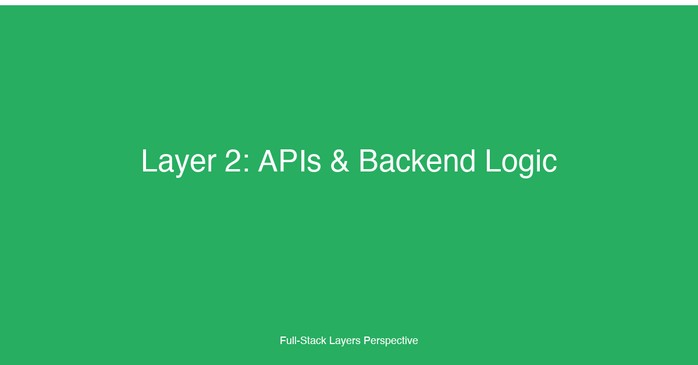

# Layer 2: APIs & Backend Logic


## TL;DR

The APIs and backend logic layer handles data processing, business rules, and client-server communication across every full-stack application. This layer encompasses the API surface (REST, GraphQL, gRPC, WebSockets), server-side business logic, request lifecycle management, input validation, error handling, and the architectural patterns that govern how clients interact with server resources. For fullstack developers, mastering this layer means understanding how API style choices cascade into client complexity, developer experience, backend architecture determines team structure and deployment complexity, and how well-structured backend logic directly affects system reliability, debuggability, and the ability to evolve the system over time without breaking existing clients.

## Why This Layer Matters

The API and backend logic layer is where business value is delivered. The frontend may be what users see, but the backend is what users rely on — it processes payments, enforces access control, orchestrates workflows, validates data, and coordinates with external systems. Every decision made in this layer has a direct and measurable impact on the product's capabilities, the team's shipping velocity, and the system's operational stability.

The choice of API style — REST, GraphQL, gRPC, or WebSockets — is one of the most consequential architectural decisions a team can make. REST remains the most widely understood and interoperable approach: it leverages HTTP semantics, is cacheable by design, and has mature tooling in every language. But REST's fixed response shapes often force clients to either over-fetch (receiving more data than needed) or under-fetch (requiring multiple round-trips to assemble a complete view). GraphQL solves these problems by letting clients declaratively specify exactly what data they need, but it introduces complexity in query parsing, resolver performance, and caching — the server no longer controls response shapes, which makes performance optimization harder. gRPC offers high-performance, strongly-typed, streaming-capable communication ideal for microservice-to-microservice traffic, but it requires protobuf schema management, generates client stubs, and has limited browser support without a proxy. WebSockets enable real-time bidirectional communication for chat, live dashboards, and collaborative editing, but they introduce stateful connection management and different scaling characteristics than stateless HTTP. There is no universal winner — the right choice depends on client requirements, team expertise, and operational constraints.

Beyond API style, the backend architecture itself — monolithic, microservices, or serverless — determines how teams are structured, how deployment works, and how operational costs scale. A monolith offers simplicity in development, deployment, and debugging: one codebase, one deployment unit, one place to trace a request from HTTP to database. This simplicity is optimal for early-stage products and small teams. Monoliths only become a problem when they grow beyond a team's ability to reason about them. Microservices decompose the system into independently deployable services, enabling team autonomy and independent scaling, but they introduce distributed systems complexity: network failures, partial failures, eventual consistency, service discovery, observability overhead, and the challenge of maintaining data integrity across service boundaries. Serverless functions (AWS Lambda, Cloudflare Workers, Vercel Functions) remove infrastructure management entirely, scaling from zero to thousands of requests per second automatically, but they introduce cold starts, execution time limits, statelessness constraints, and debugging difficulty. The architecture decision should always follow Conway's Law: services will mirror the team structure, not the other way around.

## Key Considerations for Fullstack Developers

### 1. API Style Tradeoffs

Choose your API communication protocol based on the specific needs of your clients and server environment. REST is the safest default — it has broadest interoperability, leverages HTTP caching, and is understood by every developer. GraphQL excels when clients have diverse data needs and you want to minimize round-trips, but requires discipline in resolver performance and query cost analysis. gRPC is ideal for internal microservice-to-microservice communication where performance and type safety matter more than human readability. WebSockets are necessary for real-time features but add connection state management complexity.

### 2. Monolith vs. Microservices vs. Serverless

Start with a monolith. The vast majority of applications never reach the scale that requires microservices, and the operational complexity of distributed systems is almost always underestimated. Extract services only when there is a clear boundary — a module that needs independent scaling, a team that needs autonomous deployment, or a subsystem with different performance characteristics. Serverless is compelling for event-driven workloads, bursty traffic patterns, and teams that want to minimize infrastructure management, but it imposes constraints on execution duration, state management, and local development fidelity.

### 3. Request Lifecycle

Every API request follows a path from client to database and back: HTTP parsing, routing, middleware chain execution, authentication, authorization, input validation, business logic execution, data access, response serialization, and response transmission. Understanding this lifecycle is critical because bugs can be introduced at any stage. A validation bug at the input layer can allow malicious data to reach the database. An authorization gap in the middleware can expose sensitive data. A serialization issue can leak internal data structures to clients. Fullstack developers should be able to trace a request through every layer of the stack when debugging.

### 4. Error Handling Patterns

How your API handles and communicates errors is a user experience concern, not just a debugging concern. Structured error responses — with consistent formats, error codes, human-readable messages, and machine-readable metadata — enable clients to handle failures gracefully. A generic 500 error tells the client nothing useful. A structured response with `{ error: "payment_failed", message: "Insufficient funds", details: { balance: 5.00, required: 29.99 } }` lets the client display a meaningful message to the user and offer actionable next steps. Error handling should be global, not ad-hoc: a centralized error handler catches thrown exceptions, maps them to appropriate HTTP status codes, and formats the response consistently.

### 5. Input Validation

The API boundary is the last place you can reject invalid data before it reaches your business logic and database. Input validation should be declarative, schema-driven, and happen as early as possible in the request lifecycle — ideally in dedicated validation middleware before any business logic executes. Validation should cover type checking, format validation, bounds checking, and business rule validation. Reject early, reject clearly, and always sanitize inputs to prevent injection attacks.

### 6. Idempotency

In distributed systems, network failures mean you cannot guarantee that a request is processed exactly once — it may be processed zero times or multiple times. Idempotency ensures that processing the same request multiple times produces the same result. This is critical for operations like payment processing, order creation, and any other side-effect-producing operation where duplicates would be harmful. Idempotency is typically implemented using idempotency keys: clients generate a unique key for each operation, and the server deduplicates requests with the same key. The server must persist the idempotency key alongside the result so that retries return the original result, not a new computation.

### 7. API Versioning

APIs evolve, and existing clients should not break when you ship changes. Versioning strategies include URI-based versioning (`/v1/resource`, `/v2/resource`), header-based versioning (`Accept: application/vnd.api+json;version=2`), and query-parameter versioning (`?version=2`). URI-based versioning is the most common and easiest to implement, but it can lead to code duplication as versions proliferate. Header-based versioning keeps URLs clean but is less visible and harder to test in browsers. The most pragmatic approach is to avoid breaking changes when possible by following RESTful practices — add fields instead of removing them, make new endpoints instead of changing existing ones, and deprecate gradually with clear migration timelines.

## Implementation Patterns & Technologies

### Layered Architecture: Controller / Service / Repository

The layered architecture pattern separates concerns into distinct layers, each with a single responsibility. Controllers handle HTTP concerns (parsing requests, sending responses). Services contain business logic. Repositories abstract data access. This separation makes the code testable, maintainable, and navigable.

```typescript
// controllers/userController.ts — HTTP layer only
import { Request, Response, NextFunction } from 'express';
import { userService } from '../services/userService';

export async function createUser(
  req: Request,
  res: Response,
  next: NextFunction
): Promise<void> {
  try {
    const validatedBody = req.validatedBody; // set by validation middleware
    const user = await userService.createUser(validatedBody);
    res.status(201).json({ data: user });
  } catch (error) {
    next(error); // delegate to error-handling middleware
  }
}

export async function getUserById(
  req: Request,
  res: Response,
  next: NextFunction
): Promise<void> {
  try {
    const user = await userService.getUserById(req.params.id);
    if (!user) {
      res.status(404).json({ error: 'user_not_found', message: 'User not found' });
      return;
    }
    res.json({ data: user });
  } catch (error) {
    next(error);
  }
}

// services/userService.ts — business logic, no HTTP awareness
import { userRepository } from '../repositories/userRepository';
import { hashPassword } from '../lib/crypto';

interface CreateUserInput {
  email: string;
  password: string;
  name: string;
}

export const userService = {
  async createUser(input: CreateUserInput) {
    const existing = await userRepository.findByEmail(input.email);
    if (existing) {
      throw new ConflictError('A user with this email already exists');
    }
    const passwordHash = await hashPassword(input.password);
    return userRepository.create({
      email: input.email,
      passwordHash,
      name: input.name,
    });
  },

  async getUserById(id: string) {
    return userRepository.findById(id);
  },
};

// repositories/userRepository.ts — data access, no business logic
import { db } from '../lib/database';
import type { User } from '../types';

export const userRepository = {
  async findByEmail(email: string): Promise<User | null> {
    return db.queryOne<User>('SELECT * FROM users WHERE email = $1', [email]);
  },

  async findById(id: string): Promise<User | null> {
    return db.queryOne<User>('SELECT * FROM users WHERE id = $1', [id]);
  },

  async create(data: Partial<User>): Promise<User> {
    const { rows } = await db.query<User>(
      `INSERT INTO users (email, password_hash, name) VALUES ($1, $2, $3) RETURNING *`,
      [data.email, data.passwordHash, data.name]
    );
    return rows[0];
  },
};
```

### Middleware Chain Pattern

Middleware is the backbone of request processing in most web frameworks. Each middleware function receives the request, performs a specific task (logging, authentication, validation), and either passes control to the next middleware or short-circuits the chain by sending a response. The order of middleware matters: security middleware should run first, then authentication, then authorization, then validation, then business logic.

```python
# middleware/validation.py — schema-driven request validation
from functools import wraps
from pydantic import BaseModel, ValidationError
from flask import request, jsonify

def validate_body(schema: type[BaseModel]):
    def decorator(route_func):
        @wraps(route_func)
        def wrapper(*args, **kwargs):
            try:
                validated = schema(**request.get_json(force=True))
                request.validated_body = validated
                return route_func(*args, **kwargs)
            except ValidationError as e:
                return jsonify({
                    "error": "validation_failed",
                    "message": "Request body failed validation",
                    "details": e.errors(include_context=False),
                }), 422
        return wrapper
    return decorator

# schemas/user.py — Pydantic schemas for declarative validation
from pydantic import BaseModel, EmailStr, Field

class CreateUserSchema(BaseModel):
    email: EmailStr
    password: str = Field(min_length=8, max_length=128)
    name: str = Field(min_length=1, max_length=100)

# routes/users.py — applied at the route level
from flask import Blueprint
from middleware.validation import validate_body
from schemas.user import CreateUserSchema

router = Blueprint('users', __name__)

@router.route('/users', methods=['POST'])
@validate_body(CreateUserSchema)
def create_user():
    data = request.validated_body
    # data is already validated and typed as CreateUserSchema
    user = user_service.create_user(data)
    return {"data": user}, 201
```

### Error Handling Middleware

A centralized error handler ensures consistent error responses across every endpoint:

```typescript
// middleware/errorHandler.ts — Express global error handler
import { Request, Response, NextFunction } from 'express';

class AppError extends Error {
  constructor(
    public statusCode: number,
    public code: string,
    public message: string,
    public details?: unknown
  ) {
    super(message);
    this.name = 'AppError';
  }
}

class NotFoundError extends AppError {
  constructor(resource: string) {
    super(404, 'not_found', `${resource} not found`);
  }
}

class ConflictError extends AppError {
  constructor(message: string) {
    super(409, 'conflict', message);
  }
}

function errorHandler(
  err: Error,
  _req: Request,
  res: Response,
  _next: NextFunction
): void {
  if (err instanceof AppError) {
    res.status(err.statusCode).json({
      error: err.code,
      message: err.message,
      details: err.details,
    });
    return;
  }

  // Unexpected errors — log and return generic 500
  console.error('Unhandled error:', err);
  res.status(500).json({
    error: 'internal_server_error',
    message: 'An unexpected error occurred',
  });
}

export { AppError, NotFoundError, ConflictError, errorHandler };
```

### API Versioning Strategies

Versioning is about managing change without breaking clients:

```typescript
// routes/v1/users.ts
import { Router } from 'express';
export const router = Router();

router.get('/', async (req, res) => {
  const users = await userService.listAll();
  res.json({ data: users });
});

// routes/v2/users.ts — v2 adds pagination support
import { Router } from 'express';
export const router = Router();

router.get('/', async (req, res) => {
  const page = parseInt(req.query.page as string) || 1;
  const limit = Math.min(parseInt(req.query.limit as string) || 20, 100);
  const { users, total } = await userService.listPaginated(page, limit);
  res.json({
    data: users,
    meta: { page, limit, total, totalPages: Math.ceil(total / limit) },
  });
});

// app.ts — mount both versions
import express from 'express';
import { router as v1Routes } from './routes/v1/users';
import { router as v2Routes } from './routes/v2/users';

const app = express();
app.use('/api/v1/users', v1Routes);
app.use('/api/v2/users', v2Routes);
```

### Idempotency Implementation

Idempotency keys prevent duplicate side effects in distributed systems:

```typescript
// middleware/idempotency.ts
import { Request, Response, NextFunction } from 'express';
import { redis } from '../lib/redis';

export async function idempotencyMiddleware(
  req: Request,
  res: Response,
  next: NextFunction
): Promise<void> {
  const idempotencyKey = req.headers['idempotency-key'] as string;

  if (!idempotencyKey) {
    // Idempotency is optional for GET requests, required for mutating ones
    if (req.method !== 'GET' && req.method !== 'OPTIONS') {
      res.status(400).json({
        error: 'missing_idempotency_key',
        message: 'Idempotency-Key header is required for this request',
      });
      return;
    }
    return next();
  }

  const cacheKey = `idempotency:${idempotencyKey}`;
  const existing = await redis.get(cacheKey);

  if (existing) {
    const previousResponse = JSON.parse(existing);
    res.status(previousResponse.status).json(previousResponse.body);
    return;
  }

  // Override res.json to cache the response before sending
  const originalJson = res.json.bind(res);
  res.json = function (body: unknown) {
    const responseData = { status: res.statusCode, body };
    redis.setex(cacheKey, 86_400, JSON.stringify(responseData)); // TTL: 24 hours
    return originalJson(body);
  };

  next();
}
```

## Common Pitfalls

### 1. Over-Engineering Before Product-Market Fit

Building a microservices architecture, complete with service discovery, message queues, and distributed tracing, before you have ten paying customers is premature optimization. The operational overhead of distributed systems — deployment pipelines, inter-service communication, data consistency, observability — slows development velocity at exactly the stage when speed matters most. Start with a well-structured monolith. Extract services when there is evidence that the monolith is constraining team velocity or scalability, not before.

### 2. Ignoring Idempotency in Distributed Systems

In any system where requests can fail and be retried — which is every distributed system — idempotency is not optional. Without idempotency, a network timeout that causes a client to retry a payment request can result in double charges. An order creation retry can produce duplicate orders. A user registration retry can create duplicate accounts. The fix is straightforward: require idempotency keys on all mutating endpoints, deduplicate on the server side, and persist the response so retries return the cached result. This pattern should be part of the API framework, not an afterthought in individual endpoints.

### 3. Throwing Generic 500 Errors Instead of Structured Responses

A generic `500 Internal Server Error` response tells the client nothing useful. Was the database down? Was there a validation bug? Did a downstream service fail? The client cannot possibly handle this gracefully. Structured error responses — with machine-readable error codes, human-readable messages, and optional details — allow clients to display appropriate UI states, trigger retry logic, or log meaningful diagnostics. Every error should map to a code that the client can reason about, and the error format should be consistent across every endpoint in the API.

### 4. Mixing Business Logic Into the Controller Layer

Controllers should handle HTTP concerns only: parse the request, delegate to a service, and send a response. When business logic leaks into controllers — validation rules, authorization checks, data transformations — that logic becomes untestable (you need HTTP calls to exercise it), non-reusable (you cannot call it from other controllers or background jobs), and difficult to maintain (every endpoint implements its own version of the same rule). Enforce the separation with a clear architectural boundary: controllers depend on services, services depend on repositories, and no layer reaches across more than one boundary.

### 5. Not Validating Input at the API Boundary

Input validation is the first and most important defense against bugs and security vulnerabilities. Every API endpoint should validate that incoming data matches expected types, formats, and constraints before any business logic executes. Missing validation allows malformed data to propagate into the database, corrupting data integrity. Missing validation also opens the door to injection attacks, mass assignment vulnerabilities, and business logic bypasses. Use a schema-based validation library (Zod, Pydantic, Joi) that runs as early middleware in the request lifecycle, before any handler logic executes. Validate once, reject early, and never trust client input.

### 6. Ignoring API Versioning Until It's Too Late

Every API eventually needs to change in ways that are not backward-compatible. Teams that do not plan for versioning from day one face an impossible choice when the need arises: break existing clients or never change the API. Neither option is acceptable at scale. Adopt a versioning strategy — URI-based or header-based — from the first endpoint. The overhead is minimal (a `/v1/` prefix in the URL), and the benefit is the freedom to evolve the API without coordinating with every client. Deprecate old versions with clear timelines and migration guides.

## How This Layer Connects to the 12 Factors

- **[Factor 10: Backend-for-Frontend (BFF)](../articles/10-Factor-10.md)** — The BFF pattern is an API-layer concern that creates specialized backend services tailored to specific client needs, reducing over-fetching and under-fetching while encapsulating client-specific logic.
- **[Factor 11: API Communication Patterns](../articles/11-Factor-11.md)** — The choice of REST, GraphQL, gRPC, or WebSockets defines how every layer above and below the API communicates, directly impacting performance, client complexity, and developer experience.
- **[Factor 1: UI Libraries](../articles/01-Factor-1.md)** — Frontend frameworks consume APIs; the API design directly shapes how frontend components fetch, cache, and display data.
- **[Factor 3: Design Systems](../articles/03-Factor-3.md)** — Backend API contracts and error formats should align with frontend design system patterns for consistent error states and loading UX.
- **[Factor 5: State Management](../articles/05-Factor-5.md)** — Server state management libraries like TanStack Query, Apollo Client, and SWR are tightly coupled to the API style — REST clients use query keys and mutations, GraphQL clients use fragments and subscriptions.
- **[Factor 6: Authentication & Authorization](../articles/06-Factor-6.md)** — Auth middleware is the outermost layer of the backend logic, intercepting every request before business logic executes to verify identity and enforce permissions.
- **[Factor 7: Rendering Strategies](../articles/07-Factor-7.md)** — SSR and ISR strategies rely on the API layer to provide data at request time or build time, and the API must be designed to support both synchronous and cached data delivery.
- **[Factor 9: i18n](../articles/09-Factor-9.md)** — Internationalization can be handled at the API layer by detecting client locale and returning localized error messages and content.
- **[Factor 12: A11y/SEO/Perf](../articles/12-Factor-12.md)** — API response times directly affect Core Web Vitals; slow endpoints become slow pages regardless of frontend optimization.
- **[Supplemental Factor 1: Testing](../articles/13-Supplemental-factor-1.md)** — The layered architecture (controller/service/repository) makes the backend testable at every level: integration tests for endpoints, unit tests for services, and contract tests for API boundaries.

## Case Study

Tikal helped a logistics company migrate from a monolithic Rails API to a GraphQL + microservices architecture. The company operated a fleet of 10,000+ IoT-equipped delivery vehicles, each streaming GPS coordinates, engine diagnostics, and delivery status in real time. The original Rails monolith had served the company well through its early years, but as the fleet grew from 500 to 10,000 vehicles, the monolith began to buckle under the load.

**The challenge:** The Rails API was handling everything — REST endpoints for the web dashboard, REST endpoints for the mobile driver app, WebSocket connections for real-time tracking, background job processing for route optimization, and webhook delivery to customer systems. A single database migration could take down the entire API. A CPU spike from route optimization would delay GPS processing, causing the tracking map to lag by 30 seconds or more. The mobile app was consuming 200MB of data per driver per shift because the REST endpoints returned full vehicle objects when the mobile UI only needed a subset of fields.

### Our approach:

1. **API layer split with GraphQL as the public surface** — We introduced a GraphQL gateway that replaced the REST endpoints for the web dashboard and mobile apps. The GraphQL schema was designed around the client use cases: the mobile driver app had a `DriverSession` type with only the fields needed for the driver's current trip, while the web dashboard had richer `Vehicle` and `Delivery` types with historical data. This eliminated over-fetching entirely. Mobile data usage dropped from 200MB to 80MB per shift on day one.

2. **gRPC for inter-service communication** — Behind the GraphQL gateway, we decomposed the monolith into domain services — Vehicle Service, Route Service, Delivery Service, and Customer Service — communicating over gRPC. Each service was independently deployable and owned its own data store. The strongly-typed protobuf contracts prevented the serialization mismatches that had plagued the Rails JSON serializers. gRPC streaming was used for the GPS telemetry pipeline, reducing the overhead of thousands of individual HTTP requests per second.

3. **GraphQL subscriptions for real-time tracking** — The WebSocket-based real-time tracking was migrated to GraphQL subscriptions, which provided the same real-time capability but with GraphQL's declarative data selection. The mobile app subscribed to `vehiclePosition(vehicleId: ID!)` and received only the coordinates and timestamp, not the full vehicle object. This cut WebSocket message sizes by 90%.

4. **BFF pattern for mobile clients** — A dedicated Backend-for-Frontend service was created for the mobile apps. This BFF aggregated data from multiple gRPC services and exposed a mobile-optimized GraphQL schema that accounted for the device's network conditions, battery level, and screen size. When the BFF detected a slow connection, it would batch subscription updates into 5-second intervals instead of sending every GPS ping individually.

5. **Incremental migration with the strangler fig pattern** — We did not rewrite the monolith. Instead, we deployed the GraphQL gateway in front of the existing Rails API and migrated endpoints one by one. Each migration was behind a feature flag and could be rolled back instantly. Over six months, the Rails API went from serving 100% of traffic to serving only legacy customer webhooks, which were the last to be migrated.

### Results:
- **API response times reduced by 60%** — the GraphQL gateway resolved complex queries with a single round-trip to the gRPC services, compared to the previous N+1 REST calls.
- **Mobile data usage decreased by 60%** — from 200MB to 80MB per driver shift, improving app performance and customer satisfaction.
- **Real-time tracking latency dropped from 30 seconds to under 2 seconds** — the gRPC telemetry pipeline and GraphQL subscriptions eliminated the queuing delays caused by the overloaded monolith.
- **Deploy frequency went from weekly to multiple times per day** — each microservice could be deployed independently without risking the entire system.
- **The legacy Rails monolith was fully decommissioned within eight months** — every domain was migrated incrementally, with zero downtime during cutovers.

The key lesson: the API layer is where you can make the most impactful changes with the least risk. By introducing a GraphQL gateway and the strangler fig pattern, the team improved the user experience immediately while decoupling the backend architecture incrementally. They did not need a big-bang rewrite — they evolved the architecture one endpoint at a time.

## Conclusion

The APIs and backend logic layer is the backbone of every full-stack application. It is where business rules are enforced, data is validated and transformed, and clients communicate with servers. The decisions made in this layer — API style, architectural pattern, error handling strategy, validation approach — determine the developer experience for every team member and the product experience for every user.

Start with REST and a well-structured monolith. Use the controller/service/repository pattern to keep concerns separated and testable. Validate input at the boundary with schema-based validators. Handle errors with a centralized middleware that produces structured, client-actionable responses. Plan for idempotency from day one. Adopt a versioning strategy before you need it. And when your architecture needs to evolve, reach for incremental patterns — the strangler fig, the gateway, the BFF — not rewrites.

The best API is the one that clients can depend on, that developers can debug, and that the team can evolve without breaking existing consumers. That outcome is not an accident — it is the result of deliberate architectural choices made with an understanding of the tradeoffs involved.

---

_This article is part of Tikal's Modern Full-Stack Developer's Guide: A 12-Factor Approach series. For the application architecture perspective, see the [main 12 factors](../articles/00-Intro.md)._
