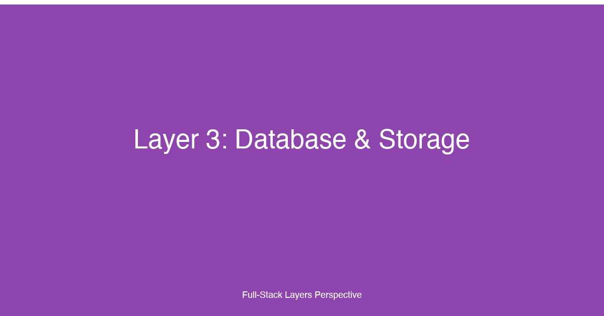

# Layer 3: Database & Storage


## TL;DR

The database and storage layer handles all persistent data in a full-stack application — relational databases for structured transactions, NoSQL stores for flexible schemas and high-velocity writes, object storage for blobs and media, and CDNs for global content distribution. For fullstack developers, mastering this layer means knowing when to choose SQL over NoSQL, how to model data for both read and write performance, how to migrate schemas without downtime, how to tune queries and connection pools under load, and how to integrate object storage and CDNs into the application architecture. This layer directly determines the system's data integrity, query latency, operational cost, and ability to evolve the data model as the product grows.

## Why This Layer Matters

The database and storage layer is the durable foundation every other layer depends on. A slow frontend can be optimized with caching. A slow API can be optimized with pagination and query tuning. But data that is lost, inconsistent, or inaccessible is unrecoverable — it erodes user trust and can have legal and financial consequences. Every architectural decision in this layer — database engine, schema design, indexing strategy, migration approach, storage backend — has direct and measurable effects on application performance, development velocity, and operational reliability.

The diversity of storage options available today is both a superpower and a source of complexity. A single application may use PostgreSQL for transactional data, Redis for caching and session state, Elasticsearch for full-text search, S3 for file uploads, and CloudFront or Cloudflare for CDN delivery. Each storage technology has different performance characteristics, consistency models, scaling properties, and cost profiles. Choosing the right tool for each job — polyglot persistence — is the hallmark of a mature full-stack architecture.

But polyglot persistence introduces its own challenges. When data lives in multiple stores, maintaining consistency across them becomes non-trivial. A user's profile might be in PostgreSQL, their session token in Redis, their uploaded avatar in S3, and the CDN edge cache may hold a stale version of that avatar. Understanding how data flows between these stores, how to keep them synchronized, and how to handle failures gracefully is critical.

The data model itself — the shape of your tables, documents, and indexes — evolves as the product evolves. A schema that served 100 users efficiently may degrade catastrophically at 100,000 users. Migrating from one schema to another, or from one database engine to another, without downtime requires careful planning, well-tested migration scripts, and a rollback strategy. Fullstack developers who understand data modeling, migration patterns, and query optimization can build systems that scale without requiring a rewrite at every growth milestone.

## Key Considerations for Fullstack Developers

### 1. SQL vs. NoSQL: A Decision Framework

The choice between relational and non-relational databases is not about which is "better" — it is about which set of trade-offs aligns with your data's access patterns, consistency requirements, and team expertise.

**Choose SQL (PostgreSQL, MySQL) when:**
- Data has clear relationships and referential integrity matters (orders → line items → products)
- You need ACID transactions — atomic updates across multiple rows and tables
- Schema enforcement is valuable for data quality and team coordination
- You need complex queries with joins, aggregations, window functions, and CTEs
- Your query patterns are not fully known in advance and need ad-hoc exploration

**Choose NoSQL (MongoDB, DynamoDB, Cassandra) when:**
- Your data model is schema-flexible or evolves rapidly without migrations
- You need horizontal write scalability with automatic partitioning
- Your access patterns are known and query-by-primary-key dominant
- You need high-velocity writes at massive scale (time-series, IoT, event logs)
- Your data is naturally document-shaped (JSON blobs, denormalized aggregates)

**Use the pragmatic hybrid** when your application has diverse data needs. A common pattern is PostgreSQL for transactional/relational data with a document store (like MongoDB) or a search engine (like Elasticsearch) for specific workloads that don't fit the relational model well. This avoids the operational complexity of running a dozen databases while still using the right tool for specific jobs.

### 2. Object Storage and CDN Integration

Relational databases are not designed to store large binary objects or serve them at global scale. Storing images, videos, PDFs, or archives as BLOBs in PostgreSQL or MySQL leads to table bloat, slow backups, and poor read performance. The correct architecture is:

- **Upload to object storage** (S3, GCS, Azure Blob, R2) — durable, cheap, infinitely scalable
- **Store only the object key/URL in the database** — reference, not the data itself
- **Serve through a CDN** (CloudFront, Cloudflare, Fastly) — edge-cached, globally distributed
- **Use signed URLs** for private content — time-limited access without exposing credentials

```typescript
// services/storageService.ts — Upload and serve files through S3 + CDN
import { S3Client, PutObjectCommand, GetObjectCommand } from '@aws-sdk/client-s3';
import { getSignedUrl } from '@aws-sdk/s3-request-presigner';

const s3 = new S3Client({ region: process.env.AWS_REGION });
const BUCKET = process.env.S3_BUCKET_NAME;
const CDN_DOMAIN = process.env.CDN_DOMAIN; // e.g., d2x3y4z5.cloudfront.net

interface UploadResult {
  objectKey: string;
  cdnUrl: string;
}

export async function uploadFile(
  fileBuffer: Buffer,
  fileName: string,
  mimeType: string,
  userId: string
): Promise<UploadResult> {
  const objectKey = `users/${userId}/${Date.now()}-${fileName}`;

  await s3.send(new PutObjectCommand({
    Bucket: BUCKET,
    Key: objectKey,
    Body: fileBuffer,
    ContentType: mimeType,
  }));

  return {
    objectKey,
    cdnUrl: `https://${CDN_DOMAIN}/${objectKey}`,
  };
}

export async function getPrivateDownloadUrl(
  objectKey: string,
  expiresInSeconds = 300
): Promise<string> {
  const command = new GetObjectCommand({
    Bucket: BUCKET,
    Key: objectKey,
  });

  return getSignedUrl(s3, command, { expiresIn: expiresInSeconds });
}

// repositories/userRepository.ts — store only the reference
import { db } from '../lib/database';

export const userRepository = {
  async updateAvatar(userId: string, avatarKey: string): Promise<void> {
    await db.query(
      'UPDATE users SET avatar_url = $1, updated_at = NOW() WHERE id = $2',
      [avatarKey, userId]
    );
  },
};
```

The CDN caches the file at edge locations worldwide. When a user requests `https://d2x3y4z5.cloudfront.net/users/abc/avatar.jpg`, the CDN serves it from the nearest edge if cached, or fetches from the S3 origin and caches it for subsequent requests. This pattern reduces origin load by 90-95% for media-heavy applications and delivers sub-50ms load times globally.

### 3. Data Modeling: Normalization, Denormalization, and Indexing

**Normalization** eliminates data redundancy by splitting data into related tables with foreign keys. A normalized schema (3NF) ensures every piece of data lives in exactly one place, preventing update anomalies and maintaining referential integrity. Normalization is the default starting point for transactional systems.

**Denormalization** intentionally duplicates data to avoid expensive joins at read time. In a denormalized e-commerce schema, the `orders` table might store `product_name` and `product_price` directly on each order line rather than joining through a `products` table. This makes writes more expensive (you must update duplicate data when prices change) but reads dramatically faster. Denormalization is a performance optimization, not a design default.

**Indexing** is the single highest-impact performance lever in any database. An index is a data structure (typically a B-tree) that allows the database to find rows without scanning the entire table. The key indexing principles are:

- Index columns used in `WHERE`, `JOIN`, `ORDER BY`, and `GROUP BY` clauses
- Use composite indexes for queries that filter on multiple columns (order matters — put equality filters before range filters)
- Avoid over-indexing — each index slows down writes and consumes storage
- Use partial indexes (`WHERE status = 'active'`) for filtered queries on large tables
- Monitor index usage with `pg_stat_user_indexes` (PostgreSQL) or equivalent tools

```sql
-- users table: support fast lookups by email (login) and by organization
CREATE INDEX idx_users_email ON users (email);
CREATE INDEX idx_users_org_id ON users (org_id);

-- orders table: support date-range queries and status filtering
CREATE INDEX idx_orders_created_at ON orders (created_at DESC);
CREATE INDEX idx_orders_user_status ON orders (user_id, status)
  WHERE status IN ('pending', 'processing');

-- products table: full-text search index
CREATE INDEX idx_products_search ON products
  USING GIN (to_tsvector('english', name || ' ' || description));

-- avoid: index on low-cardinality column alone
-- CREATE INDEX idx_users_active ON users (is_active);  -- only true/false, not useful
```

### 4. Migration Strategies

Schema migrations are how the database evolves alongside the application. The standard approach is incremental, versioned migration files that are applied in order — never ad-hoc schema changes in production consoles.

**The golden rule of safe migrations:** Every migration must be backward-compatible with the current application code. This means:

0. **Add columns and tables** — never remove or rename them in a single deployment. Add a new column, deploy the application code that reads/writes it, then remove the old column in a subsequent migration.
0. **Use nullable defaults for new columns** — existing rows should not break because a new column has no value. Provide a default or allow NULL during the transition period.
0. **Migrate data in batches** — for large tables, backfill new columns in batches of 1,000–10,000 rows to avoid long-running locks.
0. **Always have a rollback** — every migration should have a corresponding down migration that reverts the schema and restores any transformed data.

```typescript
// migrations/003_add_user_timezone.ts — forward migration
import { db } from '../lib/database';

export async function up(): Promise<void> {
  // Step 1: Add the new column as nullable
  await db.query(`
    ALTER TABLE users
    ADD COLUMN timezone VARCHAR(50) DEFAULT 'UTC';
  `);

  // Step 2: Backfill existing rows in batches (for large tables)
  let updated = 0;
  const BATCH_SIZE = 1000;
  do {
    const result = await db.query(`
      UPDATE users
      SET timezone = 'UTC'
      WHERE timezone IS NULL
      LIMIT ${BATCH_SIZE}
      RETURNING id;
    `);
    updated = result.rowCount ?? 0;
  } while (updated === BATCH_SIZE);

  // Step 3: Make the column NOT NULL now that all rows have values
  await db.query(`
    ALTER TABLE users
    ALTER COLUMN timezone SET NOT NULL;
  `);
}

export async function down(): Promise<void> {
  await db.query('ALTER TABLE users DROP COLUMN timezone;');
}
```

### 5. Connection Pooling

Every database connection consumes server resources — memory for the connection buffer, a file descriptor, and a backend process or thread. Opening a new connection per request does not scale. Connection pooling maintains a fixed set of open connections that are borrowed and returned by application code, eliminating the overhead of connection establishment.

Key configuration parameters for a connection pool:

- **Min / Max connections** — set min to handle baseline traffic and max to the database's connection limit minus a safety margin for administrative connections
- **Idle timeout** — close connections that have been idle too long to free server resources
- **Connection timeout** — how long a request waits for a connection before failing (return a 503, don't block indefinitely)

```typescript
// lib/database.ts — PostgreSQL connection pool with pg-pool
import { Pool, PoolConfig } from 'pg';

const poolConfig: PoolConfig = {
  host: process.env.DB_HOST,
  port: parseInt(process.env.DB_PORT || '5432'),
  database: process.env.DB_NAME,
  user: process.env.DB_USER,
  password: process.env.DB_PASSWORD,
  min: parseInt(process.env.DB_POOL_MIN || '2'),
  max: parseInt(process.env.DB_POOL_MAX || '20'),
  idleTimeoutMillis: 30_000,
  connectionTimeoutMillis: 5_000,
  maxUses: 7500, // recycle connections periodically to avoid memory leaks
};

export const pool = new Pool(poolConfig);

pool.on('error', (err) => {
  console.error('Unexpected database pool error:', err);
});

export const db = {
  async query<T = any>(text: string, params?: any[]): Promise<T[]> {
    const client = await pool.connect();
    try {
      const result = await client.query(text, params);
      return result.rows as T[];
    } finally {
      client.release(); // return to pool, don't destroy
    }
  },

  async transaction<T>(fn: (client: any) => Promise<T>): Promise<T> {
    const client = await pool.connect();
    try {
      await client.query('BEGIN');
      const result = await fn(client);
      await client.query('COMMIT');
      return result;
    } catch (error) {
      await client.query('ROLLBACK');
      throw error;
    } finally {
      client.release();
    }
  },
};
```

### 6. Query Optimization

Slow queries are the most common cause of production incidents in database-backed applications. The optimization workflow is:

1. **Identify slow queries** — use `pg_stat_activity` (PostgreSQL), `SHOW FULL PROCESSLIST` (MySQL), or APM tools (Datadog, New Relic, Scout)
2. **Run `EXPLAIN ANALYZE`** — understand the query plan: sequential scans, index usage, join strategies, sort operations
3. **Fix the most expensive operation** — add an index, rewrite the query, denormalize, or add a cache

Common query optimization patterns:

- **N+1 queries** — the ORM fetches a list of entities, then fetches related entities one-by-one in a loop. Fix with eager loading (`INCLUDES` in Rails, `SELECT ... IN (...)` for manual queries)
- **Missing composite indexes** — a query filtering on `(org_id, status, created_at)` cannot use separate single-column indexes efficiently; a composite index on `(org_id, status, created_at DESC)` turns it into a single index seek
- **Index-only scans** — if the index contains all columns the query needs, PostgreSQL never touches the table heap. Add covering indexes with `INCLUDE` columns
- **Avoid `SELECT *` in production queries** — returning unused columns wastes memory, network bandwidth, and prevents index-only scans

## Implementation Patterns & Technologies

### SQL vs. NoSQL Decision Matrix

| Criterion | SQL (PostgreSQL, MySQL) | NoSQL (MongoDB, DynamoDB) |
|-----------|------------------------|---------------------------|
| Consistency model | Strong (ACID) | Eventual or configurable |
| Schema | Fixed, enforced | Flexible, per-document |
| Query capability | Rich (joins, CTEs, windows) | Primary-key-centric |
| Horizontal scaling | Read replicas, sharding complexity | Built-in partitioning |
| Migration tooling | Mature (Prisma, Drizzle, Flyway) | App-level, manual |
| Transaction scope | Multi-row, multi-table | Single-document unless using DynamoDB transactions |

### Object Storage + CDN Architecture

```
User ──> Upload file ──> App Server ──> S3 (origin)
                           │
                            └──> DB: store object key

User ──> GET /files/abc.jpg
           │
           ▼
        CDN edge ──cached?──> Return from edge cache (sub-50ms)
           │
           └──miss──> S3 origin ──> Cache at edge ──> Return
```

### Migration Patterns

- **Expand-Migrate-Contract** — expand the schema to support both old and new formats, run a background migration to populate the new format, then contract by removing the old format
- **Online schema changes** — tools like `pgroll` (PostgreSQL) and `gh-ost` (MySQL) apply schema changes without locking tables
- **Blue-green migrations** — run two database schemas side by side, point new application version at the new schema, and cut over when validation passes
- **Feature-flagged migrations** — gate new schema access behind a feature flag so you can test the new code path on a subset of traffic before full rollout

### Read Replicas for Read Scaling

Offload read queries from the primary database to read replicas to improve throughput:

```python
# lib/database_router.py — Route queries to primary or replica
import os
import psycopg2
from psycopg2 import pool as pg_pool
from contextlib import contextmanager

class DatabaseRouter:
    def __init__(self):
        self.primary_pool = pg_pool.ThreadedConnectionPool(
            2, 20,
            dsn=os.environ["DATABASE_PRIMARY_URL"],
        )
        self.replica_pool = pg_pool.ThreadedConnectionPool(
            2, 40,
            dsn=os.environ["DATABASE_REPLICA_URL"],
        )

    @contextmanager
    def connection(self, read_only: bool = False):
        pool = self.replica_pool if read_only else self.primary_pool
        conn = pool.getconn()
        try:
            yield conn
        finally:
            pool.putconn(conn)

    def execute_read(self, query: str, params: tuple = ()) -> list:
        with self.connection(read_only=True) as conn:
            with conn.cursor() as cur:
                cur.execute(query, params)
                return cur.fetchall()

    def execute_write(self, query: str, params: tuple = ()) -> None:
        with self.connection(read_only=False) as conn:
            with conn.cursor() as cur:
                cur.execute(query, params)
            conn.commit()

router = DatabaseRouter()

# Usage: reads go to replica, writes go to primary
users = router.execute_read("SELECT * FROM users WHERE org_id = %s", (org_id,))
router.execute_write(
    "INSERT INTO users (name, email) VALUES (%s, %s)",
    ("Alice", "alice@example.com"),
)
```

## Common Pitfalls

### 1. Using the Database as a Message Queue

Polling database tables for work items — `SELECT * FROM jobs WHERE status = 'pending'` — creates contention on the jobs table, wastes IOPS on repeated queries, and introduces unnecessary load on the primary database. Use a dedicated message queue (RabbitMQ, SQS, Redis streams) for asynchronous work distribution. Databases are for storing state, not coordinating work.

### 2. Storing Binary Data in the Database

Storing images, PDFs, or large JSON blobs as columns in PostgreSQL or MySQL causes table bloat and slow query performance. BLOBs inflate the table size, make vacuum/optimize operations take longer, and slow down full-table scans. Object storage (S3, GCS, R2) is orders of magnitude cheaper per GB and designed specifically for blob storage. Store only the object key in the database.

### 3. Missing Indexes on Foreign Keys

If `orders.user_id` references `users.id` but has no index, every query that joins or filters on `orders.user_id` performs a sequential scan of the entire orders table. This works at 1,000 rows and catastrophically fails at 100,000 rows. Index every foreign key column — most ORMs do not do this automatically.

### 4. Schema Migrations Without a Rollback Plan

Running a destructive migration (`DROP COLUMN`, `ALTER COLUMN TYPE` that truncates data) without a rollback plan means the only way to recover from a mistake is a point-in-time database restore, which loses all data written after the last backup. Every migration should have a corresponding down migration that can be applied to revert the schema without data loss.

### 5. Over-Indexing

Adding indexes to every column that appears in a query — or creating indexes "in case they're needed" — slows down every write operation (INSERT, UPDATE, DELETE) because each index must be updated. A table with 10 indexes can be 5-10x slower for writes than the same table with 2 well-chosen indexes. Measure query patterns, then create indexes. Remove unused indexes. PostgreSQL's `pg_stat_user_indexes` shows how often each index is used.

### 6. Ignoring Connection Pool Starvation

If the connection pool is too small, requests queue up waiting for a connection and eventually time out. If it is too large, the database runs out of memory or CPU handling concurrent connections. Monitor `pool.waitingCount` and `database.activeConnections` in production. Set the pool max to leave headroom for administrative connections — never use all available database connections for the application.

### 7. Not Planning for Polyglot Consistency

When you introduce a second storage system — caching in Redis, search in Elasticsearch, files in S3 — the data in these systems can become inconsistent with the primary database. A product image uploaded to S3 may not have its URL saved to the database if the database write fails after the S3 upload succeeds. Implement the outbox pattern or transactional outbox to ensure cross-store consistency: write the intent to an outbox table within the same database transaction, and a separate process reads the outbox and publishes updates to the secondary stores.

## How This Layer Connects to the 12 Factors

- **[Factor 6: Authentication & Authorization](../articles/06-Factor-6.md)** — User credentials, session tokens, and permission policies are stored in the database layer. Token blacklisting, refresh token persistence, and RBAC/ABAC policy evaluation all depend on fast, reliable database access. The auth layer is the most security-critical consumer of the database.
- **[Factor 11: API Communication Patterns](../articles/11-Factor-11.md)** — The API layer defines how data is queried and mutated. REST endpoints typically map to database queries, GraphQL resolvers fetch from database tables or joined views, and gRPC services aggregate across multiple storage backends. The API communication pattern determines whether the database is queried efficiently or suffers from N+1 problems and over-fetching.
- **[Factor 7: Rendering Strategies](../articles/07-Factor-7.md)** — SSR and ISR rely on the database layer to provide fresh data at request time or build time. Database query latency directly affects Time to First Byte for server-rendered pages.
- **[Factor 5: State Management](../articles/05-Factor-5.md)** — Server state (TanStack Query, SWR, Apollo Client) is a cache of the database. Cache invalidation strategies, stale-while-revalidate patterns, and optimistic updates all assume a consistent database source of truth.
- **[Supplemental Factor 2: Observability](../articles/14-Supplemental-factor-2.md)** — Database query performance, connection pool metrics, and slow query logs are essential observability signals. Every production incident involving slow page loads or API timeouts should start with database query analysis.

## Case Study

Tikal helped an e-commerce platform migrate from a monolithic PostgreSQL database to a polyglot persistence architecture. The platform served 2 million monthly active users across 15 countries, with 50,000+ products, real-time inventory updates, and a global customer base. The original architecture used a single PostgreSQL database for everything — users, orders, inventory, product catalog, session data, and product images stored as base64-encoded strings in JSON columns.

**The challenge:** The monolithic PostgreSQL database was approaching its limits. Order queries that took 50ms at 10,000 orders per day now took 800ms at 50,000 orders per day because the orders table had grown to 12 million rows with no partitioning. Product search — a full-text query across 50,000 products — could take 3-5 seconds because PostgreSQL's built-in text search lacked faceting, relevance scoring, and typo-tolerance. Session storage — 500K simultaneous sessions written every 5 minutes — caused write contention on the session table. Product images stored as base64 in JSON columns made the products table 15GB, causing backups to take 4+ hours and pg_restore operations to fail due to memory limits.

**Our approach:**

1. **PostgreSQL for orders and inventory** — We kept PostgreSQL as the source of truth for orders, inventory, and user accounts — the relational core where ACID transactions and referential integrity are non-negotiable. We partitioned the orders table by month (range partitioning on `created_at`), reducing query times by 80%. We added a connection pooler (PgBouncer) in transaction mode to handle 1,000+ concurrent connections without overwhelming the database.

2. **DynamoDB for session and cart data** — Session data and shopping carts are high-velocity, write-heavy workloads with simple access patterns (get/put by session ID or user ID). We migrated this to DynamoDB with on-demand capacity mode. Session reads went from 12ms to 3ms p99. Cart merges — combining a guest cart with a user cart after login — became a single DynamoDB transaction instead of a multi-table PostgreSQL transaction.

3. **Elasticsearch for product search** — We set up an Elasticsearch cluster with an index per locale. The product catalog was synced from PostgreSQL to Elasticsearch via Change Data Capture (Debezium → Kafka → Logstash). Search queries dropped from 3-5 seconds to 50-150ms, with faceted navigation, typo-tolerant autocomplete, and relevance scoring based on purchase history.

4. **S3 + CloudFront for product images** — The 15GB of base64-encoded images was extracted into an S3 bucket organized by product ID. Image URLs were stored in the PostgreSQL products table as object keys. CloudFront was configured with a 30-day TTL for product images and 7-day TTL for thumbnails. Image load times dropped from 200ms (served from the application server) to under 30ms (served from edge locations). Database size dropped by 14GB, reducing backup time from 4+ hours to under 30 minutes.

**The consistency challenge:** With data spread across PostgreSQL, DynamoDB, Elasticsearch, and S3, maintaining consistency was the hardest part. When a user added an item to their cart:
- The cart item was written to DynamoDB
- If inventory needed to be reserved, PostgreSQL was updated
- The product availability change needed to propagate to Elasticsearch

If any of these writes failed after the first succeeded, the system would be inconsistent — a user would see an item in their cart that was no longer available, or inventory would be reserved with no corresponding cart item.

**Solution: Event sourcing with the outbox pattern.** We implemented a transactional outbox table in PostgreSQL. Any write that affected multiple storage systems wrote an event to the outbox table within the same PostgreSQL transaction. A separate outbox publisher service (running as a sidecar with at-least-once delivery guarantees) read from the outbox and published events to the secondary stores:

```typescript
// services/orderService.ts — Transactional outbox pattern
import { db } from '../lib/database';
import { v4 as uuidv4 } from 'uuid';

interface AddToCartInput {
  userId: string;
  productId: string;
  quantity: number;
  sessionId: string;
}

export async function addToCart(input: AddToCartInput): Promise<void> {
  const eventId = uuidv4();

  await db.transaction(async (client) => {
    // Step 1: Reserve inventory in the primary database
    const reservation = await client.query(
      `UPDATE inventory
       SET reserved_quantity = reserved_quantity + $1
       WHERE product_id = $2
       AND available_quantity - reserved_quantity >= $1
       RETURNING *`,
      [input.quantity, input.productId]
    );

    if (reservation.rowCount === 0) {
      throw new Error('Insufficient inventory');
    }

    // Step 2: Write the outbox event (same transaction, guaranteed atomic)
    await client.query(
      `INSERT INTO outbox (id, aggregate_type, aggregate_id, event_type, payload, created_at)
       VALUES ($1, 'cart', $2, 'cart.item_added', $3, NOW())`,
      [
        eventId,
        input.userId || input.sessionId,
        JSON.stringify({
          userId: input.userId,
          sessionId: input.sessionId,
          productId: input.productId,
          quantity: input.quantity,
        }),
      ]
    );
  });

  // Outbox publisher reads and processes events asynchronously
  // - Writes cart item to DynamoDB
  // - Publishes product availability change to Elasticsearch
  // - Both operations are idempotent and retried on failure
}
```

**Results after migration:**
- **Query latency dropped 70%** — the average order query went from 800ms to 240ms, with p99 under 500ms
- **Product search became real-time** — Elasticsearch returned results in 50-150ms with typo tolerance and faceted navigation, replacing the 3-5 second PostgreSQL text search
- **Image delivery moved to CDN** — CloudFront delivered product images in under 30ms globally, 6-7x faster than the previous application-server-served approach
- **Database size reduced by 93%** — from 16GB to 1.1GB after extracting images to S3, enabling daily backups in under 30 minutes
- **Zero data loss during migration** — every migration step had a rollback plan and was validated with full traffic replay before cutover

The key lesson: polyglot persistence is not about using every database available — it is about matching each storage technology to the access patterns and consistency requirements of the data it holds. The transactional outbox pattern provides the consistency guarantee that makes polyglot architectures safe and reliable in production.

## Conclusion

The database and storage layer is the durable foundation of every full-stack application. Choosing the right storage technology for each data type — relational for transactional integrity, document stores for flexible schemas, object storage for blobs, CDNs for global delivery — and understanding how to model, migrate, index, query, and connect to those stores is essential for building systems that are both performant and reliable.

Start with PostgreSQL for your transactional core. It is the most versatile and battle-tested database for full-stack applications. Add NoSQL stores and object storage only when you have a clear performance or capability need that PostgreSQL cannot meet. Index your foreign keys and query-critical columns from day one. Use connection pooling with appropriate min/max settings. Plan every migration with a rollback strategy. And when you need to span data across multiple storage systems, use the outbox pattern to maintain consistency without sacrificing performance.

The database layer does not need to be rewritten at every growth milestone — but it does need to be evolved deliberately, with the same discipline and testing rigor as the application code it supports.

---

_This article is part of Tikal's Modern Full-Stack Developer's Guide: A 12-Factor Approach series. For the application architecture perspective, see the [main 12 factors](../articles/00-Intro.md)._
