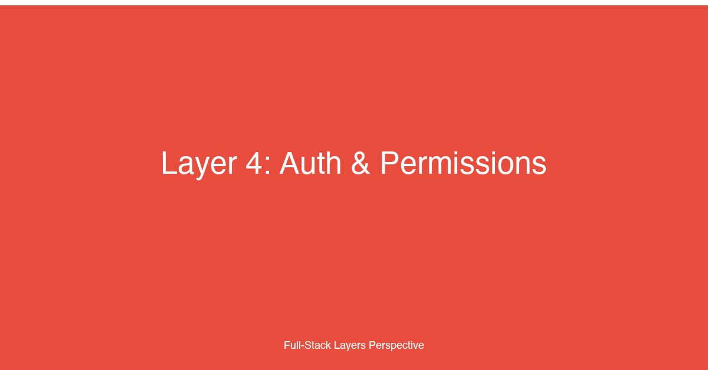

# Layer 4: Authentication & Permissions


## TL;DR

The authentication and permissions layer governs identity verification, session management, and access control across the full-stack application. For fullstack developers, mastering this layer means understanding OAuth2 and OIDC flows, choosing between RBAC and ABAC for authorization, managing JWT lifecycle and token rotation, implementing secure session strategies, and building frontend patterns that gracefully handle token refresh, protected routes, and permission-based UI rendering. This layer is the security boundary of the entire application — every request, every route, every API call passes through it.

## Why This Layer Matters

Authentication and authorization are often conflated, but they serve fundamentally different purposes. Authentication answers "who are you?" — it establishes identity. Authorization answers "what can you do?" — it enforces policy. Confusing the two leads to security gaps where identity proves access, or, worse, authorization checks are skipped entirely because "the user is logged in."

In modern full-stack applications, the auth layer has expanded far beyond username and password. Applications must support social login, single sign-on (SSO) for enterprise customers, multi-factor authentication (MFA), passwordless magic links, device authorization for headless clients, and service-to-service authentication for backend microservices. Each authentication method has different security properties, user experience implications, and implementation complexity.

At the same time, authorization models have grown more sophisticated. Role-based access control (RBAC) is simple and effective for straightforward hierarchies, but breaks down when permissions depend on context — a user's department, the sensitivity of a document, the time of day, or the geographic location. Attribute-based access control (ABAC) and policy-based access control (PBAC) provide the expressiveness needed for complex multi-tenant SaaS applications, but require careful design to avoid evaluation performance issues.

The token lifecycle — issuance, signing, storage, refresh, rotation, and revocation — is the operational backbone of the auth layer. A token that leaks to an attacker grants access until it expires. A refresh token stored insecurely undermines the entire authentication system. A missing or slow token revocation mechanism means that terminating a user's session is effectively impossible until the token naturally expires. Every decision in the token design — short-lived access tokens with long-lived refresh tokens, rotation policies, storage choices (HTTP-only cookies vs. localStorage), and signature algorithms — has security and performance consequences.

For fullstack developers, the auth layer is unique because it demands expertise across the entire stack: cryptographic primitives for token signing, protocol knowledge for OAuth2/OIDC flows, database design for session storage and permission policies, frontend patterns for token refresh and protected routing, and operational practices for key rotation and security monitoring.

## Key Considerations for Fullstack Developers

### 1. Authentication Protocols: OAuth2, OIDC, and SAML

**OAuth2** is an authorization framework, not an authentication protocol. It defines four roles — resource owner (user), client (application), authorization server, and resource server — and several grant types for different client types:
- **Authorization Code Grant** — the standard flow for server-side web applications. The client receives an authorization code after user consent, then exchanges it for tokens in a server-to-server call that includes the client secret.
- **Authorization Code Grant with PKCE** — the recommended flow for native mobile and single-page applications. PKCE (Proof Key for Code Exchange) replaces the client secret with a dynamically generated cryptographic challenge, preventing authorization code interception attacks.
- **Client Credentials Grant** — used for service-to-service communication where no user is involved. The client authenticates directly with its credentials and receives a token.
- **Device Authorization Grant** — for devices with limited input capability (smart TVs, CLI tools). The user completes authentication on a separate device.

**OpenID Connect (OIDC)** is an identity layer built on top of OAuth2. It adds an ID token (a JWT containing user identity claims) and a `/userinfo` endpoint for fetching additional user attributes. OIDC is the recommended protocol for authentication in modern applications because it standardizes what OAuth2 leaves unspecified — how the client verifies the user's identity, how identity claims are formatted, and how to obtain additional user information.

**SAML** is an older, XML-based protocol primarily used in enterprise environments for SSO. While SAML is still widely deployed in legacy systems, OIDC has largely replaced it for new implementations due to JSON's simplicity, JWT's compactness, and OIDC's better support for mobile and single-page applications.

### 2. Authorization Models: RBAC, ABAC, and PBAC

**RBAC** maps users to roles and roles to permissions. The mapping is static: a user has a role, and that role grants a fixed set of permissions. RBAC is the most common authorization model because it is simple to implement, audit, and reason about. The limitation is that it cannot express context-dependent rules — "managers can approve expenses under $10,000" requires either a separate role per threshold or a different model.

**ABAC** evaluates access decisions based on attributes of the user, resource, action, and environment. A policy might state: "A user can view a document if the user's department matches the document's department AND the document classification is not 'confidential' AND the request is during business hours." ABAC is expressive and flexible but requires a policy evaluation engine and careful performance tuning.

**PBAC** centralizes authorization logic into a policy engine — typically using a declarative policy language like Rego (Open Policy Agent) or Cedar (AWS). PBAC moves authorization decisions out of application code into a dedicated service, enabling consistent enforcement across microservices and simplifying audits. The trade-off is additional infrastructure complexity and potential latency for policy evaluation.

### 3. Token Lifecycle: JWTs, Refresh Tokens, and Rotation

JSON Web Tokens (JWTs) are the dominant token format in modern authentication. A JWT consists of three base64url-encoded segments — header, payload, and signature — separated by dots. The header specifies the signing algorithm, the payload contains claims (user ID, expiration, issuer, etc.), and the signature verifies integrity.

Access tokens are short-lived JWTs (typically 15-60 minutes) that the resource server validates on every request. Refresh tokens are long-lived opaque tokens (days to months) used only to obtain new access tokens without requiring the user to re-authenticate. The refresh token grant is an OAuth2 flow where the client presents a refresh token to the authorization server and receives a new access token (and optionally a new refresh token).

Token rotation is the practice of issuing a new refresh token with each refresh response and invalidating the previous one. Rotation ensures that if a refresh token is stolen, the attacker can use it only until the legitimate client performs its next refresh, at which point the authorization server detects the reuse and revokes all tokens for that session.

### 4. Session Management: Server-Side vs. Stateless

**Server-side sessions** store session data in a database (Redis, PostgreSQL, or a dedicated session store) and give the client a session ID cookie. The server looks up the session on every request. This approach provides immediate revocation — delete the session from the store and the user is logged out — at the cost of a database round-trip per request.

**Stateless sessions** encode all session data in a JWT or similar self-contained token. The server validates the token signature on each request without any database lookup. Stateless sessions scale horizontally without shared session storage but cannot be revoked: invalidating a stateless token requires a blocklist, which reintroduces the server-side state the pattern was meant to avoid.

Most production systems use a hybrid approach: short-lived stateless access tokens (15-60 minutes) with server-side refresh token storage. The access token can be validated without a database call for low-latency API requests, while the refresh token can be revoked server-side for prompt session termination.

### 5. Frontend Auth Patterns

Protected routes are the most basic frontend auth pattern: the router checks authentication status before rendering a page and redirects unauthenticated users to the login page. In React, this is typically implemented as a wrapper component that reads from an auth context and renders `Navigate` from React Router when the user is not authenticated.

The token refresh interceptor is a more sophisticated pattern where the HTTP client automatically detects a 401 response or an about-to-expire access token, uses the refresh token to obtain a new access token, retries the original request, and returns the result to the caller. This makes token refresh transparent to the rest of the application — components never need to know whether a refresh occurred.

Permission-based UI rendering conditionally shows or hides elements based on the user's permissions. A "Delete" button checks for the `delete:users` permission before rendering; a dashboard component checks for `view:analytics`. This pattern requires the auth context to expose both authentication state and authorization capabilities.

## Implementation Patterns & Technologies

```typescript
// lib/auth/authService.ts — OIDC authentication service with device authorization
import { decodeJwt, jwtVerify, SignJWT } from 'jose';
import { createRemoteJWKSet } from 'jose/jwks';

const JWKS = createRemoteJWKSet(
  new URL(`${process.env.OIDC_ISSUER}/.well-known/jwks.json`)
);

interface TokenSet {
  accessToken: string;
  refreshToken: string;
  idToken?: string;
  expiresAt: number; // epoch ms when access token expires
}

interface User {
  id: string;
  email: string;
  name: string;
  roles: string[];
  permissions: string[];
}

// Exchange an authorization code for tokens (Authorization Code + PKCE flow)
export async function exchangeCodeForTokens(
  code: string,
  codeVerifier: string,
  redirectUri: string
): Promise<TokenSet> {
  const response = await fetch(`${process.env.OIDC_ISSUER}/token`, {
    method: 'POST',
    headers: { 'Content-Type': 'application/x-www-form-urlencoded' },
    body: new URLSearchParams({
      grant_type: 'authorization_code',
      code,
      code_verifier: codeVerifier,
      redirect_uri: redirectUri,
      client_id: process.env.OIDC_CLIENT_ID!,
      client_secret: process.env.OIDC_CLIENT_SECRET!,
    }),
  });

  if (!response.ok) {
    const error = await response.text();
    throw new Error(`Token exchange failed: ${error}`);
  }

  const data = await response.json();

  // Decode the access token to compute expiration locally
  const decoded = decodeJwt(data.access_token);
  const expiresAt = (decoded.exp ?? Math.floor(Date.now() / 1000) + 3600) * 1000;

  return {
    accessToken: data.access_token,
    refreshToken: data.refresh_token,
    idToken: data.id_token,
    expiresAt,
  };
}

// Refresh an access token using a refresh token (with rotation)
export async function refreshTokens(
  currentRefreshToken: string
): Promise<TokenSet> {
  const response = await fetch(`${process.env.OIDC_ISSUER}/token`, {
    method: 'POST',
    headers: { 'Content-Type': 'application/x-www-form-urlencoded' },
    body: new URLSearchParams({
      grant_type: 'refresh_token',
      refresh_token: currentRefreshToken,
      client_id: process.env.OIDC_CLIENT_ID!,
      client_secret: process.env.OIDC_CLIENT_SECRET!,
    }),
  });

  if (!response.ok) {
    throw new Error('Refresh token expired or revoked');
  }

  const data = await response.json();
  const decoded = decodeJwt(data.access_token);
  const expiresAt = (decoded.exp ?? Math.floor(Date.now() / 1000) + 3600) * 1000;

  return {
    accessToken: data.access_token,
    // The authorization server issues a new refresh token (rotation)
    refreshToken: data.refresh_token,
    idToken: data.id_token,
    expiresAt,
  };
}

// Verify and decode an access token on every API request (resource server)
export async function verifyAccessToken(
  token: string
): Promise<{ sub: string; roles: string[]; permissions: string[] }> {
  const { payload } = await jwtVerify(token, JWKS, {
    issuer: process.env.OIDC_ISSUER,
    audience: process.env.OIDC_AUDIENCE,
  });

  return {
    sub: payload.sub!,
    roles: (payload.roles as string[]) ?? [],
    permissions: (payload.permissions as string[]) ?? [],
  };
}

// Build the user profile from the ID token claims after login
export function extractUserFromIdToken(idToken: string): User {
  const claims = decodeJwt(idToken);
  return {
    id: claims.sub!,
    email: claims.email as string,
    name: claims.name as string,
    roles: (claims.roles as string[]) ?? [],
    permissions: (claims.permissions as string[]) ?? [],
  };
}
```

```typescript
// hooks/useAuthInterceptor.ts — Axios interceptor for transparent token refresh
import axios, {
  AxiosError,
  InternalAxiosRequestConfig,
} from 'axios';
import { useCallback, useEffect, useRef } from 'react';

// Create a dedicated axios instance for API calls
export const apiClient = axios.create({
  baseURL: import.meta.env.VITE_API_BASE_URL,
});

interface UseAuthInterceptorOptions {
  getAccessToken: () => string | null;
  getRefreshToken: () => string | null;
  onRefreshSuccess: (accessToken: string, refreshToken: string) => void;
  onRefreshFailure: () => void;
  tokenExpiryBufferMs?: number; // how early to refresh before expiration
}

// Attach interceptor that reads the current tokens from a React context
export function useAuthInterceptor({
  getAccessToken,
  getRefreshToken,
  onRefreshSuccess,
  onRefreshFailure,
  tokenExpiryBufferMs = 120_000, // refresh 2 minutes before expiry
}: UseAuthInterceptorOptions): void {
  const isRefreshing = useRef(false);
  const pendingRequests = useRef<
    Array<(token: string) => void>
  >([]);

  const refreshTokenCall = useCallback(async () => {
    if (isRefreshing.current) return; // prevent concurrent refresh calls

    isRefreshing.current = true;
    try {
      const response = await axios.post('/api/auth/refresh', {
        refreshToken: getRefreshToken(),
      });

      const { accessToken: newAccess, refreshToken: newRefresh } = response.data;
      onRefreshSuccess(newAccess, newRefresh);

      // Retry all queued requests with the new access token
      pendingRequests.current.forEach((resolve) => resolve(newAccess));
      pendingRequests.current = [];
    } catch {
      pendingRequests.current = [];
      onRefreshFailure(); // logout user
    } finally {
      isRefreshing.current = false;
    }
  }, [getRefreshToken, onRefreshSuccess, onRefreshFailure]);

  useEffect(() => {
    // Request interceptor: add the Bearer token to every request
    const reqInterceptor = apiClient.interceptors.request.use(
      (config: InternalAxiosRequestConfig) => {
        const token = getAccessToken();
        if (token) {
          config.headers.Authorization = `Bearer ${token}`;
        }
        return config;
      }
    );

    // Response interceptor: handle 401 and pre-emptive refresh
    const resInterceptor = apiClient.interceptors.response.use(
      (response) => response,
      async (error: AxiosError) => {
        const originalRequest = error.config as InternalAxiosRequestConfig & {
          _retry?: boolean;
        };

        // Do not retry the refresh endpoint itself
        if (originalRequest.url?.includes('/auth/refresh')) {
          return Promise.reject(error);
        }

        // Case 1: Pre-emptive refresh — access token is about to expire
        const accessToken = getAccessToken();
        if (accessToken) {
          const payload = JSON.parse(atob(accessToken.split('.')[1]));
          const expiresAt = payload.exp * 1000;
          const timeUntilExpiry = expiresAt - Date.now();

          if (timeUntilExpiry < tokenExpiryBufferMs && !originalRequest._retry) {
            originalRequest._retry = true;

            // Queue the request until refresh completes
            if (isRefreshing.current) {
              return new Promise((resolve) => {
                pendingRequests.current.push((newToken: string) => {
                  originalRequest.headers.Authorization = `Bearer ${newToken}`;
                  resolve(apiClient(originalRequest));
                });
              });
            }

            await refreshTokenCall();
            originalRequest.headers.Authorization = `Bearer ${getAccessToken()}`;
            return apiClient(originalRequest);
          }
        }

        // Case 2: Response is 401 — token expired, refresh and retry
        if (error.response?.status === 401 && !originalRequest._retry) {
          originalRequest._retry = true;

          if (isRefreshing.current) {
            // Another request is already refreshing; queue this one
            return new Promise((resolve) => {
              pendingRequests.current.push((newToken: string) => {
                originalRequest.headers.Authorization = `Bearer ${newToken}`;
                resolve(apiClient(originalRequest));
              });
            });
          }

          await refreshTokenCall();
          originalRequest.headers.Authorization = `Bearer ${getAccessToken()}`;
          return apiClient(originalRequest);
        }

        return Promise.reject(error);
      }
    );

    return () => {
      apiClient.interceptors.request.eject(reqInterceptor);
      apiClient.interceptors.response.eject(resInterceptor);
    };
  }, [getAccessToken, getRefreshToken, refreshTokenCall]);
}
```

### Protocol Decision Matrix

| Criterion | OAuth2 | OIDC | SAML |
|-----------|--------|------|------|
| Identity verification | Not built-in (authorization only) | Standardized via ID token | Built-in (Assertion) |
| Token format | Opaque or JWT | JWT (ID token) + opaque access token | XML Assertion |
| Mobile / SPA support | PKCE for public clients | PKCE + ID token for identity | Poor — designed for browser redirects |
| Enterprise SSO adoption | Medium | Growing rapidly | Legacy standard |
| Client types supported | Confidential + Public | Same as OAuth2 | Web apps primarily |
| Token refresh | Yes (opaque or JWT) | Yes | No native refresh |

## Common Pitfalls

### 1. Confusing Authentication with Authorization

The most common auth security mistake: assuming that being authenticated implies authorization. A logged-in user should not automatically have access to every resource. Every API endpoint must independently verify both the caller's identity and their permission to perform the requested action. Do not rely on the frontend to enforce permissions — the backend must be the authoritative enforcement point.

### 2. Storing Tokens in localStorage

localStorage is accessible to any JavaScript running on the same origin, making it vulnerable to XSS attacks. If an attacker injects a script into your page, they can read the access token and refresh token from localStorage and impersonate the user indefinitely. Store access tokens in memory (a JavaScript variable) and refresh tokens in HTTP-only, Secure, SameSite=Strict cookies. Memory-only access tokens are lost on page refresh, requiring a refresh token exchange, which is an acceptable UX trade-off for the security benefit.

### 3. Long-Lived Access Tokens Without Rotation

Setting access token expiry to days or weeks — instead of minutes — means a leaked token remains valid for an unacceptably long window. Keep access token lifetimes at 15-60 minutes and implement refresh token rotation so that a stolen refresh token can be detected and revoked when the legitimate client performs its next refresh.

### 4. Ignoring Token Revocation

Stateless JWTs cannot be revoked without a server-side blocklist. If you cannot revoke tokens, terminating a user's session or responding to a security incident is impossible until the token expires naturally. Use a short token lifetime combined with a server-side blocklist for immediate revocation when needed, or use server-side sessions if revocation is a hard requirement.

### 5. RBAC as a One-Size-Fits-All Solution

RBAC is simple and effective for small applications but breaks down as complexity grows. When you need rules like "regional managers can approve orders under $5,000 from their region but only during business hours," RBAC requires an explosion of roles (regional_manager_5k_day, regional_manager_10k_day, etc.). Evaluate ABAC or PBAC early when your authorization rules involve attributes beyond the user's role.

### 6. Client-Side Permission Enforcement

Hiding a button on the frontend does not prevent a malicious user from sending the API request directly. Frontend permission checks improve UX by hiding unavailable actions, but the backend must enforce the same checks. Always treat the client as untrusted — validate permissions on every API request regardless of what the UI shows.

### 7. Refresh Token Reuse Detection

If a refresh token is stolen and the attacker uses it before the legitimate client's next refresh, the attacker gains ongoing access. Implement refresh token rotation: every refresh request issues a new refresh token and invalidates the old one. When a rotated-out token is presented, immediately revoke all tokens for that user session — this is a strong signal that the refresh token was compromised.

## How This Layer Connects to the 12 Factors

- **[Factor 6: Authentication & Authorization](../articles/06-Factor-6.md)** — The foundational factor that defines authentication and authorization strategies. Layer 4 is the architectural implementation of Factor 6: OAuth2/OIDC flows, token lifecycle management, frontend interceptors, and backend middleware that make the factor's principles operational. Every pattern described in Factor 6 — JWT-based auth, RBAC/ABAC, passwordless, token refresh — is built and deployed within this layer.

- **[Factor 10: Backend-for-Frontend (BFF)](../articles/10-Factor-10.md)** — The BFF pattern transforms how auth is implemented. Rather than each client (web, mobile, IoT) implementing its own OAuth2 flow — potentially with inconsistent security properties — the BFF becomes the sole OAuth2 client. It handles the authorization code exchange, stores refresh tokens server-side, and issues short-lived session cookies to the frontend. This eliminates the need for client secrets on mobile devices and prevents token storage in browser-localStorage. The BFF also enriches the session with user permissions fetched from the authorization service, so frontends never need to decode tokens or parse authorization headers.

- **[Factor 11: API Communication Patterns](../articles/11-Factor-11.md)** — Every API communication pattern (REST, GraphQL, gRPC, WebSocket) must integrate with the auth layer. REST endpoints use the Authorization header with Bearer tokens; GraphQL resolvers extract the user context from the request's auth middleware; gRPC interceptors validate tokens and propagate identity metadata across service calls; WebSocket connections authenticate during the upgrade handshake and maintain the user context for the connection's lifetime. The choice of communication pattern determines how auth metadata flows through the system.

- **[Factor 1: UI Component Libraries & Frameworks](../articles/01-Factor-1.md)** — The frontend framework determines how protected routes, auth contexts, and permission-based rendering are implemented. React uses context + wrappers; Vue uses navigation guards; Angular uses route guards and HTTP interceptors.

- **[Factor 2: State Management](../articles/02-Factor-2.md)** — Auth state (current user, tokens, permissions) is global application state. The auth context is a form of server state that must be synchronized with the backend. Token refresh is a background process that updates server state without user interaction.

- **[Factor 5: Server State Management](../articles/05-Factor-5.md)** — Auth tokens and user profiles are the outermost server-state boundary. Every server state library (TanStack Query, SWR, Apollo) depends on the auth interceptor to attach credentials and handle 401 responses, making auth the foundational layer on which all server state fetching depends.

## Case Study

Tikal helped a B2B SaaS company — a workforce analytics platform serving mid-market and enterprise customers — replace a custom-built authentication system with Auth0 + OIDC. The company had grown organically from a single-tenant prototype to a 500-customer multi-tenant platform and the authentication system could no longer keep up.

**The challenge:** The custom auth system used bcrypt-hashed passwords stored in PostgreSQL with server-side sessions tracked in Redis. It worked well for the company's 400 mid-market customers (direct sign-ups with email/password) but was failing for their 100 enterprise customers. Every enterprise deal required the company to build yet another custom SSO integration — SAML for Active Directory shops, OIDC for Google Workspace, bespoke LDAP for on-premise deployments. Each integration took 4-6 weeks, was maintained as a separate code path, and broke every time the identity provider's API changed. Enterprise prospects consistently cited SSO support as a gating requirement: "We don't buy software that doesn't support our identity provider."

Additionally, the user experience was degrading. A user authenticating through an enterprise IdP went through 5 redirects — app → IdP → app → IdP → app — because the custom system lacked proper session state management during the OAuth2 flow. The login flow had 4 different code paths (direct, Google, Azure AD, Okta), each implemented differently with varying degrees of security.

**Our approach:** We replaced the entire authentication system with Auth0 as the identity broker, using OIDC as the common protocol for all authentication flows. The architecture had three layers:

1. **Auth0 as the identity broker** — Auth0 became the single OIDC provider for all authentication. For direct sign-ups, Auth0 handled email/password authentication with built-in MFA and breach detection. For enterprise customers, Auth0 acted as a federation proxy: it accepted SAML assertions from enterprise IdPs (ADFS, Okta, Azure AD) and OIDC tokens from Google Workspace, then issued a unified OIDC token to the application. This eliminated the need to maintain separate SSO integration code paths — adding a new enterprise IdP became an Auth0 configuration change, not a code change.

2. **BFF as the OAuth2 client** — Rather than implementing the OAuth2 Authorization Code + PKCE flow directly in the SPA (which requires exposing client credentials and storing refresh tokens in the browser), we introduced a BFF layer. The BFF handled the token exchange with Auth0, stored refresh tokens server-side in an encrypted Redis store, and issued short-lived session cookies to the frontend. This eliminated token storage on the client entirely — the frontend never saw a refresh token or client secret.

3. **Frontend auth interceptor** — The React SPA used an Axios interceptor (similar to the one shown earlier in this article) that attached the session cookie to every request. When the session expired, the interceptor triggered a BFF endpoint that refreshed the auth tokens transparently. The user never saw a login prompt unless the refresh token itself had expired.

**Technical implementation details:**

- Auth0 connection: one OIDC application with multiple enterprise connections (SAML for ADFS/Okta, OIDC for Google Workspace)
- BFF: Next.js API routes with iron-session for encrypted session cookies
- Token storage: Auth0 refresh tokens stored in Redis with a TTL matching the refresh token lifetime; encrypted at rest using AES-256-GCM
- Session cookies: HTTP-only, Secure, SameSite=Lax, 7-day max age (matching the Auth0 refresh token lifetime)
- Token rotation: Auth0 issued a new refresh token with every refresh; if a rotated-out refresh token was presented, the BFF revoked all sessions for that user

```typescript
// BFF: src/pages/api/auth/refresh.ts — server-side token refresh with rotation
import { getIronSession, IronSession } from 'iron-session';
import { NextApiRequest, NextApiResponse } from 'next';

const SESSION_OPTIONS = {
  password: process.env.SESSION_COOKIE_SECRET!,
  cookieName: 'session',
  cookieOptions: {
    secure: process.env.NODE_ENV === 'production',
    httpOnly: true,
    sameSite: 'lax' as const,
    maxAge: 7 * 24 * 60 * 60, // 7 days
  },
};

interface SessionData {
  accessToken?: string;
  refreshToken?: string;
  user?: { id: string; email: string; name: string; roles: string[] };
  expiresAt?: number;
}

export default async function handler(
  req: NextApiRequest,
  res: NextApiResponse
) {
  const session = await getIronSession<SessionData>(req, res, SESSION_OPTIONS);

  if (req.method === 'POST') {
    // Refresh the access token using Auth0
    const refreshToken = session.refreshToken;
    if (!refreshToken) {
      return res.status(401).json({ error: 'No refresh token' });
    }

    try {
      const response = await fetch(
        `https://${process.env.AUTH0_DOMAIN}/oauth/token`,
        {
          method: 'POST',
          headers: { 'Content-Type': 'application/x-www-form-urlencoded' },
          body: new URLSearchParams({
            grant_type: 'refresh_token',
            client_id: process.env.AUTH0_CLIENT_ID!,
            client_secret: process.env.AUTH0_CLIENT_SECRET!,
            refresh_token: refreshToken,
          }),
        }
      );

      if (!response.ok) {
        // Refresh failed — token was rotated and reused (compromised),
        // or the session simply expired
        session.destroy();
        return res.status(401).json({ error: 'Session expired' });
      }

      const tokens = await response.json();
      const decoded = JSON.parse(
        Buffer.from(tokens.access_token.split('.')[1], 'base64').toString()
      );

      // Update session with new tokens (Auth0 rotates refresh tokens)
      session.accessToken = tokens.access_token;
      session.refreshToken = tokens.refresh_token;
      session.expiresAt = decoded.exp * 1000;
      session.user = {
        id: decoded.sub,
        email: decoded.email,
        name: decoded.name,
        roles: decoded[`${process.env.AUTH0_AUDIENCE}/roles`] ?? [],
      };
      await session.save();

      return res.status(200).json({
        accessToken: tokens.access_token,
        expiresAt: decoded.exp * 1000,
        user: session.user,
      });
    } catch (error) {
      session.destroy();
      return res.status(500).json({ error: 'Token refresh failed' });
    }
  }

  return res.status(405).json({ error: 'Method not allowed' });
}
```

**Results:**

- **Enterprise deals unblocked** — SSO was the #1 gating requirement for enterprise prospects. Within 6 months of deploying Auth0 + OIDC, the company closed 12 enterprise deals worth a combined $2.4M ARR that had been stalled on SSO requirements.
- **Login flow simplified from 5 redirects to 2** — app → Auth0 → app (the same flow for every authentication method). The user experience became consistent regardless of whether the user signed up directly or came through an enterprise IdP.
- **SSO integration time dropped from 4-6 weeks to 1 day** — Adding a new enterprise IdP became a configuration change in the Auth0 dashboard rather than a code change. The company added 8 enterprise IdP connections in the first 3 months.
- **Security posture improved** — Refresh tokens moved from localStorage (the previous implementation stored them in the SPA) to an encrypted BFF session cookie. Token rotation defeated refresh token theft. Auth0's breach detection flagged and blocked 12 credential stuffing attacks in the first month.
- **Development velocity increased** — The auth team shrank from 3 engineers to 1 part-time, reassigned to core product work. The BFF auth layer was maintained by the platform team as part of the shared infrastructure.

**Key lessons:** Auth0 as an identity broker eliminated the complexity of maintaining multiple SSO integrations. The BFF pattern eliminated client-side token storage, which was the largest security risk in the previous architecture. OIDC as the common protocol meant every authentication flow — direct, SAML, OIDC — produced the same token format for the application, simplifying the backend middleware and frontend interceptors. The most important architectural decision was making Auth0 the sole identity provider for the application, not just a proxy — this unified the token format, the authentication flows, and the session management regardless of the upstream identity provider.

## Conclusion

The authentication and permissions layer is the security boundary of every full-stack application. Authentication establishes identity through protocols like OAuth2 and OIDC, authorization enforces what that identity can do through models like RBAC, ABAC, and PBAC, and the token lifecycle — short-lived access tokens with rotated refresh tokens — provides the operational mechanism that bridges the two.

Start with OIDC as your authentication protocol — it provides standardized identity verification on top of OAuth2's authorization framework. Use a BFF pattern to handle the OAuth2 token exchange server-side, keeping refresh tokens out of browser storage. Use short access tokens (15-60 minutes) for stateless validation on API requests, and server-side refresh token storage with rotation for prompt revocation and theft detection. On the frontend, implement a token refresh interceptor that makes token management transparent to the rest of the application, and enforce authorization on both the frontend (for UX) and the backend (for security).

Auth0, Okta, Keycloak, and other identity providers should be evaluated early — the build-vs-buy decision for authentication has higher stakes than most. A custom auth implementation is a security-critical, compliance-heavy, ongoing maintenance burden that distracts from your core product. Use an identity provider as the security foundation and focus your team's energy on the authorization logic and frontend patterns that differentiate your application.

The auth layer does not need to be complex — but it must be correct. Every edge case in token refresh, every permission check, every session revocation path must be deliberate and tested. In security, correctness is the only feature that matters.

---

_This article is part of Tikal's Modern Full-Stack Developer's Guide: A 12-Factor Approach series. For the application architecture perspective, see the [main 12 factors](../articles/00-Intro.md)._
