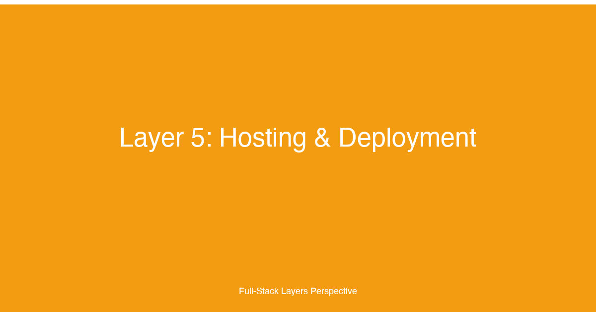

# Layer 5: Hosting & Deployment


## TL;DR

The hosting and deployment layer is where application code becomes a running service. This layer encompasses deployment platforms (Vercel, Netlify, Railway, Fly.io, self-hosted), environment management (development, staging, production, preview deployments), rollout strategies (blue-green, canary, feature flags), and infrastructure as code (Terraform, Pulumi, CloudFormation). For fullstack developers, mastering this layer means understanding how to choose the right platform for each workload, manage multiple environments with parity, deploy with zero downtime and progressive exposure, and codify infrastructure so it is reviewable, versioned, and reproducible. This layer is the bridge between development velocity and production reliability — the difference between a deployment that causes an incident and one that users never notice.

## Why This Layer Matters

Hosting and deployment is the operational reality of every application. No matter how clean the code, how comprehensive the tests, or how elegant the architecture, a poorly designed deployment pipeline undermines everything. A deployment that takes 45 minutes and requires manual coordination is a deployment that happens infrequently, which means bug fixes and features languish in staging while users wait. A deployment that lacks rollback capability is a deployment that turns every release into a high-stakes gamble. A deployment that treats production, staging, and development as fundamentally different environments is a deployment where "works on my machine" becomes an organizational excuse.

The modern hosting landscape offers an overwhelming range of options. Platform-as-a-Service providers like Vercel, Netlify, and Railway abstract away server management entirely, letting developers push code and have it running in seconds. Container-focused platforms like Fly.io, Render, and Railway provide the flexibility of containers with the convenience of managed infrastructure. Cloud providers like AWS, GCP, and Azure offer raw compute, networking, and storage with maximum control. And self-hosted solutions using Kubernetes, Nomad, or bare metal provide ultimate sovereignty for regulated industries or high-scale workloads. Choosing the right platform — or combination of platforms — requires understanding the trade-offs between developer experience, operational control, scaling characteristics, and cost.

Environment management is another dimension where deployment decisions have outsize impact. Every environment — development, staging, production, preview — serves a different purpose. Development must prioritize iteration speed. Staging must mirror production as closely as possible to catch environment-specific bugs. Preview deployments enable teams to review changes in an isolated environment before merging. Production must balance stability, performance, and availability. Achieving parity across environments without duplicating infrastructure or introducing configuration drift requires deliberate tooling and discipline.

Rollout strategies determine how new code reaches users. A naive "deploy and hope" approach maximizes velocity but minimizes safety. Blue-green deployments maintain two identical environments and switch traffic atomically, making rollback instantaneous. Canary deployments route a small percentage of traffic to the new version, monitor for errors, and gradually increase the percentage. Feature flags decouple deployment from release, letting teams deploy code to production that is disabled by default and enabled progressively. Each strategy trades complexity for safety, and the right choice depends on the application's risk tolerance, observability, and traffic patterns.

Infrastructure as Code (IaC) transforms infrastructure management from a manual, error-prone process into a software engineering practice. When infrastructure is defined in code — Terraform configurations, Pulumi programs, CloudFormation templates — it can be version-controlled, code-reviewed, tested, and automatically applied. IaC eliminates configuration drift, enables disaster recovery by recreating entire environments from code, and makes infrastructure changes as auditable and reversible as application code changes.

For fullstack developers, the hosting and deployment layer is where the rubber meets the road. It is the layer that determines whether users experience new features or errors, whether rollbacks take seconds or hours, and whether deploying on a Friday afternoon is a reasonable activity or a career-limiting decision.

## Key Considerations for Fullstack Developers

### 1. Deployment Platforms: Matching Workload to Infrastructure

Different application workloads have different hosting requirements. A static marketing site, a server-rendered Next.js application, a real-time WebSocket server, and a background job processor each benefit from different platforms:

- **Vercel** — Optimized for frontend frameworks (Next.js, SvelteKit, Remix). Provides edge functions, ISR, automatic static optimization, and preview deployments. Best for frontend-heavy applications where server-side rendering and edge delivery matter. Not suitable for long-running processes or stateful services.

- **Netlify** — Similar to Vercel with strengths in static sites, serverless functions, and form handling. Netlify's Edge Functions and deploy previews make it a strong choice for Jamstack architectures. Less suited for complex backend logic or database-connected services.

- **Railway** — A container-based platform that emphasizes developer experience. Connect a GitHub repo, choose a build pack or Dockerfile, and get a running service with a database. Excellent for full-stack applications where the same platform hosts frontend, API, and database. Less mature for high-scale enterprise workloads.

- **Fly.io** — Runs containers on firecracker micro-VMs close to users. Supports any language or framework via Docker. Strong for globally distributed applications and real-time workloads. More operational control than Vercel/Netlify, less than raw AWS.

- **Render** — Offers static sites, web services, background workers, PostgreSQL, and Redis in one platform. Good for full-stack applications that want managed infrastructure without cloud-provider complexity. Blueprint IaC provides infrastructure-as-code via YAML.

- **Self-hosted / Cloud providers (AWS, GCP, Azure)** — Maximum control and flexibility. Suitable for regulated industries, high-scale workloads, or organizations with dedicated infrastructure teams. Requires significantly more operational expertise to manage networking, security, scaling, and cost.

### 2. Environment Management: Parity Without Duplication

The principle of environment parity — making development, staging, and production as similar as possible — is one of the most violated principles in practice. The gap between development (SQLite on a laptop, hot reload, mock services) and production (PostgreSQL in a cluster, CDN, real third-party APIs) is a primary source of deployment failures.

**Effective environment management strategies:**

- **Ephemeral environments** — Spin up a complete environment (infrastructure + data seed) for each pull request. Destroy it when the PR merges. Tools like Railway, Heroku Review Apps, and Kubernetes namespaces make this practical. The cost is infrastructure duplication; the benefit is catching environment-specific bugs before merge.

- **Preview deployments** — Deploy the frontend and any frontend-adjacent services (BFF, static assets) to a unique URL for each PR. The backend and database remain shared (or use a staging backend). Vercel, Netlify, and Cloudflare Pages provide preview deployments out of the box. This is lighter weight than full ephemeral environments and sufficient for most frontend changes.

- **Environment configuration as code** — Store environment-specific configuration in the repository, not in a wiki or a developer's local `.env` file. Use a consistent schema across environments and validate it at deploy time. Tools like Doppler, Vault, or AWS Secrets Manager manage secrets across environments without exposing them in code.

- **Database parity** — Use the same database engine (PostgreSQL, not SQLite) in all environments. Seed staging with anonymized production data to catch query performance and data-shape issues before they reach production. Apply migrations to staging first, then production.

### 3. Rollout Strategies: Deploy vs. Release

Deploying is making code available on servers. Releasing is making that code serve user traffic. Decoupling the two is the foundational insight behind safe rollout strategies.

- **Blue-green deployment** — Two identical environments (blue and green) run simultaneously. At any time, one environment serves production traffic. The new version is deployed to the idle environment, tested, and then traffic is switched atomically (at the load balancer or DNS level). Rollback is instantaneous — switch traffic back to the previous environment. The cost is doubled infrastructure during deployment.

- **Canary deployment** — Route a small percentage of traffic (2%, 5%, 10%) to the new version. Monitor error rates, latency, and business metrics. If metrics remain healthy, gradually increase the percentage to 25%, 50%, 100%. If metrics degrade, roll back the canary and investigate. Canary deployments require sophisticated traffic routing infrastructure (service mesh, feature flag platform, or load balancer rules) and robust observability.

- **Feature flags** — Wrap new functionality in conditional checks controlled by a remote configuration service. Deploy the code with the flag disabled. Enable the flag for internal users first, then a small percentage of users, then gradually roll out. Feature flags decouple deployment from release entirely — code can be in production for weeks before it is enabled. The trade-off is technical debt from flag cleanup and the risk of flag-induced complexity in the codebase.

- **Rolling update** — Replace instances one at a time (or in batches) while maintaining the overall service. Kubernetes deployments use rolling updates by default. This is the simplest zero-downtime strategy but provides the least safety — if the new version has a bug, some users experience it before the deployment is rolled back.

### 4. Infrastructure as Code: Codifying Environments

Infrastructure as Code is the practice of defining infrastructure resources — servers, databases, networks, load balancers, DNS records, CDN distributions — in declarative configuration files. IaC provides:

- **Version control** — Infrastructure changes are tracked in git alongside application code. Every change has an author, a review, and a history.
- **Reproducibility** — Recreate any environment (production, staging, a specific PR) from the same code at the same commit.
- **Reviewability** — Pull requests for infrastructure changes are reviewed like code changes, catching misconfigurations before they reach production.
- **Automation** — Infrastructure changes are applied automatically by CI/CD pipelines, not executed manually through cloud consoles.

The three dominant IaC tools are:

- **Terraform** — Declarative HCL (HashiCorp Configuration Language). Provider model supports AWS, GCP, Azure, and 2000+ other providers. State management requires a backend (S3, Terraform Cloud, or similar). The mature ecosystem and broadest provider support make it the default choice for most teams.

- **Pulumi** — IaC with general-purpose programming languages (TypeScript, Python, Go, C#, Java). Infrastructure is defined as real programs with loops, conditionals, functions, and classes. This enables more expressive infrastructure patterns than Terraform's HCL, at the cost of a smaller provider ecosystem.

- **AWS CloudFormation** — AWS-native IaC using JSON or YAML templates. Deep integration with AWS services and built-in drift detection. Limited to AWS and not portable to multi-cloud setups.

## Implementation Patterns & Technologies

```typescript
// infrastructure/stack.ts — Pulumi program defining full-stack infrastructure
import * as aws from '@pulumi/aws';
import * as awsx from '@pulumi/awsx';
import * as docker from '@pulumi/docker';

// Environment name passed at deploy time: 'dev' | 'staging' | 'prod'
const env = process.env.DEPLOY_ENV || 'dev';
const isProduction = env === 'prod';
const stackName = `myapp-${env}`;

// --- Container Registry ---
const ecrRepo = new aws.ecr.Repository(`${stackName}-repo`, {
  forceDelete: true,
  imageScanningConfiguration: { scanOnPush: true },
});

// --- ECS Cluster with Fargate (serverless containers) ---
const cluster = new aws.ecs.Cluster(`${stackName}-cluster`);

// Application load balancer — routes traffic to the correct target group
const alb = new awsx.lb.ApplicationLoadBalancer(`${stackName}-alb`, {
  internal: false,
  securityGroups: [],
  subnetIds: aws.ec2.getSubnetIdsOutput({ vpcId: aws.ec2.getVpcOutput({ default: true }).id }).ids,
});

// --- ECS Service with Blue-Green deployment via CodeDeploy ---
const appService = new awsx.ecs.FargateService(`${stackName}-api`, {
  cluster: cluster.arn,
  taskDefinitionArgs: {
    container: {
      image: process.env.APP_IMAGE || 'nginx:alpine',
      cpu: isProduction ? 512 : 256,
      memory: isProduction ? 1024 : 512,
      portMappings: [{ containerPort: 3000, targetGroup: alb.defaultTargetGroup }],
      environment: [
        { name: 'NODE_ENV', value: env },
        { name: 'DATABASE_URL', value: process.env.DATABASE_URL! },
        { name: 'REDIS_URL', value: process.env.REDIS_URL! },
      ],
    },
  },
  desiredCount: isProduction ? 4 : 1,
  // Blue-green deployment: CodeDeploy shifts traffic from the old task set to the new one
  deploymentController: { type: 'CODE_DEPLOY' },
});

// --- RDS PostgreSQL (Aurora Serverless for staging, provisioned for prod) ---
const db = new aws.rds.Cluster(`${stackName}-db`, {
  engine: 'aurora-postgresql',
  engineVersion: '16.3',
  databaseName: 'myapp',
  masterUsername: 'admin',
  masterPassword: process.env.DB_PASSWORD!,
  serverlessv2ScalingConfiguration: isProduction
    ? { minCapacity: 1, maxCapacity: 16 }
    : { minCapacity: 0.5, maxCapacity: 2 },
  instances: [
    { identifier: `${stackName}-db-0`, instanceClass: isProduction ? 'db.serverless' : 'db.serverless' },
  ],
  skipFinalSnapshot: !isProduction,
  backupRetentionPeriod: isProduction ? 30 : 7,
  deletionProtection: isProduction,
});

// --- CloudFront CDN for static assets ---
const cdn = new aws.cloudfront.Distribution(`${stackName}-cdn`, {
  enabled: true,
  origins: [{
    domainName: alb.loadBalancer.dnsName,
    originId: 'alb-origin',
    customOriginConfig: {
      httpPort: 80,
      httpsPort: 443,
      originProtocolPolicy: 'https-only',
      originSslProtocols: ['TLSv1.2'],
    },
  }],
  defaultCacheBehavior: {
    targetOriginId: 'alb-origin',
    viewerProtocolPolicy: 'redirect-to-https',
    allowedMethods: ['GET', 'HEAD', 'OPTIONS', 'PUT', 'POST', 'PATCH', 'DELETE'],
    cachedMethods: ['GET', 'HEAD', 'OPTIONS'],
    forwardedValues: {
      queryString: true,
      cookies: { forward: 'all' },
      headers: ['Authorization', 'CloudFront-Viewer-Country', 'Origin'],
    },
    minTtl: 0,
    defaultTtl: 0,
    maxTtl: 0,  // dynamic content, not cached at edge
    compress: true,
  },
  orderedCacheBehaviors: [
    // Static assets (_next/static, images) — cache aggressively
    {
      pathPattern: '/_next/static/*',
      targetOriginId: 'alb-origin',
      viewerProtocolPolicy: 'redirect-to-https',
      allowedMethods: ['GET', 'HEAD', 'OPTIONS'],
      cachedMethods: ['GET', 'HEAD', 'OPTIONS'],
      forwardedValues: { queryString: false, cookies: { forward: 'none' } },
      minTtl: 0,
      defaultTtl: 86400,  // 1 day
      maxTtl: 31536000,   // 1 year
      compress: true,
    },
  ],
  priceClass: 'PriceClass_100',  // US, Canada, Europe only
  customErrorResponses: [
    { errorCode: 404, responseCode: 200, responsePagePath: '/404.html' },
  ],
  aliases: isProduction ? ['myapp.com', 'www.myapp.com'] : [`${env}.myapp.com`],
  viewerCertificate: {
    acmCertificateArn: process.env.CERT_ARN!,
    sslSupportMethod: 'sni-only',
    minimumProtocolVersion: 'TLSv1.2_2021',
  },
});

// --- Output values consumed by the CI/CD pipeline ---
export const cdnDomain = cdn.domainName;
export const albDns = alb.loadBalancer.dnsName;
export const dbEndpoint = db.endpoint;
export const ecrRepoUrl = ecrRepo.repositoryUrl;
```

This Pulumi program defines a production-grade full-stack infrastructure stack in roughly 100 lines of TypeScript. Each resource is explicitly configured for the environment (`dev`, `staging`, `prod`) with appropriate scaling, backup, and security settings. The CloudFront distribution is configured with two cache behaviors: the default behavior passes through with no caching (for dynamic API responses), while the `/_next/static/*` pattern caches aggressively at the edge (for immutable build artifacts).

```yaml
# .github/workflows/deploy.yml — GitHub Actions workflow with canary analysis
name: Deploy to Production
on:
  push:
    branches: [main]

env:
  AWS_REGION: us-east-1
  ECR_REPOSITORY: myapp/api
  ECS_CLUSTER: myapp-prod-cluster
  ECS_SERVICE: myapp-prod-api

jobs:
  build-and-deploy:
    runs-on: ubuntu-latest
    permissions:
      id-token: write  # OIDC authentication with AWS
      contents: read

    steps:
      - uses: actions/checkout@v4

      # --- Step 1: Build, tag, and push the Docker image ---
      - name: Configure AWS credentials (OIDC)
        uses: aws-actions/configure-aws-credentials@v4
        with:
          role-to-assume: arn:aws:iam::${{ secrets.AWS_ACCOUNT_ID }}:role/github-actions
          aws-region: ${{ env.AWS_REGION }}

      - name: Login to Amazon ECR
        id: login-ecr
        uses: aws-actions/amazon-ecr-login@v2

      - name: Build and tag Docker image
        id: build-image
        env:
          ECR_REGISTRY: ${{ steps.login-ecr.outputs.registry }}
          IMAGE_TAG: ${{ github.sha }}
        run: |
          docker build \
            --cache-from $ECR_REGISTRY/$ECR_REPOSITORY:latest \
            -t $ECR_REGISTRY/$ECR_REPOSITORY:$IMAGE_TAG \
            -t $ECR_REGISTRY/$ECR_REPOSITORY:latest \
            .
          docker push --all-tags $ECR_REGISTRY/$ECR_REPOSITORY
          echo "image=$ECR_REGISTRY/$ECR_REPOSITORY:$IMAGE_TAG" >> $GITHUB_OUTPUT

      # --- Step 2: Deploy with CodeDeploy (blue-green) ---
      - name: Deploy to ECS with CodeDeploy
        id: deploy
        run: |
          # Create the appspec.yml for CodeDeploy (blue-green deployment)
          cat > appspec.yml << 'EOF'
          version: 1
          Resources:
            - TargetService:
                Type: AWS::ECS::Service
                Properties:
                  TaskDefinition: "<TASK_DEFINITION>"
                  LoadBalancerInfo:
                    ContainerName: "api"
                    ContainerPort: 3000
          EOF

          # Register a new task definition with the updated image
          aws ecs register-task-definition \
            --family myapp-api \
            --cli-input-json "$(aws ecs describe-task-definition \
              --task-definition myapp-api \
              --query 'taskDefinition' \
              | jq '.containerDefinitions[0].image = "${{ steps.build-image.outputs.image }}"' \
              | jq 'del(.taskDefinitionArn, .revision, .status, .requiresAttributes, .compatibilities)')" \
            --query 'taskDefinition.taskDefinitionArn' \
            --output text > task-def-arn.txt

          # Create CodeDeploy deployment (10% canary, 5-minute interval)
          aws deploy create-deployment \
            --application-name myapp-ecs-app \
            --deployment-group-name myapp-ecs-group \
            --revision "revisionType=AppSpecContent,appSpecContent={content=file://appspec.yml}" \
            --description "Canary deploy $(git rev-parse --short HEAD)" \
            --output json

      # --- Step 3: Monitor canary health via CloudWatch ---
      - name: Monitor canary metrics
        run: |
          echo "Monitoring canary deployment for 5 minutes..."
          # Wait for the canary to stabilize (10% traffic for 5 minutes)
          sleep 300

          # Check for increased error rate in the canary target group
          ERROR_RATE=$(aws cloudwatch get-metric-statistics \
            --namespace AWS/ApplicationELB \
            --metric-name HTTPCode_Target_5XX_Count \
            --dimensions Name=LoadBalancer,Value=app/myapp-prod-alb/abc123 \
            --start-time "$(date -u -d '5 minutes ago' +%Y-%m-%dT%H:%M:%SZ)" \
            --end-time "$(date -u +%Y-%m-%dT%H:%M:%SZ)" \
            --period 60 \
            --statistics Sum \
            --query 'Datapoints[0].Sum' \
            --output text)

          if [ "$ERROR_RATE" = "None" ] || [ "$ERROR_RATE" -lt 5 ]; then
            echo "✅ Canary healthy — proceeding to full rollout"
            # Trigger CodeDeploy to shift remaining 90% traffic
            aws deploy continue-deployment \
              --deployment-id "$(aws deploy list-deployments \
                --application-name myapp-ecs-app \
                --deployment-group-name myapp-ecs-group \
                --query 'deployments[0]' \
                --output text)" \
              --deployment-wait-type READY
          else
            echo "❌ Canary error rate too high ($ERROR_RATE 5XX in 5min) — rolling back"
            aws deploy stop-deployment \
              --deployment-id "$(aws deploy list-deployments \
                --application-name myapp-ecs-app \
                --deployment-group-name myapp-ecs-group \
                --query 'deployments[0]' \
                --output text)" \
              --auto-rollback-enabled
            exit 1
          fi

      # --- Step 4: Invalidate CloudFront cache for updated assets ---
      - name: Invalidate CloudFront cache
        run: |
          aws cloudfront create-invalidation \
            --distribution-id ${{ secrets.CLOUDFRONT_DISTRIBUTION_ID }} \
            --paths "/*"
```

This GitHub Actions workflow implements a canary blue-green deployment on ECS with automated rollback. The pipeline builds a Docker image, registers a new task definition, deploys via AWS CodeDeploy starting at 10% traffic, monitors error rates for five minutes via CloudWatch, and either promotes the canary to full rollout or automatically rolls back. The final step invalidates the CloudFront CDN cache so users see the latest assets.

### Platform Decision Matrix

| Criterion | Vercel | Railway | Fly.io | AWS (self-managed) |
|-----------|--------|---------|--------|--------------------|
| Setup time | Minutes | Minutes | Minutes | Days to weeks |
| Frontend optimization | Excellent | Good | Good | Manual |
| Stateful services | No | Yes | Yes | Yes |
| Global edge | Built-in | Regional | Per-user proximity | CloudFront + regions |
| Infrastructure control | Minimal | Moderate | Moderate | Complete |
| Operational overhead | Near zero | Low | Low | High |
| Cost at scale | High (per-request) | Moderate | Moderate | Lowest |
| Preview deployments | Built-in | Manual | Manual | Manual |

## Common Pitfalls

### 1. Environment Drift Between Development and Production

The most common deployment failure is an environment difference that was never tested. A PostgreSQL 15 feature used in production but not available in the local PostgreSQL 14. A Linux-only npm dependency that works on macOS during development. A timeout that is too tight in production because the staging environment is on the same network as the database while production is cross-region. Use Docker for local development to match the production runtime. Use the same database engine and version everywhere. Run integration tests in a CI environment that mirrors production, not on developer laptops.

### 2. Deploy and Pray

Deploying without automated health checks, rollback capability, or gradual traffic shifting is gambling with production. A deployment that immediately serves 100% of traffic to a broken version affects every user. Always have a rollback plan — and test it. Use blue-green or canary deployments so that a bad release impacts at most a small percentage of users. Monitor error rates and latency during and after deployment, not just uptime.

### 3. Infrastructure as Manual Configuration

Clicking buttons in the AWS console to set up infrastructure is fast and dangerous. Manual infrastructure creates snowflake environments that cannot be reproduced. When something breaks at 3 AM, no one remembers which buttons were clicked six months ago. Codify everything — databases, load balancers, DNS, CDN, IAM roles, VPCs — in Terraform, Pulumi, or CloudFormation. Apply infrastructure changes through CI/CD, not through the console.

### 4. Ignoring Preview Deployments

Deploying every pull request to a shared staging environment creates contention — two PRs in testing at the same time step on each other. A team of five developers sharing one staging environment spends more time coordinating than testing. Use preview deployments (Vercel, Netlify, Railway) or ephemeral Kubernetes namespaces so every PR gets its own isolated environment. The infrastructure cost is modest; the productivity gain is significant.

### 5. Secrets in Environment Variables at Build Time

Injecting secrets (API keys, database passwords) as build-time environment variables embeds them in the Docker image or build artifact. Anyone with access to the image can extract the secrets. Use runtime secrets — injected at container start time via secrets manager (AWS Secrets Manager, Vault, Doppler) or environment variables set at the orchestrator level. Never bake secrets into images.

### 6. Not Testing the Rollback

Most teams have a rollback strategy. Few teams have tested it. A rollback that has never been exercised will fail when it is needed — the database migration cannot be reverted, the old Docker image was pruned from the registry, the rollback script has a syntax error. Test rollbacks in staging as part of every release. Automate rollback verification in the CI pipeline.

### 7. Treating All Environments Identically

Parity does not mean identity. Production needs different scaling, backup, alerting, and security configurations than staging. Staging needs different data seeding and monitoring than development. Configuring every environment with production-grade redundancy and backup multiplies cost without benefit. Use environment-specific IaC variables to right-size each environment while keeping the infrastructure definition consistent.

## How This Layer Connects to the 12 Factors

- **[Factor 2: Repository Strategy](../articles/02-Factor-2.md)** — The repository structure directly determines deployment strategy. A monorepo with multiple applications (frontend, API, workers) requires a build pipeline that can selectively deploy based on changed files, while a multirepo setup deploys each repository independently. Monorepos enable atomic deployments across services but require sophisticated tooling (Nx, Turborepo) to avoid rebuilding everything on every change. The deployment layer implements the repository strategy's decisions about build isolation, artifact versioning, and cross-service deployment coordination.

- **[Factor 7: Rendering Strategies](../articles/07-Factor-7.md)** — The rendering strategy determines hosting requirements. SSR applications need servers that can execute JavaScript at request time — Vercel's edge functions, Fly.io's micro-VMs, or ECS Fargate tasks. SSG applications need a build step and a CDN — and can be hosted on simpler, cheaper infrastructure (S3 + CloudFront, Netlify). ISR requires platforms that support on-demand revalidation with cache purging. The deployment pipeline must match the chosen rendering strategy: SSR deployments must handle connection pooling, session affinity, and cold starts; SSG deployments must handle incremental builds and cache invalidation.

- **[Factor 1: UI Component Libraries & Frameworks](../articles/01-Factor-1.md)** — The frontend framework determines which hosting platforms are compatible. Next.js integrates natively with Vercel; SvelteKit works well with Netlify or Vercel; Remix is optimized for Fly.io. The deployment platform's support for the framework's rendering model (SSR, SSG, ISR, edge functions) is a factor in platform selection.

- **[Factor 10: Backend-for-Frontend (BFF)](../articles/10-Factor-10.md)** — The BFF pattern impacts deployment by introducing an additional service that must be deployed alongside the frontend. BFF deployment must be coordinated with frontend deployment to ensure API compatibility. Preview deployments for the BFF enable frontend developers to test API changes in isolation.

- **[Factor 11: API Communication Patterns](../articles/11-Factor-11.md)** — API patterns influence deployment topology. REST APIs are straightforward to deploy behind any load balancer. GraphQL APIs may benefit from dedicated caching infrastructure (CDN for queries, not mutations). WebSocket servers require platforms that support long-lived connections with sticky sessions, which rules out serverless platforms like Vercel and limits options to Fly.io, Railway, or container-based hosting.

- **[Supplemental Factor 3: Micro-Frontends](../articles/15-Supplemental-factor-3.md)** — Micro-frontend architectures require coordinated deployment of multiple independent frontend applications. Each micro-frontend may be deployed by a different team on a different cadence, yet they must compose seamlessly at runtime. The hosting layer must support independent deployments, shared infrastructure (CDN, routing layer), and integration testing across micro-frontends before they reach users.

## Case Study

Tikal helped a major media company — one of the largest news publishers in the country — transform their deployment process from a 45-minute manual FTP workflow to a fully automated CI/CD pipeline with preview environments and zero-downtime blue-green deployments.

**The challenge:** The company operated a high-traffic news site that served 100,000+ concurrent readers during breaking news events. Their deployment process was entirely manual: a developer would build the application locally, compress it into a ZIP file, upload it via FTP to a shared hosting server, and manually restart the web server. A single deployment took 45 minutes of focused effort and had to be scheduled during low-traffic windows (typically 2-3 AM). Rollbacks were worse — they required locating the previous build archive, re-uploading it, and restarting the server again. During breaking news, when the newsroom was publishing stories as quickly as possible, the deployment bottleneck meant stories could be 30-60 minutes late reaching the CDN. Deployments failed approximately 15% of the time due to file permission issues, missing dependencies, or configuration differences between the developer's machine and the production server. Each failed deployment delayed the next attempt by at least an hour.

**Our approach:** We designed and implemented a complete CI/CD transformation with four key components:

1. **GitHub Actions CI/CD pipeline** — Every push to the `main` branch triggered a pipeline that: ran the test suite (unit, integration, and visual regression tests), built the Next.js application with production optimizations, built a Docker image with the Node.js runtime and application code, pushed the image to Amazon ECR, and deployed the image to an ECS Fargate cluster using blue-green deployment.

2. **Preview environments** — Every pull request received its own preview environment. A lightweight ECS Fargate service (256 CPU, 512 MB RAM, 1 task) was provisioned automatically by a GitHub Actions workflow, deployed with the PR's Docker image, and assigned a unique URL (`pr-123.preview.news-site.com`). The preview environment connected to a shared staging database seeded with anonymized production data. When the PR was merged or closed, the preview environment was torn down automatically.

3. **Blue-green deployment with canary analysis** — Production deployment used AWS CodeDeploy with a blue-green strategy. The new version was deployed to the idle target group (green). Once healthy, 10% of traffic was shifted to the green group for a five-minute observation period. CloudWatch alarms monitored 5xx error rates, p95 latency, and custom business metrics (article views per minute). If metrics remained healthy, the remaining 90% of traffic was shifted. If metrics breached thresholds, CodeDeploy automatically rolled back to the blue group.

4. **CloudFront cache invalidation** — The final deployment step invalidated the CloudFront CDN cache for all paths. To avoid the cost and latency of a full invalidation (`/*`), we configured the pipeline to invalidate only changed paths by comparing the current build manifest against the previous one. For breaking news, where immediacy was critical, we added an API endpoint that the newsroom CMS could call to trigger a targeted cache invalidation for specific article paths — this reduced the "story published to reader sees it" time from minutes to under 10 seconds.

```typescript
// scripts/invalidateCache.ts — Targeted CloudFront invalidation for changed assets
import { CloudFrontClient, CreateInvalidationCommand } from '@aws-sdk/client-cloudfront';
import { readFileSync, existsSync } from 'fs';
import { execSync } from 'child_process';

const cf = new CloudFrontClient({ region: process.env.AWS_REGION });
const DISTRIBUTION_ID = process.env.CLOUDFRONT_DISTRIBUTION_ID!;

interface BuildManifest {
  // Maps build output files to their content hashes
  assets: Record<string, string>;
  pages: Record<string, { initial?: string[] }>;
}

export async function invalidateChangedAssets(): Promise<void> {
  const currentManifest: BuildManifest = JSON.parse(
    readFileSync('.next/build-manifest.json', 'utf-8')
  );

  let previousManifest: BuildManifest = { assets: {}, pages: {} };
  const prevPath = '.next/previous-build-manifest.json';

  if (existsSync(prevPath)) {
    previousManifest = JSON.parse(readFileSync(prevPath, 'utf-8'));
  }

  // Find only the assets whose content hash changed
  const changedPaths: string[] = [];

  for (const [asset, hash] of Object.entries(currentManifest.assets)) {
    if (previousManifest.assets[asset] !== hash) {
      changedPaths.push(`/${asset}`);
    }
  }

  for (const [page, { initial }] of Object.entries(currentManifest.pages)) {
    const prev = previousManifest.pages[page]?.initial ?? [];
    const curr = initial ?? [];
    if (JSON.stringify(prev) !== JSON.stringify(curr)) {
      changedPaths.push(page === '/' ? '/index.html' : `${page}.html`);
    }
  }

  if (changedPaths.length === 0) {
    console.log('No changed assets to invalidate');
    return;
  }

  // Batch paths into groups of 15 (CloudFront invalidation limit per path)
  const BATCH_SIZE = 15;
  for (let i = 0; i < changedPaths.length; i += BATCH_SIZE) {
    const batch = changedPaths.slice(i, i + BATCH_SIZE);

    await cf.send(new CreateInvalidationCommand({
      DistributionId: DISTRIBUTION_ID,
      InvalidationBatch: {
        CallerReference: `deploy-${Date.now()}-${i}`,
        Paths: {
          Quantity: batch.length,
          Items: batch,
        },
      },
    }));

    console.log(`Invalidated ${batch.length} paths:`, batch);
  }

  // Save the current manifest for the next deploy
  execSync('cp .next/build-manifest.json .next/previous-build-manifest.json');
}

// Usage: called at the end of the deploy workflow
// npx tsx scripts/invalidateCache.ts
```

This script reads the Next.js build manifest, compares the current build's asset hashes against the previous deploy, and issues targeted CloudFront invalidations for only the changed assets. On a typical deploy — where only a few pages or components changed — this invalidates 5-20 paths instead of thousands, reducing invalidation cost by 90% and completion time from minutes to seconds.

**Results:**

- **Deployment time dropped from 45 minutes to 4 minutes** — The fully automated CI/CD pipeline, from commit to production, took under four minutes. The bottleneck shifted from the deployment itself to the test suite (which we also optimized from 12 minutes to 3 minutes through parallelization and test splitting).
- **Zero-downtime deployments** — Every deployment used blue-green with canary analysis. Readers never saw errors during deployments. The newsroom could deploy during peak traffic hours without concern.
- **Deployment failure rate dropped from 15% to 0.3%** — Automated testing caught the issues that previously caused FTP deployment failures. The only remaining failures were infrastructure issues (ECR registry unavailable, CloudFront API throttling), each with automated retry logic.
- **Story publication latency dropped from 30-60 minutes to under 10 seconds** — The targeted cache invalidation API combined with the automated CI/CD pipeline meant that breaking news stories published by the CMS reached readers through the CDN in under 10 seconds, compared to the previous window of 30-60 minutes between CMS publish and manual FTP deploy.
- **Preview environments transformed the review workflow** — The editorial team used preview URLs to review story layouts before publication. Designers verified responsive breakpoints. Ad operations validated ad placements. The product manager reviewed feature changes before merge. Preview environments eliminated the "it worked on my machine" gap between development and production.
- **Developer productivity increased** — Deploying on Friday afternoon was no longer a risk. The automated rollback meant that any bad deploy was detected and reverted within five minutes with zero user impact. Developers deployed 8x more frequently — from once every two days to four times per day on average.

**Key lessons:** The most impactful change was not any single technology — it was the shift in mindset from deployment as a risky manual operation to deployment as a safe automated process. The preview environments eliminated the "it works on my machine" problem by providing an isolated environment for every change. The blue-green canary deployment eliminated the fear of breaking production. The targeted cache invalidation eliminated the latency between content publication and CDN delivery. Each component of the transformation reduced a specific source of risk or delay, and together they made deployment fast, safe, and frequent.

## Conclusion

The hosting and deployment layer is the operational foundation of every full-stack application. Choosing the right platform for each workload — Vercel for frontend-heavy apps, Fly.io for globally distributed services, Railway for full-stack simplicity, or AWS for maximum control — is the first architectural decision. Managing environments with parity through Docker, ephemeral environments, and code-defined configuration eliminates the "works on my machine" class of deployment failures. Implementing rollout strategies that decouple deployment from release — blue-green for atomic cutovers, canary for progressive exposure, feature flags for per-user targeting — makes deploying safe enough to do multiple times a day. And adopting infrastructure as Code transforms infrastructure from a fragile snowflake into a versioned, reviewable, reproducible asset.

Start by automating your deployment pipeline before you worry about rollout strategies. A manual deployment with blue-green is still a manual deployment. Use preview environments for every pull request — the infrastructure cost is negligible compared to the debugging time they save. Codify your infrastructure in Terraform or Pulumi so that a complete environment can be recreated from scratch. Deploy in small, frequent increments — the more often you deploy, the smaller each change is, and the easier it is to identify the cause of any issue. And always test your rollback: a deployment strategy is only as good as its ability to undo a bad change without user impact.

The hosting and deployment layer does not need to be complex — but it must be deliberate. Every deployment should be automated, tested, gradual, and reversible. When deployment is boring, the team can focus on what matters: building features that users love.

---

_This article is part of Tikal's Modern Full-Stack Developer's Guide: A 12-Factor Approach series. For the application architecture perspective, see the [main 12 factors](../articles/00-Intro.md)._
