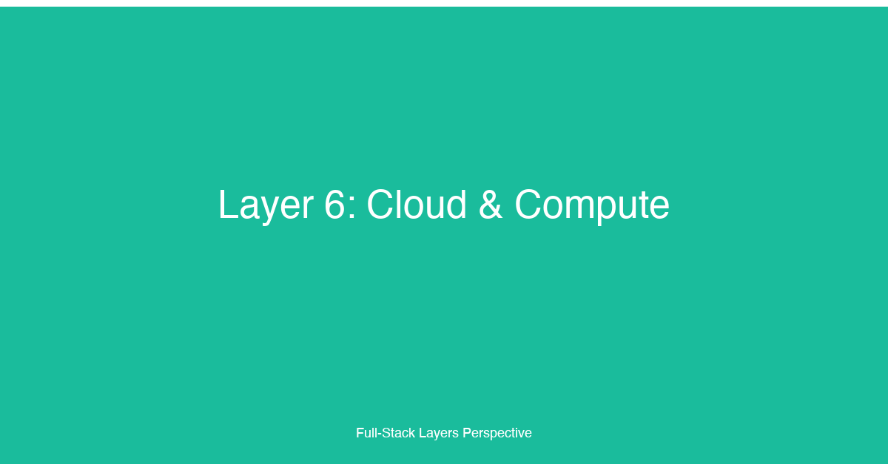

# Layer 6: Cloud & Compute


## TL;DR

The cloud and compute layer is where infrastructure meets application architecture. This layer encompasses cloud provider selection (AWS, GCP, Azure — each with distinct service models and pricing philosophies), compute options (VMs, containers on Kubernetes, serverless functions, edge compute), cost management strategies (right-sizing, reserved instances, spot instances, FinOps practices), and multi-cloud considerations. For fullstack developers, mastering this layer means understanding which compute model fits each workload, how to design for cloud economics, when multi-cloud adds value versus when it adds complexity, and how to avoid vendor lock-in without over-engineering for portability. This layer is the infrastructure foundation — it determines the cost structure, operational complexity, scaling characteristics, and deployment flexibility of every application.

## Why This Layer Matters

Cloud infrastructure has transformed from "rented servers" into a rich ecosystem of managed services that abstract away networking, storage, scaling, and operations. But the abundance of choice creates a new problem: selecting the right service for each workload requires understanding the trade-offs between control, cost, and convenience across hundreds of services on each major cloud provider.

The three dominant cloud providers — Amazon Web Services (AWS), Google Cloud Platform (GCP), and Microsoft Azure — offer functionally equivalent services under different names and pricing models. AWS pioneered the public cloud with EC2 (2006) and maintains the broadest service catalog with the most mature ecosystem. GCP differentiates through data and machine learning services, Kubernetes native integration, and a network that leverages Google's private fiber backbone. Azure is the strongest enterprise choice with deep Microsoft ecosystem integration (Active Directory, Office 365, SQL Server licensing) and aggressive hybrid-cloud support. The choice between them often comes down to organizational expertise, existing vendor relationships, and specific service maturity rather than technical superiority.

Compute models have expanded from the single option of virtual machines into a spectrum of abstraction levels. Virtual machines (EC2, GCE, Azure VMs) offer maximum control and compatibility at the cost of operational overhead. Containers orchestrated by Kubernetes (EKS, GKE, AKS) provide portability, resource efficiency, and declarative management while trading some control for abstraction. Serverless compute (Lambda, Cloud Functions, Azure Functions) eliminates server management entirely — pay only for execution time — but introduces cold starts, execution duration limits, and statelessness constraints. Edge compute (Cloudflare Workers, Deno Deploy, Lambda@Edge) pushes execution closer to users, reducing latency for global audiences at the cost of runtime restrictions.

Cost management in the cloud is fundamentally different from traditional infrastructure. Cloud costs are variable, granular, and easy to inflate through inefficient resource allocation. The most common sources of cloud waste are over-provisioned resources (running instances that are too large for the workload), idle resources (instances running 24/7 when usage drops at night or on weekends), orphaned resources (storage volumes, load balancers, IP addresses not attached to any workload), and data transfer fees (moving data between regions or out of the cloud). FinOps — the practice of bringing financial accountability to cloud spending — has emerged as a discipline combining culture, tooling, and processes to optimize cloud costs without sacrificing performance or velocity.

Multi-cloud and vendor lock-in are among the most debated topics in cloud architecture. Running workloads across multiple cloud providers simultaneously is almost always more expensive and more complex than using a single provider — the operational overhead of managing two sets of IAM policies, networking configurations, monitoring tools, and incident response procedures is substantial. However, multi-cloud strategies make sense in specific scenarios: avoiding single-provider dependency for critical infrastructure, leveraging each provider's unique services (GCP for BigQuery, AWS for Lambda), meeting data residency or regulatory requirements, or as a negotiating position for pricing.

## Key Considerations for Fullstack Developers

### 1. Cloud Provider Comparison: AWS vs. GCP vs. Azure

The three major cloud providers offer comparable core services but differ in philosophy, pricing, and ecosystem maturity:

- **AWS** — The market leader with the broadest service catalog. AWS's 200+ services cover every category from compute to quantum computing. The ecosystem is the most mature with the largest community, most third-party tooling, and the deepest documentation. AWS pricing is complex — each service has its own pricing model, and the cost calculator is essential for estimation. AWS's innovation pace means new services and features are released continuously, but the sheer breadth can be overwhelming. Best for organizations that want maximum service availability, have existing AWS expertise, or need a specific AWS service (Lambda, DynamoDB, S3).

- **GCP** — Differentiated by data and ML services (BigQuery, Vertex AI, Cloud Spanner), Kubernetes native integration (GKE is the most mature managed Kubernetes), and competitive pricing for sustained usage (committed use discounts, sustained use discounts without upfront commitment). GCP's network infrastructure uses Google's global fiber network, providing consistent performance for globally distributed workloads. GCP's service catalog is smaller than AWS, and some services have less mature ecosystems. Best for data-heavy workloads, Kubernetes-native architectures, and organizations using Google Workspace.

- **Azure** — The strongest enterprise play with deep Microsoft integration. Azure AD is the identity provider for millions of organizations, making Azure the natural choice for Microsoft-centric enterprises. Azure's hybrid cloud capabilities (Azure Arc, Azure Stack) are the most mature. Pricing aligns with Microsoft licensing, which can provide significant savings for organizations with existing Microsoft agreements. Some services lag behind AWS and GCP in maturity, particularly serverless and managed Kubernetes. Best for Microsoft-centric enterprises, organizations requiring hybrid cloud, and regulated industries with compliance requirements.

The service model spectrum is consistent across all three providers:

| Service Model | AWS | GCP | Azure |
|---|---|---|---|
| Virtual Machines | EC2 | Compute Engine | Virtual Machines |
| Managed Containers | ECS / EKS | GKE | AKS |
| Serverless Functions | Lambda | Cloud Functions | Azure Functions |
| Serverless Containers | Fargate | Cloud Run | Container Instances |
| Object Storage | S3 | Cloud Storage | Blob Storage |
| Relational Database | RDS | Cloud SQL | Azure SQL |
| Managed PostgreSQL | Aurora | Cloud SQL / AlloyDB | Flexible Server |
| Message Queues | SQS / SNS | Pub/Sub | Service Bus |
| Load Balancing | ALB / NLB | Cloud Load Balancing | Load Balancer |
| CDN | CloudFront | Cloud CDN | Azure CDN |

### 2. Compute Models: Choosing the Right Abstraction

The compute model decision is the most consequential infrastructure choice. Each model occupies a different point on the control-to-convenience spectrum:

**Virtual Machines (VMs)** — The foundational compute primitive. VMs provide full control over the operating system, runtime, libraries, and configuration. Use VMs when you need maximum compatibility (legacy applications, specific kernel modules), require persistent local storage, or have workloads with predictable resource utilization. The trade-off is operational overhead — OS patching, security hardening, capacity planning, and auto-scaling configuration are all your responsibility.

**Containers and Kubernetes** — Containers package application code with its dependencies, ensuring consistent behavior across environments. Kubernetes orchestrates container deployment, scaling, networking, and rolling updates. Use containers when you want the portability of a standardized runtime without the overhead of full VMs. Kubernetes adds value for microservice architectures with many services, teams that need self-service deployment, and workloads that benefit from automated scaling and self-healing. The trade-off is Kubernetes operational complexity — managing a cluster requires significant expertise, and even managed Kubernetes (EKS, GKE, AKS) involves learning curve and operational burden.

**Serverless Functions** — Execute code in response to events without provisioning or managing servers. The cloud provider handles all infrastructure — scaling from zero to thousands of concurrent executions, patching the runtime, and collecting logs. Use serverless functions for event-driven workloads (webhook handlers, image processing, scheduled tasks), API endpoints with variable traffic, and workloads where the cost of idle infrastructure is unacceptable. The trade-offs are cold start latency (the delay when a function is invoked after being idle), execution duration limits (typically 15 minutes for AWS Lambda), and statelessness (functions cannot rely on local filesystem state across invocations).

**Serverless Containers (Fargate, Cloud Run)** — A hybrid model that combines container portability with serverless operations. You package your application in a container and specify resource requirements; the provider runs the container without you managing servers. Cloud Run scales to zero when idle (no cost) and cold-starts faster than Lambda for container workloads. Fargate requires at least one running task (no scale-to-zero) but supports longer-running workloads and stateful applications. Use serverless containers when containers are the right packaging format but you want to avoid Kubernetes operational overhead.

**Edge Compute** — Executes code at CDN edge locations, closest to users. Cloudflare Workers run on Cloudflare's global network in over 300 locations; Lambda@Edge runs on CloudFront's global infrastructure; Deno Deploy runs on Deno's global network. Edge compute is ideal for request/response transformations (A/B testing, geolocation-based content, authentication checks), API gateway logic, and latency-critical personalization. The constraints are severe: limited runtime (usually V8 isolates), restricted API access (no filesystem, limited network access), and tight execution budgets (sub-millisecond CPU time).

### 3. Cost Management: Right-Sizing, Reserved Instances, and Spot Instances

Cloud cost management is a continuous process, not a one-time optimization. The three primary levers are:

**Right-Sizing** — Matching instance or resource size to actual workload requirements. Most teams over-provision by 2-4x "to be safe." Right-sizing involves analyzing CPU, memory, network, and I/O utilization over time and rightsizing to the appropriate instance family and size. Tools like AWS Compute Optimizer, GCP Recommender, and Azure Advisor provide automated right-sizing recommendations. Right-sizing is the highest-ROI cost optimization — it requires no architectural changes and typically reduces compute costs by 20-40% on its own.

**Reserved Instances and Committed Use Discounts** — Committing to a specific instance configuration for a 1-year or 3-year term in exchange for a significant discount (up to 72% for AWS 3-year all-upfront, 70% for GCP committed use, 60%+ for Azure reserved instances). Reserved instances make sense for base-load workloads that run continuously — databases, production services with consistent traffic, internal tools. They do not make sense for variable or experimental workloads. The commitment creates a cost floor: even if usage drops, you continue paying for the reserved capacity.

**Spot Instances and Preemptible VMs** — Excess cloud capacity sold at a steep discount (60-90% off on-demand pricing) that can be reclaimed by the provider with short notice (30 seconds for AWS Spot, 30 seconds for GCP preemptible). Spot instances are ideal for fault-tolerant, interruptible workloads: batch processing, CI/CD runners, data analysis jobs, render farms, and stateless microservices with graceful shutdown handling. They are not suitable for stateful services, latency-sensitive workloads, or single-instance applications.

Beyond these three levers, cost management requires:

- **Tagging and cost allocation** — Tag every resource with environment, team, application, and cost center. Use tags to filter cost reports and charge back to teams.
- **Automatic shutdown of non-production environments** — Turn off development and staging environments on nights and weekends. A development environment running 24/7 costs the same as a production environment of the same size.
- **Storage lifecycle policies** — Move infrequently accessed data to cheaper storage tiers automatically (S3 Standard → S3 Glacier → S3 Glacier Deep Archive).
- **Data transfer awareness** — Design architecture to minimize cross-region and cross-AZ data transfer, which is a significant and often overlooked cost component.

### 4. Multi-Cloud and Vendor Lock-In

Vendor lock-in is the dependency on a specific cloud provider's proprietary services that makes migration to another provider difficult or expensive. The risk is real but often overstated. Avoiding lock-in entirely requires using the lowest-common-denominator services — VMs, basic object storage, and standard load balancers — which means forgoing the managed services that provide the most value (DynamoDB, BigQuery, Lambda, SQS, CloudFront).

A pragmatic approach to lock-in:

- **Use managed services for core differentiation** — The productivity gains from Lambda, BigQuery, DynamoDB, and S3 far outweigh the theoretical migration cost. These services are where the cloud provider delivers the most value.
- **Abstract provider-specific APIs behind interfaces** — Wrap service-specific SDK calls behind application-level interfaces (repository pattern for databases, message bus interfaces for queues). This enables switching only if the migration benefit exceeds the abstraction maintenance cost.
- **Design for portability only where it matters** — Containerize applications so the compute layer is portable across any Kubernetes cluster (EKS, GKE, AKS, or self-hosted). Use open-source databases (PostgreSQL, MySQL) rather than proprietary databases (DynamoDB, Cosmos DB) when portability is a hard requirement.
- **Prefer providers with open-source contributions** — GCP's Kubernetes leadership and BigQuery's standard SQL interface reduce lock-in compared to proprietary alternatives.

Multi-cloud — actively running workloads on two or more providers simultaneously — is almost never the right default. The operational overhead of duplicate IAM, networking, monitoring, alerting, and deployment pipelines across providers is substantial. Multi-cloud is justified in specific cases: active-active disaster recovery across providers (very rare and expensive), price arbitrage (moving workloads based on spot pricing differences), or organizational requirements (an acquisition brings infrastructure on a different provider).

## Implementation Patterns & Technologies

```typescript
// infrastructure/compute-stack.ts — Multi-compute infrastructure with CDKTF
// This program deploys a full-stack application across three compute models:
// serverless (Lambda for API), containers (ECS Fargate for background workers),
// and edge (CloudFront Functions for request transformation).

import { Construct } from 'constructs';
import { App, TerraformStack, Fn } from 'cdktf';
import { AwsProvider } from '@cdktf/provider-aws/lib/provider';
import { LambdaFunction, LambdaFunctionConfig } from '@cdktf/provider-aws/lib/lambda-function';
import { LambdaPermission } from '@cdktf/provider-aws/lib/lambda-permission';
import { EcsCluster } from '@cdktf/provider-aws/lib/ecs-cluster';
import { EcsTaskDefinition } from '@cdktf/provider-aws/lib/ecs-task-definition';
import { EcsService } from '@cdktf/provider-aws/lib/ecs-service';
import { CloudfrontDistribution } from '@cdktf/provider-aws/lib/cloudfront-distribution';
import { CloudfrontFunction } from '@cdktf/provider-aws/lib/cloudfront-function';
import { S3Bucket } from '@cdktf/provider-aws/lib/s3-bucket';
import { S3BucketObject } from '@cdktf/provider-aws/lib/s3-bucket-object';
import { ApiGatewayRestApi } from '@cdktf/provider-aws/lib/api-gateway-rest-api';
import { ApiGatewayResource } from '@cdktf/provider-aws/lib/api-gateway-resource';
import { ApiGatewayMethod } from '@cdktf/provider-aws/lib/api-gateway-method';
import { ApiGatewayIntegration } from '@cdktf/provider-aws/lib/api-gateway-integration';
import { DataAwsIamPolicyDocument } from '@cdktf/provider-aws/lib/data-aws-iam-policy-document';
import { IamRole } from '@cdktf/provider-aws/lib/iam-role';
import { IamRolePolicyAttachment } from '@cdktf/provider-aws/lib/iam-role-policy-attachment';

interface ComputeStackConfig {
  env: 'dev' | 'staging' | 'prod';
  tags: Record<string, string>;
}

export class ComputeStack extends TerraformStack {
  constructor(scope: Construct, id: string, config: ComputeStackConfig) {
    super(scope, id);

    new AwsProvider(this, 'aws', { region: 'us-east-1' });
    const isProd = config.env === 'prod';

    // --- IAM Role shared by Lambda and ECS tasks ---
    const executionRole = new IamRole(this, 'execution-role', {
      name: `${config.env}-compute-execution`,
      assumeRolePolicy: JSON.stringify({
        Version: '2012-10-17',
        Statement: [
          {
            Effect: 'Allow',
            Principal: { Service: 'lambda.amazonaws.com' },
            Action: 'sts:AssumeRole',
          },
          {
            Effect: 'Allow',
            Principal: { Service: 'ecs-tasks.amazonaws.com' },
            Action: 'sts:AssumeRole',
          },
        ],
      }),
      tags: config.tags,
    });

    const policyAttachment = new IamRolePolicyAttachment(
      this,
      'execution-policy',
      {
        role: executionRole.name,
        policyArn: 'arn:aws:iam::aws:policy/service-role/AWSLambdaBasicExecutionRole',
      }
    );

    // =================================================================
    // Compute Model 1: Serverless Functions (Lambda + API Gateway)
    // =================================================================
    // The API layer uses Lambda for variable-traffic HTTP endpoints.
    // Lambda scales to zero when idle — no cost between requests.
    // Cold starts are mitigated by keeping a small warm pool via
    // Provisioned Concurrency for the production alias.

    const apiFn = new LambdaFunction(this, 'api-function', {
      functionName: `${config.env}-api`,
      runtime: 'nodejs20.x',
      handler: 'index.handler',
      filename: Fn.path('../../dist/api.zip'),
      memorySize: isProd ? 512 : 256,
      timeout: 29,
      environment: {
        variables: {
          NODE_ENV: config.env,
          DATABASE_URL: process.env.DATABASE_URL ?? '',
        },
      },
      role: executionRole.arn,
      publishing: true, // enable versioning
      reservedConcurrentExecutions: isProd ? 200 : 20,
      tags: config.tags,
    });

    // Provisioned Concurrency for the production alias — keeps 5 warm
    // instances to eliminate cold starts for the live alias.
    // Not applied to dev/staging to save cost.
    if (isProd) {
      // CDKTF does not yet have a dedicated ProvisionedConcurrencyConfig resource
      // in the AWS provider bindings. This would be applied via aws CLI or
      // as a separate terraform resource in production. The concept is illustrated
      // here: `aws lambda put-provisioned-concurrency-config`
      //   --function-name ${config.env}-api:live
      //   --provisioned-concurrent-executions 5
    }

    const api = new ApiGatewayRestApi(this, 'api-gateway', {
      name: `${config.env}-api`,
      endpointConfiguration: { types: ['REGIONAL'] },
      tags: config.tags,
    });

    const resource = new ApiGatewayResource(this, 'api-proxy', {
      restApiId: api.id,
      parentId: api.rootResourceId,
      pathPart: '{proxy+}',
    });

    const method = new ApiGatewayMethod(this, 'api-any-method', {
      restApiId: api.id,
      resourceId: resource.id,
      httpMethod: 'ANY',
      authorization: 'NONE',
    });

    const integration = new ApiGatewayIntegration(this, 'api-lambda-integration', {
      restApiId: api.id,
      resourceId: resource.id,
      httpMethod: method.httpMethod,
      integrationHttpMethod: 'POST',
      type: 'AWS_PROXY',
      uri: apiFn.invokeArn,
    });

    new LambdaPermission(this, 'api-lambda-permission', {
      functionName: apiFn.functionName,
      action: 'lambda:InvokeFunction',
      principal: 'apigateway.amazonaws.com',
      sourceArn: `${api.executionArn}/*/*/*`,
    });

    // =================================================================
    // Compute Model 2: Containers on ECS Fargate (Background Workers)
    // =================================================================
    // Background workers process image uploads, send emails, and
    // run scheduled jobs. These are long-running (minutes to hours),
    // stateful (in-memory processing buffers), and not suitable for
    // serverless function duration limits. Fargate provides container
    // portability without managing EC2 instances.

    const cluster = new EcsCluster(this, 'cluster', {
      name: `${config.env}-workers`,
      setting: [{ name: 'containerInsights', value: 'enabled' }],
      tags: config.tags,
    });

    const taskDef = new EcsTaskDefinition(this, 'worker-task-def', {
      family: `${config.env}-worker`,
      requiresCompatibilities: ['FARGATE'],
      networkMode: 'awsvpc',
      cpu: isProd ? '1024' : '512',
      memory: isProd ? '2048' : '1024',
      executionRoleArn: executionRole.arn,
      containerDefinitions: JSON.stringify([
        {
          name: 'worker',
          image: `${process.env.ECR_REPO_URL}:latest`,
          essential: true,
          environment: [
            { name: 'NODE_ENV', value: config.env },
            { name: 'DATABASE_URL', value: process.env.DATABASE_URL ?? '' },
          ],
          logConfiguration: {
            logDriver: 'awslogs',
            options: {
              'awslogs-group': `/ecs/${config.env}-worker`,
              'awslogs-region': 'us-east-1',
              'awslogs-stream-prefix': 'worker',
            },
          },
        },
      ]),
      tags: config.tags,
    });

    // Use Spot Instances for the worker service — workers are fault-tolerant
    // and can be interrupted. Spot reduces cost by ~70% compared to on-demand.
    new EcsService(this, 'worker-service', {
      name: `${config.env}-worker-service`,
      cluster: cluster.arn,
      taskDefinition: taskDef.arn,
      desiredCount: isProd ? 3 : 1,
      launchType: 'FARGATE',
      platformVersion: '1.4.0',
      networkConfiguration: {
        assignPublicIp: false,
        subnets: process.env.SUBNET_IDS?.split(',') ?? [],
        securityGroups: process.env.SECURITY_GROUP_IDS?.split(',') ?? [],
      },
      // Spot capacity provider — 70% cost reduction for interruptible workloads
      capacityProviderStrategy: [
        { base: isProd ? 1 : 0, weight: 1, capacityProvider: 'FARGATE' },
        { base: 0, weight: 3, capacityProvider: 'FARGATE_SPOT' },
      ],
      deploymentConfiguration: {
        maximumPercent: 200,
        minimumHealthyPercent: 50,
        deploymentCircuitBreaker: { enable: true, rollback: true },
      },
      tags: config.tags,
    });

    // =================================================================
    // Compute Model 3: Edge Compute (CloudFront Functions)
    // =================================================================
    // CloudFront Functions run at the edge, transforming requests before
    // they reach the origin. This function redirects users to the correct
    // regional API endpoint based on geolocation — faster and cheaper
    // than running this logic in the application layer.

    const edgeFn = new CloudfrontFunction(this, 'geo-router', {
      name: `${config.env}-geo-router`,
      runtime: 'cloudfront-js-2.0',
      comment: 'Route requests to the nearest regional API endpoint',
      code: `function handler(event) {
  var request = event.request;
  var headers = request.headers;
  var countryCode = headers['cloudfront-viewer-country']
    ? headers['cloudfront-viewer-country'].value
    : 'US';

  // Map country codes to regional API endpoints
  var regionMap = {
    'US': 'api-us.example.com',
    'CA': 'api-us.example.com',
    'GB': 'api-eu.example.com',
    'DE': 'api-eu.example.com',
    'FR': 'api-eu.example.com',
    'JP': 'api-ap.example.com',
    'AU': 'api-ap.example.com',
    'SG': 'api-ap.example.com',
    'BR': 'api-sa.example.com',
  };

  var originDomain = regionMap[countryCode] || 'api-us.example.com';
  request.headers['x-region-origin'] = { value: originDomain };

  // Set a redirect header for the client
  if (request.uri.startsWith('/api/')) {
    request.headers['x-api-region'] = { value: originDomain.split('.')[0] };
  }

  return request;
}`,
    });

    new CloudfrontDistribution(this, 'cdn', {
      enabled: true,
      comment: `${config.env} distribution with edge compute routing`,
      defaultCacheBehavior: {
        targetOriginId: 'api-origin',
        viewerProtocolPolicy: 'redirect-to-https',
        allowedMethods: ['GET', 'HEAD', 'OPTIONS', 'PUT', 'POST', 'PATCH', 'DELETE'],
        cachedMethods: ['GET', 'HEAD', 'OPTIONS'],
        functionAssociation: [{
          eventType: 'viewer-request',
          functionArn: edgeFn.arn,
        }],
        forwardedValues: {
          queryString: true,
          cookies: { forward: 'all' },
          headers: ['Authorization', 'CloudFront-Viewer-Country'],
        },
        minTtl: 0,
        defaultTtl: 0,
        maxTtl: 0,
      },
      origin: [{
        domainName: `${api.id}.execute-api.us-east-1.amazonaws.com`,
        originId: 'api-origin',
        customOriginConfig: {
          httpPort: 80,
          httpsPort: 443,
          originProtocolPolicy: 'https-only',
          originSslProtocols: ['TLSv1.2'],
        },
      }],
      priceClass: 'PriceClass_All',
      tags: config.tags,
    });
  }
}

// Usage: npx cdktf deploy --var env=prod
// This stack is instantiated in cdktf.json and deployed via CDKTF CLI.
// The infrastructure is version-controlled in the same repository as
// the application code, enabling pull request reviews for all changes.
```

This infrastructure program demonstrates three compute models in a single stack. The Lambda + API Gateway layer handles variable-traffic HTTP requests with auto-scaling and scale-to-zero cost efficiency. The ECS Fargate service runs background workers on spot capacity, reducing compute cost by approximately 70% for fault-tolerant workloads. The CloudFront Function runs at the edge, routing traffic to regional endpoints based on viewer geolocation without any server-side compute cost. Each compute model is chosen for its specific workload characteristics, and the infrastructure is parameterized by environment so that development, staging, and production use the same code with different resource allocations.

```typescript
// services/lambda/api-handler.ts — Lambda handler with cost-aware patterns
// This handler demonstrates patterns that optimize serverless cost and
// performance: connection reuse, response caching, and graceful shutdown.

import { DynamoDBClient } from '@aws-sdk/client-dynamodb';
import { DynamoDBDocumentClient, GetCommand, PutCommand } from '@aws-sdk/lib-dynamodb';
import { S3Client } from '@aws-sdk/client-s3';
import { CloudWatchClient, PutMetricDataCommand } from '@aws-sdk/client-cloudwatch';
import { APIGatewayProxyEvent, APIGatewayProxyResult, Context } from 'aws-lambda';

// Reuse SDK clients across invocations within the same warm container.
// This reduces connection overhead and cold start latency for subsequent
// requests handled by the same execution environment.
const ddb = DynamoDBDocumentClient.from(
  new DynamoDBClient({ region: process.env.AWS_REGION })
);
const s3 = new S3Client({ region: process.env.AWS_REGION });
const cw = new CloudWatchClient({ region: process.env.AWS_REGION });

// Simple in-memory cache for the lifetime of the warm container.
// Not shared across concurrent invocations, but effective when the
// same instance handles sequential requests for the same data.
const cache = new Map<string, { data: unknown; expiresAt: number }>();

// Track cold starts for observability — emitted as a CloudWatch metric
// so the team can monitor cold start frequency and tune provisioned concurrency.
let isColdStart = true;

export async function handler(
  event: APIGatewayProxyEvent,
  context: Context
): Promise<APIGatewayProxyResult> {
  // Emit cold start metric — visible in CloudWatch dashboard
  if (isColdStart) {
    await cw.send(new PutMetricDataCommand({
      Namespace: 'ApiLayer',
      MetricData: [{
        MetricName: 'ColdStart',
        Value: 1,
        Unit: 'Count',
        Timestamp: new Date(),
        Dimensions: [
          { Name: 'FunctionName', Value: context.functionName },
          { Name: 'Version', Value: context.functionVersion },
        ],
      }],
    }));
    isColdStart = false;
  }

  // Log the remaining execution time — useful for detecting
  // functions that are approaching the timeout limit
  const timeLeft = context.getRemainingTimeInMillis();
  if (timeLeft < 5000) {
    console.warn('Low remaining time:', timeLeft, 'ms');
  }

  try {
    const { httpMethod, path, queryStringParameters, body } = event;

    // GET /products/{id} — check cache first, then DynamoDB
    if (httpMethod === 'GET' && path.startsWith('/products/')) {
      const productId = path.split('/')[2];
      const cacheKey = `product:${productId}`;
      const cached = cache.get(cacheKey);

      if (cached && cached.expiresAt > Date.now()) {
        return respond(200, cached.data);
      }

      const result = await ddb.send(new GetCommand({
        TableName: process.env.PRODUCTS_TABLE!,
        Key: { id: productId },
      }));

      if (!result.Item) {
        return respond(404, { error: 'Product not found' });
      }

      // Cache in memory for 60 seconds — reduces DynamoDB reads and cost
      // for frequently accessed hot products
      cache.set(cacheKey, { data: result.Item, expiresAt: Date.now() + 60_000 });

      return respond(200, result.Item);
    }

    // POST /orders — write to DynamoDB with cost-optimized write capacity
    if (httpMethod === 'POST' && path === '/orders') {
      const order = JSON.parse(body ?? '{}');
      const orderId = `ORD-${Date.now()}-${Math.random().toString(36).slice(2, 8)}`;

      await ddb.send(new PutCommand({
        TableName: process.env.ORDERS_TABLE!,
        Item: {
          id: orderId,
          userId: order.userId,
          items: order.items,
          total: order.total,
          status: 'pending',
          createdAt: new Date().toISOString(),
        },
        // Use ConditionalExpression to prevent accidental overwrites
        ConditionExpression: 'attribute_not_exists(id)',
      }));

      // Return only what the frontend needs — avoid returning
      // unnecessary data that increases response size and cost
      return respond(201, {
        orderId,
        status: 'pending',
        total: order.total,
      });
    }

    return respond(405, { error: 'Method not allowed' });
  } catch (error) {
    console.error('Handler error:', error);
    return respond(500, { error: 'Internal server error' });
  }
}

function respond(statusCode: number, body: unknown): APIGatewayProxyResult {
  return {
    statusCode,
    headers: {
      'Content-Type': 'application/json',
      // Cache static responses at the edge for 30 seconds
      'Cache-Control': statusCode < 400 ? 'max-age=30, s-maxage=30' : 'no-store',
      // Minimal response headers reduce transfer size
      'X-Request-Id': crypto.randomUUID(),
    },
    body: JSON.stringify(body),
  };
}
```

This Lambda handler implements three cost-aware patterns. First, SDK clients are initialized outside the handler function so they are reused across invocations within the same warm container — this avoids re-establishing connections on every request and reduces both latency and cost. Second, an in-memory cache avoids repeated DynamoDB reads for frequently accessed product data; a 60-second cache for hot products can reduce read costs by 90% for those items while maintaining acceptable freshness. Third, cold start tracking emits a CloudWatch metric so the team can monitor how often cold starts occur and decide whether Provisioned Concurrency is worth the cost for the production alias. The handler also returns minimal response payloads — every unnecessary byte in an API response increases data transfer cost and latency.

## Common Pitfalls

### 1. Over-Engineering for Portability

Designing for portability across cloud providers from day one usually means using the lowest common denominator of every service category. This forgoes the managed services that provide the most productivity value (Lambda, DynamoDB, SQS, CloudFront) in favor of generic abstractions that run anywhere but excel nowhere. A better approach: use managed services aggressively, abstract the interfaces at the application layer (repository pattern for databases, interfaces for queues), and accept that a cloud migration is a significant project that should be undertaken deliberately, not as a continuous insurance policy.

### 2. Ignoring Data Transfer Costs

Data transfer is the most underestimated cloud cost. Moving data between AWS Availability Zones costs $0.01/GB each direction. Moving between AWS regions costs $0.02-0.09/GB. Egress to the internet costs $0.09/GB. A chatty microservice architecture that sends 1TB of cross-AZ traffic per month incurs $20/month in AZ transfer costs alone — invisible in the console but showing up in the bill. Design services to minimize cross-AZ and cross-region traffic. Co-locate services that communicate heavily in the same AZ. Use CloudFront or a CDN to reduce egress costs for publicly served data.

### 3. Using the Wrong Compute Model for the Workload

Running a low-traffic API on a 24/7 EC2 instance costs more than running it on Lambda, even with Lambda's per-request pricing. Running a long-running video processing job on Lambda fails because of the 15-minute execution limit. Running a stateful WebSocket server on Lambda is impossible without external state storage. Map each workload to the appropriate compute model: serverless for variable and event-driven workloads, containers for steady-state and long-running services, VMs for workloads requiring specific OS configurations or legacy compatibility.

### 4. Buying Reserved Instances for Variable Workloads

Reserved instances commit you to paying for a specific instance configuration for 1-3 years. Purchasing reservations for workloads with variable or unpredictable traffic means paying for idle capacity during low-usage periods. Use reserved instances only for base-load workloads — databases, production API services with consistent traffic, internal tooling — that run 24/7/365. Use Spot Instances or on-demand pricing for variable, experimental, or bursty workloads.

### 5. Over-Provisioning Instance Sizes

Teams habitually over-provision by selecting the next-larger instance size "to be safe." An application running on m5.large instances that never exceeds 20% CPU and 30% memory is paying for capacity it does not use. Right-size based on historical utilization data from CloudWatch, GCP Recommender, or Azure Advisor. Use auto-scaling to handle traffic spikes rather than over-provisioning for peak load. Right-sizing alone typically reduces compute costs by 20-40%.

### 6. Not Using Infrastructure as Code

Clicking through the AWS console to provision infrastructure is fast and dangerous. Console-created resources become undocumented, unreproducible, and unmanageable. When an engineer leaves, their console-created S3 bucket, security group, or IAM role becomes an orphaned resource that accrues cost or creates a security risk. Always define infrastructure in Terraform, Pulumi, CDK, or CloudFormation. Every resource should be version-controlled, code-reviewed, and automatically deployed — just like application code.

### 7. Multi-Cloud as a Default Strategy

Running workloads on two cloud providers simultaneously doubles operational complexity, IAM management, networking overhead, monitoring surface area, and team expertise requirements. Multi-cloud only makes sense for specific use cases: active-active disaster recovery across providers (legitimate but rare and expensive), price arbitrage on spot instances, or organizational requirements from acquisitions. For most teams, a single cloud provider with a well-designed disaster recovery plan within that provider is the right choice.

## How This Layer Connects to the 12 Factors

- **[Factor 7: Rendering Strategies](../articles/07-Factor-7.md)** — The rendering strategy directly determines compute requirements. SSR applications need servers that can execute JavaScript at request time — Lambda with API Gateway, Cloud Run, or ECS Fargate are all viable options depending on traffic patterns. SSG applications only need a CDN and static hosting (S3 + CloudFront, GCS + Cloud CDN), dramatically reducing compute cost and operational complexity. ISR requires platforms that support on-demand revalidation with fast cache purging. The cloud compute layer must match the rendering strategy: serverless functions for SSR with variable traffic, containers for SSR with consistent traffic, and edge compute for response transformations and A/B testing at the CDN level.

- **[Factor 10: Backend-for-Frontend (BFF)](../articles/10-Factor-10.md)** — The BFF pattern influences compute decisions by introducing an additional service layer that must be deployed and scaled independently. The BFF is typically a lightweight API layer that aggregates data for specific frontend clients — it benefits from serverless compute (Lambda, Cloud Run) because its workload is variable and frontend-driven. The BFF's compute requirements are shaped by the number of frontend clients, the aggregation complexity, and the caching strategy. Placing the BFF on serverless compute enables per-client scaling: a mobile app BFF can scale independently from a web BFF, each with its own concurrency limits and cold start characteristics.

- **[Factor 1: UI Component Libraries & Frameworks](../articles/01-Factor-1.md)** — The frontend framework and its rendering model determine whether the application needs compute at the edge (CloudFront Functions, Cloudflare Workers for request/response transformation), compute at the origin (Lambda, ECS, Cloud Run for SSR and API), or no compute at all (static hosting for SSG). Next.js's server components push computation to the server; Remix's loader functions run on the server on every request; SvelteKit's form actions require server compute. Each framework creates a different compute profile that should inform cloud provider and service selection.

- **[Factor 4: Design Systems & Component Libraries](../articles/04-Factor-4.md)** — Design system documentation sites (Storybook, Styleguidist) are typically static sites that can be hosted on the cheapest available infrastructure — S3 + CloudFront, Netlify, or Vercel. However, design system component rendering at runtime (server components, server-rendered component previews) may require compute at the origin. Compute decisions for the design system should match the main application's compute model to avoid maintaining two infrastructure stacks.

- **[Factor 5: Server State Management](../articles/05-Factor-5.md)** — Server state management libraries (TanStack Query, SWR, Apollo) shape compute requirements through their caching and polling patterns. Aggressive client-side caching with background refetching reduces server load, enabling lower compute capacity. Real-time subscriptions (GraphQL subscriptions, WebSockets) require persistent connections, ruling out serverless compute without additional infrastructure (API Gateway WebSocket API, Cloudflare Durable Objects). The server state strategy directly informs whether the compute layer can be stateless (serverless) or must be stateful (containers with sticky sessions).

- **[Factor 11: API Communication Patterns](../articles/11-Factor-11.md)** — API patterns have distinct compute implications. RESTful APIs work well on any compute model. GraphQL APIs benefit from dedicated caching infrastructure (CDN for persisted queries) and benefit from serverless compute for variable query complexity. WebSocket services require platforms that support long-lived connections — Fargate, EKS, or Fly.io — because serverless functions have duration limits and cannot maintain persistent connections. gRPC services benefit from container-based compute on Kubernetes where the service mesh provides mTLS and traffic management.

## Case Study

Tikal helped a health-tech startup reduce cloud costs by 55% without reducing performance. The company operated a patient engagement platform serving 200+ healthcare providers with variable traffic patterns — high utilization during business hours (appointment scheduling, lab result delivery, provider messaging) and low utilization overnight.

**The challenge:** The startup's monthly AWS bill had grown to $40,000. The infrastructure was architected for simplicity during their seed stage: everything ran on EC2 instances behind an Application Load Balancer. The API layer (Node.js), the background job processors (image processing, PDF generation, email delivery), and the analytics pipeline all ran on a fleet of 24/7 EC2 instances (16 × m5.xlarge, 4 × c5.2xlarge for compute-intensive batch jobs). Utilization analysis revealed that the API instances averaged 8-15% CPU utilization outside peak hours and the batch processing instances were idle 60% of the time between job runs. The team was paying for capacity that was mostly idle, with no auto-scaling and no right-sizing — the instance types had been chosen during their initial deployment 18 months prior and never reviewed.

**Our approach:** We redesigned the compute architecture using a workload-specific model selection strategy:

1. **API layer → AWS Lambda + API Gateway** — The RESTful API handled variable traffic with significant idle periods. Migrating from EC2 to Lambda eliminated the cost of idle instances. Lambda's per-request pricing meant the startup paid only for actual API execution time. To mitigate cold starts for latency-sensitive endpoints (patient data retrieval, appointment booking), we configured Provisioned Concurrency with 10 warm instances for the production alias. The API handler code required minimal changes — the existing Express.js application was wrapped in a Lambda handler using the `@vendia/serverless-express` adapter, simplifying the migration.

2. **Database layer → RDS Reserved Instances** — The PostgreSQL database (RDS db.r5.xlarge) was a steady-state workload running 24/7 with consistent utilization. We purchased a 3-year, all-upfront Reserved Instance for the database, reducing the monthly cost by 62% compared to on-demand pricing. The database was not a candidate for serverless because the workload required persistent connections and consistent performance characteristics.

3. **Batch processing → ECS Fargate + Spot Instances** — Image processing, PDF generation, and analytics jobs were fault-tolerant and could be interrupted and retried. We migrated these workloads to ECS Fargate tasks running on Fargate Spot capacity. Spot pricing reduced compute cost by 70% compared to on-demand EC2. Tasks were triggered by SQS messages and ran to completion within the Fargate task duration. If a Spot instance was reclaimed, the task failed, the SQS message became visible again after the visibility timeout, and another Spot instance picked it up. This architecture required no changes to the worker code — only the deployment mechanism changed from a long-running EC2 process to an event-triggered Fargate task.

4. **Remaining EC2 → Auto-scaling with right-sized instances** — A small number of services could not migrate to serverless or containers: a legacy HL7 integration service and a WebSocket notification server. We right-sized these from m5.xlarge to t3.medium instances (matching actual utilization) and implemented auto-scaling policies based on CPU and memory utilization rather than running fixed instances 24/7.

```typescript
// services/infrastructure/cost-analysis.ts — Cost comparison across compute models
// This utility estimates the monthly cost of running an API workload
// on different compute models, helping the team make informed decisions.

interface WorkloadProfile {
  requestsPerMonth: number;
  avgDurationMs: number;    // average request processing time
  peakRequestsPerSecond: number;
  memoryMb: number;
  dataTransferGbPerMonth: number;
}

interface CostEstimate {
  compute: number;
  dataTransfer: number;
  total: number;
}

const LAMBDA_PRICE_PER_GB_SECOND = 0.0000166667;  // $0.0000166667 per GB-second
const LAMBDA_FREE_TIER_GB_SECONDS = 400_000;       // 400K GB-seconds free per month

function estimateLambdaCost(profile: WorkloadProfile): CostEstimate {
  const computeSeconds = profile.requestsPerMonth *
    (profile.avgDurationMs / 1000) *
    (profile.memoryMb / 1024);

  const billableComputeSeconds = Math.max(0,
    computeSeconds - LAMBDA_FREE_TIER_GB_SECONDS
  );

  const compute = billableComputeSeconds * LAMBDA_PRICE_PER_GB_SECOND;
  const dataTransfer = profile.dataTransferGbPerMonth * 0.09; // $0.09/GB egress

  return { compute, dataTransfer, total: compute + dataTransfer };
}

function estimateEc2Cost(profile: WorkloadProfile): CostEstimate {
  // Estimate the minimum instance count needed to handle peak traffic
  const requestsPerSecondPerInstance = 200; // rough estimate for a Node.js API
  const minInstances = Math.ceil(
    profile.peakRequestsPerSecond / requestsPerSecondPerInstance
  );

  // Assume m5.large ($0.096/hr) for each instance, running 24/7
  const hourlyRate = 0.096;
  const instances = Math.max(minInstances, 2); // minimum 2 for HA
  const compute = instances * hourlyRate * 730; // 730 hours per month

  const dataTransfer = profile.dataTransferGbPerMonth * 0.09;

  return { compute, dataTransfer, total: compute + dataTransfer };
}

function estimateFargateCost(
  profile: WorkloadProfile,
  useSpot: boolean
): CostEstimate {
  // Fargate pricing: $0.04048 per vCPU per hour, $0.004445 per GB per hour
  const cpuHoursNeeded = profile.requestsPerMonth *
    (profile.avgDurationMs / 1000 / 3600) *
    (profile.memoryMb / 1024);

  const vcpuCount = Math.ceil(profile.memoryMb / 2048); // 2GB per vCPU rough ratio
  const vcpuCost = cpuHoursNeeded * vcpuCount * 0.04048;
  const memoryCost = cpuHoursNeeded * (profile.memoryMb / 1024) * 0.004445;
  const computeMultiplier = useSpot ? 0.3 : 1.0; // Spot = 70% discount

  const compute = (vcpuCost + memoryCost) * computeMultiplier;
  const dataTransfer = profile.dataTransferGbPerMonth * 0.09;

  return { compute, dataTransfer, total: compute + dataTransfer };
}

// Example: compare costs for the startup's API workload
// 5 million requests/month, 200ms average duration, 512MB memory
// Peak: 500 requests/second, 500GB data transfer/month

const apiWorkload: WorkloadProfile = {
  requestsPerMonth: 5_000_000,
  avgDurationMs: 200,
  peakRequestsPerSecond: 500,
  memoryMb: 512,
  dataTransferGbPerMonth: 500,
};

console.log('=== API Workload Cost Comparison ===');
console.log('Lambda:', estimateLambdaCost(apiWorkload));
console.log('EC2:', estimateEc2Cost(apiWorkload));
console.log('Fargate (on-demand):', estimateFargateCost(apiWorkload, false));
console.log('Fargate (spot):', estimateFargateCost(apiWorkload, true));

// Results (approximate):
// Lambda:   { compute: $417,  dataTransfer: $45, total: $462 }
// EC2:      { compute: $1402, dataTransfer: $45, total: $1447 }
// Fargate:  { compute: $891,  dataTransfer: $45, total: $936 }
// Fargate (spot): { compute: $267, dataTransfer: $45, total: $312 }
//
// Lambda is the cheapest option for this workload profile because
// the average request rate (1.9 req/s) is far below peak (500 req/s).
// EC2 would be idle 99.6% of the time. Lambda pays only for
// actual execution time. Fargate with Spot is competitive if the
// workload can tolerate interruptions.
```

This cost analysis utility was used during the migration planning to quantify the savings for each workload. The API workload (5M requests/month, 200ms average duration, 500 req/s peak) showed Lambda at $462/month versus EC2 at $1,447/month — a 68% reduction. The difference is driven by the massive gap between average utilization (1.9 requests/second sustained) and peak utilization (500 requests/second): EC2 must provision for peak, Lambda pays only for actual execution.

**Results:**

- **Monthly AWS bill reduced from $40,000 to $18,000** — a 55% reduction. The savings came from three sources: eliminating idle EC2 capacity ($12,000/month saved), RDS Reserved Instance discount ($3,500/month saved), and Fargate Spot pricing for batch processing ($6,500/month saved).
- **p99 latency remained unchanged** — The Lambda + Provisioned Concurrency configuration matched the previous EC2-based latency. Cold starts were eliminated for the production alias, and the in-memory cache in the Lambda handler reduced DynamoDB read latency compared to the previous architecture where every request hit the database.
- **Dev velocity improved 3x** — The team no longer managed EC2 instances. Deployments became Push-to-Lambda via CI/CD. Auto-scaling was automatic. Logs were aggregated via CloudWatch Logs. The two DevOps engineers who previously spent 60% of their time on EC2 maintenance (OS patching, security updates, capacity planning, auto-scaling tuning) were reassigned to product engineering.
- **Batch processing reliability improved** — The SQS-triggered Fargate Spot architecture was more resilient than the previous long-running EC2 processes. A failed task automatically retried via SQS's redrive policy. The previous EC2-based batch processors sometimes hung silently, requiring manual intervention to restart.
- **FinOps discipline established** — The monthly cost review became a team practice. Resource tagging was enforced. Cost anomalies were detected and investigated within hours rather than months. The cost analysis utility was updated quarterly as workloads evolved, ensuring the compute model remained optimal.

**Key lessons:** The most impactful change was matching each workload to the right compute model — not moving everything to serverless, but using Lambda where variable traffic made EC2 wasteful, reserved instances where steady-state utilization made commitments economical, and Spot Fargate where fault tolerance made interruptible capacity acceptable. The database was deliberately not migrated — RDS Reserved Instances were the most cost-effective option for a steady-state workload where serverless would have introduced connection management complexity and unpredictable costs. The team learned that cloud cost optimization is not about "use serverless everywhere" but about selecting the right compute model for each workload's utilization profile, latency requirements, and fault tolerance.

## Conclusion

The cloud and compute layer is the infrastructure foundation for every full-stack application. Choosing the right cloud provider — AWS for breadth and maturity, GCP for data and Kubernetes, Azure for enterprise integration — sets the service catalog and pricing structure for the entire application. Selecting the right compute model for each workload — serverless functions for variable and event-driven work, containers for steady-state and long-running services, VMs for maximum compatibility — determines the cost structure, operational complexity, and scaling characteristics of every service. Managing costs through right-sizing, reserved instances, spot instances, and FinOps practices turns cloud infrastructure from a fixed cost center into a variable cost aligned with actual usage.

Start by analyzing your current utilization before making any changes. Right-sizing existing instances typically provides 20-40% savings with zero architectural effort. Map each workload to its optimal compute model — serverless for variable traffic, containers for steady-state services, reserved instances for databases. Use spot instances for any workload that can tolerate interruptions — the 70% discount is transformative for batch processing, CI/CD, and analytics. Codify all infrastructure in Terraform, Pulumi, or CDK so that environments are reproducible, changes are reviewed, and costs are trackable. And resist the temptation to adopt multi-cloud as a default strategy — the operational complexity rarely justifies the theoretical portability benefit.

The cloud and compute layer does not need to be complex — but it must be intentional. Every compute decision should be driven by workload characteristics, not by habit or fear of lock-in. When infrastructure is aligned with the workloads it supports, the team spends less time managing servers and more time building features that users value.

---

_This article is part of Tikal's Modern Full-Stack Developer's Guide: A 12-Factor Approach series. For the application architecture perspective, see the [main 12 factors](../articles/00-Intro.md)._
