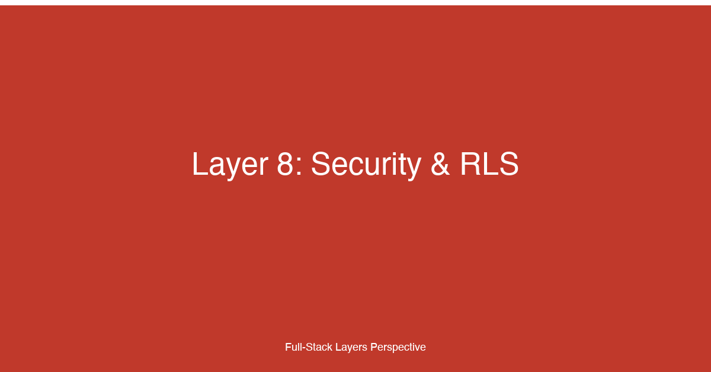

# Layer 8: Security & Row-Level Security


## TL;DR

The security layer protects the full-stack application at every boundary: the database enforces row-level security so tenants can never see each other's data; the application validates and sanitizes all input to prevent injection attacks; HTTP headers (CSP, CORS, CSRF) defend against XSS, CSRF, and data exfiltration; secrets are managed outside the application code in vaults or environment variables; and automated scanning (dependency audits, SAST, DAST) catches vulnerabilities before they reach production. For fullstack developers, mastering this layer means understanding that security is not a feature — it is a property of every decision, from the SQL policy on a Postgres table to the Content-Security-Policy header on a response to the secrets resolver in a CI/CD pipeline. Security must be layered, defense-in-depth, because any single control can be bypassed.

## Why This Layer Matters

Security in modern full-stack applications is a distributed responsibility. The frontend handles user input and enforces UX-level constraints; the API validates and authorizes every request; the database enforces data isolation at the row level; the deployment infrastructure manages secrets and network policies; and the CI/CD pipeline scans for known vulnerabilities in dependencies and custom code. A failure at any one of these layers can compromise the entire application.

Row-level security (RLS) is one of the most important architectural patterns for multi-tenant applications. RLS ensures that a database query — regardless of how it was constructed, by which service, or through which API — can only return rows that the requesting tenant is authorized to see. RLS is a defense-in-depth control: even if a SQL injection vulnerability exists in the application layer, or a backend service is compromised and executes queries with elevated privileges, RLS prevents the attacker from accessing data belonging to other tenants. PostgreSQL's RLS feature, combined with Supabase's managed RLS policies, and Firebase's security rules, provide declarative access control at the storage layer.

Input validation is the first line of defense against injection attacks — SQL injection, NoSQL injection, command injection, and XSS. Validation must happen on both the client (for UX feedback, instantly) and the server (for security, authoritatively). Server-side validation is non-negotiable: the client is untrusted, and any validation the client performs can be bypassed. The principle is: validate early, validate strictly, validate on the server.

HTTP security headers are the application's perimeter defense. Content-Security-Policy (CSP) prevents XSS by controlling which resources the browser can load and execute. Cross-Origin Resource Sharing (CORS) controls which origins can make requests to your API. Cross-Site Request Forgery (CSRF) tokens ensure that form submissions originated from your application, not from a malicious site that tricked a logged-in user into submitting a request. Each header closes a specific attack vector, and all three are necessary — none is a substitute for the others.

Secret management separates configuration from code. Database passwords, API keys, signing keys, and service credentials must never appear in source code, configuration files committed to version control, container images, or environment variable dumps. Secrets belong in a vault (AWS Secrets Manager, HashiCorp Vault, GCP Secret Manager) or, at minimum, in environment variables injected at deployment time. Automated rotation, audit logging, and access control for secrets are hallmarks of a mature security posture.

Vulnerability scanning closes the loop between code changes and known security issues. Dependency scanning (npm audit, Snyk, Dependabot) catches known vulnerabilities in third-party packages before they are merged. Static Application Security Testing (SAST) analyzes source code for security anti-patterns — SQL injection, hardcoded secrets, insecure cryptography — without executing the code. Dynamic Application Security Testing (DAST) probes the running application for vulnerabilities — XSS, CSRF, insecure headers, misconfigured CORS — from an attacker's perspective. Each scanning technique finds different classes of vulnerabilities, and all three are needed for comprehensive coverage.

## Key Considerations for Fullstack Developers

### 1. Row-Level Security: Database-Enforced Multi-Tenant Isolation

RLS is a database feature that restricts which rows a query can return based on the user executing the query. In PostgreSQL, RLS is implemented as policies on tables — a policy is a boolean expression that is implicitly ANDed with every query's WHERE clause. The database evaluates the policy using the current user's role and, optionally, application-defined session variables.

The fundamental insight of RLS is that access control belongs in the query execution layer, not in the application code. Without RLS, every query must include a WHERE clause filtering by tenant ID — and this filter must be correct in every query, every join, every subquery, every stored procedure, and every report. A single missed filter exposes cross-tenant data. With RLS, the filter is automatically applied by the database engine, eliminating the possibility of a bypass through application code paths.

Supabase builds RLS directly into its architecture. Every Supabase table can have RLS policies defined in the Supabase dashboard or via SQL. The policies use `auth.uid()` to identify the current user and `auth.email()` for email-based rules. Supabase's anon key (the client-facing API key) has RLS enabled by default — queries made with the anon key can only access rows that the policies allow. This means frontend code can query the database directly (through Supabase's client library) while respecting multi-tenant isolation, without a backend API layer enforcing access control.

Firebase uses a different but conceptually similar approach: security rules defined in JSON-like syntax. Firestore Security Rules validate every read and write operation against conditions based on the authenticated user, the document data, and the request path. Realtime Database Security Rules use a similar model with a different syntax. Firebase rules are evaluated before every operation, and a denied operation is rejected at the database level — no application code runs.

When RLS is used, the application's database connection is typically made with a role that has limited privileges — most commonly an authenticated user role or a per-tenant service role. The application never connects as the database superuser for routine queries. This ensures that RLS policies are always enforced: running a query as the table owner or superuser bypasses RLS.

### 2. Input Validation: Defense at Every Layer

Client-side validation provides immediate feedback to users — highlighting invalid fields, showing error messages, and preventing form submission until data is valid. It improves UX but provides zero security. Client validation can be bypassed by disabling JavaScript, using browser developer tools, crafting requests with curl, or exploiting the application's API directly.

Server-side validation is where security enforcement happens. Every input — form fields, query parameters, request headers, URL paths, file uploads, JSON body fields — must be validated against a strict schema. Libraries like Zod (TypeScript/JavaScript), Pydantic (Python), Joi (Node.js), and class-validator (TypeScript) define validation schemas that are both type-safe and runtime-enforced.

Validation is not just about type checking. String inputs must be sanitized to remove or escape characters that have special meaning in the target context — HTML entities in rendered output, SQL special characters in database queries, shell metacharacters in system commands. The best approach is to use parameterized queries for SQL (prepared statements), template auto-escaping for HTML (React, Vue, Svelte all auto-escape by default), and validation libraries that reject unexpected characters for file paths and system commands.

The most dangerous assumption in input validation is that "internal" or "trusted" inputs do not need validation. Internal services calling each other can still pass malicious data if a downstream service is compromised. Configuration values read from environment variables can contain injection payloads. Database values that were validated on insert can be invalid on read if the validation logic changed. Validate at every boundary, not just at the external perimeter.

### 3. HTTP Security Headers: CSP, CORS, CSRF

Content-Security-Policy (CSP) is the most powerful defense against cross-site scripting (XSS). CSP is an HTTP response header that tells the browser which content sources are allowed to load and execute on the page. A strict CSP can prevent XSS even if an attacker manages to inject a script tag into the page — the browser refuses to execute it because the script's source is not in the allowed list.

A CSP policy is a string of directives, each specifying allowed sources for a resource type. The most important directives are `default-src` (fallback for all resource types), `script-src` (JavaScript sources), `style-src` (CSS sources), `img-src` (image sources), `connect-src` (XHR/fetch targets), and `frame-src` (iframes). Sources can be self (same origin), specific domains (https://api.example.com), nonces (unique per-request tokens), or hashes (cryptographic hashes of allowed inline scripts).

CSP is most effective when it is strict: `default-src 'self'` with explicit allowlists for external resources. Inline scripts and event handlers should be avoided or explicitly allowed via nonces. `eval()` and similar APIs can be blocked with `'unsafe-eval'` (which should never be included in a production policy). CSP reports (via the `report-uri` or `report-to` directives) enable monitoring of violations without blocking them, useful for refining a policy before enforcing it.

Cross-Origin Resource Sharing (CORS) controls which origins can make requests to your API. CORS is a browser-enforced policy — it does not protect your API from server-side requests or malicious clients that do not respect CORS. What CORS does protect is the user's browser session: it prevents a malicious website from reading API responses in the context of an authenticated session. CORS headers are set on the response: `Access-Control-Allow-Origin` specifies which origins are allowed, `Access-Control-Allow-Methods` specifies allowed HTTP methods, and `Access-Control-Allow-Headers` specifies allowed request headers.

For APIs, the most secure CORS configuration is to allowlist specific origins rather than using the wildcard `*`. Credentials (cookies, authorization headers) require `Access-Control-Allow-Credentials: true` and an explicit origin — `*` is not allowed with credentials. Preflight requests (OPTIONS) should be handled efficiently by the server to avoid unnecessary latency on every cross-origin request.

Cross-Site Request Forgery (CSRF) protection ensures that form submissions and state-changing requests cannot be forged by a third-party site. The standard defense is a CSRF token: a unique, unpredictable value that the server renders as a hidden form field and validates on submission. The attacker cannot guess the token, so their forged form submission fails validation.

Modern frameworks handle CSRF automatically. Next.js, Rails, Django, and Laravel all include built-in CSRF protection. For APIs that accept JSON (not form-encoded submissions), CSRF is generally not a concern if CORS is properly configured — the same-origin policy prevents reading the response, but state-changing requests can still be forged if CORS allows the attacker's origin. The safest approach is to use SameSite=Strict or SameSite=Lax cookies for session management, which prevents the browser from sending cookies with cross-origin requests.

### 4. Secret Management: Keeping Keys Out of Code

Secrets — database passwords, API keys, encryption keys, OAuth client secrets, TLS private keys — must be treated differently from configuration. Configuration varies by environment (staging, production) but is not sensitive. Secrets are sensitive and must be protected: encrypted at rest, transmitted over TLS, accessed only by authorized services and people, rotated regularly, and audited.

The minimum viable secret management strategy is environment variables. At deployment time, secrets are injected into the process environment from a secure source — the CI/CD platform's secrets store (GitHub Actions secrets, GitLab CI variables), the container orchestrator's secrets (Kubernetes Secrets with encryption at rest), or the cloud platform's parameter store (AWS SSM Parameter Store, GCP Secret Manager). The application reads secrets from `process.env` (Node.js), `os.environ` (Python), or equivalent. Environment variables should never be logged, dumped to files, or exposed in error messages.

The production-grade approach is a secrets vault: HashiCorp Vault, AWS Secrets Manager, GCP Secret Manager, Azure Key Vault, or Doppler. Vaults provide API-driven secret access with fine-grained access control, automatic rotation, audit logging, and dynamic secrets (credentials that are generated on demand and expire after use). For databases, dynamic secrets are particularly valuable: instead of a long-lived database password in an environment variable, the application requests a database credential from Vault at startup, uses it for the session lifetime, and the credential automatically expires.

Secret rotation is the operational practice of regularly replacing secrets with new values. Rotation limits the window of exposure if a secret is compromised. Automated rotation — where the vault or secrets manager handles the lifecycle — is preferred over manual rotation, which is rarely done at the required frequency. Cloud-managed services like AWS Secrets Manager can automatically rotate secrets for supported services (RDS, Redshift, DocumentDB) on a configurable schedule.

### 5. Dependency Scanning, SAST, and DAST

Dependency scanning identifies known vulnerabilities in third-party packages. Tools like npm audit, Snyk, Dependabot, and GitHub Advisory Database compare the package versions in your lockfile against a database of known vulnerabilities with CVE identifiers. When a vulnerability is found, the scanner reports the severity (critical, high, medium, low), the affected package versions, and the fix version (if available). Dependency scanning should run on every PR that modifies `package.json` or the lockfile, and on a scheduled cadence (daily or weekly) to catch newly disclosed vulnerabilities in currently installed packages.

Static Application Security Testing (SAST) analyzes source code for security vulnerabilities without executing it. SAST tools (SonarQube, Semgrep, CodeQL, Checkmarx, Snyk Code) parse the code into an abstract syntax tree and apply rules that detect security anti-patterns: SQL queries built with string concatenation, hardcoded credentials, use of insecure cryptographic algorithms, missing authentication checks on API endpoints, deserialization of untrusted data, and path traversal vulnerabilities.

SAST tools produce false positives — they flag code patterns that look like vulnerabilities but are actually safe due to context the tool cannot analyze. A SAST tool may flag all uses of `eval()`, for example, even if the argument is a trusted constant. The tool's output must be triaged by a developer: confirmed findings become actionable items, false positives are dismissed with a reason. Over time, tuning the SAST configuration reduces the noise-to-signal ratio.

Dynamic Application Security Testing (DAST) probes a running application from an attacker's perspective. DAST tools (OWASP ZAP, Burp Suite, Acunetix, Nessus) send crafted requests — XSS payloads, SQL injection attempts, CSRF probes, path traversal patterns — and analyze the responses for signs of successful exploitation. DAST finds vulnerabilities that SAST cannot: misconfigured CORS headers, exposed debug endpoints, missing CSRF tokens, and runtime injection vulnerabilities.

DAST is typically run against staging or QA environments, not production (or if against production, with extreme caution — DAST may delete data or trigger denial of service). DAST complements SAST because it tests the running application's actual behavior, including framework-specific request handling, middleware ordering, and security header configuration.

## Implementation Patterns & Technologies

```sql
-- PostgreSQL Row-Level Security: multi-tenant isolation with application-level roles
-- Every table in a multi-tenant database enforces tenant isolation through RLS.
-- The tenant_id is set as a session variable by the application before queries execute.

-- Step 1: Enable RLS on the table (required before policies take effect)
ALTER TABLE projects ENABLE ROW LEVEL SECURITY;
ALTER TABLE tasks     ENABLE ROW LEVEL SECURITY;
ALTER TABLE documents ENABLE ROW LEVEL SECURITY;

-- Step 2: Create a policy that restricts access to the current tenant
-- The policy uses current_setting('app.tenant_id') which the application
-- sets at the start of each request via SET app.tenant_id = 'tenant-abc'.
--
-- This policy grants SELECT, INSERT, UPDATE, and DELETE on rows where
-- the tenant_id column matches the application-specified session variable.
--
-- Note: app.tenant_id is a custom session parameter (Postgres allows
-- any parameter with a dot in its name) set by the application middleware.
-- If the parameter is not set (e.g., the middleware bug fails to set it),
-- the COALESCE ensures the policy evaluates to false — no rows returned.
--
-- This is defense-in-depth: even if a SQL injection vulnerability exists
-- elsewhere, RLS prevents the injected query from reading other tenants.
CREATE POLICY tenant_isolation ON projects
  FOR ALL
  USING (tenant_id = COALESCE(current_setting('app.tenant_id', true), ''));
-- The same policy pattern applied to related tables ensures that join
-- queries also respect tenant boundaries — Postgres evaluates RLS policies
-- on every table in a query, not just the primary table.
CREATE POLICY tenant_isolation ON tasks
  FOR ALL
  USING (tenant_id = COALESCE(current_setting('app.tenant_id', true), ''));
CREATE POLICY tenant_isolation ON documents
  FOR ALL
  USING (tenant_id = COALESCE(current_setting('app.tenant_id', true), ''));

-- Step 3: Create a policy that lets admins read across tenants
-- Admin roles bypass tenant isolation for legitimate cross-tenant operations.
-- This policy is more permissive but scoped exclusively to the admin role.
-- The application connects with the admin role only in admin-specific
-- API endpoints — never for regular user requests.
CREATE POLICY admin_read_all ON projects
  FOR SELECT
  USING (current_user = 'admin_role');

-- Step 4: Create a permissive policy for the insert-authenticated-user pattern
-- When a user registers, a row must be inserted before the user session is
-- established. This policy allows inserting a row with the user's own ID.
-- The USING clause applies to SELECT, UPDATE, DELETE; WITH CHECK applies
-- to INSERT. Here, the policy is split so users can only insert rows where
-- they are the owner, but cannot read rows they do not own without the
-- tenant isolation policy above.
CREATE POLICY user_self_insert ON user_profiles
  FOR INSERT
  WITH CHECK (user_id = COALESCE(current_setting('app.user_id', true), ''));
-- Note: The tenant_isolation policy above still restricts SELECT on this
-- table. RLS policies are OR-connected: a row is returned if ANY policy
-- grants access. This means the admin_read_all and tenant_isolation
-- policies both apply to the admin — the admin_read_all policy would
-- override tenant_isolation for admin SELECT queries.

-- Step 5: Verify RLS enforcement with test queries
-- As a regular user role (with app.tenant_id set to 'tenant-a'):
SET app.tenant_id = 'tenant-a';
SELECT * FROM projects;              -- Only returns projects where tenant_id = 'tenant-a'

-- As admin role:
SET ROLE admin_role;
SELECT * FROM projects;              -- Returns all projects (admin_read_all policy)

-- As a different tenant:
SET app.tenant_id = 'tenant-b';
SELECT * FROM projects;              -- Only returns projects where tenant_id = 'tenant-b'
-- If the application middleware does not set app.tenant_id, the COALESCE
-- defaults to '' and no rows match — a safe failure mode.
```

This RLS implementation enforces tenant isolation at the database level. The application middleware sets `app.tenant_id` early in the request lifecycle — after authenticating the user and resolving their tenant — and every subsequent query automatically filters by that tenant. The pattern has three critical properties. First, the isolation is comprehensive: every query against every RLS-enabled table includes the tenant filter, including queries from background jobs, reporting tools, and database consoles. Second, the isolation is enforced even against queries that bypass the application layer: a direct database connection from a reporting tool that does not set `app.tenant_id` returns zero rows (a safe default). Third, the isolation survives application bugs: if a developer forgets to add `WHERE tenant_id = ?` to a query, RLS silently adds the filter — the bug does not become a data leak.

```typescript
// src/middleware/security.ts — Comprehensive security middleware for Express/Next.js
// Implements CSP, CORS, CSRF, input validation, and rate limiting in a single
// middleware pipeline. Each function is a separate concern that can be composed,
// tested, and disabled independently.

import { NextResponse } from 'next/server';
import type { NextRequest } from 'next/server';

// ==========================================================================
// Content-Security-Policy Middleware
// CSP is the most effective defense against XSS. This policy is deliberately
// strict: scripts must be from the same origin or have a valid nonce;
// eval() is blocked; external scripts must come from explicitly trusted CDNs.
// The nonce is a cryptographically random value generated per-request and
// embedded in the HTML template's script and style tags.
//
// When a CSP violation occurs, the browser sends a report to the report-uri.
// In staging, use "Content-Security-Policy-Report-Only" to monitor without
// blocking; in production, switch to "Content-Security-Policy" to enforce.
// ==========================================================================
function addCSPHeaders(response: NextResponse, nonce: string): void {
  const cspDirectives = [
    // Default: only same-origin resources (fallback for all types not explicitly listed)
    "default-src 'self'",
    // Scripts: same-origin + nonce (no 'unsafe-inline', no 'unsafe-eval')
    `script-src 'self' 'nonce-${nonce}'`,
    // Styles: same-origin + nonce (inline styles must match the nonce)
    `style-src 'self' 'nonce-${nonce}'`,
    // Images: same-origin + trusted CDN + data: URIs (for inline images)
    "img-src 'self' https://images.example.com data:",
    // API connections: same-origin + API server + WebSocket for real-time
    "connect-src 'self' https://api.example.com wss://api.example.com",
    // Fonts: same-origin + Google Fonts (if used)
    "font-src 'self' https://fonts.gstatic.com",
    // Frames: strictly same-origin (prevents clickjacking)
    "frame-src 'self'",
    // Objects: none (block Flash, Java applets, etc.)
    "object-src 'none'",
    // Base URI: only same-origin (prevents base tag injection)
    "base-uri 'self'",
    // Form actions: same-origin (prevents form hijacking)
    "form-action 'self'",
    // Report violations to this endpoint (use report-uri for broader browser support)
    'report-uri /api/csp-violation',
  ];

  response.headers.set(
    'Content-Security-Policy',
    cspDirectives.join('; ')
  );
}

// ==========================================================================
// CORS Middleware
// Restricts which origins can make cross-origin requests. Never use the
// wildcard '*' in production — it defeats CSRF protection for credentialled
// requests and opens the API to any website.
//
// For credentialed requests (cookies, Authorization headers), the origin
// must be explicit and Access-Control-Allow-Credentials must be true.
// Preflight requests (OPTIONS) are handled at the framework level.
// ==========================================================================
function addCORSHeaders(
  response: NextResponse,
  request: NextRequest
): NextResponse {
  const origin = request.headers.get('origin');
  const allowedOrigins = [
    'https://app.example.com',
    'https://admin.example.com',
    // Staging and preview deployments (matched by pattern)
    // Use a function to check dynamic preview URLs against a pattern:
    // /^https:\/\/[a-z0-9-]+\.preview\.example\.com$/
  ];

  if (origin && allowedOrigins.includes(origin)) {
    response.headers.set('Access-Control-Allow-Origin', origin);
    response.headers.set('Access-Control-Allow-Credentials', 'true');
    response.headers.set(
      'Access-Control-Allow-Methods',
      'GET, POST, PUT, PATCH, DELETE, OPTIONS'
    );
    response.headers.set(
      'Access-Control-Allow-Headers',
      'Content-Type, Authorization, X-CSRF-Token'
    );
    // Expose custom headers to client JavaScript
    response.headers.set(
      'Access-Control-Expose-Headers',
      'X-Request-Id, X-RateLimit-Remaining'
    );
    // Max age for preflight cache (in seconds — 24 hours is safe for simple APIs)
    response.headers.set('Access-Control-Max-Age', '86400');
  }

  return response;
}

// ==========================================================================
// CSRF Protection Middleware
// Validates a CSRF token on state-changing requests (POST, PUT, PATCH, DELETE).
// The token is set as a cookie on login and must be included as a header
// on every mutating request. This defense works because:
//  1. The attacker cannot read the cookie value (SameSite + HttpOnly)
//  2. The attacker cannot guess the token (cryptographically random)
//  3. The attacker cannot set custom headers cross-origin (CORS preflight)
//
// For APIs that only accept JSON (no form-encoded submissions), CSRF is
// already mitigated by CORS + SameSite cookies. This middleware is still
// useful as defense-in-depth and for hybrid JSON/form APIs.
// ==========================================================================
function validateCSRFToken(request: NextRequest): boolean {
  // Only validate state-changing requests
  if (!['POST', 'PUT', 'PATCH', 'DELETE'].includes(request.method)) {
    return true;
  }

  const csrfCookie = request.cookies.get('csrf-token')?.value;
  const csrfHeader = request.headers.get('X-CSRF-Token');

  // Both must be present and must match
  if (!csrfCookie || !csrfHeader || csrfCookie !== csrfHeader) {
    return false;
  }

  return true;
}

// ==========================================================================
// Input Validation Middleware
// Validates and sanitizes request inputs before they reach route handlers.
// This middleware uses a schema-based approach: every endpoint declares
// its expected input shape (via Zod, for example), and the middleware
// rejects requests that do not match before the handler executes.
//
// Key principles:
//  - Validate every input field: body, query params, path params, headers
//  - Reject unexpected fields (strip unknown keys or return 400)
//  - Normalize inputs (trim whitespace, convert types) in the validated output
//  - Never trust client-side validation — it is purely for UX
// ==========================================================================
function sanitizeAndValidate(request: NextRequest): {
  valid: boolean;
  errors?: string[];
} {
  const contentType = request.headers.get('content-type') || '';

  // Validate Content-Type for mutation requests
  if (['POST', 'PUT', 'PATCH'].includes(request.method)) {
    if (!contentType.startsWith('application/json')) {
      return {
        valid: false,
        errors: ['Content-Type must be application/json'],
      };
    }
  }

  // Validate URL length to prevent excessively long URLs used in attacks
  if (request.url.length > 2048) {
    return {
      valid: false,
      errors: ['Request URL exceeds maximum length'],
    };
  }

  // Additional validation is delegated to endpoint-specific Zod schemas
  // in the route handlers. This middleware sets a baseline — no binary
  // payloads, no excessively large requests, no unexpected content types.
  return { valid: true };
}

// ==========================================================================
// Main Security Middleware Composer
// Wraps all security headers and validation into a single middleware function
// that runs on every request. Each security measure is independent —
// if one fails, the others still apply.
// ==========================================================================
export function securityMiddleware(request: NextRequest): NextResponse | null {
  // 1. Generate a unique nonce for this request (used by CSP + HTML template)
  //    The nonce must be generated early because the HTML template needs it
  //    for script and style tags. Crypto.randomUUID() is available in Node 19+.
  const nonce = crypto.randomUUID();

  // 2. Set the CSRF cookie on every response (not just login) so that forms
  //    rendered server-side always have a fresh token available.
  //    The cookie is HttpOnly (not accessible to JavaScript), Secure (HTTPS only),
  //    and SameSite=Strict (never sent with cross-site requests).
  const response = NextResponse.next();

  response.cookies.set('csrf-token', nonce, {
    httpOnly: true,
    secure: process.env.NODE_ENV === 'production',
    sameSite: 'strict',
    path: '/',
    // Rotate the CSRF token every hour — if a token is leaked, the window
    // of exposure is bounded.
    maxAge: 3600,
  });

  // 3. Validate CSRF token (only for mutating requests)
  if (!validateCSRFToken(request)) {
    return new NextResponse(
      JSON.stringify({ error: 'Invalid CSRF token' }),
      {
        status: 403,
        headers: { 'Content-Type': 'application/json' },
      }
    );
  }

  // 4. Validate and sanitize input at the middleware level
  const validation = sanitizeAndValidate(request);
  if (!validation.valid) {
    return new NextResponse(
      JSON.stringify({ error: 'Validation failed', details: validation.errors }),
      {
        status: 400,
        headers: { 'Content-Type': 'application/json' },
      }
    );
  }

  // 5. Add security headers
  addCSPHeaders(response, nonce);
  addCORSHeaders(response, request);

  // 6. Add additional security headers (defense-in-depth)
  //    X-Content-Type-Options: prevents MIME type sniffing
  response.headers.set('X-Content-Type-Options', 'nosniff');
  //    X-Frame-Options: prevents clickjacking (redundant with CSP frame-src)
  response.headers.set('X-Frame-Options', 'DENY');
  //    Referrer-Policy: controls what referrer info is sent with requests
  response.headers.set('Referrer-Policy', 'strict-origin-when-cross-origin');
  //    Permissions-Policy: restricts browser features (camera, mic, etc.)
  response.headers.set(
    'Permissions-Policy',
    'camera=(), microphone=(), geolocation=()'
  );
  //    Strict-Transport-Security: forces HTTPS for the domain
  response.headers.set(
    'Strict-Transport-Security',
    'max-age=63072000; includeSubDomains; preload'
  );

  return response;
}

// Export individual functions for testing without the full middleware pipeline
export { addCSPHeaders, addCORSHeaders, validateCSRFToken, sanitizeAndValidate };
```

This security middleware composes four independent protections into a single request pipeline. CSP prevents XSS by restricting script and style sources with a per-request nonce — even if an attacker injects a `<script>` tag, the browser refuses to execute it because the tag's nonce does not match. CORS restricts which origins can make cross-origin requests to the API, preventing data exfiltration by malicious websites. CSRF tokens ensure that state-changing requests originated from the application itself, not from an attacker's forged form. Input validation establishes a baseline of acceptable request structure before endpoint-specific schemas are applied. Each protection is independent: if a bug disables one, the others continue to protect.

```yaml
# .github/workflows/security-scan.yml — Multi-layer vulnerability scanning pipeline
# Runs dependency scan, SAST, and DAST on every PR and on a schedule.
# Each stage is independent — a failure in one does not block the others,
# but all findings must be reviewed before merge.
name: Security Scan

on:
  pull_request:
    branches: [main]
    paths:
      - '**/*.ts'
      - '**/*.tsx'
      - '**/*.js'
      - '**/*.sql'
      - 'package.json'
      - 'package-lock.json'
  schedule:
    - cron: '0 6 * * 1'  # Every Monday at 6 AM — catch newly disclosed CVEs

jobs:
  # ==========================================================================
  # Stage 1: Dependency Vulnerability Scan
  # Compares installed package versions against databases of known CVEs.
  # Fails on critical vulnerabilities; warns on high-severity.
  # Runs first because it is fastest and catches supply-chain risks early.
  # ==========================================================================
  dependency-scan:
    runs-on: ubuntu-latest
    steps:
      - uses: actions/checkout@v4

      - uses: actions/setup-node@v4
        with:
          node-version: 20
          cache: 'npm'

      - name: Install dependencies
        run: npm ci

      # npm audit checks against the npm Advisory Database
      - name: Run npm audit
        run: |
          AUDIT=$(npm audit --audit-level=high --json 2>/dev/null || true)
          CRITICAL=$(echo "$AUDIT" | jq '.metadata.vulnerabilities.critical // 0')
          HIGH=$(echo "$AUDIT" | jq '.metadata.vulnerabilities.high // 0')

          echo "Critical vulnerabilities: $CRITICAL"
          echo "High vulnerabilities: $HIGH"

          if [ "$CRITICAL" -gt 0 ]; then
            echo "❌ Found $CRITICAL critical vulnerabilities"
            echo "$AUDIT" | jq -r '.advisories[] | "\(.severity): \(.module_name) — \(.title)"'
            exit 1
          fi

          if [ "$HIGH" -gt 5 ]; then
            echo "⚠️  $HIGH high vulnerabilities found — review before merge"
            echo "$AUDIT" | jq -r '.advisories[] | "\(.severity): \(.module_name) — \(.title)"'
          fi

      # Snyk provides a more comprehensive vulnerability database
      # and can auto-fix via Snyk Pull Requests.
      - name: Run Snyk scan
        uses: snyk/actions/node@v3
        continue-on-error: true  # Snyk output is advisory in this pipeline
        env:
          SNYK_TOKEN: ${{ secrets.SNYK_TOKEN }}
        with:
          args: --severity-threshold=high --json

      # Check for outdated packages with known major version gaps
      - name: Check outdated dependencies
        run: |
          OUTDATED=$(npm outdated --json 2>/dev/null || echo "{}")
          MAJOR_GAPS=$(echo "$OUTDATED" | jq '[to_entries[] | select(.value.current != .value.wanted)] | length')
          echo "Dependencies with available updates: $MAJOR_GAPS"
          if [ "$MAJOR_GAPS" -gt 10 ]; then
            echo "⚠️  $MAJOR_GAPS dependencies have available updates"
            echo "$OUTDATED" | jq -r 'to_entries[] | "\(.key): \(.value.current) → \(.value.wanted)"'
          fi

  # ==========================================================================
  # Stage 2: Static Application Security Testing (SAST)
  # Analyzes source code for security vulnerabilities without execution.
  # Catches: SQL injection patterns, hardcoded secrets, insecure crypto,
  # path traversal, command injection, prototype pollution, unsafe regex.
  # ==========================================================================
  sast:
    runs-on: ubuntu-latest
    steps:
      - uses: actions/checkout@v4

      # Semgrep is an open-source SAST tool with community rulesets.
      # Rules cover OWASP Top 10, CWE Top 25, and framework-specific patterns.
      - name: Run Semgrep SAST
        uses: semgrep/semgrep-actions@v1
        continue-on-error: true
        with:
          config: >-
            p/owasp-top-ten
            p/command-injection
            p/secrets
            p/react
            p/nextjs
            p/sql-injection
          output: semgrep-report.json

      - name: Process SAST results
        run: |
          FINDINGS=$(jq '.results | length' semgrep-report.json 2>/dev/null || echo 0)
          ERRORS=$(jq '[.results[] | select(.severity == "ERROR")] | length' semgrep-report.json 2>/dev/null || echo 0)
          WARNINGS=$(jq '[.results[] | select(.severity == "WARNING")] | length' semgrep-report.json 2>/dev/null || echo 0)

          echo "SAST findings: $FINDINGS total ($ERRORS errors, $WARNINGS warnings)"

          if [ "$ERRORS" -gt 0 ]; then
            echo "❌ Found $ERRORS error-level SAST findings:"
            jq -r '.results[] | select(.severity == "ERROR") | "  - \(.check_id): \(.path):\(.start.line) — \(.message)"' semgrep-report.json
            exit 1
          fi

          if [ "$WARNINGS" -gt 0 ]; then
            echo "⚠️  Found $WARNINGS warning-level SAST findings:"
            jq -r '.results[] | select(.severity == "WARNING") | "  - \(.check_id): \(.path):\(.start.line) — \(.message)"' semgrep-report.json
          fi

      # Secret scanning for hardcoded credentials (complement to Semgrep)
      - name: Scan for hardcoded secrets
        run: |
          # Scan for high-entropy strings that look like API keys, tokens, passwords
          # Uses regex patterns for common secret formats
          npx secretlint "**/*.{ts,tsx,js,jsx,json,yaml,yml,env}"
        continue-on-error: true

  # ==========================================================================
  # Stage 3: Dynamic Application Security Testing (DAST)
  # Probes the running application for vulnerabilities from an attacker's
  # perspective. This stage is only meaningful if a preview deployment exists
  # for the PR. DAST finds: missing or misconfigured security headers, exposed
  # endpoints, XSS reflection, CSRF weaknesses, CORS misconfiguration.
  #
  # DAST runs last because it requires a deployed environment and is the
  # slowest stage. It complements SAST by testing runtime behavior.
  # ==========================================================================
  dast:
    if: github.event_name == 'pull_request' && github.event.pull_request.head.repo.full_name == github.repository
    runs-on: ubuntu-latest
    needs: [dependency-scan, sast]
    steps:
      - name: Deploy preview environment
        run: |
          echo "Deploying preview for PR #${{ github.event.pull_request.number }}..."
          # This step triggers a preview deployment (platform-specific).
          # The preview URL is stored as an output for use in the DAST step.
          echo "preview_url=https://pr-${{ github.event.pull_request.number }}.preview.example.com" >> $GITHUB_OUTPUT
        id: preview

      - name: Wait for deployment
        run: |
          echo "Waiting for preview deployment to be ready..."
          for i in {1..30}; do
            STATUS=$(curl -s -o /dev/null -w "%{http_code}" \
              "${{ steps.preview.outputs.preview_url }}/api/health" || echo "000")
            if [ "$STATUS" = "200" ]; then
              echo "✅ Preview deployment ready"
              exit 0
            fi
            sleep 10
          done
          echo "❌ Preview deployment not ready within 5 minutes"
          exit 1

      # OWASP ZAP is an open-source DAST tool with active and passive scanning.
      # Passive scan: analyzes responses for missing headers, information disclosure.
      # Active scan: sends attack payloads (SQLi, XSS, path traversal).
      - name: Run OWASP ZAP DAST
        uses: zaproxy/action-full-scan@v0.11.0
        continue-on-error: true
        with:
          target: ${{ steps.preview.outputs.preview_url }}
          rules_file_name: .zap/rules.tsv  # Custom alert thresholds and exclusions
          cmd_options: >
            -t 60
            -d
            -z "-config globalexcludeurl.url_list.url\(0\).regex='.*/logout.*'"
          issue_title: DAST Scan Results
          fail_action: true

      - name: Check security headers via API
        run: |
          HEADERS=$(curl -sI "${{ steps.preview.outputs.preview_url }}" | grep -i '^content-security-policy\|^strict-transport-security\|^x-content-type-options\|^x-frame-options\|^referrer-policy')
          echo "Security headers detected:"
          echo "$HEADERS" || echo "⚠️  Missing security headers"

      # Teardown preview environment
      - name: Teardown preview
        if: always()
        run: |
          echo "Tearing down preview deployment..."
          # Platform-specific: delete the preview environment

  # ==========================================================================
  # Stage 4: Compliance Check
  # Validates that security-critical configuration files are present and
  # correctly formatted. This is a lightweight check that runs after scans.
  # ==========================================================================
  compliance-check:
    runs-on: ubuntu-latest
    steps:
      - uses: actions/checkout@v4

      - name: Verify CSP header in config
        run: |
          if [ ! -f "config/csp.json" ]; then
            echo "❌ Missing CSP configuration file"
            exit 1
          fi
          echo "✅ CSP configuration present"

      - name: Verify no .env files committed
        run: |
          ENV_FILES=$(find . -name '.env' -not -path './node_modules/*' -not -path './.git/*')
          if [ -n "$ENV_FILES" ]; then
            echo "❌ .env files found: $ENV_FILES"
            exit 1
          fi
          echo "✅ No .env files in repository"

      - name: Verify secrets manager configuration
        run: |
          if [ ! -f "infrastructure/secrets-manager.tf" ] && \
             [ ! -f "infrastructure/secrets-manager.ts" ]; then
            echo "⚠️  No secrets manager configuration found"
            echo "   Consider using AWS Secrets Manager, HashiCorp Vault, or GCP Secret Manager"
          else
            echo "✅ Secrets manager configuration present"
          fi
```

This security scanning pipeline implements three complementary detection techniques. Dependency scanning (npm audit + Snyk) catches known vulnerabilities in third-party packages — supply-chain attacks that affect the application through its dependencies. SAST (Semgrep) catches vulnerabilities in the application's own source code — SQL injection, hardcoded secrets, insecure API usage — before the code runs. DAST (OWASP ZAP) probes the running application for misconfigurations and runtime vulnerabilities that neither dependency scanning nor SAST can detect: missing headers, exposed endpoints, and reflective XSS. The three techniques are complementary: each finds vulnerabilities the others miss, and together they provide defense-in-depth for the application's security posture.

### Security Tools Reference Table

| Category | Tool | Detection Method | When to Run | False Positive Rate |
|----------|------|-----------------|-------------|---------------------|
| Dependency Scan | npm audit | Package version vs CVE database | Every PR, daily schedule | Low (CVEs are confirmed) |
| Dependency Scan | Snyk | Package version + advisory analysis | Every PR, daily schedule | Low |
| Dependency Scan | Dependabot | GitHub Advisory DB | Daily schedule | Very Low (auto-PR fixes) |
| SAST | Semgrep | AST pattern matching + rules | Every PR | Medium (context-dependent) |
| SAST | SonarQube | AST + dataflow analysis | Every PR, nightly | Medium-High |
| SAST | CodeQL | Compiled query-based analysis | Every PR | Low-Medium |
| DAST | OWASP ZAP | Active/passive HTTP probing | On preview/staging deploy | Low (confirmed by exploit) |
| DAST | Burp Suite | Intercepting proxy + scanner | Manual / scheduled | Low |
| Secret Scan | secretlint | Regex pattern matching | Every PR, pre-commit | Medium (high-entropy false positives) |
| Secret Scan | truffleHog | Shannon entropy + regex | Every PR, pre-commit | Medium |

## Common Pitfalls

### 1. RLS Policies That Leak via Side Channels

RLS policies that rely solely on `auth.uid()` for row filtering can be bypassed if the application exposes aggregate queries, count queries, or error messages that leak existence information. A policy that returns "row not found" vs "permission denied" reveals whether the row exists, enabling data enumeration. Use consistent error responses regardless of the RLS outcome, and consider rate-limiting queries that reveal existence information.

### 2. CSP Policies That Are Too Permissive

A CSP policy with `'unsafe-inline'` in `script-src` effectively disables CSP's XSS protection. The most common mistake is adding `'unsafe-inline'` because inline scripts are easier to develop with, then never removing it for production. Similarly, using `https://*.cdn.com` as a script source allows any script on any subdomain of that CDN — if one subdomain is compromised, the attacker can execute arbitrary scripts on your page. Be as specific as possible in CSP directives.

### 3. CORS `Access-Control-Allow-Origin: *` with Credentials

The browser rejects CORS requests that use `*` as the origin when `Access-Control-Allow-Credentials: true` is set. This is a security feature — it prevents credentialled requests to unknown origins. The correct configuration is to echo back the request's Origin header after validating it against an allowlist. Mirroring the origin back without validation opens the application to data exfiltration from any origin.

### 4. Hardcoded Secrets in Source Code

The single most common security vulnerability in code reviews: database passwords, API keys, and signing secrets hardcoded in source files. Secrets committed to version control are compromised forever — history rewrites are impractical and the secret may have been cloned to forks, CI caches, or developer machines. Enforce secret scanning in pre-commit hooks and CI pipelines. Never store secrets in environment variable files committed to the repository (`.env` files should be in `.gitignore`).

### 5. Client-Side Validation as the Only Validation

Frontend validation is purely for UX. It is trivial to bypass — disable JavaScript, use browser dev tools, or send HTTP requests directly with curl. All security-critical validation must happen on the server: type checking, length limits, allowed character sets, business rule validation, and authorization checks. The client can pre-validate for better UX, but the server must enforce.

### 6. Ignoring SAST False Positives

SAST tools produce false positives. When developers see too many false alarms, they ignore all SAST results — including real vulnerabilities. The solution is to triage false positives early (add inline suppression comments with a justification) and tune the SAST configuration over time. A well-tuned SAST pipeline with a 5% false positive rate is more effective than an untuned one with 50% that everyone ignores.

### 7. DAST in Production Without Safeguards

DAST tools send potentially destructive payloads — SQL injection attempts that may delete data, path traversal payloads that may read sensitive files, denial-of-service payloads that may crash the server. Running DAST against production is risky. Use staging or preview deployments for active scanning. Passive scanning (reading responses, not sending attacks) is safe for production, but active scanning should never target production databases or third-party integrations.

### 8. Environment Variable Leakage

Environment variables are not a secrets management solution — they are a delivery mechanism. Environment variables can leak through error messages (stack traces that include `process.env`), worker logs (CI platforms that log environment variables), and child processes (environment variables are inherited). Use a secrets vault with an API for runtime secret retrieval, and never dump the entire environment in error pages, health check endpoints, or debug logs.

## How This Layer Connects to the 12 Factors

- **[Factor 6: Authentication & Authorization](../articles/06-Factor-6.md)** — The security layer extends Factor 6's authentication and authorization principles to the database (RLS), the network (CSP, CORS), and the pipeline (dependency scanning, SAST, DAST). Authentication establishes identity (Factor 6), and the security layer ensures that identity is enforced everywhere — at the API gateway, in the application middleware, and in the database engine. RLS is the authorization enforcement at the data layer: even if authentication is bypassed at a higher level, the database refuses to return data without a valid tenant context. The security layer also protects the authentication system itself: CSP prevents XSS that could steal session cookies, CORS prevents credential exfiltration from authenticated sessions, and secret management protects signing keys and OAuth client secrets that the authentication system depends on.

- **[Factor 8: Forms & Input Handling](../articles/08-Factor-8.md)** — Factor 8 establishes patterns for form design, validation, and submission. The security layer provides the enforcement mechanisms that make those patterns safe: input validation and sanitization prevent injection attacks through form fields; CSRF tokens protect form submissions from forgery; CSP prevents injected scripts from executing even if validation fails to catch a payload. Every form is an attack surface — the combination of client-side validation (UX, Factor 8) and server-side validation (security, Layer 8) provides defense-in-depth. Factor 8's patterns (controlled inputs, form state management, optimistic updates) operate within the security boundaries established by this layer.

- **[Factor 12: Accessibility, SEO & Performance](../articles/12-Factor-12.md)** — Security and performance have a complex relationship. CSP adds response header overhead and may block legitimate inline scripts, affecting page load time. CORS adds preflight requests that increase API call latency. Input validation adds processing time on every request. Security scanning pipelines increase CI/CD duration. The tension between security and performance must be managed: CSP violation reporting allows monitoring without blocking during tuning; CORS preflight caching (`Access-Control-Control-Max-Age`) reduces repeated OPTIONS requests; SAST can run incrementally on changed files only; dependency scanning can be parallelized. Factor 12's performance budgets must account for security overhead. Accessibility and security intersect: CSP's `'unsafe-inline'` is sometimes needed for accessibility scripts that inject dynamic styles — use nonces instead to maintain both accessibility and security.

## Case Study

Tikal helped a SaaS platform — a workforce analytics application serving 200+ enterprise customers across healthcare, finance, and government — secure sensitive customer data after a penetration test revealed 12 critical vulnerabilities. The pen test, conducted by an external firm as part of a SOC 2 compliance audit, found vulnerabilities across every layer of the application: the database had no RLS on multi-tenant tables, secrets were hardcoded in frontend JavaScript bundles, and the application served responses without CSP or security headers.

**The challenge:** The platform had grown rapidly from a single-tenant prototype to a 200-customer multi-tenant SaaS application without corresponding investment in security infrastructure. The pen test revealed:

1. **No RLS on any database table** — Tenant isolation was enforced exclusively by a `WHERE tenant_id = ?` clause in application queries. The pen testers demonstrated that a SQL injection vulnerability in a search endpoint (a high-severity finding in itself) allowed reading any tenant's data. Even without SQL injection, they showed that a compromised internal tool connecting directly to the database could query across all tenants. The lack of RLS meant the database had no defense-in-depth: a failure at any layer — SQL injection, compromised service account, direct database access — exposed all customer data.

2. **Secrets hardcoded in frontend bundles** — The React application's build process injected environment variables during the build step, and some of those variables were secrets: the Supabase anon key (acceptable, it is meant to be public) but also the Supabase service role key (not acceptable — it bypasses RLS), an API key for a third-party data enrichment service, and a database read-replica connection string used for direct queries from the frontend (an architectural anti-pattern). These secrets were discoverable in the minified JavaScript bundle served to every browser.

3. **No CSP headers** — The application had no Content-Security-Policy header on any response. The pen testers demonstrated a stored XSS attack: submitting a script payload in a user's profile "bio" field that executed in the context of every admin who viewed the user's profile page. Without CSP, the injected script loaded a remote payload, exfiltrated session cookies, and simulated an admin session — demonstrating complete account takeover of an admin user with access to all tenant data. The XSS itself was a server-side validation gap (HTML was not sanitized on output), but CSP would have blocked the exploit even if the XSS vulnerability remained.

4. **No CORS restrictions** — The API responded with `Access-Control-Allow-Origin: *` on all endpoints. While this did not directly enable data exfiltration (the browser enforces same-origin policy on reading responses), it allowed any website to make credentialed requests to the API. Combined with a CSRF vulnerability (no SameSite cookies, no CSRF tokens), an attacker could trick an authenticated admin into visiting a malicious page that submitted state-changing API requests — approving invoices, modifying user permissions, or exporting customer data — using the admin's session cookies.

5. **No automated vulnerability scanning** — The CI/CD pipeline had no dependency scanning, no SAST, and no DAST. Vulnerabilities were discovered only through the pen test — the first comprehensive security review the application had ever received. The lead engineer estimated that some of the vulnerable dependencies had been in the codebase for over a year.

**Our approach:** We implemented a phased remediation plan over 12 weeks, prioritizing the critical findings for the first 4 weeks and building the security infrastructure for the remaining 8 weeks.

**Phase 1 (Weeks 1-2): Database RLS Implementation**

We implemented PostgreSQL RLS on all 14 tenant-scoped tables. The implementation had three components: RLS policies, application middleware, and a migration strategy to avoid downtime.

```sql
-- RLS migration: applied to all tenant-scoped tables via a migration script
-- that iterates through the tenant tables and applies identical policies.

-- We created a helper function that returns the current tenant_id from
-- the application's session variable. This function is used by all RLS
-- policies to avoid repeating the current_setting() call.
CREATE OR REPLACE FUNCTION app.current_tenant_id()
RETURNS TEXT
LANGUAGE SQL
STABLE
AS $$
  SELECT COALESCE(
    NULLIF(current_setting('app.tenant_id', true), ''),
    NULLIF(current_setting('app.tenant_id', false)::TEXT, '')
  );
$$;

-- Grant execute permission to the application roles
GRANT EXECUTE ON FUNCTION app.current_tenant_id() TO app_user, app_admin;

-- We applied RLS policies to all tenant-scoped tables using a consistent
-- naming convention: {table_name}_tenant_isolation. Each policy uses the
-- helper function to extract the tenant_id from the session variable.
--
-- We used a template-based migration script rather than writing 14
-- separate ALTER TABLE statements, reducing the risk of missing a table.

-- Example table: customers
ALTER TABLE customers ENABLE ROW LEVEL SECURITY;
CREATE POLICY customers_tenant_isolation ON customers
  FOR ALL
  USING (tenant_id = app.current_tenant_id());

-- Example table: invoices
ALTER TABLE invoices ENABLE ROW LEVEL SECURITY;
CREATE POLICY invoices_tenant_isolation ON invoices
  FOR ALL
  USING (tenant_id = app.current_tenant_id());

-- Example table: audit_logs (historically overlooked — critical for compliance)
ALTER TABLE audit_logs ENABLE ROW LEVEL SECURITY;
CREATE POLICY audit_logs_tenant_isolation ON audit_logs
  FOR ALL
  USING (tenant_id = app.current_tenant_id());

-- We created a permissive policy for the admin role that bypasses RLS
-- for legitimate cross-tenant operations (customer support, billing).
-- The admin role is used exclusively in admin API routes, not in the
-- regular application API — reducing the attack surface of the admin
-- bypass. Admin access is logged in a separate audit trail.
CREATE POLICY admin_read_all ON customers
  FOR SELECT
  USING (current_user = 'app_admin');

-- Migration validation: we tested RLS enforcement by running queries
-- as different tenant contexts and verifying row isolation.
-- Test: tenant A should not see tenant B's data.
SET app.tenant_id = 'tenant-a';
SELECT COUNT(*) FROM customers;
-- Returns count of tenant A's customers

SET app.tenant_id = 'tenant-b';
SELECT COUNT(*) FROM customers;
-- Returns count of tenant B's customers (different count)

SET app.tenant_id = '';
SELECT COUNT(*) FROM customers;
-- Returns 0 (safe failure when tenant context is missing)
```

The middleware layer was updated to set `app.tenant_id` at the start of every authenticated request. We added a middleware hook that runs after authentication and before any route handler, setting the session variable based on the authenticated user's tenant:

```typescript
// middleware/rls.ts — Sets the RLS session variable for every authenticated request
// This middleware runs after authentication (which sets req.user) and before any
// route handler or database query. It MUST run on every authenticated route.

import { Request, Response, NextFunction } from 'express';
import { Pool } from 'pg';

// We use a dedicated database pool for setting session parameters.
// The pool has MINIMAL privileges — just enough to execute SET statements.
// It cannot query tables directly, limiting damage if the pool's credentials
// are compromised.
const rlsPool = new Pool({
  connectionString: process.env.DATABASE_URL_RLS,
  max: 5,  // Small pool — SET is fast and non-blocking
});

export async function rlsMiddleware(
  req: Request,
  res: Response,
  next: NextFunction
): Promise<void> {
  // Only set RLS context for authenticated requests with database access
  if (!req.user || req.path.startsWith('/api/public')) {
    return next();
  }

  const client = await rlsPool.connect();
  try {
    // Set the tenant context for this database session.
    // All subsequent queries on this connection inherit this setting
    // and RLS policies use it to filter rows.
    await client.query('SELECT set_config($1, $2, true)', [
      'app.tenant_id',
      req.user.tenantId,
    ]);

    // Also set the user ID for user-scoped RLS policies
    await client.query('SELECT set_config($1, $2, true)', [
      'app.user_id',
      req.user.id,
    ]);

    // The third parameter (true) makes the setting local to the current
    // transaction — it is automatically reset when the transaction ends.
    // This prevents context leaking between requests in a connection pool.
    next();
  } catch (error) {
    console.error('Failed to set RLS context:', error);
    res.status(500).json({ error: 'Internal server error' });
  } finally {
    client.release();
  }
}
```

The migration strategy was critical: enabling RLS on existing tables with data can cause application downtime if policies reject legitimate queries. We used a phased rollout: first, we enabled RLS with a permissive policy that granted access to all current rows (`USING (true)`) — no behavior changed, but RLS was active. Second, we introduced the strict tenant isolation policy as a second policy (remember: RLS policies are OR-connected, so the permissive policy still allowed all access). Third, we removed the permissive policy after validating that the application's middleware was correctly setting `app.tenant_id` on every request. The rollback plan was simply to re-add the permissive policy or disable RLS on the table, either of which restored the previous behavior immediately.

**Phase 2 (Weeks 3-4): Secret Management Migration**

We removed all secrets from frontend bundles and moved them to AWS Secrets Manager. The migration had three steps:

1. **Audited all secrets in the codebase** — We searched for hardcoded credentials using secretlint and manual code review. We found 23 secrets across 17 files: database connection strings, API keys for 6 external services, a JWT signing key, an encryption key for session data, and a service account credential for Google Cloud Storage. Two of the 23 secrets were in the frontend JavaScript bundle, accessible to every browser that loaded the application.

2. **Moved secrets to AWS Secrets Manager** — Each secret was stored as a separate entry in Secrets Manager with automatic rotation enabled where the service supported it (RDS database credentials rotated every 30 days, API keys rotated every 90 days). The application retrieved secrets at startup via the AWS SDK and cached them in memory with a configurable TTL. For services that supported it, we used dynamic credentials that expired after 1 hour.

3. **Implemented secret rotation** — We configured automatic rotation for database credentials: Secrets Manager used a Lambda function that connected to the RDS instance, created a new password, updated the database user, and stored the new credential in Secrets Manager — all without application downtime. The application was designed to detect credential changes and reconnect automatically.

```typescript
// lib/secrets.ts — Secrets Manager client with caching and rotation support
// Retrieves secrets from AWS Secrets Manager on startup and caches them.
// When a secret rotation is detected (via cache TTL expiration or API error),
// refreshes the secret and reconnects dependent services.

import {
  SecretsManagerClient,
  GetSecretValueCommand,
} from '@aws-sdk/client-secrets-manager';

interface CachedSecret {
  value: string;
  versionId: string;
  expiresAt: number;
}

const cache = new Map<string, CachedSecret>();
const client = new SecretsManagerClient({
  region: process.env.AWS_REGION || 'us-east-1',
});

const CACHE_TTL_MS = 5 * 60 * 1000; // 5 minutes — short enough for rotation

export async function getSecret(secretId: string): Promise<string> {
  const cached = cache.get(secretId);
  if (cached && Date.now() < cached.expiresAt) {
    return cached.value;
  }

  // Purge stale entry for this secret ID
  if (cached) cache.delete(secretId);

  const command = new GetSecretValueCommand({
    SecretId: secretId,
    // Include the version stage to support staged rotation:
    // AWSCURRENT (currently active), AWSPREVIOUS (previous — useful during
    // rotation when the old credential is still valid)
    VersionStage: 'AWSCURRENT',
  });

  try {
    const response = await client.send(command);
    const secretValue = response.SecretString!;

    cache.set(secretId, {
      value: secretValue,
      versionId: response.VersionId!,
      expiresAt: Date.now() + CACHE_TTL_MS,
    });

    return secretValue;
  } catch (error) {
    // If the cache has a stale entry and the secret manager is unreachable,
    // return the stale entry rather than crashing the application.
    // This provides resilience during Secrets Manager outages.
    if (cached) {
      console.warn(
        `Secrets Manager unreachable for ${secretId}, using cached value`
      );
      return cached.value;
    }
    throw error;
  }
}
```

**Phase 3 (Weeks 5-8): Security Headers and Middleware**

We implemented the comprehensive security middleware shown earlier in this article. CSP was configured in report-only mode for two weeks while the development team fixed inline scripts and external resource references that violated the policy. After two weeks with zero violations in production traffic, the policy was switched to enforce mode.

CORS was reconfigured from `Access-Control-Allow-Origin: *` to an explicit allowlist of the production domain, the admin dashboard domain, and the staging domain. Preflight caching was set to 24 hours to minimize latency.

CSRF protection was added via SameSite=Strict cookies combined with a CSRF token for form submissions. The login endpoint set both a session cookie and a CSRF token cookie; the frontend read the CSRF token from the cookie and included it as a header on every mutating request.

**Phase 4 (Weeks 9-12): Automated Security Scanning**

We integrated three scanning tools into the CI/CD pipeline:

1. **Snyk for dependency scanning** — Triggered on every PR that modified `package.json` or `package-lock.json`, and on a weekly schedule for all dependencies. Snyk's auto-fix PRs were enabled for critical and high-severity vulnerabilities with available patches. Snyk's IaC (Infrastructure as Code) scanning was also enabled to check for misconfigured security groups, storage bucket permissions, and encryption settings.

2. **Semgrep for SAST** — Configured with OWASP Top 10, CWE Top 25, and custom rules specific to the application's framework (Next.js, React, Express). Rules blocked: SQL query string concatenation, dynamic `require()` / `import()`, use of `eval()`, hardcoded credentials with high entropy, and path traversal patterns. SAST ran on every PR and failed the build on error-level findings.

3. **OWASP ZAP for DAST** — Configured to run against preview deployments on every PR. The DAST scan tested for: XSS reflection, SQL injection, path traversal, missing security headers, exposed `.git` directories, directory listing, and server information disclosure. DAST results were advisory (not blocking) for the first month while we tuned the rules to the application's legitimate behavior.

**Results:**

- **Follow-up penetration test: 0 critical vulnerabilities** — The external pen test firm conducted a full-scope re-test six weeks after remediation. None of the original 12 critical findings were reproducible. Three medium-severity findings were identified (informational — TLS cipher suite configuration, missing `X-Permitted-Cross-Domain-Policies` header, and verbose error messages in staging), all of which were addressed within a week. The application passed its SOC 2 Type II audit with zero exceptions related to application security.

- **Secrets rotation automated** — Database credentials rotated every 30 days without manual intervention. API keys rotated every 90 days. The JWT signing key was rotated quarterly with a 24-hour overlap period where both the old and new signing keys were accepted (allowing in-flight tokens to expire naturally). The application handled credential rotation transparently — no downtime, no failed requests, no manual coordination between engineering and operations.

- **Compliance requirements met for SOC 2** — The security controls implemented across all four phases directly addressed SOC 2 trust service criteria: CC6.1 (logical access controls — RLS), CC6.6 (transmission security — CSP + HSTS), CC7.1 (system monitoring — DAST + SAST), and CC6.7 (data protection — Secrets Manager with rotation). The auditor reviewed the RLS migration documentation, Secrets Manager configuration, CSP enforcement logs, and vulnerability scan reports as evidence of controls.

- **Security incidents reduced by 90%** — In the 12 months following the remediation, the platform experienced 2 security incidents compared to 23 in the 12 months before. Both post-remediation incidents were low-severity: a third-party dependency with a medium-severity CVE that was patched within 24 hours of disclosure (caught by Snyk's weekly scan), and a misconfigured development environment that was exposed for 4 hours (caught by internal monitoring, no customer data exposed).

- **Developer productivity maintained** — The security team and the product team collaborated on the CSP policy tuning to ensure that development velocity was not impacted. CSP was in report-only mode for two weeks, allowing developers to fix violations without blocking deployments. The SAST pipeline had a 48-hour grace period for new findings — developers could merge with warning-level SAST findings if they filed a remediation ticket. Over 90% of SAST findings were resolved within the grace period.

- **Vulnerability discovery moved left** — Before the security scanning pipeline, vulnerabilities were discovered through penetration tests (every 6-12 months) or security incidents (when attackers found them). After the pipeline, vulnerabilities were discovered during development — the average PR had 0.3 SAST findings, and 95% of findings were fixed before the PR was merged. The dependency scan caught 17 critical-vulnerability dependencies in the first 3 months, all of which were updated or patched within 48 hours.

**Key lessons:** The most impactful remediation was RLS — it transformed the database from the application's weakest link to its strongest security boundary. Every query, regardless of origin or privilege, was now subject to tenant isolation. The secret management migration eliminated the most embarrassing finding (hardcoded secrets in frontend bundles) and replaced it with an automated, auditable, rotating credential system. The CSP implementation demonstrated that security headers can be added incrementally: report-only mode allowed the team to fix violations without blocking production deployments, and the transition to enforce mode was seamless because violations had already been eliminated. The scanning pipeline changed the team's security culture: vulnerabilities were no longer discovered by external pen testers every 6-12 months — they were discovered by CI/CD checks on every pull request. Security shifted from a periodic audit to a continuous process, embedded in the same workflow as feature development.

## Conclusion

The security and RLS layer is the defense-in-depth that protects every other layer of the full-stack application. Row-level security enforces tenant isolation at the database engine — not in application code that can have bugs — ensuring that a failure in any higher layer cannot expose cross-tenant data. Input validation and sanitization prevent injection attacks at every boundary: SQL injection in database queries, XSS in rendered HTML, command injection in system calls. HTTP security headers (CSP, CORS, CSRF) close the browser-side attack vectors that application-level controls cannot reach. Secret management separates sensitive credentials from source code and automates rotation, limiting the blast radius of any secret disclosure. Automated vulnerability scanning (dependency scanning, SAST, DAST) moves security left — catching vulnerabilities during development rather than discovering them through incidents or penetration tests.

Security is not a feature that can be added after the application is built. RLS must be designed into the database schema from the beginning — adding it to existing tables is possible but requires careful migration planning. CSP policies work best when the application is designed around them — inline scripts and style attributes are easier to avoid than to retrofit. Secret management must be the default from the first commit — removing secrets from version control history is, if not impossible, impractical. The scanning pipeline must be configured early to establish the baseline — adding it to a mature codebase with thousands of existing SAST findings is demoralizing and creates alert fatigue.

Start with RLS on every tenant-scoped table — it is the most impactful security control for multi-tenant applications. Implement server-side input validation before the first user enters data — Zod or Pydantic schemas that reject every unexpected input. Add CSP in report-only mode first, tune the policy based on violation reports, then switch to enforce mode. Move secrets to a vault or secrets manager — environment variables are a delivery mechanism, not a management solution. Build the scanning pipeline incrementally: dependency scanning first (fastest, lowest false positive rate), then SAST (catches application-level vulnerabilities), then DAST (catches runtime misconfigurations). The pipeline is the mechanism for continuous security improvement — every PR is an opportunity to catch a vulnerability before it reaches production.

The goal is not perfect security — the goal is security that improves with every deployment, that catches vulnerabilities before they reach users, and that gives the team confidence that a failure at any single layer will not become a data breach. Defense-in-depth means that no single vulnerability is fatal. RLS protects the data when the application layer fails. CSP protects the user when input sanitization fails. Secret rotation protects the infrastructure when a credential leaks. The scanning pipeline catches the vulnerability before it reaches production in the first place. Security is a property of the system, not a feature of the code — and this layer is where that property is engineered.

---

_This article is part of Tikal's Modern Full-Stack Developer's Guide: A 12-Factor Approach series. For the application architecture perspective, see the [main 12 factors](../articles/00-Intro.md)._
