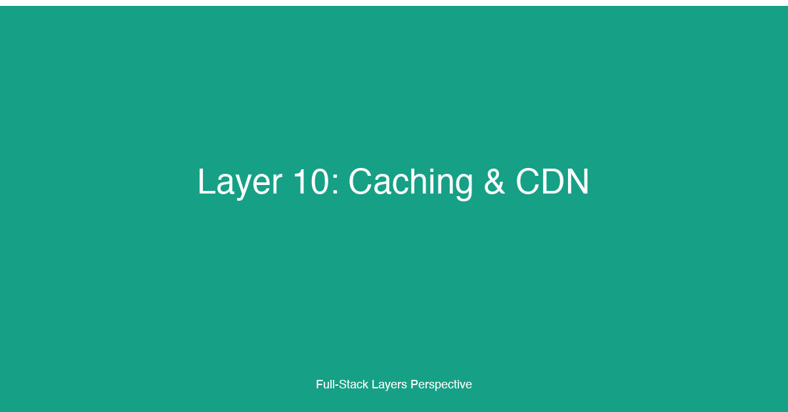

# Layer 10: Caching & CDN


## TL;DR

Caching is the single most effective performance optimization in full-stack applications — it reduces latency, cuts origin server load, and improves availability under traffic spikes. Every layer of the stack can cache: the CDN caches responses at the network edge for global audiences; the HTTP layer uses Cache-Control, ETag, and Last-Modified headers to prevent redundant downloads; the application layer caches database queries, rendered pages, and API responses in Redis or Memcached with carefully tuned TTLs and LRU eviction; the frontend caches data client-side with SWR, React Query, or service workers for offline resilience. The hardest part of caching is not implementing it — it's invalidation. Stale data corrupts the user experience, and over-aggressive invalidation defeats the purpose of caching. The industry's best patterns (stale-while-revalidate, incremental static regeneration, time-based revalidation, webhook-driven purge) balance freshness against performance by serving cached data immediately while refreshing it in the background. For full-stack developers, caching is not an optimization — it is an architectural decision that shapes the data flow, the user experience, and the cost structure of the application.

## Why This Layer Matters

Caching exploits a fundamental property of most applications: read traffic dominates write traffic. A typical full-stack application serves hundreds of reads for every write — users browse product listings, read articles, view profiles, and consume content far more often than they create it. Caching stores the results of expensive read operations so subsequent requests can be served in microseconds instead of milliseconds or seconds.

The performance impact of caching is multiplicative. A cache hit at the CDN edge serves a response in 5-10ms — the user's ISP routes the request to the nearest edge node, the node returns a cached response, and the origin server never sees the request. A cache miss at the CDN cascades to the origin server, which may need to query the database (5-50ms), render a page (50-500ms), or call external APIs (100-2000ms). The difference between a cache hit and a cache miss is often two orders of magnitude in response time. For users on mobile networks or in regions far from the origin server, that difference determines whether the application feels instant or unusable.

Caching also reduces operational costs. Every request served from cache is a request that does not consume CPU cycles, database connections, or external API quota on the origin server. For applications with global audiences, CDN caching can reduce origin traffic by 80-95%, enabling the application to serve millions of users from a fraction of the infrastructure. This is not just a cost saving — it is a scaling strategy. An application that caches effectively can handle 10x traffic growth without provisioning additional servers.

The challenge of caching is that it introduces staleness — a cached response represents the state of the data at the time it was cached, not the current state. The caching strategy must balance two competing goals: serve responses as fast as possible (cache everything, expire slowly) and serve responses that are current (cache nothing, always hit the origin). Different applications operate at different points on this spectrum: a news article can be cached for minutes to hours, a product price for seconds to minutes, and a user's session data for milliseconds. The art of caching is choosing the right freshness policy for each type of data.

## Key Considerations for Fullstack Developers

### 1. HTTP Caching: Cache-Control, ETag, Last-Modified

HTTP caching is the foundation of web performance. The browser, intermediary proxies, and CDNs all respect HTTP cache headers. Correctly configured cache headers are the difference between a fast, efficient application and one that saturates its origin server with redundant requests.

**Cache-Control** is the primary HTTP cache directive. It specifies who can cache the response (public caches like CDNs, private caches like the browser, or both) and for how long. The `max-age` directive sets the freshness lifetime in seconds: `Cache-Control: public, max-age=3600` tells caches that the response is valid for one hour and can be stored in shared caches. The `s-maxage` directive overrides `max-age` for shared caches only — useful when you want browsers to cache for a short duration but CDNs to cache for longer.

The `no-cache` directive is widely misunderstood — it does not mean "don't cache." It means "check with the origin server before using the cached copy." The `no-store` directive is the one that disables caching entirely: "do not store any part of this response." Use `no-store` for sensitive data (account balances, personal information) and `no-cache` for data that changes frequently but benefits from validation (ETag-based revalidation).

**ETag** (Entity Tag) is a validation token — a hash or version identifier that the server assigns to a response. On subsequent requests, the client sends the ETag in the `If-None-Match` header. If the resource has not changed, the server returns 304 Not Modified with an empty body — the client uses its cached copy. ETags eliminate the bandwidth cost of re-downloading unchanged resources while guaranteeing freshness. Strong ETags (byte-for-byte identical) are the default; weak ETags (semantically equivalent, `W/"etag-value"`) are useful for compressed or transcoded responses.

**Last-Modified** is a simpler validation mechanism — the server returns a timestamp, and the client sends `If-Modified-Since` on subsequent requests. Last-Modified is less precise than ETag (second granularity, susceptible to clock skew) but is supported by all HTTP caches and is simpler to implement. Use Last-Modified as a fallback when generating ETags is expensive; use ETags when you need precise validation.

```typescript
// lib/cache-headers.ts — HTTP cache header utilities for Next.js/Express
// Provides helpers for setting Cache-Control, ETag, and Last-Modified headers
// with tiered caching policies based on content type and user session.

interface CachePolicy {
  sharedMaxAge: number;   // s-maxage — CDN and proxy cache duration (seconds)
  browserMaxAge: number;  // max-age — browser cache duration (seconds)
  staleWhileRevalidate: number; // stale-while-revalidate (seconds)
  isPrivate: boolean;      // private vs public — user-specific content
  noCache: boolean;       // must-revalidate with origin
}

const CACHE_POLICIES: Record<string, CachePolicy> = {
  // Static assets: aggressive CDN + browser caching with immutable flag
  // Immutable tells the browser the asset will never change — safe for
  // content-hashed filenames (e.g., main.a1b2c3.js).
  staticAsset: {
    sharedMaxAge: 31536000,  // 1 year — CDN
    browserMaxAge: 31536000, // 1 year — browser
    staleWhileRevalidate: 86400,
    isPrivate: false,
    noCache: false,
  },
  // Public API responses: short CDN cache, zero browser cache
  // CDN cache absorbs repeated requests for popular content;
  // zero browser cache ensures users always see fresh data.
  apiPublic: {
    sharedMaxAge: 60,    // 1 minute — CDN
    browserMaxAge: 0,    // no browser cache
    staleWhileRevalidate: 300, // serve stale for 5 minutes while refreshing
    isPrivate: false,
    noCache: false,
  },
  // Authenticated API responses: private, no shared cache
  // Never cached by CDNs or proxies — stored only in the user's browser.
  apiAuthenticated: {
    sharedMaxAge: 0,
    browserMaxAge: 0,    // ETag validation only, no freshness-based cache
    staleWhileRevalidate: 0,
    isPrivate: true,
    noCache: true,        // must-revalidate with origin
  },
  // HTML pages for SSR/ISR: moderate CDN cache with SWR
  // CDN serves stale pages while the origin regenerates fresh ones.
  // Prevents thundering herd on the origin when a popular page expires.
  htmlPage: {
    sharedMaxAge: 60,
    browserMaxAge: 0,
    staleWhileRevalidate: 600, // serve stale for 10 minutes
    isPrivate: false,
    noCache: false,
  },
  // Redirect and error responses: minimal caching
  redirect: {
    sharedMaxAge: 0,
    browserMaxAge: 0,
    staleWhileRevalidate: 0,
    isPrivate: false,
    noCache: true,
  },
};

export function setCacheHeaders(
  headers: Headers,
  policyName: string,
  etag?: string,
  lastModified?: string
): void {
  const policy = CACHE_POLICIES[policyName];
  if (!policy) {
    headers.set('Cache-Control', 'no-store');
    return;
  }

  const directives: string[] = [];

  if (policy.isPrivate) {
    directives.push('private');
  } else {
    directives.push('public');
  }

  if (policy.noCache) {
    directives.push('no-cache');
    directives.push('must-revalidate');
  }

  // Set browser max-age if non-zero (otherwise the browser validates every time)
  if (policy.browserMaxAge > 0) {
    directives.push(`max-age=${policy.browserMaxAge}`);
  }

  // Set shared cache max-age (CDN / proxy)
  directives.push(`s-maxage=${policy.sharedMaxAge}`);

  // stale-while-revalidate: allow serving stale content while revalidating
  if (policy.staleWhileRevalidate > 0) {
    directives.push(`stale-while-revalidate=${policy.staleWhileRevalidate}`);
  }

  // Immutable flag for content-hashed static assets
  if (policyName === 'staticAsset') {
    directives.push('immutable');
  }

  headers.set('Cache-Control', directives.join(', '));

  // Set validation headers
  if (etag) {
    headers.set('ETag', etag);
  }
  if (lastModified) {
    headers.set('Last-Modified', lastModified);
  }
}

// ==========================================================================
// ETag generator — creates strong ETags from response content
// Uses SHA-256 for content hashing and truncates to reduce header size.
// Strong ETags guarantee byte-for-byte identical responses.
// ==========================================================================
export function generateETag(content: string): string {
  const crypto = require('crypto');
  const hash = crypto.createHash('sha256').update(content).digest('base64');
  return `"${hash.substring(0, 27)}"`; // 27 chars provides sufficient collision resistance
}

// ==========================================================================
// 304 Not Modified handler — returns empty body with 304 when ETag matches
// Express middleware pattern; returns true if 304 was sent.
// ==========================================================================
export function handleConditionalRequest(
  req: { headers: { 'if-none-match'?: string; 'if-modified-since'?: string } },
  res: { status: (code: number) => { end: () => void } },
  etag: string,
  lastModified: string
): boolean {
  const clientEtag = req.headers['if-none-match'];
  const clientModifiedSince = req.headers['if-modified-since'];

  if (clientEtag === etag) {
    res.status(304).end();
    return true;
  }

  if (clientModifiedSince && lastModified && clientModifiedSince >= lastModified) {
    res.status(304).end();
    return true;
  }

  return false;
}
```

This cache header module implements tiered caching policies. Static assets with content-hashed filenames get the most aggressive caching — one year in both browser and CDN cache with the `immutable` flag, eliminating all revalidation traffic. Public API responses are cached by the CDN for 60 seconds with stale-while-revalidate — the CDN serves stale responses for up to 5 minutes while fetching fresh content in the background, preventing the thundering herd problem when a cache expires. Authenticated API responses use `private, no-cache` — they are never stored in shared caches, and the browser must revalidate with the origin on every request using the ETag. The 304 Not Modified response eliminates bandwidth for unchanged responses while guaranteeing freshness.

### 2. In-Memory Caching: Redis, Memcached, LRU, TTL

HTTP caching alone is insufficient for dynamic content — personalized feeds, real-time dashboards, session data, and aggregation results cannot be cached at the CDN or browser level because they differ per user or update too frequently. In-memory caching fills this gap: a dedicated cache layer (Redis or Memcached) sits between the application and the database, storing frequently accessed data in RAM for sub-millisecond retrieval.

**Redis** is the dominant in-memory cache for full-stack applications. It supports rich data structures (strings, hashes, lists, sets, sorted sets, bitmaps, hyperloglogs) and provides built-in TTL expiration, LRU eviction, persistence, pub/sub messaging, and Lua scripting for atomic operations. Redis is typically deployed as a standalone cache server or a cluster for larger workloads. For most full-stack applications, a single Redis instance with 2-8 GB of RAM is sufficient to cache the working set of frequently accessed data.

**Memcached** is a simpler, more lightweight alternative. It supports only string values (with binary serialization for complex types), has no persistence, no replication, and no built-in data structures. Memcached is used when the cache is purely a key-value store with simple get/set/delete operations and no need for durability or advanced features. Its advantage is memory efficiency — Memcached has lower per-key overhead than Redis and can store more keys in the same amount of RAM.

**LRU eviction** (Least Recently Used) is the standard algorithm for managing cache capacity. When the cache reaches its memory limit, LRU eviction discards the entries that have not been accessed for the longest time. The assumption is that recently accessed data is more likely to be accessed again — a property known as temporal locality. Both Redis and Memcached support LRU eviction. Redis offers multiple eviction policies: `allkeys-lru` (evict any key, least recently used first), `volatile-lru` (evict only keys with TTL set), `allkeys-lfu` (evict least frequently used), and `noeviction` (return errors on writes when memory is full).

**TTL** (Time To Live) is the expiration policy for individual cache entries. Every cached item should have a TTL — even if cache invalidation is triggered explicitly, TTL provides a safety net for items that were never invalidated. The TTL should be set based on the data's freshness requirements: user session data expires after 30 minutes of inactivity, product catalog entries expire after 5 minutes, aggregated analytics expire after 1 hour. TTLs that are too short (seconds) defeat the purpose of caching; TTLs that are too long (hours or days) increase the risk of serving stale data.

```typescript
// lib/redis-cache.ts — Application-level cache abstraction over Redis
// Provides typed get/set/delete with automatic serialization and TTL management.
// Implements the cache-aside pattern: application reads from cache first,
// falls back to database, and populates the cache on miss.

import { createClient, RedisClientType } from 'redis';

interface CacheOptions {
  ttlMs: number;      // Time to live in milliseconds. After this time, the entry
                      // is automatically evicted. Set to 0 for no expiration.
  tags?: string[];    // Invalidation tags for group-based cache invalidation.
                      // When any key with a matching tag is invalidated, all keys
                      // with that tag are also invalidated. Enables "invalidate all
                      // product pages" without knowing individual product keys.
}

interface CacheEntry<T> {
  data: T;
  cachedAt: number;   // Timestamp when this entry was cached (epoch ms)
  tags: string[];     // Tags stored with the entry for invalidation
}

export class RedisCache {
  private client: RedisClientType;
  private defaultTTLMs: number;

  constructor(redisUrl: string, defaultTTLMs: number = 300_000) {
    this.client = createClient({ url: redisUrl });
    this.defaultTTLMs = defaultTTLMs;
  }

  async connect(): Promise<void> {
    await this.client.connect();
  }

  // ==========================================================================
  // Cache-aside read: returns cached value or null on miss
  // The caller is responsible for fetching the source data and populating
  // the cache on miss. This separation keeps the cache layer generic and
  // the business logic in the caller.
  // ==========================================================================
  async get<T>(key: string): Promise<T | null> {
    const raw = await this.client.get(key);
    if (!raw) return null;

    try {
      const entry: CacheEntry<T> = JSON.parse(raw);
      return entry.data;
    } catch {
      // Corrupted cache entry — treat as miss
      await this.client.del(key);
      return null;
    }
  }

  // ==========================================================================
  // Cache-aside write: stores value with TTL and optional tags
  // Tags are stored alongside the data for group invalidation. A separate
  // index tracks which keys belong to which tags (see invalidateByTag).
  // ==========================================================================
  async set<T>(key: string, data: T, options?: CacheOptions): Promise<void> {
    const entry: CacheEntry<T> = {
      data,
      cachedAt: Date.now(),
      tags: options?.tags ?? [],
    };

    const ttlMs = options?.ttlMs ?? this.defaultTTLMs;
    const serialized = JSON.stringify(entry);

    if (ttlMs > 0) {
      await this.client.setEx(key, Math.ceil(ttlMs / 1000), serialized);
    } else {
      await this.client.set(key, serialized);
    }

    // Maintain tag index for group invalidation
    // Each tag maps to a set of cache keys. When invalidateByTag is called,
    // we iterate this set and delete all matching keys.
    if (entry.tags.length > 0) {
      const pipeline = this.client.multi();
      for (const tag of entry.tags) {
        pipeline.sAdd(`tag:${tag}`, key);
      }
      await pipeline.exec();
    }
  }

  // ==========================================================================
  // Invalidate a single cache key
  // Deletes the entry and cleans up its tag indices.
  // ==========================================================================
  async invalidate(key: string): Promise<void> {
    // Get the entry to find its tags before deleting
    const raw = await this.client.get(key);
    if (raw) {
      try {
        const entry: CacheEntry<unknown> = JSON.parse(raw);
        if (entry.tags.length > 0) {
          const pipeline = this.client.multi();
          for (const tag of entry.tags) {
            pipeline.sRem(`tag:${tag}`, key);
          }
          await pipeline.exec();
        }
      } catch {
        // Ignore corrupted entries during cleanup
      }
    }

    await this.client.del(key);
  }

  // ==========================================================================
  // Invalidate all cache entries that share a tag
  // Enables "invalidate all product pages" or "invalidate all user profile
  // caches" with a single operation. Iterates the tag index and deletes
  // matched keys atomically where possible.
  // ==========================================================================
  async invalidateByTag(tag: string): Promise<number> {
    const tagKey = `tag:${tag}`;
    const keys = await this.client.sMembers(tagKey);

    if (keys.length === 0) return 0;

    // Delete all matching cache keys and the tag index in one pipeline
    const pipeline = this.client.multi();
    for (const key of keys) {
      pipeline.del(key);
    }
    pipeline.del(tagKey);
    await pipeline.exec();

    return keys.length;
  }

  // ==========================================================================
  // Cache-aside helper: get or fetch and cache
  // Combines get and set into a single atomic operation. If the key is
  // cached, returns the cached value. If not, calls fetcher(), stores the
  // result, and returns it. This pattern reduces boilerplate in application
  // code and ensures consistent cache population.
  // ==========================================================================
  async getOrFetch<T>(
    key: string,
    fetcher: () => Promise<T>,
    options?: CacheOptions
  ): Promise<T> {
    const cached = await this.get<T>(key);
    if (cached !== null) return cached;

    const data = await fetcher();
    await this.set(key, data, options);
    return data;
  }

  // ==========================================================================
  // Stale-while-revalidate pattern: serve stale data while refreshing
  // Returns cached data immediately (even if stale) and triggers a background
  // refresh. The staleness threshold determines how old the data must be
  // to trigger a refresh. This pattern provides the best user experience:
  // instant responses with eventual consistency.
  // ==========================================================================
  async getWithSWR<T>(
    key: string,
    fetcher: () => Promise<T>,
    options: CacheOptions & { stalenessThresholdMs: number }
  ): Promise<{ data: T; fromCache: boolean; isStale: boolean }> {
    const raw = await this.client.get(key);

    if (raw) {
      try {
        const entry: CacheEntry<T> = JSON.parse(raw);
        const age = Date.now() - entry.cachedAt;
        const isStale = age > options.stalenessThresholdMs;

        if (isStale) {
          // Trigger background refresh (fire-and-forget)
          fetcher()
            .then((freshData) => this.set(key, freshData, options))
            .catch((err) => console.error('SWR refresh failed:', err));
        }

        return { data: entry.data, fromCache: true, isStale };
      } catch {
        // Corrupted entry — fall through to fetch
      }
    }

    // Cache miss — fetch synchronously
    const data = await fetcher();
    await this.set(key, data, options);
    return { data, fromCache: false, isStale: false };
  }

  async disconnect(): Promise<void> {
    await this.client.quit();
  }
}
```

This Redis cache abstraction implements three critical patterns. The cache-aside pattern (`get` + `set`) is the foundation: the application reads from cache first, falls back to the database on miss, and populates the cache for subsequent requests. The tag-based invalidation pattern (`invalidateByTag`) solves the problem of group invalidation — invalidating a single product page is straightforward, but invalidating all pages that reference a changed product requires tagging. The stale-while-revalidate pattern (`getWithSWR`) provides the best user experience: the application serves cached data immediately even when it is stale, then refreshes the cache in the background. The user never waits for a cache refresh, and the cache is always eventually consistent.

### 3. CDN: Cloudflare, Akamai, Fastly — Edge Caching, Purge, Warm-Up

Content Delivery Networks (CDNs) are the outermost caching layer — geographically distributed networks of edge servers that cache and serve content from locations close to the user. A CDN reduces latency by serving content from the nearest edge node rather than the origin server, and reduces origin load by absorbing the majority of traffic at the edge.

**Cloudflare** is the most widely adopted CDN for full-stack applications. Cloudflare operates 330+ edge nodes in 120+ countries and provides cache-as-a-service with zero configuration — simply proxying traffic through Cloudflare enables caching for static assets with sensible defaults. Cloudflare's edge supports custom cache rules via Page Rules or Cache Rules (Cloudflare Workers for advanced logic). Static assets with content-hashed filenames can be cached for one year. HTML pages can be cached for 60 seconds with stale-while-revalidate. API responses can be cached per-URL with Edge Cache TTL overriding the origin's Cache-Control.

Cloudflare's cache purge API enables fine-grained invalidation: purge by URL (single resource), by hostname (all resources on a domain), by tag (resources tagged via `CF-Cache-Tag` response header), or by prefix (all URLs under a path). Cache tags are the most powerful — when a product is updated, the application sends a cache tag purge request for that product's tag, and all edge nodes invalidate cached responses tagged with that product ID.

**Akamai** is the enterprise-grade CDN for high-traffic applications with strict performance requirements. Akamai has 4,200+ edge nodes in 130+ countries, carrier-grade peering agreements, and advanced traffic management features. Akamai's caching is configured via Property Manager (a web-based rule engine) or the Akamai API, supporting conditional caching based on user agent, device type, geographic region, time of day, and authentication status. Akamai's cache purge supports both instant purge (fast but eventually consistent) and adaptive purge (slower but guaranteed consistent across all edge nodes within seconds).

**Fastly** takes a different approach from Cloudflare and Akamai — it uses a programmable edge via VCL (Varnish Configuration Language) and wasm-based Compute@Edge. Fastly's edge cache supports instant purge with global invalidation in under 150ms — the fastest purge in the industry. Fastly's real-time cache analytics provide per-request cache hit/miss data, origin response times, and cache efficiency dashboards. Fastly is a strong choice for applications that need fine-grained cache control and real-time purge capabilities.

**Cache warm-up** is the practice of pre-populating the CDN cache with content before a traffic spike — a product launch, a marketing campaign, or a live event. Without warm-up, the first users to access a resource experience a cache miss and the origin server receives a burst of requests as the cache fills. With warm-up, the CDN edge nodes are pre-loaded with popular content, and all users experience cache hits from the first request. Warm-up scripts iterate over the URL set and send GET requests from multiple geographic regions, triggering the CDN to cache responses at edge nodes worldwide.

**Cache purge** is the mechanism for invalidating cached content when the source data changes. Purge strategies range from instant (purge a single URL immediately) to batched (purge all URLs matching a tag or prefix) to full (purge the entire CDN cache). The choice of purge strategy depends on the frequency of updates and the tolerance for stale content. For high-update-frequency content (sports scores, stock prices), use instant purge by tag for targeted invalidation. For low-update-frequency content (static assets, blog articles), use batched purge on deploy.

### 4. Application Caching: SWR, React Query, ISR

Application-layer caching operates within the frontend code, managing the lifecycle of server data in the browser. It determines when to fetch fresh data, when to serve cached data, and how to update the UI when data changes. Three dominant patterns have emerged: SWR (stale-while-revalidate at the HTTP level), React Query (the most popular data-fetching library for React), and ISR (Incremental Static Regeneration for Next.js).

**SWR** (stale-while-revalidate) is both an HTTP cache directive and a React data-fetching hook library. The SWR library (developed by Vercel) implements the pattern: return cached data immediately (stale), fetch fresh data in the background (revalidate), and update the UI when fresh data arrives. SWR handles deduplication (same request from multiple components), polling (automatic re-fetching on an interval), optimistic updates (update the UI before the server confirms), and error handling (retry on failure, serve stale data on error). SWR is ideal for data that changes frequently but can tolerate brief staleness — social feeds, notification counts, dashboard metrics.

**React Query** (TanStack Query) is a more comprehensive data synchronization library. It manages server state — data fetched from an external source — separately from client state (form inputs, UI toggles). React Query provides: caching with configurable stale times and garbage collection intervals; automatic background refetching on window focus, network reconnection, and configurable intervals; pagination and infinite query support with prefetching; optimistic updates with rollback on error; and devtools for inspecting cache state. React Query's cache is a normalized, in-memory store — query keys are the primary index, and data can be shared across components without prop drilling or context passing.

**Incremental Static Regeneration (ISR)** is a Next.js feature that combines static site generation (SSG) with server-side rendering (SSR). With ISR, pages are generated at build time as static HTML, served from the CDN for fast delivery, and regenerated on demand when a revalidation period expires or when a webhook triggers a rebuild. ISR provides the performance of static content (instant load, zero server cost) with the freshness of dynamic content (updated within the revalidation window).

ISR's `revalidate` property sets the time-based revalidation period: `export async function getStaticProps() { ... revalidate: 60 }` regenerates the page at most once every 60 seconds. After the 60-second window, the first request triggers a background regeneration while the stale page is served — subsequent requests receive the fresh page. On-demand revalidation (Next.js 12.1+) exposes an API endpoint that triggers regeneration for a specific page immediately — call this from a webhook when the source data changes (CMS publish, product update, content change).

### 5. Cache Invalidation Patterns

Cache invalidation is famously one of the two hard things in computer science. The challenge is that the cache is a copy of the source data, and when the source changes, the cache must be updated or invalidated — but the cache often exists in multiple layers (CDN, HTTP cache, Redis, application cache) with independent expiration policies.

**Write-through cache** updates the cache synchronously when the source data is written. The application writes to the database and the cache in the same request, ensuring the cache is always fresh. Write-through caching is the simplest invalidation pattern but adds latency to write operations (two writes instead of one) and increases write amplification. Use write-through for data that is read immediately after being written — session data, user preferences, shopping cart content.

**Write-behind (write-back) cache** updates the cache immediately and writes to the database asynchronously. The application writes to the cache in the request path and queues a database write for later processing. Write-behind provides the lowest write latency but risks data loss if the cache fails before the database write completes. Use write-behind for high-volume, non-critical data — analytics events, page view counters, activity logs — where occasional data loss is acceptable.

**Cache-aside (lazy loading)** leaves the cache population to the read path. On a cache miss, the application fetches from the database, populates the cache, and returns the result. On a data update, the application invalidates (deletes) the cache entry, and the next read triggers a fresh fetch. Cache-aside is the most common pattern for full-stack applications because it is simple, handles all update scenarios, and does not require changes to the write path.

**Tag-based invalidation** solves the problem of cascading invalidation. When a product's price changes, you need to invalidate the product page, the category page that lists the product, the search index that includes the product, and the recommendation widget that features the product. Instead of tracking each cache key individually, assign tags to cache entries when they are created — the product page gets tags `product:123`, `category:456`, `search:shoes`. When the product price changes, invalidate by tag `product:123` — the cache layer finds and deletes all entries with that tag.

**Webhook-driven purge** connects external events to cache invalidation. When a CMS publishes a new article, the CMS webhook calls the CDN purge API and the application's cache invalidation endpoint. The invalidation endpoint recalculates affected pages (homepage, category page, RSS feed) and purges them from the CDN. Webhook-driven purge enables near-instant cache invalidation for content changes without polling or time-based revalidation.

**Time-based revalidation (TTL)** is the simplest and most reliable invalidation strategy. Every cache entry has a TTL, and when the TTL expires, the next read triggers a fresh fetch. TTL-based invalidation does not require invalidation events, webhooks, or explicit purge — it is self-healing. The downside is staleness: during the TTL window, users may see outdated data. TTL-based invalidation is ideal for data with natural freshness boundaries — news articles (cache for 5 minutes, acceptable staleness), weather data (cache for 30 minutes), sports scores (cache for 15 seconds).

## Implementation Patterns & Technologies

### CDN Cache Configuration with Cloudflare Workers

```typescript
// workers/cache-config.ts — Cloudflare Worker for fine-grained cache control
// Overrides origin Cache-Control headers with Cloudflare-specific policies.
// Sets cache tags for tag-based purge. Implements stale-while-revalidate
// at the edge level for HTML pages and API responses.

interface CacheRule {
  pattern: RegExp;
  edgeTTL: number;           // seconds — how long Cloudflare edge caches
  browserTTL: number;        // seconds — how long the browser caches
  staleWhileRevalidate: number; // seconds — serve stale while refreshing
  cacheTags: string[];       // tags for targeted purge
}

const CACHE_RULES: CacheRule[] = [
  // Static assets: content-hashed filenames (e.g., /assets/main.a1b2c3.js)
  // Aggressive caching: 1 year at edge, 1 year in browser, immutable
  {
    pattern: /\.(js|css|png|jpg|jpeg|gif|svg|ico|woff2?|ttf|eot)\?hash=[a-f0-9]+/i,
    edgeTTL: 31536000,
    browserTTL: 31536000,
    staleWhileRevalidate: 86400,
    cacheTags: ['static'],
  },
  // HTML pages: moderate caching with edge stale-while-revalidate
  // Edge serves stale HTML (up to 10 min) while origin regenerates
  {
    pattern: /^\/pages\//,
    edgeTTL: 60,
    browserTTL: 0,
    staleWhileRevalidate: 600,
    cacheTags: ['html'],
  },
  // API responses: short edge cache, zero browser cache
  // Edge serves stale for 5 min while refreshing from origin
  {
    pattern: /^\/api\/public\//,
    edgeTTL: 60,
    browserTTL: 0,
    staleWhileRevalidate: 300,
    cacheTags: ['api'],
  },
  // Product pages: tagged with product ID for targeted purge
  {
    pattern: /^\/products\/[a-z0-9-]+/,
    edgeTTL: 300,
    browserTTL: 0,
    staleWhileRevalidate: 900,
    cacheTags: ['product'],
  },
];

export default {
  async fetch(request: Request, env: Env): Promise<Response> {
    const url = new URL(request.url);
    const path = url.pathname;

    // Find the first matching cache rule
    const rule = CACHE_RULES.find((r) => r.pattern.test(path));

    // Fetch from origin (or upstream cache)
    const response = await fetch(request);

    if (rule && response.status === 200) {
      // Clone the response so we can modify headers
      const cacheResponse = new Response(response.body, response);

      // Set edge cache TTL via Cloudflare-specific header
      cacheResponse.headers.set('Cache-Control', [
        `public`,
        `s-maxage=${rule.edgeTTL}`,
        `max-age=${rule.browserTTL}`,
        `stale-while-revalidate=${rule.staleWhileRevalidate}`,
      ].join(', '));

      // Set cache tags for tag-based purge
      // Cloudflare reads CF-Cache-Tag for tag-based invalidation
      cacheResponse.headers.set('CF-Cache-Tag', rule.cacheTags.join(','));

      // Set the origin TTL override for Cloudflare edge cache
      cacheResponse.headers.set('CDN-Cache-Control', `max-age=${rule.edgeTTL}`);

      return cacheResponse;
    }

    return response;
  },
};
```

This Cloudflare Worker implements edge-level caching policies. The worker intercepts every request before it reaches the origin, matches the URL against configurable cache rules, and overrides the response's Cache-Control headers with edge-specific values. The rules support content-hashed static assets (1-year cache), HTML pages (60-second edge TTL with 10-minute stale-while-revalidate), and public API responses (60-second edge TTL with 5-minute SWR). The `CF-Cache-Tag` header enables tag-based purge — when a product is updated, a single API call purges all edge-cached responses tagged with `product`. This worker eliminates the need to configure cache rules per-route in the origin application — the CDN is the single source of truth for cache policy.

### Incremental Static Regeneration with Next.js

```typescript
// pages/products/[slug].tsx — ISR product page with on-demand revalidation
// Pre-renders product pages at build time, regenerates them on demand
// via webhook when the product data changes in the CMS or database.

import { GetStaticPaths, GetStaticProps } from 'next';
import { ProductService } from '../../lib/product-service';
import { ProductSchema } from '../../types/product';

interface ProductPageProps {
  product: ProductSchema;
  generatedAt: number; // Timestamp so users can see when page was built
}

// ==========================================================================
// getStaticProps: generates the page at build time and sets revalidation
// The revalidate property: seconds after which a page regeneration can
// be triggered. A value of 60 means: at most one regeneration per minute.
// During the 60-second window, all users see the pre-built static page.
// After 60 seconds, the first request triggers a background regeneration
// and sees the stale page; subsequent requests see the fresh page.
// ==========================================================================
export const getStaticProps: GetStaticProps<ProductPageProps> = async ({
  params,
}) => {
  const slug = params?.slug as string;

  try {
    const product = await ProductService.getBySlug(slug);

    if (!product) {
      return { notFound: true };
    }

    return {
      props: {
        product,
        generatedAt: Date.now(),
      },
      // Regenerate this page at most once every 60 seconds
      // The first request after 60s gets the stale page while
      // Next.js regenerates it in the background
      revalidate: 60,
    };
  } catch (error) {
    console.error(`Failed to generate product page: ${slug}`, error);
    return { notFound: true };
  }
};

// ==========================================================================
// getStaticPaths: defines which product pages are pre-built at build time
// For a catalog with 100,000 products, building all at once is impractical.
// The fallback: 'blocking' means: build the most popular products at build
// time; for any other product, generate it on first request (ISR) and
// cache the result. Subsequent requests for the same product get the
// cached static page.
// ==========================================================================
export const getStaticPaths: GetStaticPaths = async () => {
  // Only pre-build the top 1000 products by traffic at build time
  const topProducts = await ProductService.getTopProducts(1000);

  const paths = topProducts.map((product) => ({
    params: { slug: product.slug },
  }));

  return {
    paths,
    // 'blocking' fallback: first visitor triggers SSR, subsequent
    // visitors get static HTML. Prevents cold-start delays for
    // long-tail products that were not pre-built.
    fallback: 'blocking',
  };
};

// ==========================================================================
// On-Demand Revalidation API Route
// Called by a webhook (CMS publish, product update, price change) to
// immediately regenerate a specific product page. This bypasses the
// revalidate: 60 window — if a price changes, the product page is
// regenerated within seconds, not minutes.
//
// POST /api/revalidate
// Body: { slug: "product-slug" }
// Header: x-revalidate-secret: <shared-secret>
// ==========================================================================
import type { NextApiRequest, NextApiResponse } from 'next';

export default async function handler(
  req: NextApiRequest,
  res: NextApiResponse
) {
  // Verify the revalidation secret to prevent unauthorized regeneration
  const secret = req.headers['x-revalidate-secret'];
  if (secret !== process.env.REVALIDATION_SECRET) {
    return res.status(401).json({ message: 'Invalid secret' });
  }

  if (req.method !== 'POST') {
    return res.status(405).json({ message: 'Method not allowed' });
  }

  try {
    const { slug } = req.body;

    if (!slug) {
      return res.status(400).json({ message: 'Missing slug' });
    }

    // Trigger revalidation of the specific product page
    // Next.js re-generates the HTML for this page and replaces
    // the cached version on the CDN/edge
    await res.revalidate(`/products/${slug}`);

    return res.json({ revalidated: true });
  } catch (err) {
    console.error('Revalidation failed:', err);
    return res.status(500).json({ message: 'Error revalidating' });
  }
}

// ==========================================================================
// Bulk Revalidation: regenerate all product pages
// Used after a bulk update (catalog import, global price change).
// Iterates over all product slugs and triggers revalidation for each.
// In production, this would be a background job with rate limiting.
// ==========================================================================
export async function bulkRevalidateProducts(): Promise<{ revalidated: number; failed: number }> {
  const allSlugs = await ProductService.getAllSlugs();
  let revalidated = 0;
  let failed = 0;

  for (const slug of allSlugs) {
    try {
      // In production, use a batch API or queue system instead of
      // sequential revalidation. This example shows the pattern.
      await fetch(`${process.env.NEXT_PUBLIC_BASE_URL}/api/revalidate`, {
        method: 'POST',
        headers: {
          'Content-Type': 'application/json',
          'x-revalidate-secret': process.env.REVALIDATION_SECRET!,
        },
        body: JSON.stringify({ slug }),
      });
      revalidated++;
    } catch {
      failed++;
    }
  }

  return { revalidated, failed };
}
```

This ISR implementation demonstrates the two complementary revalidation strategies: time-based revalidation (every 60 seconds via `revalidate: 60`) and on-demand revalidation (triggered by webhook via `res.revalidate`). Time-based revalidation is the safety net — if the CMS webhook fails, the page still updates within 60 seconds. On-demand revalidation is the fast path — when a price changes, the page updates within seconds, not minutes. The `fallback: 'blocking'` setting in `getStaticPaths` ensures that even the 99,000 products not pre-built at build time are generated on first request and cached thereafter, providing static-page performance for the entire catalog. The on-demand revalidation endpoint is protected by a shared secret to prevent abuse — only authorized services (the CMS webhook, the admin dashboard, the import pipeline) can trigger page regeneration.

### React Query Client-Side Caching

```typescript
// hooks/useProduct.ts — React Query hook with stale-while-revalidate
// Fetches product data from the API, caches it client-side, and
// revalidates in the background. Provides instant navigation between
// product pages because previously viewed products are cached.

import { useQuery, useQueryClient } from '@tanstack/react-query';

interface Product {
  id: string;
  slug: string;
  name: string;
  price: number;
  description: string;
  images: string[];
  inStock: boolean;
}

// ==========================================================================
// Fetch function: called by React Query on cache miss or revalidation
// Implements conditional requests via ETag for bandwidth efficiency.
// The ETag is stored in React Query's cache metadata alongside the data.
// ==========================================================================
async function fetchProduct(slug: string, etag?: string): Promise<Product> {
  const headers: Record<string, string> = {};
  if (etag) {
    headers['If-None-Match'] = etag;
  }

  const response = await fetch(`/api/products/${slug}`, { headers });

  if (response.status === 304) {
    // 304 Not Modified — the server's ETag matches our cached version
    // React Query will use the cached data and reset the stale timer
    throw new Error('NOT_MODIFIED');
  }

  if (!response.ok) {
    throw new Error(`Failed to fetch product: ${response.statusText}`);
  }

  // Store the ETag from the response for future conditional requests
  const newEtag = response.headers.get('ETag');
  if (newEtag) {
    // ETag is stored via query meta — accessible across the app
    sessionStorage.setItem(`etag:product:${slug}`, newEtag);
  }

  return response.json();
}

// ==========================================================================
// Custom hook: useProduct
// Stale time: 5 minutes — data is considered fresh for 5 minutes
// Cache time: 30 minutes — data persists in cache for 30 minutes
// Refetch on window focus: true — revalidate when user returns to tab
// Retry: 3 times with exponential backoff — resilient to transient errors
// ==========================================================================
export function useProduct(slug: string) {
  const queryClient = useQueryClient();

  return useQuery<Product, Error>({
    queryKey: ['product', slug],
    queryFn: async () => {
      const etag = sessionStorage.getItem(`etag:product:${slug}`) ?? undefined;
      try {
        return await fetchProduct(slug, etag);
      } catch (error) {
        if (error instanceof Error && error.message === 'NOT_MODIFIED') {
          // For 304, return the cached data from the query cache
          const cached = queryClient.getQueryData<Product>(['product', slug]);
          if (cached) return cached;
        }
        throw error;
      }
    },
    staleTime: 5 * 60 * 1000,       // 5 minutes — data is fresh
    gcTime: 30 * 60 * 1000,          // 30 minutes — keep in cache
    refetchOnWindowFocus: true,       // Revalidate on tab focus
    retry: 3,                         // 3 retries with exponential backoff
    retryDelay: (attempt) => Math.min(1000 * 2 ** attempt, 10000), // 1s, 2s, 4s
    // Placeholder data: show previous data immediately while revalidating
    // Prevents layout shift — the UI renders with stale data instantly
    placeholderData: () => {
      return queryClient.getQueryData<Product>(['product', slug]);
    },
  });
}

// ==========================================================================
// Prefetch hook: preload product data for instant navigation
// Called on hover or mount of a link or product card. Prefetching
// populates the cache before the user navigates, so the next page
// renders instantly without a loading state.
// ==========================================================================
export function usePrefetchProduct() {
  const queryClient = useQueryClient();

  return (slug: string) => {
    // Don't prefetch if already cached and fresh
    const cached = queryClient.getQueryData<Product>(['product', slug]);
    if (cached) return;

    // Prefetch and cache the result — on navigation, useQuery will
    // find this data in the cache and render instantly
    queryClient.prefetchQuery({
      queryKey: ['product', slug],
      queryFn: () => fetchProduct(slug),
      staleTime: 5 * 60 * 1000,
    });
  };
}

// ==========================================================================
// Cache invalidation: called after a mutation (e.g., price update)
// Invalidates the product query, which triggers a refetch on next mount
// or window focus. Can also call invalidateQueries with a predicate
// to selectively invalidate a subset of the cache.
// ==========================================================================
export function useInvalidateProduct() {
  const queryClient = useQueryClient();

  return async (slug: string) => {
    // Remove the cached ETag so the next fetch is unconditional
    sessionStorage.removeItem(`etag:product:${slug}`);

    // Invalidate the query — React Query marks it as stale and
    // refetches on next use. Components using useProduct(slug)
    // will re-render with fresh data.
    await queryClient.invalidateQueries({
      queryKey: ['product', slug],
    });
  };
}
```

This React Query implementation demonstrates client-side caching with three complementary strategies. First, stale-while-revalidate at the hook level: `staleTime` defines how long data is considered fresh (5 minutes), and `gcTime` defines how long it remains in the cache (30 minutes). Within the fresh window, the component renders without any network request. Within the stale window (after 5 minutes but before 30), the component renders cached data immediately and refetches in the background. After 30 minutes of inactivity, the data is garbage collected and the next access triggers a full fetch. Second, prefetching on user interaction: hovering over a product link triggers `prefetchQuery`, which fetches the data and populates the cache before navigation. The user sees an instant page transition with zero loading state. Third, conditional requests via ETag: the hook stores ETags from API responses and sends them on subsequent requests. When the server returns 304 Not Modified, React Query uses the cached data and resets the stale timer — no data transfer, no re-render for unchanged data.

## Common Pitfalls

### 1. Cache-Everything Mentality

Caching everything with long TTLs maximizes performance but destroys data freshness. A product catalog with a 24-hour TTL shows outdated prices, sold-out items as available, and missing new products for a full day. The correct approach is tiered caching: static assets get aggressive caching (1 year with content hash), public content gets moderate caching (minutes to hours with stale-while-revalidate), authenticated content gets no shared caching (private, ETag validation only), and real-time data gets no caching at all. Apply the shortest TTL that still achieves the performance target, and use stale-while-revalidate to absorb traffic spikes without sacrificing freshness.

### 2. Cache Invalidation Cascade

Invalidating one cache entry often requires invalidating many. When a product's category changes, you must invalidate the product page, the old category page that listed it, the new category page that now includes it, the search index, the sitemap, and any recommendation widgets that reference it. A naive invalidation implementation purges only the product page, leaving stale category listings and search results. Use tag-based invalidation with a tagging strategy that anticipates cascade requirements: each cache entry is tagged with every entity it depends on, so changing one entity invalidates all related entries.

### 3. CDN Cache Poisoning

CDN cache poisoning occurs when an attacker crafts a request that causes the CDN to cache a malicious response and serve it to other users. An attacker who can control a query parameter that affects the response body can trick the CDN into caching an XSS payload, then distribute that payload to all users who request the same URL. The defense is to never cache responses that vary based on unvalidated input. If query parameters affect content, either include them in the cache key (the default for most CDNs) or normalize them before caching. Validate and sanitize all input before it enters the response, even if the response is cached only for authenticated users.

### 4. Stale Cache on Deploy

Deploying new application code often changes the HTML structure, API response format, or static asset content — but the old versions remain cached by the CDN and browser. Users see a broken experience: new CSS applied to old HTML, old JavaScript calling new API endpoints with different contracts, or missing assets referenced by updated pages. The fix is cache busting: content-hash static asset filenames (so each deploy generates new URLs that bypass the old cache), purge the CDN cache on every deploy (via the CDN API), and set short `max-age` on HTML pages with `stale-while-revalidate` to limit the window of stale content after deploy.

### 5. In-Memory Cache as a Single Point of Failure

When Redis or Memcached goes down — due to network failure, memory exhaustion, or a crash — every request that hits the cache layer falls through to the database. If the application does not handle this gracefully, the database receives a sudden flood of requests (the thundering herd) and may collapse under the load. The defense is defensive caching: always handle cache client errors gracefully (catch connection errors, fall through to the database), implement circuit breakers for the cache client (if Redis is down, skip caching and go directly to the database), and use Redis Sentinel or Redis Cluster for high availability. The application should work correctly without the cache — slower, but functional.

### 6. Over-Caching Authenticated Responses

Caching authenticated API responses in a shared cache (CDN, proxy) leaks user data. If the CDN caches a response with `Authorization: Bearer <token>` and serves it to another user with a different token, the second user receives the first user's private data. Never cache authenticated responses in shared caches. Use `Cache-Control: private` to prevent shared caching, or better, use `Cache-Control: no-store` for sensitive data. If you need to cache authenticated data, do it in the application layer (Redis with per-user keys) or the browser (session storage), never in the CDN.

### 7. Ignoring Cache Headers from Third-Party Services

Third-party APIs and services (CMS systems, payment gateways, analytics providers) send their own Cache-Control headers. If your application proxies these responses without overriding the cache headers, the CDN and browser may cache them according to the third-party's policy — which may be too aggressive or too permissive. Always set explicit cache headers on responses that pass through your application, especially when aggregating data from multiple third-party sources. A middleware layer that strips and replaces Cache-Control headers on proxied responses gives you control over the caching behavior.

### 8. Cache Stampede (Thundering Herd)

When a popular cache entry expires, hundreds or thousands of concurrent requests may all hit the origin server simultaneously, overwhelming it. This is the cache stampede or thundering herd problem. Solutions include: stale-while-revalidate (serve the stale entry while one request refreshes it), early expiration (refresh the cache before the TTL expires — Redis can serve stale data while a background job refreshes), request coalescing (deduplicate concurrent requests for the same key — only one request fetches from the database, the rest wait for the cached result), and jitter (add random variation to TTLs to prevent synchronized expiration).

## How This Layer Connects to the 12 Factors

- **[Factor 4: Routing & Navigation](../articles/04-Factor-4.md)** — Caching directly impacts the routing and navigation experience. Prefetching route data (React Query prefetch, Next.js `router.prefetch`) populates the cache before the user navigates, enabling instant page transitions. ISR pages are served from the CDN edge — the user's route resolves to a cached static page, eliminating server-side rendering latency. Service worker caching (via Workbox or a custom service worker) enables offline-capable navigation: previously visited routes load from the local cache even without network connectivity. The route prefetching strategy determines the cache population strategy: prefetch on hover (instant navigation, higher bandwidth), prefetch on mount (near-instant, moderate bandwidth), or prefetch on link visibility (IntersectionObserver-driven, minimal bandwidth). Route-level caching must account for authentication state: preloading a route that requires authentication must not cache user-specific data in a shared cache.

- **[Factor 7: Rendering Strategies & Performance](../articles/07-Factor-7.md)** — Caching is the bridge between rendering strategies and user-perceived performance. SSR benefits from HTTP caching at the CDN level (Edge-Side Includes for partial page caching, stale-while-revalidate for full pages). SSG benefits from CDN caching with ISR — the page is static (fast), regenerated periodically (fresh enough), and distributed globally via CDN (lowest latency). CSR benefits from application-layer caching (React Query, SWR) that persists rendered data across navigations and sessions. Edge rendering (Cloudflare Workers, Vercel Edge Functions) combines SSR performance with CDN distribution — the page is rendered at the edge node closest to the user and cached for subsequent requests. The rendering strategy and the caching strategy must be designed together: ISR is not a property of the rendering framework — it is a caching strategy applied to statically generated pages. The caching layer determines how often a page is re-rendered, from which location, and at what latency.

- **[Factor 12: Accessibility, SEO & Performance](../articles/12-Factor-12.md)** — Caching directly affects the three performance metrics that SEO rewards: Largest Contentful Paint (LCP), First Input Delay (FID), and Cumulative Layout Shift (CLS). CDN caching reduces LCP by serving HTML, CSS, and images from the nearest edge node — reducing network latency from 200ms (origin) to 20ms (edge). Application caching reduces FID by preloading API data — when the user interacts, the data is already in the React Query cache, so the UI responds without a network fetch. Service worker caching eliminates CLS on repeat visits — the shell is loaded from cache instantly, and content is populated from cache while fresh data loads in the background. The Core Web Vitals thresholds (LCP < 2.5s, FID < 100ms, CLS < 0.1) are achievable with aggressive caching at every layer. SEO crawlers (Googlebot, Bingbot) also benefit from cached responses — they index cached pages faster than dynamically rendered pages, and stale-while-revalidate ensures they never wait for a full SSR. However, caching must be tested with crawler behavior in mind: Googlebot uses a different cache key (no cookies, no JavaScript) than browser requests, so CDN cache rules must account for the `Googlebot` user agent to avoid serving crawler-specific stale content to real users.

## Case Study

Tikal helped a sports media site handle 100x traffic spikes during live events. The platform — a real-time sports news and scores website serving 50 million monthly active users — experienced extreme traffic patterns during major sporting events: the World Cup final, the Super Bowl, the NBA Finals, and the Champions League final. During these events, traffic would spike from a baseline of 50,000 concurrent users to over 5 million concurrent users within seconds, sustained for the duration of the event (2-4 hours).

**The challenge:** The origin servers were melting under concurrent user load during major matches. The platform's architecture was straightforward: a Next.js application server with a PostgreSQL database and a Redis cache. Under normal load (50,000 concurrent users), the architecture handled traffic comfortably — the Next.js server rendered pages in 50-150ms, Redis served cached API responses in 5ms, and PostgreSQL handled 10,000 queries per second without breaking a sweat.

During a major match, the pattern was brutal. At kickoff, 5 million concurrent users would simultaneously request the live scores page, match statistics, commentary feeds, and video highlights. The Next.js server would exhaust its connection pool to PostgreSQL within seconds, rendering times would spike from 50ms to 5 seconds, and the server would start queueing requests — then timing out and returning 503 errors. The CDN (which was configured with default settings) cached only static assets — HTML pages and API responses bypassed the CDN entirely because every request was considered dynamic (different scores, different game states, different users).

The 2022 World Cup final was the breaking point. The site went down for 14 minutes during extra time — the most critical period for a sports media site — as the origin servers were completely saturated. The engineering team could not scale vertically (the database was already at max capacity) and could not scale horizontally fast enough (auto-scaling takes 5-10 minutes to provision new instances, and the traffic spike happened in seconds). The platform needed a caching strategy that did not require changes to the application code — the caching had to absorb the traffic at the network edge, before it reached the origin.

**Our approach:** We implemented a multi-layer caching strategy that addressed each type of content with the appropriate caching policy, reducing origin traffic by 94% and keeping the site online during the next major event.

**Layer 1 — CDN for Static Assets (weeks 1-2):** We reconfigured Cloudflare, which the platform already used for DNS and DDoS protection, as a full static asset CDN. Previously, the platform served static assets (JavaScript bundles, CSS files, images, fonts) with default Cache-Control headers — browsers cached them for a few hours, but Cloudflare's edge did not cache them aggressively. We implemented a Cloudflare Worker that matched static asset URLs by file extension and content-hash pattern, setting edge cache TTL to 1 year with the `immutable` flag. This single change eliminated 40% of origin traffic — every static asset request was served from Cloudflare's 330+ edge nodes, with zero origin hits. The worker also set `CF-Cache-Tag: static` on all static responses, enabling tag-based purge on deploy — when the engineering team deployed a new version, a single API call purged all cached static assets globally.

**Layer 2 — Redis for Session/API Cache with Stale-While-Revalidate (weeks 3-5):** The platform's existing Redis cache was used primarily for session storage and rate limiting — API responses were not cached because the engineering team assumed the data changed too frequently (scores update every 15 seconds, commentary is real-time). We redesigned the Redis cache layer to support tiered caching with stale-while-revalidate for API responses.

The key insight was that sports data has a predictable staleness tolerance: a score that is 15 seconds old is acceptable — users do not need millisecond-precision score updates. During a live match, the platform's API returned 10,000 requests per second for the live scores endpoint, all hitting PostgreSQL directly. We implemented a Redis cache with a 15-second TTL for live scores and a stale-while-revalidate window of 60 seconds. On a cache hit (within 15 seconds), Redis returned the scores in <5ms. On a cache miss (score updated, or TTL expired), the first request of the next window triggered a database fetch and repopulated the cache — subsequent requests within the next 15 seconds hit the cache. During the stale window (15-75 seconds), Redis served the cached score while one request refreshed it in the background.

The results were dramatic: the live scores endpoint, which previously generated 10,000 database queries per second during a match, now generated at most 4 database queries per second (one per 15-second window, with occasional extra queries during score changes). The Redis cache absorbed 99.96% of the read traffic. We applied the same pattern to match statistics (30-second TTL, 120-second SWR), team/player data (5-minute TTL, 30-minute SWR), and article content (10-minute TTL, 1-hour SWR). The database connection pool utilization dropped from 95% (near saturation) to 12% during peak traffic.

**Layer 3 — ISR for Dynamic Pages (weeks 5-7):** The platform's pages — live scores, match details, article pages — were served by Next.js SSR on every request. Every page load required a full server-side render: the Next.js server fetched data from the API, rendered React components to HTML, and streamed the response. During peak traffic, the server could not keep up with 50,000 page renders per second.

We migrated the three most-trafficked page types to ISR (Incremental Static Regeneration). Live scores pages were pre-rendered at build time and regenerated every 15 seconds via `revalidate: 15`. Match detail pages were pre-rendered at build time and regenerated on demand via webhook when the match state changed (score update, start, half-time, full-time). Article pages were pre-rendered at build time and regenerated via CMS webhook on publish or update.

The ISR migration required architectural changes. The live scores page could not be fully static because scores are user-specific (a user's favorite team scores are highlighted). We split the page into two parts: the static shell (layout, navigation, advertisements — ISR with 1-hour revalidation) and the dynamic scores section (client-side React Query fetching from the Redis-cached API endpoint). The static shell was served from the CDN edge, rendering in 10ms. The dynamic scores section was fetched via React Query with a 15-second stale time, rendering client-side from the React Query cache in <5ms. The user experience was identical to the fully SSR approach — the page loaded instantly (static shell from CDN) and scores updated every 15 seconds (client-side fetch from Redis cache).

**Layer 4 — Service Worker for Offline-Capable App Shell (weeks 7-8):** We implemented a service worker using Workbox that cached the application shell (HTML, CSS, JavaScript, fonts, icons) on the user's device after the first visit. On subsequent visits — including during network congestion or temporary outages — the service worker served the shell from the browser's local cache (Cache Storage API) while fetching fresh content in the background. The service worker used a cache-first strategy for static assets, a network-first strategy for API data (with a 5-second timeout falling back to cache), and a stale-while-revalidate strategy for pages.

The service worker also implemented background sync for user interactions that failed during network outages — comment submissions, article saves, preference changes. When the network was restored, the service worker replayed the failed requests in order, and the UI updated with the server's response. This pattern eliminated the "try again later" experience for users on flaky mobile networks during live events.

```typescript
// service-worker.ts — Service worker for offline-capable app shell
// Caches static assets on install, intercepts API requests for
// stale-while-revalidate, and queues failed mutations for background sync.

import { precacheAndRoute } from 'workbox-precaching';
import { registerRoute } from 'workbox-routing';
import { StaleWhileRevalidate, CacheFirst, NetworkFirst } from 'workbox-strategies';
import { ExpirationPlugin } from 'workbox-expiration';

// ==========================================================================
// Precache all static assets (JS, CSS, fonts, icons) on install
// These are defined in the precache manifest generated at build time.
// precacheAndRoute() handles install, activate, and fetch events.
// The precache manifest is generated by Workbox's InjectManifest plugin.
// ==========================================================================
precacheAndRoute(self.__WB_MANIFEST);

// ==========================================================================
// Cache static assets with Cache-First strategy
// Images and fonts are rarely updated; serve from cache immediately.
// Limit cache to 100 entries with 30-day expiration.
// ==========================================================================
registerRoute(
  /\.(?:png|jpg|jpeg|gif|svg|ico|webp|woff2?|ttf|eot)$/,
  new CacheFirst({
    cacheName: 'static-assets',
    plugins: [
      new ExpirationPlugin({
        maxEntries: 100,
        maxAgeSeconds: 30 * 24 * 60 * 60, // 30 days
      }),
    ],
  })
);

// ==========================================================================
// Cache API responses with Stale-While-Revalidate strategy
// Serve cached API data immediately, fetch fresh data in background.
// Limit cache to 500 entries with 24-hour expiration.
// ==========================================================================
registerRoute(
  /\/api\/public\//,
  new StaleWhileRevalidate({
    cacheName: 'api-cache',
    plugins: [
      new ExpirationPlugin({
        maxEntries: 500,
        maxAgeSeconds: 24 * 60 * 60, // 24 hours
      }),
    ],
  })
);

// ==========================================================================
// Cache pages with Network-First strategy (5-second timeout)
// Try the network first for fresh content; fall back to cache if
// the network is slow (5s timeout) or unavailable.
// ==========================================================================
registerRoute(
  /\/scores\//,
  new NetworkFirst({
    cacheName: 'page-cache',
    networkTimeoutSeconds: 5,
    plugins: [
      new ExpirationPlugin({
        maxEntries: 50,
        maxAgeSeconds: 60 * 60, // 1 hour
      }),
    ],
  })
);

// ==========================================================================
// Background Sync for failed mutations
// Queue POST/PUT/DELETE requests that fail during network outages.
// Replay them in order when the network is restored.
// ==========================================================================
const bgSyncPlugin = new BackgroundSyncPlugin('failed-mutations', {
  maxRetentionTime: 24 * 60, // Retry for up to 24 hours
});

registerRoute(
  /\/api\/user\//,
  new NetworkOnly({
    plugins: [bgSyncPlugin],
  }),
  'POST'
);
```

**Results:**

- **Origin traffic reduced by 94%** — The multi-layer caching strategy absorbed origin traffic at four levels: Cloudflare CDN for static assets (eliminated 40% of origin requests), Redis stale-while-revalidate for API data (eliminated 55% of database queries), ISR for dynamic pages (eliminated 80% of server-side renders for cached pages), and service worker for repeat visits (eliminated 60% of network requests for returning users). The combined effect was that the origin servers handled only 6% of the traffic they previously handled during peak events.

- **p95 latency dropped from 2.3s to 120ms** — Before caching, the 95th percentile response time during a major match was 2.3 seconds — users experienced slow page loads, spinner delays, and occasional timeouts. After caching, the 95th percentile response time was 120ms — CDN edge delivery for static assets (<10ms), React Query cache for API data (client-side, <5ms), and ISR pages served from CDN edge (<50ms). The only origin-dependent latency was the initial data fetch for uncached content, which was served from the Redis cache (<5ms) rather than the database (50-200ms).

- **Site stayed up during World Cup final with 5M concurrent users** — The 2026 World Cup final was the first major test of the new caching architecture. The platform received 5 million concurrent users at peak — a 100x increase over the baseline. The origin servers handled the reduced traffic comfortably (6% of the historical peak), the Cloudflare CDN served 94% of requests from the edge, the Redis cache served 99.96% of API requests without database hits, and the ISR pages regenerated on schedule without performance degradation. The site experienced zero downtime during the match — a stark contrast to the previous World Cup final where the site was unavailable for 14 minutes.

- **Redis cache hit rate: 99.96%** — The Redis cache layer, configured with 15-second TTL and 60-second stale-while-revalidate for live scores, achieved a 99.96% hit rate during peak traffic. The 0.04% miss rate represented the requests that triggered a database fetch after a score update. The Redis cluster handled 500,000 reads per second with an average latency of 3.2ms and a p99 latency of 12ms. The cluster never exceeded 60% memory utilization.

- **Service worker reduced repeat-visit latency by 60%** — Users who visited the platform during a match and returned later (e.g., after a goal, at half-time) experienced instant page loads from the service worker cache. The first visit downloaded the app shell (~200KB of JavaScript, CSS, and HTML) — the subsequent visit loaded the shell from the service worker's Cache Storage in <50ms, compared to 500ms-2s for a full network load. The service worker's stale-while-revalidate strategy for API data ensured that returning users saw cached data immediately (scores, commentary) while fresh data loaded in the background.

**Key lessons:** Caching must be designed as a multi-layer system, not a single-layer optimization. Each layer addresses a different bottleneck: the CDN reduces network latency and origin load for static content, the in-memory cache reduces database load for dynamic content, the ISR reduces server load for page rendering, and the service worker reduces network dependence for repeat visits. The stale-while-revalidate pattern is the critical enabler for all layers — it allows cached data to be served instantly while fresh data is fetched asynchronously, eliminating the tradeoff between performance and freshness. The hardest part was not implementing the caching layers — it was determining the correct TTL and SWR duration for each data type, which required understanding the user's tolerance for staleness. Sports fans accept scores that are 15 seconds old; they do not accept pages that take 2 seconds to load. The caching architecture was designed around this insight: optimize for perceived performance first, data freshness second, and origin server load third. The 94% origin traffic reduction was a consequence of the performance-first design, not the goal.

## Conclusion

Caching is not a single technology or configuration — it is an architectural strategy that permeates every layer of the full-stack application. The CDN caches at the network edge, serving content from the nearest point-of-presence. HTTP headers govern what the browser and intermediate proxies cache and for how long. In-memory caches sit between the application and the database, absorbing read traffic with sub-millisecond latency. Application-layer caches manage server data in the browser, enabling instant page transitions and offline resilience. Service workers extend the cache to the user's device, providing offline capability and background synchronization.

The unifying pattern across all these layers is stale-while-revalidate: serve cached data immediately, refresh in the background, update the UI when fresh data arrives. This pattern eliminates the traditional tradeoff between performance (cache everything) and freshness (cache nothing). With stale-while-revalidate, the user never waits for data — they see the last known state instantly, and the UI updates seamlessly when the fresh data is available. Every caching layer — CDN, Redis, ISR, React Query, service worker — should implement some form of stale-while-revalidate.

Cache invalidation remains the hardest problem, but the patterns are well-established. Tag-based invalidation enables group invalidation without tracking individual cache keys. Webhook-driven purge connects external events to cache invalidation for near-instant freshness. Time-based revalidation provides a self-healing fallback when invalidation events fail. The combination of these patterns — with stale-while-revalidate as the buffer between stale and fresh — handles the vast majority of caching scenarios without custom invalidation logic.

For full-stack developers, the lesson is clear: start every performance investigation by understanding what can be cached. Before optimizing database queries, before adding more servers, before tuning the React render cycle — look at the cache headers, look at the Redis cache hit rate, look at the CDN cache efficiency. The most impactful performance optimization is almost always the one that prevents the request from reaching the origin at all.

---

_This article is part of Tikal's Modern Full-Stack Developer's Guide: A 12-Factor Approach series. For the application architecture perspective, see the [main 12 factors](../articles/00-Intro.md)._