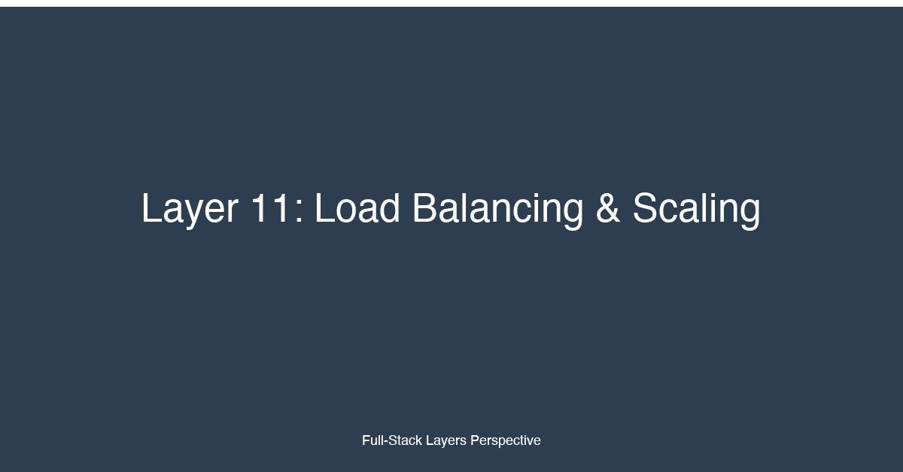

# Layer 11: Load Balancing & Scaling


## TL;DR

Load balancing and scaling are the mechanisms that keep your application responsive as traffic grows. Load balancers distribute incoming requests across multiple backend instances — eliminating single points of failure, absorbing traffic spikes, and enabling seamless deployments through rolling updates. Scaling comes in two flavors: vertical (bigger machines) and horizontal (more machines). Horizontal scaling is the fundamental enabler of cloud-native architectures — it allows your application to grow from one instance to thousands by adding capacity rather than replacing it. However, horizontal scaling demands stateless application design: sessions stored in memory on one instance are invisible to another, so state must be externalized to Redis, databases, or client-side tokens. Auto-scaling policies tie scaling decisions to observable signals — CPU utilization, request queue depth, or scheduled events — and adjust capacity in response. Database scaling is the hardest problem in the stack: read replicas handle read-heavy workloads, connection pooling prevents connection exhaustion, and sharding distributes data across multiple database instances when a single instance cannot store or process the workload. For full-stack developers, scaling is not an operations concern — it is an architectural constraint that shapes every design decision from the data model to the session management strategy.

## Why This Layer Matters

Every application starts small — a single server running a monolithic codebase, a single database instance, a single Redis cache. This architecture works well for the first hundred, even the first thousand users. But growth is not linear. At some threshold — usually between 1,000 and 10,000 concurrent users — the single-server architecture hits a wall. CPU saturation drives response times from 50ms to 5 seconds. Memory exhaustion causes the application to swap or crash. Database connection pools are exhausted, queuing requests until they time out. The application becomes unusable under its own success.

Load balancing and scaling are the architectural response to this threshold. A load balancer sits in front of the application servers and distributes traffic — round-robin, least-connections, or request-based — so no single server bears the full load. When traffic increases, new servers are added to the pool; when traffic decreases, servers are removed. The load balancer also performs health checks, removing failed servers from the pool and preventing requests from being routed to dead instances.

The separation of concerns is critical: the load balancer handles traffic distribution, and the application servers handle request processing. These two responsibilities must be independently scalable. A load balancer can handle hundreds of thousands of requests per second on a single instance (Nginx, HAProxy) or millions when deployed across multiple availability zones (AWS ALB, Cloudflare). Application servers, depending on the request complexity, typically handle hundreds to thousands of requests per second per instance.

For full-stack developers, the key insight is that scaling is not a deployment-time concern — it is a design-time constraint. An application that stores session state in process memory cannot be horizontally scaled without losing user sessions. An application that opens a database connection for every request and never uses connection pooling will exhaust the database's connection limit when scaled beyond a few instances. An application with a synchronous, in-process job queue will lose queued work when the server is terminated during a scale-in event. These are not operations problems — they are design problems that must be solved before scaling is required.

## Key Considerations for Fullstack Developers

### 1. Horizontal vs Vertical Scaling

Vertical scaling (scaling up) means replacing the server with a larger one — more CPU cores, more RAM, faster disk I/O. It is the simplest scaling strategy: no architectural changes, no load balancer configuration, no distributed system complexity. You provision a larger instance (for example, from 2 vCPUs and 8 GB RAM to 8 vCPUs and 32 GB RAM), deploy the application, and the application runs faster because it has more resources.

Vertical scaling has hard limits. Cloud providers cap instance sizes — AWS EC2's largest instances offer up to 448 vCPUs and 24 TB of RAM, but at significant cost. Beyond a certain point, the cost-per-transaction increases non-linearly: doubling the instance size does not double the throughput because memory bandwidth, cache coherence, and I/O contention create diminishing returns. Vertical scaling also creates a single point of failure — one large server is still one server, and its failure takes down the entire application.

Horizontal scaling (scaling out) means adding more servers of the same size. Instead of replacing the 2-vCPU server with an 8-vCPU server, you deploy four 2-vCPU servers behind a load balancer. Horizontal scaling provides near-linear scaling: four 2-vCPU servers handle approximately four times the traffic of a single 2-vCPU server. There is no hard limit — you can scale from 1 to 1,000 instances by adding capacity incrementally. Horizontal scaling also provides fault tolerance: if one instance fails, the remaining instances continue serving traffic, and the load balancer routes around the failed instance.

The tradeoff is architectural complexity. A horizontally scaled application must be stateless — no session data stored in process memory, no file system state, no in-process job queues. The application must use external services for state (Redis, database), file storage (S3, Cloud Storage), and job processing (Redis queues, SQS, RabbitMQ). The deployment process must support rolling updates (deploying to one server at a time while the load balancer routes traffic to the remaining servers). The monitoring system must aggregate metrics across all instances. These are not insurmountable challenges, but they require deliberate architectural decisions.

The rule of thumb: start with vertical scaling for simplicity. When the largest available instance is insufficient or the cost-per-transaction becomes uneconomical, switch to horizontal scaling. The transition point varies by application, but most applications hit it between 1,000 and 10,000 requests per second.

### 2. Load Balancers: ALB/ELB, Nginx, HAProxy, Cloudflare

Load balancers operate at different layers of the OSI model. Layer 4 load balancers (transport layer) route traffic based on IP address and TCP port — they inspect the TCP connection, forward packets to a backend server, and track which server handles which connection. Layer 7 load balancers (application layer) inspect the HTTP request — the URL path, headers, cookies, and body — and make routing decisions based on application-level knowledge. Layer 7 load balancers can implement path-based routing (`/api/*` to the API servers, `/app/*` to the frontend servers), host-based routing (`app.example.com` vs `api.example.com`), cookie-based session persistence, and content-based caching.

**AWS ALB (Application Load Balancer)** is a managed Layer 7 load balancer that integrates with the AWS ecosystem. ALB supports path-based routing, host-based routing, query string routing, and HTTP header routing. It terminates TLS, forwards requests to target groups (groups of EC2 instances, Lambda functions, or IP addresses), and performs health checks against configurable endpoints. ALB integrates with Auto Scaling Groups — when a new EC2 instance is launched by the auto-scaler, ALB automatically registers it and starts routing traffic to it. ALB also supports WebSocket and HTTP/2, sticky sessions (via cookies or ELB-generated cookies), and access logs that record every request for auditing and analysis.

**AWS NLB (Network Load Balancer)** is a Layer 4 load balancer designed for extreme performance — it handles millions of requests per second with ultra-low latency (sub-millisecond). NLB does not inspect HTTP headers — it forwards TCP or UDP traffic directly to backend servers. NLB is used for performance-critical workloads (real-time gaming, financial trading, IoT data ingestion) and for protocols that ALB does not support (TCP, UDP, TLS termination at the load balancer level). NLB preserves the client's source IP address, which is important for applications that need the original client IP for logging or geolocation.

**Nginx** is a software-based load balancer, web server, and reverse proxy. It is deployed on the application server or on dedicated proxy instances. Nginx supports Layer 7 load balancing with configurable algorithms: round-robin (default), least-connections (forward to the server with the fewest active connections), IP hash (consistent routing based on client IP), and weighted distribution. Nginx also provides HTTP caching, TLS termination, rate limiting, access control, and static file serving. Nginx is used in environments where the team needs full control over the load balancer configuration and cannot use managed load balancers (on-premises deployments, multi-cloud architectures, cost-sensitive environments).

**HAProxy** is a software-based load balancer focused on high availability and performance. It supports both Layer 4 and Layer 7 load balancing with advanced features: connection queuing (hold excess connections in the load balancer queue rather than forwarding them to the backend), health checks with configurable intervals and thresholds, stick tables for session persistence, and detailed statistics via a web interface. HAProxy is used in environments where load balancing reliability is critical — it is the default load balancer for Kubernetes (kube-proxy), OpenStack, and many cloud-native platforms.

**Cloudflare** provides global load balancing as a service. Cloudflare's load balancer distributes traffic across multiple origin servers and data centers, with automatic failover and intelligent routing based on geographic proximity, server load, and health check results. Cloudflare also provides DDoS protection, CDN caching, and WAF functionality at the edge, making it the most comprehensive option for applications that need global distribution and security. Cloudflare's load balancer routes traffic at the DNS level or the HTTP proxy level, depending on the configuration.

```typescript
// infrastructure/alb-config.ts — AWS CDK definition for an Application Load Balancer
// with path-based routing, health checks, and auto-scaling integration.
// Routes /api/* to API target group, /app/* to frontend target group.
// Health checks ensure failed instances are removed from rotation.

import * as cdk from 'aws-cdk-lib';
import * as ec2 from 'aws-cdk-lib/aws-ec2';
import * as elbv2 from 'aws-cdk-lib/aws-elasticloadbalancingv2';
import * as autoscaling from 'aws-cdk-lib/aws-autoscaling';
import * as cw from 'aws-cdk-lib/aws-cloudwatch';
import * as cwActions from 'aws-cdk-lib/aws-cloudwatch-actions';

export interface AlbScalingStackProps extends cdk.StackProps {
  vpc: ec2.IVpc;
  apiInstanceType: ec2.InstanceType;
  frontendInstanceType: ec2.InstanceType;
  minCapacity: number;
  maxCapacity: number;
  cpuTargetPercent: number;
}

export class AlbScalingStack extends cdk.Stack {
  constructor(scope: cdk.App, id: string, props: AlbScalingStackProps) {
    super(scope, id, props);

    // Security group for the ALB — allows HTTP/HTTPS from anywhere
    const albSecurityGroup = new ec2.SecurityGroup(this, 'AlbSecurityGroup', {
      vpc: props.vpc,
      description: 'Security group for the Application Load Balancer',
      allowAllOutbound: false,
    });
    albSecurityGroup.addIngressRule(
      ec2.Peer.anyIpv4(),
      ec2.Port.tcp(443),
      'Allow HTTPS from anywhere'
    );
    albSecurityGroup.addIngressRule(
      ec2.Peer.anyIpv4(),
      ec2.Port.tcp(80),
      'Allow HTTP from anywhere (redirects to HTTPS)'
    );

    // ------------------------------------------------------------------
    // Application Load Balancer
    // Internet-facing, IPv4, with access logs enabled for auditing.
    // Deletion protection prevents accidental removal in production.
    // ------------------------------------------------------------------
    const alb = new elbv2.CfnLoadBalancer(this, 'ApplicationLoadBalancer', {
      name: 'app-alb',
      type: 'application',
      scheme: 'internet-facing',
      ipAddressType: 'ipv4',
      securityGroups: [albSecurityGroup.securityGroupId],
      subnets: props.vpc.publicSubnets.map(s => s.subnetId),
      loadBalancerAttributes: [
        { key: 'deletion_protection.enabled', value: 'true' },
        { key: 'access_logs.s3.enabled', value: 'true' },
        { key: 'access_logs.s3.bucket', value: `app-alb-logs-${this.account}` },
      ],
    });

    // ------------------------------------------------------------------
    // TLS Listener — terminates TLS at the load balancer
    // Redirects HTTP (port 80) to HTTPS (port 443)
    // Routes traffic to target groups based on path patterns.
    // ------------------------------------------------------------------
    const certificateArn = `arn:aws:acm:${this.region}:${this.account}:certificate/app.example.com`;

    const httpsListener = new elbv2.CfnListener(this, 'HttpsListener', {
      loadBalancerArn: alb.ref,
      protocol: 'HTTPS',
      port: 443,
      certificates: [{ certificateArn }],
      defaultActions: [{
        type: 'fixed-response',
        fixedResponseConfig: {
          statusCode: '404',
          contentType: 'text/plain',
          messageBody: 'Not Found',
        },
      }],
    });

    // HTTP listener — redirects all traffic to HTTPS
    new elbv2.CfnListener(this, 'HttpRedirectListener', {
      loadBalancerArn: alb.ref,
      protocol: 'HTTP',
      port: 80,
      defaultActions: [{
        type: 'redirect',
        redirectConfig: {
          protocol: 'HTTPS',
          port: '443',
          host: '#{host}',
          path: '/#{path}',
          query: '#{query}',
          statusCode: 'HTTP_301',
        },
      }],
    });

    // ------------------------------------------------------------------
    // API Target Group — routes /api/* to API server instances
    // Health check: GET /api/health — must return 200 within 5 seconds
    // Deregistration delay: 30 seconds — allows in-flight requests to
    // complete before the instance is removed from the target group.
    // ------------------------------------------------------------------
    const apiTargetGroup = new elbv2.CfnTargetGroup(this, 'ApiTargetGroup', {
      name: 'app-api-tg',
      targetType: 'instance',
      protocol: 'HTTP',
      port: 3001,
      vpcId: props.vpc.vpcId,
      healthCheckEnabled: true,
      healthCheckPath: '/api/health',
      healthCheckProtocol: 'HTTP',
      healthCheckPort: '3001',
      healthCheckIntervalSeconds: 30,
      healthCheckTimeoutSeconds: 5,
      healthyThresholdCount: 2,
      unhealthyThresholdCount: 3,
      deregistrationDelayTimeoutSeconds: 30,
      // Path-based forwarding rule will route /api/* to this group
    });

    // ------------------------------------------------------------------
    // Frontend Target Group — routes /app/* to frontend server instances
    // Health check: GET /app/health — the frontend server health endpoint
    // uses a longer timeout because frontend rendering may be slow.
    // ------------------------------------------------------------------
    const frontendTargetGroup = new elbv2.CfnTargetGroup(this, 'FrontendTargetGroup', {
      name: 'app-frontend-tg',
      targetType: 'instance',
      protocol: 'HTTP',
      port: 3000,
      vpcId: props.vpc.vpcId,
      healthCheckEnabled: true,
      healthCheckPath: '/app/health',
      healthCheckProtocol: 'HTTP',
      healthCheckPort: '3000',
      healthCheckIntervalSeconds: 30,
      healthCheckTimeoutSeconds: 10,
      healthyThresholdCount: 2,
      unhealthyThresholdCount: 3,
      deregistrationDelayTimeoutSeconds: 60, // longer for frontend — client connections
    });

    // ------------------------------------------------------------------
    // Listener Rules — path-based routing
    // /api/* -> API target group (first rule, higher priority)
    // /app/* -> Frontend target group
    // Default -> 404 (handled by HTTPS listener default action)
    // ------------------------------------------------------------------
    new elbv2.CfnListenerRule(this, 'ApiRouteRule', {
      listenerArn: httpsListener.ref,
      priority: 10,
      actions: [{
        type: 'forward',
        targetGroupArn: apiTargetGroup.ref,
      }],
      conditions: [{
        field: 'path-pattern',
        pathPatternConfig: { values: ['/api/*'] },
      }],
    });

    new elbv2.CfnListenerRule(this, 'FrontendRouteRule', {
      listenerArn: httpsListener.ref,
      priority: 20,
      actions: [{
        type: 'forward',
        targetGroupArn: frontendTargetGroup.ref,
      }],
      conditions: [{
        field: 'path-pattern',
        pathPatternConfig: { values: ['/app/*'] },
      }],
    });
    // ------------------------------------------------------------------
  }
}
```

This CDK stack defines an Application Load Balancer with two target groups: one for API servers (`/api/*`) and one for frontend servers (`/app/*`). The ALB terminates TLS at the edge — the backend servers receive plain HTTP on the internal network, avoiding the computational cost of TLS termination on each application instance. Path-based routing separates the API and frontend traffic so each target group scales independently: the API group may need 10 instances while the frontend group needs 3. Health checks ensure that failed instances are removed from rotation within 30 seconds — the health check hits `/api/health` on the API servers and `/app/health` on the frontend servers, and both endpoints verify that the application is functional (database connectivity, Redis connectivity, disk space) before returning 200. The deregistration delay allows in-flight requests to complete before an instance is removed from the target group during a scale-in event or rolling deploy.

### 3. Auto-Scaling Policies: CPU-Based, Request-Based, Schedule-Based

Auto-scaling adjusts the number of application instances in response to load. The goal is to match capacity to demand: scale up when traffic increases, scale down when traffic decreases, and maintain steady state during normal operation. Auto-scaling is the mechanism that enables cost-efficient operation — you pay for the capacity you need, when you need it, rather than provisioning for peak traffic 24/7.

**CPU-based scaling** is the simplest and most common auto-scaling policy. A CloudWatch alarm monitors the average CPU utilization across the target group. When CPU utilization exceeds a threshold (for example, 70%) for a sustained period (for example, 5 minutes), the auto-scaling group launches additional instances. When CPU utilization drops below a threshold (for example, 30%) for a sustained period, the auto-scaling group terminates instances. CPU-based scaling works well for CPU-bound workloads — compute-heavy API endpoints, video transcoding, data processing — but is less effective for I/O-bound or memory-bound workloads where CPU utilization is not the bottleneck.

**Request-based scaling** uses the request count per target group as the scaling metric. The metric is `RequestCountPerTarget` — the number of requests handled by each instance in the target group over a 1-minute or 5-minute period. When the request count exceeds a threshold (for example, 10,000 requests per minute per instance), the auto-scaler adds capacity. Request-based scaling is more direct than CPU-based scaling — it measures the actual workload rather than a proxy metric — but it requires careful threshold calibration because request complexity varies. A request that renders a complex dashboard page consumes 10x more CPU than a simple health check request, so the request count threshold must account for the average request complexity and the expected traffic pattern.

**Schedule-based scaling** adds or removes capacity at predetermined times. Schedule-based scaling is used for workloads with predictable traffic patterns — for example, an e-commerce site that receives 10x normal traffic during a daily flash sale at 2 PM, or a SaaS application that receives 2x traffic on Monday mornings when users return to work. Schedule-based scaling is combined with dynamic scaling for the best of both worlds: the schedule pre-positions capacity before the expected traffic spike, and the dynamic policy fine-tunes the capacity based on actual demand.

**Cooldown period** is the time between scaling actions — typically 60-300 seconds. During the cooldown, the auto-scaler does not launch or terminate additional instances, even if the alarm condition persists. The cooldown prevents thrashing — the rapid launch and termination of instances caused by oscillating metrics. For example, if a newly launched instance starts processing requests immediately, the CPU utilization drops below the threshold, and without a cooldown, the auto-scaler would terminate the instance before it finished bootstrapping, creating a cycle of launch-terminate-launch-terminate.

```typescript
// infrastructure/auto-scaling.ts — Auto-scaling configuration for API servers
// Combines CPU-based dynamic scaling with schedule-based pre-positioning.
// Cooldown periods prevent thrashing; warm-up time accounts for instance
// initialization (downloading container image, running database migrations).

export function configureApiAutoScaling(
  scope: cdk.Stack,
  autoScalingGroup: autoscaling.AutoScalingGroup,
  targetGroup: elbv2.CfnTargetGroup,
  vpc: ec2.IVpc
): void {
  // ==========================================================================
  // CPU-Based Scaling Policy
  // Scale out when CPU exceeds 70% for 3 consecutive 1-minute periods
  // Scale in when CPU drops below 30% for 10 consecutive 5-minute periods
  // The asymmetric thresholds (70% out, 30% in) prevent oscillation:
  // capacity additions and removals are separated by a hysteresis band.
  // ==========================================================================
  const cpuScaleOutPolicy = new autoscaling.CfnScalingPolicy(scope, 'CpuScaleOutPolicy', {
    autoScalingGroupName: autoScalingGroup.autoScalingGroupName,
    policyType: 'StepScaling',
    adjustmentType: 'ChangeInCapacity',
    stepAdjustments: [
      {
        metricIntervalLowerBound: 0,
        metricIntervalUpperBound: 20,
        scalingAdjustment: 1, // 1 instance when CPU 70-90%
      },
      {
        metricIntervalLowerBound: 20,
        scalingAdjustment: 2, // 2 instances when CPU exceeds 90%
      },
    ],
    estimatedInstanceWarmup: 120, // 2 minutes for instance warm-up
    cooldown: 180, // 3-minute cooldown between scaling actions
  });

  const cpuScaleInPolicy = new autoscaling.CfnScalingPolicy(scope, 'CpuScaleInPolicy', {
    autoScalingGroupName: autoScalingGroup.autoScalingGroupName,
    policyType: 'StepScaling',
    adjustmentType: 'ChangeInCapacity',
    stepAdjustments: [
      {
        metricIntervalUpperBound: 0,
        metricIntervalLowerBound: -30,
        scalingAdjustment: -1, // Remove 1 instance when CPU 10-30%
      },
      {
        metricIntervalUpperBound: -30,
        scalingAdjustment: -2, // Remove 2 instances when CPU below 10%
      },
    ],
    estimatedInstanceWarmup: 120,
    cooldown: 300, // 5-minute cooldown for scale-in — conservative
  });

  // ==========================================================================
  // Target Tracking Policy — simpler alternative to step scaling
  // AWS automatically adjusts capacity to maintain the target metric.
  // This policy keeps average CPU at 50%, scaling smoothly without
  // the sharp steps of the step scaling policy above.
  // ==========================================================================
  autoScalingGroup.scaleOnCpuUtilization('CpuTargetTracking', {
    targetUtilizationPercent: 50,
    cooldown: cdk.Duration.seconds(180),
    disableScaleIn: false, // Allow both scale-out and scale-in
  });

  // ==========================================================================
  // Schedule-Based Scaling — pre-position capacity for known traffic events
  // Monday 8 AM: scale to 10 instances for the weekly traffic spike
  // Monday 12 PM: scale back to 4 instances after the spike passes
  // Friday 5 PM: scale to 2 instances for the weekend low-traffic period
  // These schedules are combined with the dynamic CPU policies above:
  // the schedule sets the baseline, the dynamic policy handles variance.
  // ==========================================================================
  new autoscaling.CfnScheduledAction(scope, 'MondayMorningScaleUp', {
    autoScalingGroupName: autoScalingGroup.autoScalingGroupName,
    scheduledActionName: 'MondayMorningScaleUp',
    minSize: '10',
    maxSize: '20',
    desiredCapacity: '10',
    recurrence: '0 8 * * MON', // Every Monday at 8:00 UTC
  });

  new autoscaling.CfnScheduledAction(scope, 'MondayAfternoonScaleDown', {
    autoScalingGroupName: autoScalingGroup.autoScalingGroupName,
    scheduledActionName: 'MondayAfternoonScaleDown',
    minSize: '4',
    maxSize: '20',
    desiredCapacity: '4',
    recurrence: '0 12 * * MON', // Every Monday at 12:00 UTC
  });

  new autoscaling.CfnScheduledAction(scope, 'WeekendScaleDown', {
    autoScalingGroupName: autoScalingGroup.autoScalingGroupName,
    scheduledActionName: 'WeekendScaleDown',
    minSize: '2',
    maxSize: '10',
    desiredCapacity: '2',
    recurrence: '0 17 * * FRI', // Every Friday at 17:00 UTC
  });

  // ==========================================================================
  // Lifecycle Hook — handles graceful shutdown during scale-in
  // Before terminating an instance, the auto-scaling group sends a
  // lifecycle hook notification to an SQS queue. The application
  // drains connections, flushes buffers, and signals completion.
  // Without this, in-flight requests are terminated mid-execution.
  // ==========================================================================
  new autoscaling.CfnLifecycleHook(scope, 'ScaleInLifecycleHook', {
    autoScalingGroupName: autoScalingGroup.autoScalingGroupName,
    lifecycleTransition: 'autoscaling:EC2_INSTANCE_TERMINATING',
    heartbeatTimeout: 300, // 5 minutes to complete graceful shutdown
    defaultResult: 'CONTINUE',
    notificationTargetArn: 'arn:aws:sqs:us-east-1:123456789012:scale-lifecycle-queue',
    roleArn: 'arn:aws:iam::123456789012:role/autoscaling-lifecycle-role',
  });
}
```

This auto-scaling configuration combines three strategies. The CPU-based step scaling policy adds instances when CPU exceeds 70% and removes instances when CPU drops below 30%, with a hysteresis band that prevents oscillation — the auto-scaler does not add and remove the same instance repeatedly. The target tracking policy provides a simpler, smoother alternative that maintains 50% CPU utilization without sharp step adjustments. The schedule-based scaling pre-positions capacity for known traffic patterns: 10 instances on Monday morning, back to 4 after the lunchtime peak, and 2 instances over the weekend. The lifecycle hook ensures graceful shutdown: when the auto-scaler terminates an instance, the application receives a notification, drains active connections, flushes any buffered data, and signals completion before the instance is terminated. Without the lifecycle hook, in-flight requests are abruptly terminated, potentially corrupting data or leaving operations in an inconsistent state.

### 4. Stateful vs Stateless Scaling

The single most important architectural decision for horizontal scaling is whether the application is stateful or stateless. A stateless application does not store any state in the local process memory or filesystem — every request can be handled by any instance, and terminating an instance has no impact on user sessions or application functionality. A stateful application stores state locally — user sessions in memory, uploaded files on disk, or processing state in local queues.

Stateless scaling is simple: add instances behind a load balancer, remove instances when traffic drops, and the application continues operating correctly regardless of which instance handles which request. The application stores all state in external services: Redis for session state, a database for persistent data, S3 for file storage, SQS or Redis for job queues. The application instances are interchangeable — any instance can handle any request for any user.

Stateful scaling requires session affinity (sticky sessions): the load balancer must route all requests from a specific user to the same instance. Session affinity is implemented via cookies (the load balancer sets a cookie identifying the backend server) or client IP hashing (the load balancer routes based on a hash of the client IP). Session affinity works for moderate scaling (tens to low hundreds of instances) but breaks down at larger scales: when an instance fails, all sessions on that instance are lost; during rolling deployments, sessions must be drained before the instance is terminated; and the load balancer's session table grows with the number of concurrent users.

The solution is to externalize all state. Session data moves from process memory to Redis. File uploads move from the local filesystem to S3. Job queues move from in-process arrays to Redis lists or SQS queues. The transition from stateful to stateless is the most impactful refactoring for scalability — it transforms the application from a fragile, unscalable monolith into a resilient, horizontally scalable service.

For session management, the standard pattern is a Redis-backed session store. Express.js applications use `connect-redis` to store sessions in Redis instead of in-memory. Django applications use `django-redis` for the session backend. The session is identified by a cookie (`connect.sid` in Express, `sessionid` in Django) that is sent with every request. The application reads the session from Redis, processes the request, and writes the session back to Redis. Since the session is stored in an external service, any application instance can handle any request — there is no session affinity requirement.

### 5. Database Scaling: Read Replicas, Sharding, Connection Pooling

Database scaling is the hardest scaling problem in full-stack applications. Application servers scale horizontally by adding instances, but databases must maintain data consistency across all writes — a constraint that does not apply to stateless application servers. Three patterns address different aspects of database scaling: read replicas handle read-heavy workloads, connection pooling prevents connection exhaustion, and sharding distributes data across multiple database instances.

**Read replicas** are database instances that serve read traffic while the primary instance handles writes. The application writes to the primary instance, and the primary propagates changes to replicas asynchronously (in MySQL and PostgreSQL) or synchronously (in some SQL Server configurations). Read replicas scale the read capacity of the database — the application can distribute read queries across multiple replicas, and each replica independently handles its share of the read workload. Read replicas are effective for applications with a read-to-write ratio of 10:1 or higher — typical for content-heavy applications, reporting dashboards, and analytics workloads.

The application uses a read/write splitter to route queries: write queries (INSERT, UPDATE, DELETE) go to the primary instance, and read queries (SELECT) go to one of the replicas. Most ORMs and database drivers support read/write splitting natively: Prisma supports `@@primary` and `@@read` annotations on models, and ActiveRecord supports multiple database connections with `primary` and `replica` roles.

**Replication lag** is the primary challenge with read replicas. The replica is typically 50-500ms behind the primary, depending on the write volume and network latency. If the application writes data and immediately reads it (the "read-after-write" pattern), the read may hit a replica that has not yet received the update. The solution is query routing: after a write, route subsequent reads from the same user to the primary instance for a configurable period (typically 1-5 seconds), then switch back to replicas. This ensures the user sees their own writes immediately while other users can read from replicas.

**Sharding** distributes data across multiple database instances (shards) based on a shard key. Each shard holds a subset of the data, and no shard communicates with other shards. The application determines which shard to query based on the shard key — typically a user ID, tenant ID, or geographic region. Sharding is the most complex database scaling strategy and should be adopted only when a single database instance cannot store or process the data — typically at hundreds of gigabytes to terabytes of data or thousands of writes per second.

**Shard key selection** is the critical design decision. A good shard key distributes data evenly across shards and aligns with the application's query patterns. User ID is the most common shard key: all data for a user is on a single shard, and queries for a user's data hit only one shard. The downside is that cross-shard queries (aggregating data across all users, generating reports) are slow and complex — they must query every shard and merge results in the application layer.

**Connection pooling** prevents the database from being overwhelmed by connections from many application instances. Each application instance opens a number of database connections equal to its connection pool size (typically 10-50 connections per instance). When the application scales to 100 instances, the total connections to the database are 1,000-5,000 — and the database's `max_connections` setting is typically 100-500 for smaller instances and 1,000-5,000 for larger ones. Without connection pooling, each application instance would open connections up to the pool limit, saturating the database connection capacity.

**PgBouncer** (for PostgreSQL) and **ProxySQL** (for MySQL) are dedicated connection poolers that sit between the application and the database. They maintain a small pool of persistent connections to the database (for example, 50 connections) and multiplex application requests across those connections. When an application requests a database connection, PgBouncer assigns one from its pool for the duration of the query, then returns it to the pool for reuse by another application instance. This decouples the number of application connections from the number of database connections — 100 application instances with 10 connections each (1,000 total) connect through PgBouncer to 50 database connections, and the database never exceeds its connection limit.

```typescript
// lib/database-router.ts — Read/write splitter and connection pool manager
// Routes read queries to read replicas, write queries to the primary.
// Implements read-after-write consistency: after a write, subsequent
// reads from the same user are routed to the primary for 3 seconds.
// PgBouncer is configured in session pooling mode for connection multiplexing.

import { Pool, PoolClient, QueryResult } from 'pg';

interface DatabaseConfig {
  primary: { host: string; port: number; database: string; user: string; password: string };
  replicas: Array<{ host: string; port: number; database: string; user: string; password: string }>;
  pgbouncer: { host: string; port: number };
  readAfterWriteTimeoutMs: number;
}

interface QueryOptions {
  readAfterWrite?: boolean; // true for queries that must see recent writes
  userId?: string;          // used for read-after-write routing
  timeoutMs?: number;       // query timeout
}

export class DatabaseRouter {
  private primaryPool: Pool;
  private replicaPools: Pool[];
  private readAfterWriteTimeoutMs: number;

  // Track which users have written recently — maps userId to timestamp
  private recentWriteTimestamps: Map<string, number> = new Map();
  private cleanupInterval: NodeJS.Timeout;

  constructor(config: DatabaseConfig) {
    // PgBouncer connection pool for the primary
    this.primaryPool = new Pool({
      host: config.pgbouncer.host,
      port: config.pgbouncer.port,
      database: config.primary.database,
      user: config.primary.user,
      password: config.primary.password,
      max: 20,   // connections to PgBouncer per application instance
      idleTimeoutMillis: 30000,
      connectionTimeoutMillis: 5000,
    });

    // PgBouncer connection pools for each read replica
    this.replicaPools = config.replicas.map(replica => new Pool({
      host: config.pgbouncer.host,
      port: config.pgbouncer.port,
      database: replica.database,
      user: replica.user,
      password: replica.password,
      max: 20,
      idleTimeoutMillis: 30000,
      connectionTimeoutMillis: 5000,
    }));

    this.readAfterWriteTimeoutMs = config.readAfterWriteTimeoutMs || 3000;

    // Periodic cleanup of stale read-after-write entries
    this.cleanupInterval = setInterval(() => {
      const now = Date.now();
      for (const [userId, timestamp] of this.recentWriteTimestamps) {
        if (now - timestamp > this.readAfterWriteTimeoutMs) {
          this.recentWriteTimestamps.delete(userId);
        }
      }
    }, 1000); // Clean up every second
  }

  // ==========================================================================
  // Track a write operation for read-after-write consistency
  // Called by the write method. Stores the user ID and current timestamp.
  // Subsequent read queries from this user will hit the primary node
  // until the readAfterWriteTimeoutMs window expires.
  // ==========================================================================
  private trackWrite(userId?: string): void {
    if (userId) {
      this.recentWriteTimestamps.set(userId, Date.now());
    }
  }

  // ==========================================================================
  // Determine if a query should be routed to the primary
  // A query routes to the primary if any of these conditions hold:
  // 1. It is a write query (INSERT, UPDATE, DELETE, CREATE, ALTER, DROP)
  // 2. The readAfterWrite option is set (caller explicitly requires primary)
  // 3. The user has written within the readAfterWriteTimeoutMs window
  // ==========================================================================
  private shouldUsePrimary(query: string, options?: QueryOptions): boolean {
    const normalized = query.trim().toUpperCase();

    // Write queries always go to primary
    if (
      normalized.startsWith('INSERT') ||
      normalized.startsWith('UPDATE') ||
      normalized.startsWith('DELETE') ||
      normalized.startsWith('CREATE') ||
      normalized.startsWith('ALTER') ||
      normalized.startsWith('DROP') ||
      normalized.startsWith('TRUNCATE')
    ) {
      return true;
    }

    // Read-after-write queries go to primary
    if (options?.readAfterWrite) {
      return true;
    }

    // Check if the user has written recently
    if (options?.userId) {
      const lastWrite = this.recentWriteTimestamps.get(options.userId);
      if (lastWrite && (Date.now() - lastWrite) < this.readAfterWriteTimeoutMs) {
        return true;
      }
    }

    return false;
  }

  // ==========================================================================
  // Execute a query — automatically routes to primary or replica
  // Write queries go to the primary; read queries go to a random replica
  // (or the primary if read-after-write consistency is required).
  // ==========================================================================
  async query<T = any>(
    queryText: string,
    params?: any[],
    options?: QueryOptions
  ): Promise<QueryResult<T>> {
    const usePrimary = this.shouldUsePrimary(queryText, options);

    if (usePrimary) {
      // Track writes for read-after-write consistency
      const isWrite = queryText.trim().toUpperCase().startsWith('INSERT') ||
        queryText.trim().toUpperCase().startsWith('UPDATE') ||
        queryText.trim().toUpperCase().startsWith('DELETE');
      if (isWrite) {
        this.trackWrite(options?.userId);
      }

      const client = await this.primaryPool.connect();
      try {
        if (options?.timeoutMs) {
          await client.query(`SET statement_timeout = ${options.timeoutMs}`, []);
        }
        return await client.query(queryText, params);
      } finally {
        client.release();
      }
    } else {
      // Route to a random replica for load distribution
      const poolIndex = Math.floor(Math.random() * this.replicaPools.length);
      const client = await this.replicaPools[poolIndex].connect();
      try {
        if (options?.timeoutMs) {
          await client.query(`SET statement_timeout = ${options.timeoutMs}`, []);
        }
        return await client.query(queryText, params);
      } finally {
        client.release();
      }
    }
  }

  // ==========================================================================
  // Transactions — always use the primary for consistency
  // Writes within a transaction must be visible to subsequent reads in
  // the same transaction. Routing a transaction through replicas would
  // break this guarantee because replicas are eventually consistent.
  // ==========================================================================
  async transaction<T>(
    callback: (client: PoolClient) => Promise<T>,
    options?: { userId?: string }
  ): Promise<T> {
    const client = await this.primaryPool.connect();
    try {
      await client.query('BEGIN');
      if (options?.userId) {
        this.trackWrite(options.userId);
      }
      const result = await callback(client);
      await client.query('COMMIT');
      return result;
    } catch (error) {
      await client.query('ROLLBACK');
      throw error;
    } finally {
      client.release();
    }
  }

  async close(): Promise<void> {
    clearInterval(this.cleanupInterval);
    await this.primaryPool.end();
    for (const pool of this.replicaPools) {
      await pool.end();
    }
  }
}
```

This database router implements three critical scaling patterns. First, read/write splitting: write queries (INSERT, UPDATE, DELETE, DDL statements) are always routed to the primary database pool, and read queries are routed to a random read replica pool. The random replica selection distributes read traffic evenly across replicas. Second, read-after-write consistency: after a user performs a write, all subsequent queries from that user are routed to the primary for 3 seconds, ensuring the user sees their own writes immediately even if the replicas are lagging behind the primary. The `recentWriteTimestamps` Map tracks which users have written recently, and periodic cleanup prevents memory leaks from stale entries. Third, connection pooling through PgBouncer: the application connects to PgBouncer (not directly to the database), and PgBouncer multiplexes connections from hundreds of application instances across a small pool of persistent database connections.

## Implementation Patterns & Technologies

### Nginx Load Balancer Configuration

```nginx
# /etc/nginx/nginx.conf — Nginx load balancer configuration
# Routes traffic to a pool of application servers with health checks,
# rate limiting, and TLS termination. Configures WebSocket support
# for real-time features and connection draining for graceful shutdown.

upstream app_servers {
    # Least-connections algorithm: route to the server with the
    # fewest active connections. Better than round-robin for
    # workloads with variable request-processing times.
    least_conn;

    # Application server instances
    server app-01.internal:3000 max_fails=3 fail_timeout=30s weight=3;
    server app-02.internal:3000 max_fails=3 fail_timeout=30s weight=3;
    server app-03.internal:3000 max_fails=3 fail_timeout=30s weight=2;

    # Connection draining — when a server is marked as down, Nginx
    # waits for in-flight requests to complete before closing connections.
    # The drain state is set via the Nginx API: curl -X POST \
    #   http://localhost:8080/upstream_conf?upstream=app_servers&id=0&drain=1
}

upstream websocket_servers {
    # Separate upstream for WebSocket connections
    # WebSocket connections are long-lived and should not be
    # balanced with the same algorithm as regular HTTP requests.
    ip_hash;  # Consistent routing per client IP for WebSocket stickiness

    server ws-01.internal:3001;
    server ws-02.internal:3001;
    server ws-03.internal:3001;
}

server {
    listen 443 ssl http2;
    server_name app.example.com;

    # TLS configuration
    ssl_certificate /etc/ssl/certs/app.example.com.pem;
    ssl_certificate_key /etc/ssl/private/app.example.com.key;
    ssl_protocols TLSv1.2 TLSv1.3;
    ssl_ciphers HIGH:!aNULL:!MD5;

    # Rate limiting zone — 10MB shared memory zone, 100 requests per second
    limit_req_zone $binary_remote_addr zone=api_limit:10m rate=100r/s;

    # ==========================================================================
    # API endpoints — load balanced across application servers
    # Rate limited to 100 requests per second per client IP.
    # Request body limited to 1MB to prevent large payload attacks.
    # ==========================================================================
    location /api/ {
        limit_req zone=api_limit burst=20 nodelay;
        client_max_body_size 1m;

        proxy_pass http://app_servers;
        proxy_set_header Host $host;
        proxy_set_header X-Real-IP $remote_addr;
        proxy_set_header X-Forwarded-For $proxy_add_x_forwarded_for;
        proxy_set_header X-Forwarded-Proto $scheme;

        # Buffering — disabled for real-time API responses
        proxy_buffering off;
        proxy_buffer_size 4k;
        proxy_buffers 8 4k;

        # Timeouts
        proxy_connect_timeout 5s;    # Connection timeout
        proxy_send_timeout 10s;      # Send timeout
        proxy_read_timeout 30s;      # Read timeout (longer for slow queries)

        # Error handling — retry on server errors
        proxy_next_upstream error timeout invalid_header http_500 http_502 http_503;
        proxy_next_upstream_tries 3;
        proxy_next_upstream_timeout 10s;
    }

    # ==========================================================================
    # WebSocket endpoints — separate upstream with sticky sessions
    # Connection upgrade for WebSocket protocol. Longer timeout for
    # persistent connections. No rate limiting — WebSocket connections
    # are already rate-limited by the application layer.
    # ==========================================================================
    location /ws/ {
        proxy_pass http://websocket_servers;
        proxy_http_version 1.1;
        proxy_set_header Upgrade $http_upgrade;
        proxy_set_header Connection "upgrade";
        proxy_set_header Host $host;
        proxy_set_header X-Real-IP $remote_addr;

        # WebSocket connections can be long-lived — 12 hours max
        proxy_read_timeout 43200s;

        # Disable buffering for WebSocket
        proxy_buffering off;
    }

    # ==========================================================================
    # Static assets — served directly by Nginx, not proxied
    # Content-hashed filenames get aggressive caching (1 year).
    # No rate limiting — unlimited access to static assets is expected.
    # ==========================================================================
    location /static/ {
        alias /var/www/app/static;
        expires 1y;
        add_header Cache-Control "public, immutable";
        access_log off;
    }

    # ==========================================================================
    # Health check endpoint — returns 200 if Nginx is running
    # Used by the load balancer (ALB) or external monitoring systems
    # to verify that this Nginx instance is healthy.
    # ==========================================================================
    location /nginx/health {
        access_log off;
        return 200 "healthy\n";
        add_header Content-Type text/plain;
    }
}

# HTTP redirect — all traffic goes to HTTPS
server {
    listen 80;
    server_name app.example.com;
    return 301 https://$host$request_uri;
}
```

This Nginx configuration implements a production-grade load balancer. The `upstream` block defines the pool of application servers with the `least_conn` algorithm — requests are routed to the server with the fewest active connections, ensuring even load distribution even when request-processing times vary. The `weight` parameter gives servers with higher capacity a larger share of traffic. The `max_fails` and `fail_timeout` parameters define health check behavior: if a server fails 3 requests within 30 seconds, Nginx marks it as unavailable and stops routing traffic to it for 30 seconds. The WebSocket upstream uses `ip_hash` for sticky sessions — all WebSocket connections from a client IP are routed to the same server, which is required for WebSocket state management. The rate limiting configuration limits each client IP to 100 API requests per second with a burst capacity of 20 requests — the `nodelay` parameter ensures that burst requests are processed immediately (not delayed) but count against the rate limit. The `proxy_next_upstream` configuration handles server failures: if a server returns a 5xx error, Nginx retries the request on another server, up to 3 retries within 10 seconds.

## Common Pitfalls

### 1. Scaling Instances Without Scaling State

Adding application servers without externalizing state creates a system that works under low load and fails under scale. Session data stored in process memory is invisible to other instances — a user who logs in on instance A is rejected on instance B because their session does not exist. File uploads saved to the local filesystem are accessible only on the instance that received the upload. Job queues stored in an in-process array are lost when the instance is terminated. Always externalize state before adding a second instance: Redis for sessions, S3 for files, database for persistent data, and a message queue for job processing.

### 2. Database Connection Exhaustion

Scaling application instances to 100 without adjusting the database connection limit is a common failure pattern. Each application instance opens 10-50 database connections. At 100 instances, the total connections to the database are 1,000-5,000, exceeding the database's `max_connections` (typically 100-500 for smaller instances). New connection attempts fail, and existing connections time out. The solution is connection pooling with PgBouncer or ProxySQL: the application connects to the pooler, and the pooler maintains a fixed number of connections to the database. The pooler decouples the number of application connections from the number of database connections.

### 3. Insufficient Health Check Configuration

A health check that only verifies the process is running (responding on the configured port) misses critical failures. The application may be running but unable to serve requests — the database may be disconnected, Redis may be unreachable, or disk space may be exhausted. The health check endpoint should verify all critical dependencies: database connectivity (execute a lightweight query like `SELECT 1`), cache connectivity (ping Redis), and disk space (check that the disk is not full). If any dependency is unavailable, the health check returns 503 and the load balancer removes the instance from rotation.

### 4. Auto-Scaling Without Cooldown

Launching instances based on a single high-CPU metric without cooldown creates oscillation. The auto-scaler launches an instance when CPU exceeds 70%, but the new instance starts handling requests immediately, reducing CPU on existing instances — which triggers the scale-in policy, which terminates the new instance, which increases CPU on existing instances — which triggers the scale-out policy again. The cycle repeats indefinitely, wasting resources and destabilizing the system. Always configure cooldown periods (60-300 seconds) and use hysteresis bands (scale out at 70%, scale in at 30%) to prevent oscillation.

### 5. Ignoring Replication Lag

Read replicas are asynchronously replicated from the primary. The replica is typically 50-500ms behind the primary. Applications that read immediately after write ("read-after-write" pattern) see stale data on replicas. The user saves their profile and the page shows the old data because the read hit a lagging replica. The solution is query routing: route reads from users who have recently written to the primary instance, or use session-level consistency where the application tracks the last write timestamp and routes reads accordingly.

### 6. Sticky Session as a Crutch

Sticky sessions (session affinity) are often used as a shortcut to avoid externalizing state. The load balancer routes all requests from a user to the same instance, so sessions stored in process memory work without Redis. This works at small scale but fails at larger scale: when an instance fails, all sessions on that instance are lost; rolling deployments become complex (drain connections before terminating); and the load balancer's session table grows with active users. The correct solution is to externalize state so any instance can handle any request — sticky sessions should be avoided except for specific use cases like WebSocket connections.

### 7. Scaling the Write Path

Read replicas handle the read path, but the write path is still bottlenecked by the single primary instance. Applications with high write throughput (thousands of writes per second) saturate the primary's CPU, I/O, or WAL (Write-Ahead Log) capacity. Read replicas do not help — every write goes to the primary. The solution is either vertical scaling of the primary (larger instance), connection pooling to reduce connection overhead, or sharding to distribute writes across multiple primaries. Before implementing any of these, optimize the write path: batch writes, reduce the number of indexes on high-write tables, use prepared statements, and consider asynchronous writes (queue the write and let a worker process it).

## How This Layer Connects to the 12 Factors

- **[Factor 7: Rendering Strategies & Performance](../articles/07-Factor-7.md)** — Load balancing and scaling directly interact with rendering strategies. Server-side rendering (SSR) is the most load-sensitive rendering strategy: every request triggers a full server-side render, consuming CPU and database resources. Horizontally scaled SSR requires a load balancer to distribute render requests across instances, Redis for session state (so any instance can render any user's page), and connection pooling to prevent database saturation. Static Site Generation (SSG) is the least load-sensitive — static pages are served from the CDN with zero server-side processing. Incremental Static Regeneration (ISR) combines the performance of static content with the freshness of SSR: pages are pre-rendered at build time, served from the CDN, and regenerated on demand without load balancer involvement. The choice of rendering strategy determines the scaling requirements: SSR needs aggressive horizontal scaling with stateless design, SSG needs minimal server capacity, and ISR needs moderate capacity for page regeneration. The render server pool must be auto-scaled independently from the API server pool — a traffic spike on the API should not steal capacity from the render servers, and vice versa. Health checks for render servers must verify that the rendering process is functional (can connect to the data sources, can render a test page) — a render server that cannot render is worse than a failed one because it accepts requests and returns errors after a timeout.

## Case Study

Tikal helped a B2B analytics platform scale from 100 to 100,000 daily active users in 6 months. The platform — a business intelligence SaaS application serving mid-market companies — provided real-time dashboards, custom report builders, and data export pipelines. Customers connected their own data sources (PostgreSQL, MySQL, BigQuery, Salesforce) and the platform built visualizations on top of the imported data.

**The challenge:** The application was a monolithic Ruby on Rails application deployed on a single AWS EC2 instance (c5.4xlarge — 16 vCPUs, 32 GB RAM). At 100 daily active users, the platform ran comfortably — page loads completed in 200-400ms, database queries returned in 50ms, and the single instance handled all traffic without breaking a sweat. The first 12 months of customer acquisition followed a steady growth curve, reaching 500 DAU by month 12.

At month 13, a major enterprise customer with 50,000 internal users signed on. The platform's daily active user count jumped from 500 to 1,000 on launch day, and within two weeks, the DAU count reached 5,000 as the enterprise customer rolled out the platform to their entire organization. The single-server architecture hit the wall immediately:

- CPU utilization on the Rails server reached 95% during peak hours (9 AM — 12 PM). Page load times increased from 200ms to over 5 seconds.
- The PostgreSQL database (also running on the same instance) reached its connection limit (200 connections). New connections were rejected, causing the application to return 500 errors.
- Memory utilization reached 98%. The server started swapping to disk, increasing disk I/O wait times from 2ms to 500ms. The swapping compounded the CPU problem: every memory access triggered a disk read, and the CPU spent most of its time waiting for I/O.
- The 1,000 concurrent user limit was exceeded within 30 minutes of peak traffic. Users experienced timeouts on dashboard pages, delayed report generation, and frequent 504 Gateway Timeout errors.

By month 14, the platform was at 10,000 DAU with the enterprise rollout in full swing. The single server was failing for an hour every morning during peak traffic. The engineering team attempted vertical scaling — upgrading from c5.4xlarge to c5.12xlarge (48 vCPUs, 96 GB RAM) — which bought a few weeks of headroom but hit diminishing returns. The application's thread-per-request architecture did not scale linearly beyond 16 cores, and the database was still running on the same instance, competing for memory and I/O with the application.

**Our approach:** We migrated the platform from a monolithic, single-server architecture to a horizontally scaled, stateless architecture over 12 weeks, organized in four phases.

**Phase 1 — Stateless Application Design (weeks 1-3):** The Rails application stored session state in memory (the default Rails cookie-based session store was already stateless, but the application used flash messages, cached fragment views in the filesystem, and stored uploaded CSVs on the local disk). We moved all state to external services:

- **Session and cache state to Redis:** We deployed a Redis cluster (two nodes, 8 GB each, with Sentinel for failover). Rails sessions moved from cookie store to Redis store using `redis-session-store`. Fragment caching moved from filesystem cache to Redis. The Redis cluster handled 50,000 reads/second and 10,000 writes/second with an average latency of 2ms.

- **File uploads to S3:** The platform's data import pipeline allowed users to upload CSV files up to 100MB. Previously uploaded to `public/uploads/` on the application server. We migrated to direct-to-S3 uploads using the `aws-sdk-s3` gem with presigned URLs. The application server no longer handled file upload traffic — files went directly from the browser to S3, and the server received a notification when the upload completed.

- **Job queue to Redis + Sidekiq:** The platform's batch jobs (data import, report generation, email delivery) ran as in-process background threads. When the server was under load, background threads competed with web threads for CPU and memory. We migrated to Sidekiq with Redis as the job backend. Background jobs ran on dedicated worker instances (separate from the web instances), isolated from user-facing traffic.

**Phase 2 — Horizontal Scaling with ALB (weeks 4-6):** We deployed the stateless Rails application behind an AWS Application Load Balancer. The architecture split into three auto-scaling groups:

1. **Web tier** — Rails Puma web servers behind the ALB. Auto-scaled based on CPU utilization (scale out at 70%, scale in at 30%). Initial capacity: 3 instances, scaled to 12 during peak traffic.
2. **Worker tier** — Sidekiq worker instances. Auto-scaled based on Sidekiq queue depth (scale out when queue depth exceeds 10,000 jobs, scale in when queue depth drops below 1,000). Initial capacity: 2 instances, scaled to 8 during heavy import periods.
3. **Background job tier** — One-off rake tasks and scheduled jobs. Fixed capacity of 2 instances, triggered by CloudWatch Events (cron expressions).

The ALB configuration used path-based routing: `/api/*` to the web tier, `/admin/*` to a separate admin tier (with IP whitelisting), and `/health` to a health check endpoint that verified database connectivity, Redis connectivity, and S3 access.

**Phase 3 — Database Scaling (weeks 6-9):** The single PostgreSQL instance (db.r5.2xlarge — 8 vCPUs, 64 GB RAM) was the remaining bottleneck. The database was handling 5,000 queries per second during peak hours, with connection utilization at 95%. We implemented three database scaling strategies:

- **Read replicas:** We deployed two read replicas (db.r5.xlarge — 4 vCPUs, 32 GB RAM) in the same AWS region. The Rails application used the `makara` gem for read/write splitting: writes went to the primary, reads were distributed across the two replicas using a round-robin algorithm. The `makara` gem implemented read-after-write stickiness — after a write, subsequent reads from the same user were routed to the primary for 2 seconds. The read replicas handled 60% of the total query volume, reducing the primary's query load from 5,000 QPS to 2,000 QPS.

- **Connection pooling with PgBouncer:** We deployed PgBouncer on a dedicated EC2 instance (t3.medium) in the same VPC as the application and database. PgBouncer maintained a pool of 50 persistent connections to the primary and 30 connections to each read replica. The Rails application's connection pool was configured with 5 connections per Puma worker process — with 3 web instances and 4 Puma workers each, the total application connections were 60, well within PgBouncer's pool of 50. Before PgBouncer, the application attempted to open 60 connections directly to the database, but the database's `max_connections` was set to 200, and with the worker tier and background tier adding another 40 connections, the total was approaching the limit. After PgBouncer, the database never exceeded 110 connections (50 primary + 30 + 30 replicas), and connection saturation was eliminated.

- **Read replica for reporting queries:** The platform's reporting dashboards ran complex aggregation queries that took 5-30 seconds to complete. These queries consumed significant CPU and I/O on the primary, impacting user-facing query performance. We created a dedicated read replica for reporting queries — the reporting microservice (a separate Rails engine deployed independently) connected to this replica and ran aggregation queries without affecting the primary instance.

**Phase 4 — Background Job Migration (weeks 9-12):** The platform's data import pipeline — customers uploading CSV files, the platform parsing, validating, and importing them — was the highest-impact workload on the database. A single import of a 100MB CSV file with 500,000 rows generated 500,000 INSERT queries, taking 15-30 minutes to complete. During import, the database CPU was at 100%, and user-facing queries were delayed by 500ms-2s.

We migrated the import pipeline to a queue-based architecture:

- **Upload to S3, notify via SQS:** When a user uploaded a CSV file, the browser uploaded directly to S3 via a presigned URL. S3 generated an event notification to an SQS queue. A Sidekiq worker on the worker tier picked up the notification, downloaded the file from S3, parsed it, and imported the data in batches of 1,000 rows (batch INSERT statements cut import time from 30 minutes to 4 minutes).

- **Worker auto-scaling based on queue depth:** We configured auto-scaling for the worker tier based on the SQS queue depth. When the queue depth exceeded 1,000 messages, the auto-scaler launched additional worker instances. When the queue depth dropped below 100, the auto-scaler terminated excess instances. This ensured that import jobs completed quickly during peak usage without over-provisioning worker capacity during normal operation.

- **Database connection limits for import workers:** Import workers were configured with a separate PgBouncer pool of 10 connections to the primary. This prevented the import pipeline from consuming all available database connections during heavy import periods. If all 10 connections were busy, additional import jobs queued in Sidekiq and waited for a connection to become available — the user saw a progress indicator showing "Import in progress" rather than a failed import.

```ruby
# config/pgbouncer.yml — PgBouncer configuration for connection pooling
# Three pool configurations: web, worker, and reporting.
# Each pool has a maximum number of connections to the database.
# The web pool uses transaction-level pooling (fastest), the worker
# pool uses session-level pooling (required for prepared statements).

# /etc/pgbouncer/pgbouncer.ini
[databases]
primary = host=primary-db.internal port=5432 dbname=app_production
replica1 = host=replica-1.internal port=5432 dbname=app_production
replica2 = host=replica-2.internal port=5432 dbname=app_production
reporting = host=reporting-replica.internal port=5432 dbname=app_production

[pgbouncer]
listen_addr = 0.0.0.0
listen_port = 6432
auth_type = trust
auth_file = /etc/pgbouncer/userlist.txt
admin_users = pgbouncer_admin

# Pool configuration per database
# The web pool uses transaction pooling — the fastest mode.
# A connection is assigned to a client for the duration of a single
# transaction. This yields the best performance for web workloads.
[pool_primary_web]
pool_db = primary
pool_mode = transaction
default_pool_size = 50
max_pool_size = 100
min_pool_size = 10
reserve_pool_size = 10
reserve_pool_timeout = 3
server_idle_timeout = 300
client_idle_timeout = 600

# Worker pool uses session pooling — the worker uses Sidekiq with
# prepared statements, which require session-level pooling.
[pool_primary_workers]
pool_db = primary
pool_mode = session
default_pool_size = 20
max_pool_size = 40
min_pool_size = 5
reserve_pool_size = 5
reserve_pool_timeout = 5
server_idle_timeout = 600
client_idle_timeout = 1200

# Replica pools for read traffic — transaction pooling
[pool_replica1]
pool_db = replica1
pool_mode = transaction
default_pool_size = 30
max_pool_size = 60
min_pool_size = 5
server_idle_timeout = 300

[pool_replica2]
pool_db = replica2
pool_mode = transaction
default_pool_size = 30
max_pool_size = 60
min_pool_size = 5
server_idle_timeout = 300

# Reporting pool — dedicated to the reporting microservice
# Uses session pooling because reporting queries often use cursors
# and prepared statements for complex aggregation queries.
[pool_reporting]
pool_db = reporting
pool_mode = session
default_pool_size = 10
max_pool_size = 20
min_pool_size = 2
server_idle_timeout = 600

# Logging and monitoring
log_connections = 1
log_disconnections = 1
log_pooler_errors = 1
stats_period = 60
```

**Results:**

- **Handled 10,000 concurrent users at p99 < 500ms** — The horizontally scaled architecture with ALB, stateless application design, and connection pooling handled 10,000 concurrent users during peak hours with p99 response time under 500ms. The web tier auto-scaled from 3 to 12 instances, the ALB distributed traffic evenly, and the Redis cache absorbed 80% of read requests without hitting the database. The PgBouncer connection pool ensured that database connections never exceeded 110, eliminating connection saturation errors. User-facing page loads completed in 150-400ms, and reporting queries completed in 2-15 seconds without impacting user-facing traffic.

- **Scaled to 100,000 DAU without further architecture changes** — The phased migration — stateless application design, horizontal scaling with ALB, database read replicas with connection pooling, and background job offloading — created an architecture that scaled from 10,000 DAU to 100,000 DAU without further changes. The web tier scaled from 12 instances at peak to 40 instances at peak. The worker tier scaled from 8 instances to 20 instances. The database read replicas handled 80% of query traffic, and the primary handled 20%. The PgBouncer configuration scaled without changes — the database never exceeded 110 connections regardless of the application instance count. The Redis cluster remained the same 2-node deployment, handling increased traffic by scaling vertically (adding more memory to the existing nodes) rather than horizontally.

- **Database query load reduced by 80% through Redis caching** — The Redis cache, implemented in Phase 1, absorbed 80% of database read traffic during peak hours. The cache was configured with data-specific TTLs: dashboard metadata (5-minute TTL), user preferences (30-minute TTL), report definitions (1-hour TTL), and raw query results (variable TTL based on data source refresh frequency). The cache hit rate was 85-90% during peak traffic, meaning that only 10-15% of read requests reached the database. The combined effect of Redis caching and read replicas reduced the primary database's query load from 5,000 QPS to under 500 QPS during peak hours.

- **Import pipeline completed 94% faster** — The migration from in-process imports to the S3 + SQS + Sidekiq pipeline reduced CSV import completion time by 94%. A 500,000-row import that previously took 30 minutes on the single server completed in less than 2 minutes on the scaled architecture. The batch INSERT (1,000 rows per batch) was the primary performance improvement — 500 batch inserts instead of 500,000 single-row inserts. The auto-scaling worker tier allowed multiple imports to run concurrently, each on a separate worker instance, without competing for database connections.

- **Zero production incidents related to capacity in the following 12 months** — The architecture, designed for horizontal scaling from the beginning, absorbed all traffic growth without capacity-related incidents. The auto-scaling policies maintained response time targets during traffic spikes (Monday morning peaks, end-of-quarter reporting rushes, product launch days). The PgBouncer configuration prevented connection saturation regardless of the number of application instances. The health check endpoints caught degraded instances before they affected user traffic.

**Key lessons:** Database scaling is the hardest part of horizontal scaling, and it must be addressed before application scaling reaches the database's limits. The B2B analytics platform's database was the bottleneck at every stage: connection exhaustion was solved by PgBouncer, read load was solved by read replicas, write load was solved by queue-based import pipelines, and reporting query isolation was solved by dedicated replicas. The connection pooler was the single highest-impact change — it decoupled the number of application instances from the number of database connections, enabling the web tier to scale from 1 instance to 40 instances without increasing database connections. The phased migration approach — stateless first, then scaling, then database optimization — ensured that each phase built on a solid foundation. Stateless application design was a prerequisite for horizontal scaling; horizontal scaling exposed the database bottleneck; and database scaling was possible only because the application statelessly handled connection and query routing. The platform's 100x growth from 1,000 DAU to 100,000 DAU was achieved without rewriting the application — it was achieved by applying the right scaling patterns at the right time.

## Conclusion

Load balancing and scaling transform a single-server application into a distributed system that can grow with traffic. Load balancers distribute traffic across instances, health checks remove failed instances, and auto-scaling adjusts capacity to match demand. The applications must be stateless — state must be externalized to Redis, databases, and object storage. Databases must be scaled through read replicas, connection pooling, and sharding when necessary.

The patterns in this layer form a progression. Start with vertical scaling — upgrade to a larger instance — until the largest instance is insufficient or uneconomical. Then move to horizontal scaling: deploy behind a load balancer, externalize state, and auto-scale based on load. Then address database scaling: deploy read replicas for read-heavy workloads, implement connection pooling to prevent connection exhaustion, and use dedicated replicas for reporting and background jobs. Sharding is the last resort — adopt it only when a single database instance cannot store or process the data.

For full-stack developers, the most important takeaway is that scaling is a design constraint, not an operations concern. Stateless application design must be in place before the first instance is duplicated. Connection pooling must be configured before the database connection limit is reached. Read replicas must be provisioned before the primary is saturated. These are not problems that can be solved after the application is built — they must be designed into the architecture from the beginning. The 100x growth case study demonstrates that a well-designed architecture scales without rewriting: the platform went from 1,000 DAU to 100,000 DAU on the same application codebase, with changes only to the infrastructure and configuration layers. The hardest lesson is that database scaling — not application scaling — is the true bottleneck. An application can scale to hundreds of stateless instances behind a load balancer, but the database must be carefully designed to handle the combined load. Start with connection pooling, add read replicas early, and plan for the write path before it becomes the bottleneck.

---

_This article is part of Tikal's Modern Full-Stack Developer's Guide: A 12-Factor Approach series. For the application architecture perspective, see the [main 12 factors](../articles/00-Intro.md)._
