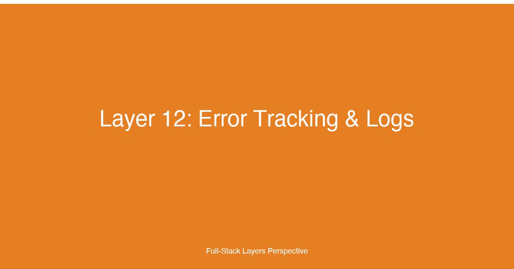

# Layer 12: Error Tracking & Logs


## TL;DR

Error tracking and structured logging form the observability backbone of every production full-stack application. This layer covers how to collect, structure, aggregate, and act on telemetry data across the entire stack — from browser-side JavaScript errors to backend request latencies to infrastructure-level metrics. For fullstack developers, mastering observability means treating logs not as debugging afterthoughts but as structured event streams that feed dashboards, alerts, and distributed traces, enabling teams to detect, diagnose, and resolve incidents before users are affected.

## Why This Layer Matters

Production applications fail. Networks partition, databases throttle, browsers throw cryptic JavaScript errors, and third-party APIs return 503s. Without an observability layer, every failure becomes a forensic investigation: SSH into a server, grep through flat files, reconstruct the timeline from fragmented clues. This approach breaks at modest scale — once you have more than a few services or more than a handful of users, ad-hoc debugging becomes impossible.

The 12-factor methodology recognized this early. Factor 11 (Logs) mandates treating logs as event streams — unbuffered, stdout-destined, and decoupled from storage. Modern observability extends this principle across the entire stack: frontend errors tracked via Sentry, backend logs emitted as structured JSON, traces propagated via OpenTelemetry, and metrics scraped by Prometheus. Each data source feeds a different diagnostic workflow, and together they form a coherent picture of system health.

For fullstack developers specifically, error tracking and logs are the layer where frontend and backend observability must converge. A user-reported bug often starts as a frontend error — a thrown exception in React, a failed API call, a rejected promise — but its root cause may live in a backend service, a database query, or an upstream dependency. Only when frontend and backend telemetry share correlation IDs and are queryable from a single pane of glass can you trace the full path from user symptom to root cause.

## Key Considerations for Fullstack Developers

### 1. Structured Logging as the Foundation

Plain-text logs are human-readable but machine-opaque. Structured logging — emitting logs as structured data (typically JSON) — makes logs parseable, searchable, and aggregatable by log management systems. Every log line becomes a queryable record with fields instead of a grep target.

The key decision is the log format schema. Teams should agree on a set of standard fields that every service emits: `timestamp`, `level`, `service`, `environment`, `trace_id`, `message`, and any domain-specific fields. JSON is the universal format because every log aggregator supports it, every language has a JSON serializer, and it handles nested data naturally.

### 2. Log Levels and Granularity

Not every log line is equally important. Define clear semantics for each log level:

- **DEBUG:** Detailed information for diagnosing problems during development. Never emit DEBUG in production at high volume.
- **INFO:** Confirmation that things are working as expected. Service startup, successful requests, scheduled job completion.
- **WARN:** Something unexpected happened but the application handled it gracefully. Deprecated API usage, retry attempts, degraded performance.
- **ERROR:** A failure that prevented a specific operation from completing but didn't crash the service. Database connection failures, third-party API errors, validation failures.
- **FATAL:** A catastrophic failure that caused the service to shut down or become unable to serve requests. Out of memory, corrupted state, unrecoverable database errors.

The common mistake is logging everything at INFO — this creates noise that buries real issues. Reserve ERROR and FATAL for events that require human attention.

### 3. Context Enrichment

A log line without context is nearly useless in production. Every log line should carry enough context to understand what was happening when the event occurred:

- **Request context:** Trace ID, user ID, request path, HTTP method, client IP
- **Service context:** Service name, version, hostname, deployment environment
- **Business context:** Order ID, payment amount, tenant ID, feature flag state
- **Performance context:** Duration, memory usage, database query count

Context enrichment happens automatically in most frameworks via middleware that attaches context to the logging scope. The key is ensuring this context propagates through asynchronous boundaries — promises, callbacks, message queues.

### 4. Error Tracking vs. Logging

Error tracking and logging serve different purposes and should not be conflated. Logging captures the general stream of application events. Error tracking captures specific failure events with rich context: stack traces, breadcrumbs, user sessions, and environment snapshots.

Use a dedicated error tracking service (Sentry, Datadog Error Tracking, Rollbar) for application errors. These services group identical errors by fingerprinting, track frequency trends, and attach diagnostic data that standard log aggregators don't capture. Use logging for everything else — request patterns, business events, system metrics.

### 5. Distributed Tracing

In a microservices architecture, a single user request may traverse five or more services. Without distributed tracing, debugging a slow request means manually correlating log timestamps across services — a tedious and error-prone process.

Distributed tracing solves this by propagating a trace ID across every service call. Each service records spans (units of work) tagged with the trace ID, and a tracing backend reassembles these spans into a waterfall view. OpenTelemetry has emerged as the industry standard for both instrumentation and data format, with multiple backend options including Jaeger, Zipkin, and commercial offerings like Datadog APM and Honeycomb.

### 6. Metrics, Dashboards, and SLOs

Logs tell you what happened; metrics tell you how the system is behaving over time. Key metrics for every full-stack application include:

- **Request metrics:** Latency (p50, p95, p99), error rate (by status code), throughput (requests per second)
- **Resource metrics:** CPU utilization, memory usage, disk I/O, garbage collection pauses
- **Business metrics:** Active users, order completion rate, payment success rate, signup conversion
- **Dependency metrics:** Third-party API latency and error rates, database query performance, cache hit ratio

Dashboards visualize these metrics in real time. Every team should have at minimum an "at-a-glance" dashboard showing the service-level indicators (SLIs) that map to their service-level objectives (SLOs). When an SLO is at risk, the dashboard should make that immediately visible.

### 7. Alerting and On-Call

Observability without alerting is a museum — interesting to look at, but it doesn't prevent incidents. Alerting requires defining what conditions warrant human attention and routing those alerts to the right people at the right time.

Three tiers of alerting:

- **Page (immediate):** Service is down, error rate exceeds 5%, payment pipeline is failing. These alerts call or page someone immediately, 24/7.
- **Ticket (same business day):** Error rate between 1% and 5%, latency p95 exceeding 2 seconds, disk usage above 80%. These create a ticket for triage during working hours.
- **Warning (asynchronous):** Error rate trending upward, latency increasing week-over-week, certificate expiring in 30 days. These show up on a dashboard or in a weekly digest.

On-call rotations should follow industry best practices: no individual should be on call more than one week at a time, escalation paths should escalate to the team lead after 15 minutes of no acknowledgment, and every incident should produce a postmortem with actionable follow-ups.

## Implementation Patterns & Technologies

### Structured JSON Logging

The foundational pattern for modern logging — every service emits structured JSON to stdout, and the execution environment (Docker, Kubernetes, serverless runtime) handles log collection:

```typescript
// lib/logger.ts — structured JSON logger for Node.js services
import pino from 'pino';

const level = process.env.LOG_LEVEL ?? 'info';

export const logger = pino({
  level,
  transport:
    process.env.NODE_ENV === 'development'
      ? { target: 'pino-pretty', options: { colorize: true } }
      : undefined,
  formatters: {
    level(label) {
      return { level: label };
    },
    bindings() {
      return {
        service: process.env.SERVICE_NAME ?? 'unknown',
        environment: process.env.NODE_ENV ?? 'development',
        version: process.env.APP_VERSION ?? '0.0.0',
      };
    },
  },
  serializers: {
    err: pino.stdSerializers.err,
    req: pino.stdSerializers.req,
    res: pino.stdSerializers.res,
  },
  redact: {
    paths: [
      'req.headers.authorization',
      'req.headers.cookie',
      'password',
      'secret',
      'creditCard',
    ],
    censor: '[REDACTED]',
  },
});

// Usage in a request handler
app.get('/api/orders/:id', async (req, res) => {
  const traceId = req.headers['x-trace-id'] ?? crypto.randomUUID();
  const childLogger = logger.child({
    traceId,
    userId: req.user?.id,
    orderId: req.params.id,
    path: req.path,
  });

  childLogger.info('Fetching order details');

  try {
    const order = await db.orders.findById(req.params.id);
    childLogger.info({ orderId: order.id, status: order.status }, 'Order retrieved');
    res.json(order);
  } catch (error) {
    childLogger.error({ err: error }, 'Failed to fetch order');
    res.status(500).json({ error: 'Internal server error' });
  }
});
```

### Error Tracking with Sentry (Frontend + Backend)

Error tracking captures exceptions with stack traces, breadcrumbs (user actions leading up to the error), device context, and user sessions. Sentry groups identical errors by fingerprint so you see unique bugs instead of individual occurrences:

```typescript
// sentry.ts — initialize Sentry for frontend and backend

// Frontend (browser)
import * as Sentry from '@sentry/react';
import { BrowserTracing } from '@sentry/tracing';

Sentry.init({
  dsn: process.env.NEXT_PUBLIC_SENTRY_DSN ?? '',
  environment: process.env.NODE_ENV ?? 'development',
  release: process.env.NEXT_PUBLIC_APP_VERSION ?? '0.0.0',
  integrations: [
    new BrowserTracing({
      tracingOrigins: ['localhost', 'api.example.com'],
    }),
  ],
  tracesSampleRate: 0.1,          // sample 10% of transactions in production
  replaysSessionSampleRate: 0.05, // session replays for 5% of sessions
  replaysOnErrorSampleRate: 1.0,  // session replay for every error
  beforeSend(event) {
    // Filter out known noise — browser extensions, network blips
    if (event.exception?.values?.[0]?.type === 'NS_ERROR_FAILURE') {
      return null;
    }
    return event;
  },
});

// Backend (Node.js)
import * as Sentry from '@sentry/node';
import { ProfilingIntegration } from '@sentry/profiling-node';

Sentry.init({
  dsn: process.env.SENTRY_DSN ?? '',
  environment: process.env.NODE_ENV ?? 'development',
  release: process.env.APP_VERSION ?? '0.0.0',
  integrations: [
    new ProfilingIntegration(),
  ],
  tracesSampleRate: 0.1,
  profilesSampleRate: 0.1,
});

// Express middleware for request context
app.use(
  Sentry.Handlers.requestHandler({
    ip: true,
    user: ['id', 'email'],
  })
);

app.use(
  Sentry.Handlers.errorHandler({
    shouldHandleError(error) {
      // Only capture 5xx errors in Sentry
      return error.status >= 500 || !error.status;
    },
  })
);
```

### Distributed Tracing with OpenTelemetry

OpenTelemetry is the vendor-neutral standard for collecting and exporting traces, metrics, and logs. Instrument your services once and export to any backend:

```typescript
// tracing.ts — OpenTelemetry setup with Jaeger / Zipkin export
import { NodeSDK } from '@opentelemetry/sdk-node';
import { OTLPTraceExporter } from '@opentelemetry/exporter-trace-otlp-http';
import { Resource } from '@opentelemetry/resources';
import { SemanticResourceAttributes } from '@opentelemetry/semantic-conventions';
import { ExpressInstrumentation } from '@opentelemetry/instrumentation-express';
import { HttpInstrumentation } from '@opentelemetry/instrumentation-http';
import { PgInstrumentation } from '@opentelemetry/instrumentation-pg';
import { RedisInstrumentation } from '@opentelemetry/instrumentation-redis';

const sdk = new NodeSDK({
  resource: new Resource({
    [SemanticResourceAttributes.SERVICE_NAME]: 'order-service',
    [SemanticResourceAttributes.SERVICE_VERSION]: '1.0.0',
    [SemanticResourceAttributes.DEPLOYMENT_ENVIRONMENT]: process.env.NODE_ENV,
  }),
  traceExporter: new OTLPTraceExporter({
    url: process.env.OTEL_EXPORTER_OTLP_ENDPOINT ?? 'http://localhost:4318/v1/traces',
  }),
  instrumentations: [
    new HttpInstrumentation(),
    new ExpressInstrumentation(),
    new PgInstrumentation(),
    new RedisInstrumentation(),
  ],
});

sdk.start();

// Graceful shutdown
process.on('SIGINT', () => sdk.shutdown());
process.on('SIGTERM', () => sdk.shutdown());

// In your application code, the trace context is automatic once instrumented.
// For manual spans:
import { trace, SpanStatusCode } from '@opentelemetry/api';

async function processPayment(orderId: string, amount: number) {
  const tracer = trace.getTracer('payment-service');
  const span = tracer.startSpan('processPayment', {
    attributes: {
      'order.id': orderId,
      'payment.amount': amount,
    },
  });

  try {
    const result = await paymentGateway.charge(amount);
    span.setStatus({ code: SpanStatusCode.OK });
    span.setAttribute('payment.status', result.status);
    return result;
  } catch (error) {
    span.setStatus({
      code: SpanStatusCode.ERROR,
      message: error instanceof Error ? error.message : 'Unknown error',
    });
    span.recordException(error instanceof Error ? error : new Error(String(error)));
    throw error;
  } finally {
    span.end();
  }
}
```

### Metrics Pipeline with Prometheus and Grafana

Open source metrics pipeline: instrument your application with Prometheus client libraries, scrape metrics from service endpoints, and visualize in Grafana dashboards:

```typescript
// metrics.ts — Prometheus metrics for a Node.js service
import promClient from 'prom-client';

// Create a Registry
const register = new promClient.Registry();
promClient.collectDefaultMetrics({ register });

// Custom metrics
export const httpRequestDurationMicroseconds = new promClient.Histogram({
  name: 'http_request_duration_ms',
  help: 'Duration of HTTP requests in milliseconds',
  labelNames: ['method', 'route', 'status_code'],
  buckets: [10, 50, 100, 200, 500, 1000, 3000],
  registers: [register],
});

export const httpRequestsTotal = new promClient.Counter({
  name: 'http_requests_total',
  help: 'Total number of HTTP requests',
  labelNames: ['method', 'route', 'status_code'],
  registers: [register],
});

export const paymentFailures = new promClient.Counter({
  name: 'payment_failures_total',
  help: 'Total number of failed payment attempts',
  labelNames: ['payment_provider', 'failure_reason'],
  registers: [register],
});

export const activeConnections = new promClient.Gauge({
  name: 'active_database_connections',
  help: 'Number of active database connections',
  registers: [register],
});

// Export metrics endpoint for Prometheus scraping
export function metricsMiddleware(req: any, res: any) {
  res.set('Content-Type', register.contentType);
  res.end(register.metrics());
}

// Usage in middleware
app.use((req, res, next) => {
  const start = Date.now();
  res.on('finish', () => {
    const duration = Date.now() - start;
    httpRequestDurationMicroseconds
      .labels(req.method, req.route?.path ?? req.path, String(res.statusCode))
      .observe(duration);
    httpRequestsTotal
      .labels(req.method, req.route?.path ?? req.path, String(res.statusCode))
      .inc();
  });
  next();
});

app.get('/metrics', metricsMiddleware);
```

### Alerting Configuration with PagerDuty

Define alerts that trigger on metric thresholds and route to on-call responders:

```yaml
# prometheus-alerts.yml — Prometheus alerting rules
groups:
  - name: payment-service
    rules:
      - alert: HighPaymentFailureRate
        expr: |
          rate(payment_failures_total[5m]) / rate(http_requests_total{route="/api/payments"}[5m]) > 0.01
        for: 2m
        labels:
          severity: critical
          team: payments
        annotations:
          summary: 'Payment failure rate above 1% for 2 minutes'
          description: >
            Payment failure rate is {{ $value | humanizePercentage }} for the last 5 minutes.
            Current value: {{ $value }}.
          runbook_url: 'https://runbook.example.com/payment-failures'

      - alert: HighLatency
        expr: |
          histogram_quantile(0.95, rate(http_request_duration_ms_bucket{route="/api/payments"}[5m])) > 1000
        for: 5m
        labels:
          severity: warning
          team: payments
        annotations:
          summary: 'High latency on /api/payments'
          description: 'p95 latency is {{ $value }}ms for payments endpoint.'

  - name: infrastructure
    rules:
      - alert: InstanceDown
        expr: up == 0
        for: 1m
        labels:
          severity: critical
        annotations:
          summary: 'Instance {{ $labels.instance }} is down'
          description: 'Instance has been unreachable for more than 1 minute.'
```

## Common Pitfalls

### 1. Logging at the Wrong Level

The most common observability mistake is DEBUG-level logging in production. Teams sprinkle `console.log` during development, leave it in the codebase, and suddenly find their log aggregator is ingesting terabytes of noise — burying the ERROR and WARN signals that actually matter. Every log statement in production code should have an intentional level, and DEBUG logs should be disabled by default in production.

### 2. No Correlation IDs Across Services

Without a shared correlation ID propagated across service boundaries, reconstructing a single user request's journey requires manual timestamp matching. The result: when a user reports "I tried to pay and it failed," you cannot trace which service failed, let alone why. Correlation IDs must be generated at the ingress point (API gateway, load balancer) and forwarded through every downstream call — HTTP headers, message queue metadata, gRPC metadata — to every service involved.

### 3. Muting Alarms Instead of Fixing Root Causes

When a team receives too many alerts, the natural response is to tune thresholds, increase durations, or silence specific alert rules. This pattern — alarm fatigue leading to alarm muting — is how critical incidents go undetected. The correct response to a noisy alert is not to silence it but to fix the underlying issue that makes it noisy: perhaps the alert is too broad, the threshold is too tight, or the metric is measuring the wrong thing. Every silenced alarm is a future incident waiting to happen.

### 4. No Sampling Strategy for Traces

In high-throughput systems, tracing every single request is prohibitively expensive. Without a sampling strategy, teams either trace nothing (losing all visibility) or trace everything (incurring massive compute and storage costs). The solution is head-based consistent sampling (sample entire trace decisions at the edge, not per-span) with tail-based sampling for errors (ensure every error trace is kept regardless of sampling rate).

### 5. Treating Observability as a Post-Deployment Concern

Adding structured logging, error tracking, and distributed tracing after a service is in production is exponentially harder than building it in from the start. Instrumentation requires changes throughout the codebase — every database call, every external HTTP request, every message queue operation needs tracing. Teams that skip observability during initial development inevitably face a painful retrofitting project when the first production incident hits.

### 6. Dashboard Sprawl Without a Clear Narrative

Teams often create dashboards for every metric, every team, and every service — resulting in hundreds of dashboards that nobody looks at. A dashboard without a clear question it answers is noise. Every dashboard should have a purpose: the "at-a-glance" dashboard (is the system healthy?), the "deep-dive" dashboard (why is latency spiking?), and the "business KPI" dashboard (are we meeting our commitments?). Anything else belongs in ad-hoc exploration, not a permanent dashboard.

### 7. Alerting Without Escalation Paths

An alert sent to an email alias that nobody reads is not an alert — it's a log line. Every critical alert must have a defined escalation path: primary on-call (acknowledges within 5 minutes), secondary on-call (escalated after 5 minutes of no acknowledgment), team lead (escalated after 10 minutes), and engineering manager (escalated after 15 minutes). Services like PagerDuty and Opsgenie automate these escalation policies.

## How This Layer Connects to the 12 Factors

Error tracking and observability intersect with nearly every factor in the full-stack methodology:

- **[Supplemental Factor 2: Observability](../articles/14-Supplemental-factor-2.md)** — The companion factor to this layer, covering the full observability strategy across logs, metrics, traces, and alerts.
- **[Factor 6: Auth](../articles/06-Factor-6.md)** — Authentication and authorization errors are among the most common logged events; error tracking must handle auth failures without logging secrets.
- **[Factor 7: Rendering](../articles/07-Factor-7.md)** — SSR and hydration errors in Next.js/Render frameworks must be captured on both server and client with correlated trace IDs.
- **[Factor 10: BFF](../articles/10-Factor-10.md)** — The Backend-for-Frontend pattern concentrates API logic in one service, making it the natural boundary for correlation ID generation and context propagation.
- **[Factor 11: API Patterns](../articles/11-Factor-11.md)** — API error responses should follow consistent formats (RFC 9457 Problem Details) and include trace IDs for debugging.
- **[Layer 5: Hosting & Deployment](../layers/05-Layer-5-Hosting-and-Deployment.md)** — Log aggregation and metrics scraping require hosting infrastructure configuration (sidecar containers, log shippers, service discovery for Prometheus targets).
- **[Layer 7: CI/CD & Version Control](../layers/07-Layer-7-CICD-and-Version-Control.md)** — Deployments should automatically update error tracking release versions and trigger deployment markers in observability platforms.
- **[Layer 8: Security & RLS](../layers/08-Layer-8-Security-and-RLS.md)** — Security events (auth failures, rate limit breaches, suspicious IP patterns) must be logged and alerted on, while ensuring no sensitive data leaks through logs.
- **[Layer 11: Load Balancing & Scaling](../layers/11-Layer-11-Load-Balancing-and-Scaling.md)** — Load balancer metrics (connection counts, latency distributions, health check failures) feed into the same observability pipeline as application logs.

## Case Study: Reducing Incident Response Time from 45 Minutes to 8 Minutes

Tikal worked with a payments processing company whose platform handled millions of dollars in daily transaction volume. Their application had grown from a monolith to twelve microservices over two years, but their observability practices had not kept pace.

### The Challenge

The company's observability was fragmented and reactive:

- **Logs were scattered.** Each of the twelve microservices wrote logs to local files with different formats — some plain text, some ad-hoc JSON, some syslog to different destinations. There was no centralized log aggregation.
- **No correlation IDs.** A single payment flow touched five to seven services, but no trace ID connected these requests. When a payment failed, developers manually grepped logs across services, matching timestamps by eye.
- **Errors were invisible.** Exceptions were logged to stdout but never captured in a structured error tracking system. The team discovered failed payments only when a customer complained — an average of 45 minutes after the failure occurred.
- **No alerting.** There were no automated alerts for payment failures, latency spikes, or error rate increases. The operations team relied on ad-hoc monitoring and customer reports.
- **Incident response was manual.** When a customer reported a failed payment, the on-call engineer spent 30-45 minutes gathering context: SSH into multiple servers, grep log files, correlate timestamps, identify the failing service, and trace the root cause. Mean time to detection (MTTD) averaged 30 minutes; mean time to resolution (MTTR) averaged 45 minutes.

### Our Approach

Tikal implemented a comprehensive observability transformation across three phases:

**Phase 1: Structured Logging and Correlation IDs (Weeks 1-3)**

We standardized all twelve microservices on structured JSON logging with a shared schema. Every log line included `service_name`, `environment`, `version`, `trace_id`, `span_id`, `level`, and `timestamp`. We instrumented the API gateway to generate a correlation ID for every incoming request and propagated it via HTTP headers (`x-trace-id`) to every downstream service. The logging middleware in each service extracted this header and attached it to every log line emitted during that request's lifecycle.

```typescript
// Shared logging middleware propagated across all 12 services
function loggingMiddleware(req: Request, res: Response, next: NextFunction) {
  const traceId = req.headers['x-trace-id'] as string ?? crypto.randomUUID();
  const spanId = crypto.randomUUID().slice(0, 16);

  req.logger = logger.child({
    trace_id: traceId,
    span_id: spanId,
    service: config.serviceName,
    environment: config.environment,
    version: config.appVersion,
    request: {
      method: req.method,
      path: req.path,
      query: req.query,
    },
  });

  const start = Date.now();
  res.on('finish', () => {
    req.logger.info({
      duration_ms: Date.now() - start,
      status_code: res.statusCode,
    }, 'Request completed');
  });

  next();
}
```

**Phase 2: Error Tracking and Log Aggregation (Weeks 4-6)**

We deployed Datadog as the centralized log aggregation and observability platform. All twelve microservices shipped their structured logs to Datadog via the Datadog Agent running as a sidecar in each Kubernetes pod. We configured Datadog Logs to parse the JSON schema and index it for search.

We integrated Sentry for error tracking on both frontend (React SPA) and backend (Node.js services). Sentry captured every unhandled exception with full stack traces, breadcrumbs of user actions, and the trace ID linking the error to the distributed trace. Sentry's fingerprinting automatically grouped identical errors, converting a firehose of individual exception events into a manageable list of unique bugs. We configured Sentry's release tracking so every deployment correlated errors with the code changes that introduced them.

```typescript
// Sentry setup for payments service
import * as Sentry from '@sentry/node';

Sentry.init({
  dsn: process.env.SENTRY_DSN,
  environment: process.env.NODE_ENV,
  release: process.env.APP_VERSION,
  integrations: [
    new Sentry.Integrations.Http({ tracing: true }),
    new Sentry.Integrations.Express(),
  ],
  tracesSampleRate: 0.05,
  beforeSend(event) {
    if (event.tags?.trace_id) {
      // Link to Datadog trace for unified debugging
      event.contexts = {
        ...event.contexts,
        datadog: {
          trace_id: event.tags.trace_id,
        },
      };
    }
    return event;
  },
});

// Route handler with Sentry transaction
app.post('/api/payments/charge', async (req, res) => {
  const transaction = Sentry.startTransaction({
    op: 'payment.charge',
    name: 'Charge payment',
    tags: {
      payment_provider: req.body.provider,
      amount: req.body.amount,
    },
  });

  try {
    const result = await paymentService.charge(req.body);
    transaction.setStatus('ok');
    res.json(result);
  } catch (error) {
    transaction.setStatus('internal_error');
    Sentry.captureException(error, {
      tags: { payment_provider: req.body.provider },
      extra: { amount: req.body.amount, currency: req.body.currency },
    });
    res.status(502).json({ error: 'Payment processing failed' });
  } finally {
    transaction.finish();
  }
});
```

**Phase 3: Metrics, Dashboards, and Alerting (Weeks 7-8)**

We instrumented every service with Prometheus metrics: request latency histograms, error rate counters, active connection gauges, and business-specific metrics (payment failure rate, settlement latency, refund rate). Datadog's built-in Prometheus scraping collected these metrics.

We built a payment KPI dashboard in Datadog showing: payment volume (requests/second), success rate (%), payment failure rate (%), average latency (ms), p95 latency (ms), top failure reasons, and service health status. The dashboard was displayed on a wall-mounted monitor in the engineering team's workspace.

We configured PagerDuty alerts for three critical conditions:

- **Payment failure rate exceeds 1% for 2 minutes** — pages the payments team on-call engineer
- **Payment endpoint p95 latency exceeds 3 seconds for 5 minutes** — creates a high-priority ticket
- **Any service reports 5xx errors > 5% for 3 minutes** — pages the service team on-call

```yaml
# Datadog monitor definition for payment failures (configured via API)
{
  "name": "Payment Failure Rate > 1%",
  "type": "metric alert",
  "query": "sum(last_5m):(sum:trace.express.request.errors{service:payment-service,env:production}.as_count() / sum:trace.express.request.hits{service:payment-service,env:production}.as_count()) * 100 > 1",
  "message": "Payment failure rate is {{value}}% — above the 1% threshold.\n\n@oncall-payments-team\n\nRunbook: https://runbook.example.com/payment-failures",
  "tags": ["team:payments", "severity:critical", "service:payment-service"],
  "options": {
    "thresholds": { "critical": 1 },
    "notify_audit": false,
    "timeout_h": 1,
    "escalation_message": "Payment failure rate still above threshold — escalation to engineering manager.",
    "evaluation_delay": 60,
  }
}
```

### Results

After eight weeks, the observability transformation produced measurable improvements:

| Metric | Before | After |
|---|---|---|
| Mean Time to Detection (MTTD) | 30 minutes | < 2 minutes |
| Mean Time to Resolution (MTTR) | 45 minutes | 8 minutes |
| Incident response time | 45 minutes | 8 minutes |
| Time spent debugging per incident | 30-45 minutes | 5-10 minutes |
| Payment failures discovered via customer complaint | 80% | < 5% |
| Alert noise (false positives per week) | N/A (no alerts) | 2-3 per week |
| Developer time spent on observability tooling | 0 hours/week | 4 hours/week (maintenance) |

The most impactful change was the shift from reactive to proactive incident management. Before the transformation, the team learned about payment failures when customers called support. After the transformation, the on-call engineer received a PagerDuty alert within two minutes of a payment failure rate spike, had immediate access to correlated logs, trace waterfall, and error details in a single Datadog dashboard, and could identify root cause — a degraded upstream payment provider, a database connection pool exhaustion, or a deployment bug — in minutes instead of hours.

The structured JSON logging with correlation IDs eliminated the most time-consuming step in incident response: the "grep across services" phase. With a single trace ID search, the engineer could see every log line from every service involved in the failed payment flow, ordered by timestamp, with full context. Sentry's error fingerprinting ensured that repeated errors from the same root cause were grouped together, making it immediately clear whether an incident was a new bug or a recurrence.

The team's post-incident reviews shifted focus: instead of spending time reconstructing what happened, they spent time on root cause analysis and preventative measures. The combination of metrics dashboards and alerting created a continuous feedback loop — each incident improved the monitoring, each monitoring improvement reduced the next incident's impact.

## Conclusion

Error tracking and structured logging are not operational overhead — they are the foundation of production-grade software engineering. The shift from ad-hoc debugging to systematic observability transforms how teams understand, operate, and improve their applications.

For fullstack developers, the key insights are:

- **Logs are structured data, not text files.** JSON logging with a shared schema ensures every log line is machine-parseable, searchable, and automatically enriched with context.
- **Correlation IDs are non-negotiable.** Without a trace ID that spans every service in a request's path, distributed debugging is manual and slow.
- **Error tracking and logging are complementary.** Use Sentry or equivalent for exceptions (stack traces, grouping, breadcrumbs); use log aggregators for everything else (request patterns, business events, system metrics).
- **Metrics drive dashboards; dashboards drive alerts.** Define your SLOs, instrument the SLIs that measure them, build dashboards that make at-a-glance health obvious, and alert only on conditions that require human intervention.
- **Observability must be built in, not bolted on.** Instrumentation in the initial development phase costs a fraction of retrofitting it after a production incident.

Start with structured JSON logging and a correlation ID. Add error tracking (Sentry or Datadog Error Tracking). Layer on distributed tracing (OpenTelemetry). Instrument key metrics. Build a single dashboard that answers "is the system healthy?" Configure alerting with escalation paths. Each step builds on the previous one, and each step reduces the time between a failure occurring and a human understanding why.

The best observability setup is invisible during normal operation and invaluable during an incident. When your pager goes off at 3 AM and you can open a dashboard, see a trace waterfall, read correlated logs, and identify the root cause in five minutes instead of forty-five — that is the return on investment for Layer 12.

---

_This article is part of Tikal's Modern Full-Stack Developer's Guide: A 12-Factor Approach series. For the observability strategy perspective, see [Supplemental Factor 2: Observability & Error Management](../articles/14-Supplemental-factor-2.md)._
