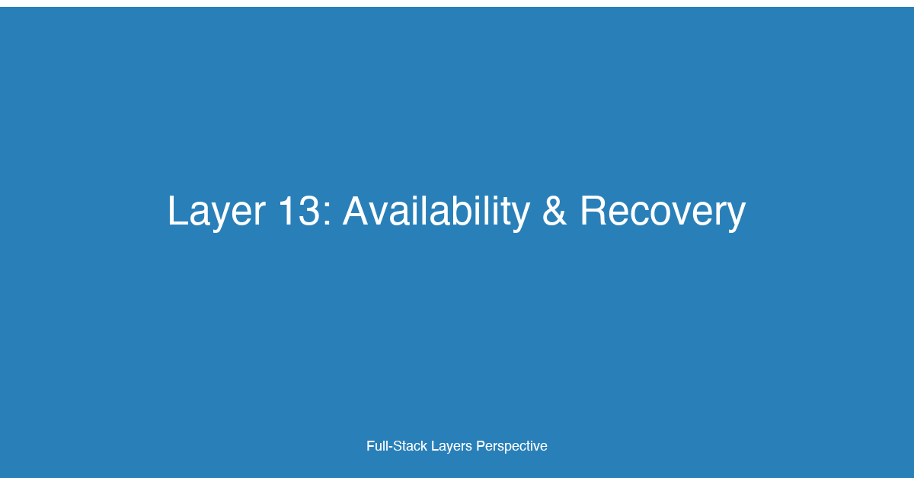

# Layer 13: Availability & Recovery


## TL;DR

Availability and recovery are the safety net of every production system. This layer covers how to design applications and infrastructure that survive failures — from single-instance crashes to full-region outages — and recover with minimal data loss and downtime. For fullstack developers, building for availability means thinking beyond happy-path code: implementing redundancy at every tier, defining clear recovery objectives (RPO/RTO), applying proven resilience patterns (circuit breakers, bulkheads, retries with backoff), and verifying recovery through chaos engineering. The goal is not to prevent all failures — that is impossible — but to ensure the system degrades gracefully and recovers automatically when failures occur.

## Why This Layer Matters

Production systems fail constantly. Hard drives die, network switches drop packets, cloud providers experience region-wide outages, and software bugs corrupt data. The difference between a well-engineered system and a fragile one is not whether it fails but how it behaves when failure happens.

The 12-factor methodology established a foundation for resilient applications: stateless processes that can be restarted without side effects, backing services treated as attached resources, and strict separation of build/release/run. But statelessness alone does not guarantee availability. You need redundancy at every layer (compute, database, networking), automated failover when a component dies, and tested recovery procedures for when things go catastrophically wrong.

For fullstack developers, availability is a cross-cutting concern that touches every layer of the application stack. The frontend must handle API timeouts gracefully — showing meaningful error states instead of infinite spinners. The backend must implement circuit breakers that stop cascading failures when a downstream dependency degrades. The database layer must be configured for high availability with automated failover and regular backups with verified restore procedures. The deployment infrastructure must span multiple availability zones and, for critical systems, multiple regions.

The business case for availability is equally compelling. Every minute of downtime translates to lost revenue, eroded trust, and — in regulated industries — compliance failures. Healthcare applications must maintain uptime for FDA compliance. Payment processors must meet card network availability requirements. SaaS platforms define uptime in their SLAs and face contractual penalties for breaches. Layer 13 is where you design, implement, and verify the systems that keep your application running through every class of failure.

## Key Considerations for Fullstack Developers

### 1. Redundancy at Every Tier

Single-instance architectures are the enemy of availability. Every component that can fail must have a redundant counterpart:

- **Compute redundancy:** Run at least two instances of every service, distributed across different availability zones. Use load balancers to distribute traffic and health checks to detect and drain unhealthy instances.
- **Database redundancy:** Deploy primary/replica configurations with automated failover. Read replicas serve read traffic and provide a warm standby for failover. Multi-AZ deployments in AWS RDS, Azure SQL, or Cloud SQL provide this with a single configuration flag.
- **Network redundancy:** Use multiple network paths, redundant load balancers, and DNS failover (Route53 health checks, Cloudflare load balancing) so no single network component is a point of failure.

The principle is simple: any single component can fail without causing a service outage. Achieving this requires redundancy at every layer, verified through regular failure testing.

### 2. Multi-AZ vs. Multi-Region

Availability zones and regions are the two units of failure isolation in cloud architectures:

- **Multi-AZ (Availability Zone):** Protects against datacenter-level failures (power outage, cooling failure, network partition within a cloud region). Multi-AZ deployments typically have single-digit millisecond latency between zones and support synchronous replication for databases. Most production applications should start here.
- **Multi-Region:** Protects against region-level failures (earthquake, cloud provider regional outage, regulatory change). Multi-Region deployments require asynchronous replication (due to latency), global load balancing (Route53 latency-based routing, Cloudflare global load balancer), and significantly more operational complexity. Typically reserved for mission-critical systems with the strictest availability requirements.

The decision between Multi-AZ and Multi-Region depends on your availability target. For 99.9% uptime (approximately 8 hours of downtime per year), Multi-AZ is usually sufficient. For 99.99% uptime (approximately 52 minutes of downtime per year), Multi-Region becomes necessary for many applications.

### 3. RPO and RTO

Recovery Point Objective (RPO) and Recovery Time Objective (RTO) are the two metrics that define your recovery requirements:

- **RPO:** How much data loss is acceptable? Measured in time. An RPO of 5 minutes means you can lose at most 5 minutes of data. Determines backup frequency and replication lag tolerance.
- **RTO:** How long can the system be down? Measured in time. An RTO of 15 minutes means the system must be fully operational within 15 minutes of a failure. Determines failover procedures and infrastructure provisioning strategy.

These objectives are business decisions, not technical ones. A social media app might tolerate an RPO of 1 hour and an RTO of 30 minutes. A healthcare payment system might require an RPO of 5 minutes and an RTO of 15 minutes. The business decides the numbers; engineering builds the systems that meet them — and verifies through regular drills that they actually do.

### 4. Resilience Patterns

Resilience patterns protect against cascading failures — where a failure in one component triggers failures in others, gradually bringing down the entire system:

- **Circuit Breaker:** Monitors calls to a downstream dependency. When failures exceed a threshold, the circuit "opens" and subsequent calls fail immediately (or return a fallback) without attempting the call. After a timeout, the circuit transitions to "half-open" to test whether the dependency has recovered. Prevents a slow/degraded dependency from exhausting connection pools and thread pools.
- **Bulkhead:** Isolates resources so a failure in one part of the system cannot consume resources needed by another part. Named after ship hull compartments — if one compartment floods, the ship stays afloat. In practice: separate thread pools or connection pools for different dependencies, separate queues for different request types, separate compute capacity for different tenants.
- **Retries with Backoff:** When a call fails with a transient error (network timeout, throttling response, temporary service unavailability), retry after a delay. Exponential backoff (delay doubles with each retry) prevents the retry storm that would occur with fixed-interval retries. Jitter (randomizing the delay) prevents the thundering herd problem where all retries arrive simultaneously.
- **Timeouts:** Every external call must have a timeout. Without a timeout, a single slow dependency can hold connections open indefinitely, eventually exhausting the connection pool and making the entire service unavailable. Timeouts should be aggressive (shorter than the client's timeout on you) and should include both connection timeout and request timeout.

### 5. Backup Strategies and Restore Testing

Backups are the last line of defense against data loss. Every backup strategy must answer three questions:

- **What is being backed up?** Databases (full + transaction logs), file storage (S3, blob storage), configuration (infrastructure-as-code), secrets (vault with export).
- **How often?** Determined by RPO. An RPO of 5 minutes requires continuous or near-continuous backup (transaction log shipping, point-in-time recovery). An RPO of 24 hours can use daily full backups.
- **Is the restore tested?** This is the question most teams fail. A backup that has never been restored is not a backup — it is a delusion. Regularly scheduled restore drills (at least quarterly) must verify that backups are complete, consistent, and restorable within the target RTO.

The 3-2-1 rule remains the gold standard: three copies of the data, on two different media types, with one copy off-site (or in a different region for cloud deployments).

## Implementation Patterns & Technologies

### Circuit Breaker with Resilience4j (Java / Spring Boot)

Circuit breakers are critical for preventing cascading failures when downstream dependencies degrade. The circuit breaker monitors failure rates and opens the circuit when the threshold is exceeded, giving the dependency time to recover:

```java
// PaymentService.java — Circuit breaker for payment gateway calls
import io.github.resilience4j.circuitbreaker.annotation.CircuitBreaker;
import io.github.resilience4j.retry.annotation.Retry;
import io.github.resilience4j.bulkhead.annotation.Bulkhead;
import org.springframework.stereotype.Service;
import java.time.Duration;

@Service
public class PaymentService {

    private final PaymentGatewayClient paymentGateway;
    private final PaymentRepository paymentRepository;

    public PaymentService(PaymentGatewayClient paymentGateway, 
                          PaymentRepository paymentRepository) {
        this.paymentGateway = paymentGateway;
        this.paymentRepository = paymentRepository;
    }

    @CircuitBreaker(
        name = "paymentGateway",
        fallbackMethod = "chargeFallback"
    )
    @Retry(
        name = "paymentGateway",
        maxAttempts = 3,
        backoff = @Backoff(delay = 100, multiplier = 2.0, maxDelay = 1000)
    )
    @Bulkhead(
        name = "paymentGateway",
        type = Bulkhead.Type.THREADPOOL,
        maxWaitDuration = 500
    )
    public PaymentResult charge(PaymentRequest request) {
        PaymentResult result = paymentGateway.charge(request);
        paymentRepository.save(PaymentEvent.success(request, result));
        return result;
    }

    /**
     * Fallback method invoked when the circuit breaker is open
     * or all retry attempts have been exhausted.
     * Returns a cached or degraded response instead of failing hard.
     */
    public PaymentResult chargeFallback(PaymentRequest request, Exception ex) {
        // Log the failure for alerting
        logger.error("Payment charge failed after retries/circuit open: {}",
                     ex.getMessage());

        // Return a degraded response — try again later
        paymentRepository.save(PaymentEvent.failed(request, ex.getMessage()));
        return PaymentResult.degraded(request.getOrderId(), 
                                      "Payment service temporarily unavailable. " +
                                      "Please retry in a few minutes.");
    }
}
```

```yaml
# application.yml — Resilience4j circuit breaker configuration
resilience4j:
  circuitbreaker:
    configs:
      default:
        slidingWindowSize: 10
        minimumNumberOfCalls: 5
        failureRateThreshold: 50
        waitDurationInOpenState: 30s
        permittedNumberOfCallsInHalfOpenState: 3
        recordExceptions:
          - java.net.ConnectException
          - java.net.SocketTimeoutException
          - org.springframework.web.client.HttpServerErrorException
    instances:
      paymentGateway:
        baseConfig: default
  retry:
    configs:
      default:
        maxAttempts: 3
        waitDuration: 100ms
        exponentialBackoffMultiplier: 2.0
        retryExceptions:
          - java.net.SocketTimeoutException
          - org.springframework.web.client.HttpServerErrorException
    instances:
      paymentGateway:
        baseConfig: default
  bulkhead:
    configs:
      default:
        maxConcurrentCalls: 20
        maxWaitDuration: 500ms
    instances:
      paymentGateway:
        baseConfig: default
```

### Retries with Exponential Backoff and Jitter (TypeScript / Node.js)

Retries are essential for transient failures but dangerous without proper backoff and jitter. Fixed-interval retries create thundering herds that can DDoS your own dependencies. Exponential backoff with jitter distributes retry traffic evenly:

```typescript
// retry.ts — generic retry with exponential backoff and jitter
import { randomInt } from 'node:crypto';

interface RetryOptions {
  maxAttempts: number;
  baseDelayMs: number;
  maxDelayMs: number;
  jitterFactor?: number; // 0-1, controls randomness
}

const defaultOptions: RetryOptions = {
  maxAttempts: 4,
  baseDelayMs: 100,
  maxDelayMs: 10_000,
  jitterFactor: 0.2,
};

type ShouldRetryFn = (error: unknown, attempt: number) => boolean;

export async function withRetry<T>(
  fn: () => Promise<T>,
  options?: Partial<RetryOptions>,
  shouldRetry?: ShouldRetryFn,
): Promise<T> {
  const opts = { ...defaultOptions, ...options };
  const shouldRetryFn: ShouldRetryFn = shouldRetry ?? isTransientError;

  let lastError: unknown;
  for (let attempt = 1; attempt <= opts.maxAttempts; attempt++) {
    try {
      return await fn();
    } catch (error) {
      lastError = error;

      if (attempt === opts.maxAttempts || !shouldRetryFn(error, attempt)) {
        throw error;
      }

      const delay = calculateBackoff(attempt, opts);
      await sleep(delay);
    }
  }

  throw lastError; // unreachable, but satisfies TypeScript
}

/**
 * Exponential backoff with full jitter.
 * delay = random(0, min(maxDelay, baseDelay * 2^attempt))
 * This evenly distributes retry traffic vs. the spike pattern of fixed retries.
 */
function calculateBackoff(attempt: number, opts: RetryOptions): number {
  const exponentialDelay = opts.baseDelayMs * Math.pow(2, attempt - 1);
  const cappedDelay = Math.min(exponentialDelay, opts.maxDelayMs);
  // Full jitter: random between 0 and cappedDelay
  return randomInt(0, Math.floor(cappedDelay * (1 + (opts.jitterFactor ?? 0.2))) + 1);
}

function sleep(ms: number): Promise<void> {
  return new Promise((resolve) => setTimeout(resolve, ms));
}

/**
 * Determine if an error is transient and worth retrying.
 * Network errors, 429 (rate limit), 503 (service unavailable) are retryable.
 * 4xx client errors (4xx except 429) are not retryable.
 */
function isTransientError(error: unknown, attempt: number): boolean {
  if (error instanceof TypeError && error.message.includes('fetch')) {
    return true; // network error
  }

  if (error && typeof error === 'object' && 'status' in error) {
    const status = (error as { status: number }).status;
    return status === 429 || status === 503 || status >= 500;
  }

  return false; // assume non-transient by default
}

// Usage — calling a payment API with automatic retry
async function chargeCustomer(order: Order): Promise<PaymentResult> {
  const result = await withRetry(
    () => paymentApi.charge({
      customerId: order.customerId,
      amount: order.total,
      currency: order.currency,
      idempotencyKey: order.id,
    }),
    { maxAttempts: 3, baseDelayMs: 200, maxDelayMs: 5_000 },
    (error, attempt) => {
      if (error instanceof PaymentDeclinedError) return false; // don't retry declined payments
      return attempt < 3; // retry up to 3 times for transient errors
    },
  );

  return result;
}
```

### Chaos Engineering Script for Multi-AZ Validation

Chaos engineering validates that your availability architecture actually works by introducing controlled failures. This script simulates EC2 instance termination in one AZ to verify that traffic shifts to the remaining AZ(s) without impact:

```bash
#!/bin/bash
# chaos-az-failover.sh — terminate an EC2 instance in one AZ
# to validate Multi-AZ failover behavior
#
# Usage: ./chaos-az-failover.sh <target-az> <tag-name>
# Example: ./chaos-az-failover.sh us-east-1a production

set -euo pipefail

TARGET_AZ="${1:?Missing target AZ}"
TAG_NAME="${2:?Missing tag name}"
REGION="us-east-1"

echo "=== Chaos Drill: AZ Failover ==="
echo "Target AZ: $TARGET_AZ"
echo "Tag: $TAG_NAME"
echo "Time: $(date -u '+%Y-%m-%dT%H:%M:%SZ')"
echo ""

# 1. Find instances in the target AZ
INSTANCES=$(aws ec2 describe-instances \
  --region "$REGION" \
  --filters "Name=availability-zone,Values=$TARGET_AZ" \
            "Name=tag:Name,Values=$TAG_NAME" \
            "Name=instance-state-name,Values=running" \
  --query 'Reservations[].Instances[].InstanceId' \
  --output text)

if [ -z "$INSTANCES" ]; then
  echo "No running instances found in $TARGET_AZ with tag $TAG_NAME"
  exit 1
fi

echo "Instances in $TARGET_AZ: $INSTANCES"

# 2. Pre-termination health check
echo ""
echo "Pre-termination health check..."
for endpoint in "${HEALTH_CHECK_ENDPOINTS[@]}"; do
  STATUS=$(curl -s -o /dev/null -w "%{http_code}" "$endpoint" || echo "000")
  echo "  $endpoint → HTTP $STATUS"
done

# 3. Terminate the instances
echo ""
echo "Terminating instances in $TARGET_AZ..."
for INSTANCE_ID in $INSTANCES; do
  echo "  Terminating $INSTANCE_ID..."
  aws ec2 terminate-instances --region "$REGION" --instance-ids "$INSTANCE_ID" > /dev/null
done

# 4. Auto Scaling should launch replacement instances in other AZs
echo ""
echo "Waiting for Auto Scaling to launch replacement instances..."
sleep 60

NEW_INSTANCES=$(aws ec2 describe-instances \
  --region "$REGION" \
  --filters "Name=tag:Name,Values=$TAG_NAME" \
            "Name=instance-state-name,Values=running" \
  --query 'Reservations[].Instances[].[InstanceId,Placement.AvailabilityZone]' \
  --output text)

echo "Running instances after termination:"
echo "$NEW_INSTANCES"

# 5. Post-termination health check
echo ""
echo "Post-termination health check..."
for endpoint in "${HEALTH_CHECK_ENDPOINTS[@]}"; do
  STATUS=$(curl -s -o /dev/null -w "%{http_code}" "$endpoint" || echo "000")
  echo "  $endpoint → HTTP $STATUS"
done

# 6. Check if any instances remain in the terminated AZ
REMAINING=$(echo "$NEW_INSTANCES" | grep "$TARGET_AZ" || true)
if [ -n "$REMAINING" ]; then
  echo ""
  echo "WARNING: Instances still running in terminated AZ $TARGET_AZ"
  echo "$REMAINING"
else
  echo ""
  echo "SUCCESS: No instances remain in $TARGET_AZ. Traffic shifted to other AZs."
fi
```

## Understanding SLA, SLO, and SLI

Service Level Agreements (SLAs), Service Level Objectives (SLOs), and Service Level Indicators (SLIs) form the measurement framework for availability:

- **SLI (Service Level Indicator):** A quantifiable metric that measures a specific aspect of service performance. Common SLIs: request latency (p95), error rate (percentage of requests returning 5xx), availability (percentage of time the service is reachable), throughput (requests per second).
- **SLO (Service Level Objective):** A target value for an SLI that represents acceptable performance. Example: "p95 latency below 500ms for 99.9% of requests over a 30-day rolling window." SLOs define what "good enough" looks like.
- **SLA (Service Level Agreement):** A contractual commitment to a customer specifying the SLO and the consequences of failing to meet it. Example: "99.9% uptime guarantee; if availability falls below 99.9%, customer receives a 10% service credit."

The critical principle is that SLOs must be stricter than SLAs. If your SLA promises 99.9% uptime, your internal SLO should target 99.95% — giving you a margin (the "error budget") before contractual consequences trigger. This error budget approach it teams to balance reliability against velocity: as long as you are within the error budget, you can deploy freely; when the error budget is depleted, you stop deploying and focus on reliability improvements.

## How This Layer Connects to the 12 Factors

Availability and recovery intersect with multiple factors and layers in the full-stack methodology:

- **[Factor 7: Rendering](../articles/07-Factor-7.md)** — SSR rendering failures must not cascade to the entire application. Circuit breakers around rendering services prevent a slow template render from exhausting server resources. Frontend availability depends on backend rendering being resilient.
- **[Factor 10: BFF](../articles/10-Factor-10.md)** — The Backend-for-Frontend pattern is a critical availability boundary. If the BFF service is down, every frontend feature is unavailable. Multi-AZ deployment of BFF services, circuit breakers for upstream calls, and graceful degradation when BFF responses are delayed are essential.
- **[Layer 3: Database & Storage](../layers/03-Layer-3-Database-and-Storage.md)** — Database availability is the foundation of application availability. Multi-AZ replication, automated failover, regular backups with point-in-time recovery, and read replicas for traffic offload directly determine RPO and RTO.
- **[Layer 5: Hosting & Deployment](../layers/05-Layer-5-Hosting-and-Deployment.md)** — Hosting infrastructure defines the availability primitives: load balancers with health checks, Auto Scaling groups that replace failed instances, and multi-AZ subnet configurations.
- **[Layer 6: Cloud & Compute](../layers/06-Layer-6-Cloud-and-Compute.md)** — Cloud provider selection directly impacts availability architecture. Each provider offers different Multi-AZ, Multi-Region, and managed service availability guarantees.
- **[Layer 11: Load Balancing & Scaling](../layers/11-Layer-11-Load-Balancing-and-Scaling.md)** — Load balancers are the front line of availability. Health check configuration, connection draining, and cross-zone load balancing determine how gracefully the system handles instance failures.
- **[Layer 12: Error Tracking & Logs](../layers/12-Layer-12-Error-Tracking-and-Logs.md)** — Observability of availability incidents is essential. Alerts on health check failures, error rate spikes, and circuit breaker state changes provide the detection half of the detection-and-response cycle.
- **[Supplemental Factor 2: Observability](../articles/14-Supplemental-factor-2.md)** — Observability feeds the continuous improvement loop for availability. SLI measurements, SLO tracking, and error budget dashboards are observability products.

## Case Study: Healthcare SaaS — Achieving 99.99% Uptime for FDA Compliance

Tikal partnered with a healthcare SaaS company whose platform managed patient scheduling, HIPAA-compliant messaging, and electronic health record (EHR) integrations for a network of 200+ hospitals and clinics. Their FDA compliance requirements mandated strict uptime guarantees: the system had to maintain 99.99% availability, and any service disruption affecting patient care was reportable as a compliance incident.

### The Challenge

The company's infrastructure was not designed for the reliability their compliance requirements demanded:

- **Single-AZ deployment on AWS.** All application servers, databases, and supporting services ran in a single availability zone (us-east-1a). A single-rack power failure would bring the entire platform down.
- **No backup strategy.** The PostgreSQL database had no automated backup configured. The sole protection was a weekly manual `pg_dump` that had never been restored. Estimated data loss in a disaster: 7 days of patient data, including appointments, messages, and clinical notes.
- **8-hour RTO.** The acknowledged recovery time objective was 8 hours — meaning the platform could be down for an entire business day before the team expected to have it restored. For a healthcare platform handling 50,000+ patient interactions daily, this was unacceptable.
- **No disaster recovery plan.** There was no documented DR plan, no cross-region replication, and no runbook for any failure scenario. Recovery relied on tribal knowledge — a single senior engineer who "knew how to rebuild everything."
- **No failure testing.** The team had never simulated a failure. They did not know whether their application would survive an instance termination, a database failover, or a network partition.

The regulatory stakes were high. The FDA's 21 CFR Part 11 regulations require electronic record systems to have "accurate and reliable" operation with "appropriate controls" to ensure data integrity. A significant outage with data loss could trigger an FDA audit, corrective action plan, or — in worst case — enforcement action.

### Our Approach

Tikal designed and implemented a comprehensive availability and recovery transformation across four work streams, prioritized by risk severity:

**Work Stream 1: Multi-AZ Deployment with RDS Standby (Weeks 1-3)**

The highest-priority risk was the single-AZ deployment. We redesigned the infrastructure to span three availability zones:

- **Compute:** Application servers deployed across us-east-1a, us-east-1b, and us-east-1c via Auto Scaling groups with a minimum of 2 instances per AZ. An Application Load Balancer with cross-zone load balancing distributed traffic and health-checked every instance every 10 seconds.
- **Database:** Migrated from standalone PostgreSQL to Amazon RDS PostgreSQL with Multi-AZ deployment. RDS Multi-AZ provisions a synchronous standby replica in a different AZ. If the primary fails, RDS automatically fails over to the standby with a typical downtime of 60-120 seconds. The application uses the RDS endpoint DNS name, which RDS automatically updates on failover.
- **Caching:** Elasticache Redis cluster deployed across Multi-AZ with automatic failover. The Redis cluster provides session state, rate limit counters, and cached EHR data.

We updated the application's database connection configuration to handle failover gracefully. The key change: the connection pool timeout was set lower than RDS's failover window, and the application implemented retry logic for the initial connection failure during failover:

```java
// DatabaseConfig.java — RDS failover-aware database configuration
@Configuration
public class DatabaseConfig {

    @Bean
    public DataSource dataSource() {
        HikariConfig config = new HikariConfig();
        config.setJdbcUrl(System.getenv("DATABASE_URL"));
        config.setUsername(System.getenv("DATABASE_USER"));
        config.setPassword(System.getenv("DATABASE_PASSWORD"));

        // Critical for failover: short connection timeout so the application
        // doesn't hang during RDS Multi-AZ failover (typical 60-120s)
        config.setConnectionTimeout(10_000);      // 10 seconds
        config.setValidationTimeout(5_000);       // 5 seconds
        config.setMaximumPoolSize(20);
        config.setMinimumIdle(5);
        config.setMaxLifetime(600_000);            // 10 minutes

        // Test connection before using it, to detect stale connections
        // after a failover event
        config.setConnectionTestQuery("SELECT 1");
        config.setConnectionInitSql("SELECT 1");

        // Register MySQL JDBC driver (RDS Aurora-compatible)
        config.setDriverClassName("org.postgresql.Driver");

        return new HikariDataSource(config);
    }

    @Bean
    public HealthIndicator databaseHealthIndicator(DataSource dataSource) {
        return new DataSourceHealthIndicator(dataSource, "SELECT 1");
    }
}
```

**Work Stream 2: Cross-Region Disaster Recovery (Weeks 4-7)**

Multi-AZ protects against availability zone failures, but not region-level disasters. For FDA compliance, the company needed cross-region DR with aggressive RTO (15 minutes) and RPO (5 minutes):

- **Database replication:** Configured AWS RDS cross-region read replicas in us-west-2. The read replica asynchronously replicates from the primary in us-east-1 with lag typically under 1 second. In a DR scenario, the read replica is promoted to a standalone primary in < 5 minutes.
- **Application standby:** Maintained a warm standby environment in us-west-2 with a scaled-down Auto Scaling group (minimum 1 instance per AZ) running the latest application release. The standby environment does not serve traffic during normal operation but can scale up within minutes.
- **Storage replication:** Configured S3 cross-region replication for patient-uploaded documents (X-rays, lab results). Replication time: near-real-time, typically under 1 minute.
- **DNS failover:** Route53 health checks monitored the primary region's ALB endpoint. When the health check failed (3 consecutive failures, 10 seconds apart), Route53 automatically updated DNS records to point to the us-west-2 load balancer. TTL set to 60 seconds for fast propagation.
- **Automated DR runbook:** Created a Step Functions state machine that orchestrates the full DR procedure: promote RDS replica, scale up standby environment, update Route53 records, verify application health, and send notification. The entire process completes in under 15 minutes.

The DR runbook was documented as code:

```yaml
# dr-runbook.yml — Automated DR orchestration (simplified)
name: cross-region-failover
steps:
  - step: 1-promote-rds
    description: Promote cross-region read replica to primary
    action: aws rds promote-read-replica --db-instance-identifier dr-db-primary
    verify: aws rds describe-db-instances --db-instance-identifier dr-db-primary --query 'DBInstances[0].DBInstanceStatus'
    expected: available
    timeout: 300s
    on_failure: Stop — manual intervention required

  - step: 2-scale-up-compute
    description: Scale up warm standby ASG to production capacity
    action: aws autoscaling update-auto-scaling-group --auto-scaling-group-name dr-app-asg --min-size 6 --max-size 12
    verify: aws autoscaling describe-auto-scaling-groups --auto-scaling-group-names dr-app-asg --query 'AutoScalingGroups[0].Instances[?LifecycleState==`InService`] | length(@)'
    expected: ">= 6"
    timeout: 300s
    on_failure: Continue — proceed with degraded capacity

  - step: 3-failover-dns
    description: Update Route53 DNS to point to DR region load balancer
    action: aws route53 change-resource-record-sets --hosted-zone-id ZONE_ID --change-batch file://dns-failover.json
    verify: dig +short app.healthcare-example.com
    expected: "dr-alb-*.us-west-2.elb.amazonaws.com"
    timeout: 120s
    on_failure: Stop — DNS must point to DR region

  - step: 4-health-verification
    description: Verify application health in DR region
    action: curl -s -o /dev/null -w "%{http_code}" https://app.healthcare-example.com/health
    verify: http_code == 200
    timeout: 60s
    on_failure: Stop — application health check failed in DR region

  - step: 5-notify
    description: Notify team of DR failover completion
    action: aws sns publish --topic-arn DR_NOTIFICATIONS_TOPIC --message "DR failover to us-west-2 completed successfully at $(date -u)"
    timeout: 30s
```

**Work Stream 3: Circuit Breakers and Resilience Patterns (Weeks 6-8)**

The healthcare platform depended on several third-party services: a pharmacy API for prescription data, an insurance eligibility verification service, a laboratory results feed, and a PDF generation service for medical records. Any of these could degrade or fail independently. Without resilience patterns, a slow pharmacy API would exhaust the application's connection pool, making all features unavailable — not just pharmacy lookups.

We implemented circuit breakers for every downstream dependency using Resilience4j (the platform's backend was Java/Spring Boot):

- **Pharmacy API:** Circuit breaker with 50% failure threshold in a 10-call sliding window, 30-second open wait duration, fallback to cached formulary data.
- **Insurance verification:** Circuit breaker with 30% failure threshold, fallback to "verification unavailable" status that flags the patient record for manual review.
- **Laboratory results:** Circuit breaker with timeout (5 seconds) and retry (3 attempts, exponential backoff 100ms/200ms/400ms). Fallback to last known lab results from cache.
- **PDF generation:** Bulkhead with separate thread pool (max 10 concurrent calls, queue size 20) so a sudden spike in PDF generation requests cannot starve the main request processing pool.

Each circuit breaker logged state transitions (closed → open → half-open → closed) to the centralized observability platform and surfaced circuit breaker state on the `/health` endpoint for operational visibility.

**Work Stream 4: Chaos Engineering Drills (Ongoing, Monthly)**

Availability architecture is a hypothesis until verified by failure. We established a monthly chaos engineering program:

- **Month 1:** Random EC2 instance termination during business hours. Verified that Auto Scaling replaced instances and the load balancer drained connections before termination. Result: 0 customer impact, < 30 second blip in request latency.
- **Month 2:** RDS primary failover during low-traffic hours. Triggered `aws rds failover-db-instance` to force a database failover. Verified connection pooling handled the brief outage and failover completed within 90 seconds. Unexpected finding: one service did not close stale database connections after failover, causing connection errors for 3 minutes. Fixed by reducing connection pool `maxLifetime` below the failover timeout.
- **Month 3:** Network latency injection using Gremlin. Injected 500ms latency on all traffic to the pharmacy API. Verified: circuit breaker opened after 50% failure rate threshold, fallback activated to cached formulary data, and only pharmacy features were degraded (not the entire application).
- **Month 4:** Simulated us-east-1 regional outage (DNS block at load balancer level). Executed the DR runbook. Result: all customer traffic shifted to us-west-2 within 8 minutes 30 seconds — well under the 15-minute RTO target. Data loss: approximately 45 seconds of transaction log data (below the 5-minute RPO target).
- **Quarterly:** Full DR drill during business hours with customer notification. Verified that the entire DR procedure — failover, scale-up, DNS cutover, health verification — completes within the target RTO with < target RPO data loss.

The chaos engineering program was formalized with a weekly rotating "chaos engineer" role — a developer responsible for planning and executing that week's failure injection experiment. Each experiment followed a strict cycle: hypothesis → experiment design → scheduled execution → observation → postmortem → remediation tracking.

### Results

After 12 weeks of implementation and 12 months of sustained operation, the healthcare SaaS platform achieved:

| Metric | Before | After |
|---|---|---|
| Availability (12-month rolling) | 99.2% (estimated) | 99.995% |
| Annual downtime | ~70 hours | ~26 minutes |
| RTO | 8 hours (untested) | 15 minutes (verified quarterly) |
| RPO | ~7 days (untested) | 5 minutes (verified quarterly) |
| Deployment topology | Single-AZ | Multi-AZ (3 AZs) + Multi-Region DR |
| Backup strategy | Weekly manual pg_dump (never restored) | Automated daily + continuous WAL archiving with quarterly restore drills |
| Resilience patterns | None | Circuit breakers, bulkheads, retry with backoff, timeouts |
| Failure testing | None | Monthly chaos engineering drills |
| DR runbook | Tribal knowledge (one engineer) | Automated Step Functions orchestration |
| FDA compliance | Gap | Passed audit with no findings |

The FDA audit was the ultimate validation. The auditor reviewed the DR runbook, observed a live failover exercise, verified backup restore procedures, and inspected the circuit breaker implementation for third-party dependencies. The zero-finding audit result was directly attributable to the availability and recovery infrastructure — the auditor specifically cited the documented and tested DR procedure as an example of "appropriate controls to ensure record integrity and availability" under 21 CFR Part 11.

The operational impact was equally significant. The team experienced exactly one unplanned downtime event in the 12 months following the implementation: a brief (4 minute) outage when an AWS Transit Gateway failed in us-east-1b. Traffic automatically shifted to us-east-1a and us-east-1c, and the incident was invisible to patients and clinicians. The team discovered it through their monitoring alerts and classified it as a non-incident since it did not affect the customer-facing SLA.

The monthly chaos engineering drills became a cultural fixture. The rotating chaos engineer role normalized failure testing as a standard engineering practice rather than a special event. Each drill produced concrete improvements: configuration fixes, monitoring improvements, runbook updates, and architectural changes. Over 12 months, the drills identified and remediated 17 potential failure modes before they could cause a production incident.

## Common Pitfalls

### 1. Confusing Backup with Availability

A common misconception is that having a backup is equivalent to having high availability. Backups protect against data loss (RPO); they do not provide availability (RTO). Restoring a multi-terabyte database from a backup takes hours, not minutes. Availability requires redundancy and automated failover, not just backup. The two are complementary, not interchangeable.

### 2. Untested Disaster Recovery Plans

The most dangerous availability mistake is a DR plan that has never been executed. DR plans are hypotheses until tested. Common failures discovered during DR drills: credentials that expired, DNS records that do not exist in the DR region, security groups that block DR traffic, database replicas that stopped replicating months ago, and runbook steps that rely on a specific engineer's knowledge. Test your DR plan quarterly at minimum. The test either works (confidence) or reveals a gap to fix (even more valuable).

### 3. No Circuit Breakers on Downstream Dependencies

Every downstream dependency is a potential availability risk. Without circuit breakers, a single degraded third-party API can cascade through your entire system — exhaust connection pools, block worker threads, fill disk queues — and take down features that have nothing to do with the failing dependency. Circuit breakers are not optional for production systems with external dependencies. They are as fundamental as input validation.

### 4. Retry Storms Without Backoff and Jitter

Retries without exponential backoff and jitter create retry storms. When a service fails, every client retries simultaneously at the same interval, creating a DDoS-like traffic spike that prevents the service from recovering. Exponential backoff (doubling delay) spreads retries over time; jitter (randomizing the delay) eliminates the synchronized spikes. The combination ensures that retries help recovery instead of preventing it.

### 5. Setting Timeouts Too Long (or Not at All)

Missing or excessively long timeouts are a primary cause of cascading failures. A timeout that is never hit is equivalent to no timeout at all. Every external call — HTTP requests, database queries, message broker operations — must have a timeout that is aggressive enough that a slow dependency does not consume resources indefinitely. The timeout should be shorter than the client's timeout on your service, creating a "timeout sandwich" where each layer respects the layer above it.

### 6. Ignoring Stateful Service Availability

Stateless services are easy to make available: add more instances behind a load balancer. Stateful services (databases, caches, message queues) are hard. Teams often invest heavily in compute redundancy while neglecting database availability. The database is almost always the hardest component to fail over and the most likely to cause extended downtime. Multi-AZ database configurations, automated failover testing, and backup verification should receive proportionally more investment than compute redundancy.

### 7. No Runbooks for Common Failure Scenarios

When an incident occurs is not the time to figure out what to do. Every common failure scenario should have a documented runbook: database failover, instance replacement, region failover, certificate rotation, upstream provider degradation, and data corruption recovery. Runbooks should be tested during chaos engineering drills and updated after every incident. A runbook saves 30-60 minutes during an incident by eliminating decision paralysis and reducing cognitive load on the on-call engineer.

## Conclusion

Availability and recovery are the defining characteristics of a production-grade system. The difference between a prototype and a reliable service is not feature completeness but how the system behaves when components fail — and every component will fail eventually.

For fullstack developers, building for availability means:

- **Redundancy is not optional.** Every tier — compute, database, network — must have no single point of failure. Multi-AZ deployment is the minimum bar for production systems. Multi-Region is required for systems with 99.99%+ uptime targets.
- **RPO and RTO are business decisions.** Define them with stakeholders, build infrastructure to meet them, and verify through regular drills that you actually achieve them. An untested RTO is a guess, not a commitment.
- **Resilience patterns prevent cascading failures.** Circuit breakers, bulkheads, retries with exponential backoff and jitter, and aggressive timeouts are not optional optimizations. They are fundamental design patterns that prevent a single point of failure from becoming a system-wide outage.
- **Chaos engineering validates availability architecture.** A redundant system that has never been tested for failure is not redundant — it is hypothetical. Regular failure injection drills uncover the gaps between architecture diagrams and operational reality.
- **SLIs, SLOs, and SLAs provide the measurement framework.** You cannot improve what you do not measure. Define SLIs for the metrics that matter, set SLOs that represent acceptable performance, and use the error budget to balance reliability against feature velocity.

Start with Multi-AZ deployment and automated backups with tested restore procedures. Add circuit breakers for every downstream dependency. Define your RPO and RTO targets and build to meet them. Introduce monthly chaos engineering drills — start small (terminate one instance) and escalate (simulate region failover). Each step builds a more resilient system, and each failure test uncovers a gap before it becomes a production incident.

The goal is not zero failures — that is impossible. The goal is that every failure is handled gracefully, every incident is an opportunity to improve, and every recovery is automatic and well-understood before the alarm goes off.

---

_This article is part of Tikal's Modern Full-Stack Developer's Guide: A 12-Factor Approach series._